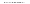
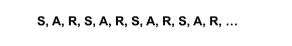
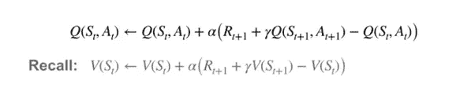
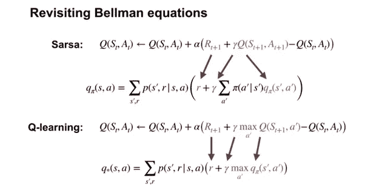
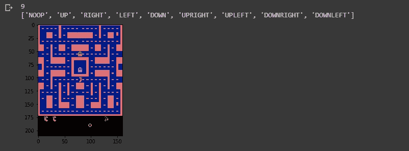
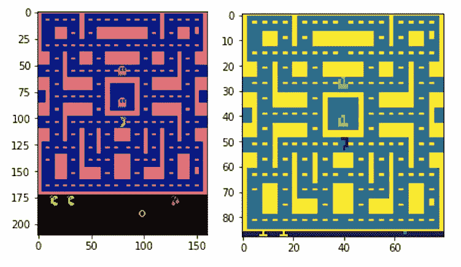
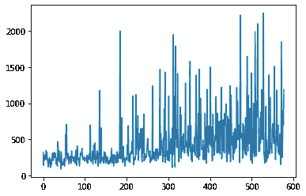
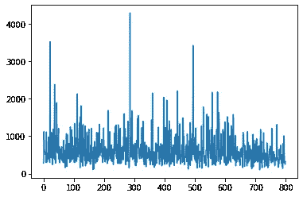

# 用深度 Q 学习自动化 Pac-man:在 Tensorflow 中的实现。

> 原文：<https://towardsdatascience.com/automating-pac-man-with-deep-q-learning-an-implementation-in-tensorflow-ca08e9891d9c?source=collection_archive---------9----------------------->

## 强化学习的基础

# **简介**

在我们关于 GradientCrescent 强化学习基础的文章中，我们研究了基于[模型的](https://medium.com/gradientcrescent/fundamentals-of-reinforcement-learning-markov-decision-processes-policies-value-functions-94f7389e1e82)和基于样本的强化学习方法。简而言之，前一类的特征在于需要所有可能的状态转移的完整概率分布的知识，并且可以通过[马尔可夫决策过程](https://medium.com/gradientcrescent/fundamentals-of-reinforcement-learning-markov-decision-processes-policies-value-functions-94f7389e1e82)来举例说明。相反，[基于样本的学习方法](https://medium.com/gradientcrescent/fundamentals-of-reinforcement-learning-automating-pong-in-using-a-policy-model-an-implementation-b71f64c158ff)允许简单地通过重复观察来确定状态值，而不需要转换动态。在这个领域中，我们已经讨论了[蒙特卡罗](https://medium.com/gradientcrescent/fundamentals-of-reinforcement-learning-understanding-blackjack-strategy-through-monte-carlo-88c9b85194ed)和[时间差](https://medium.com/gradientcrescent/fundamentals-of-reinforcement-learning-illustrating-online-learning-through-temporal-differences-ec4833b6b06a)电子学习。简而言之，这两者可以通过状态值更新的频率来区分:蒙特卡罗方法要求一个情节完成一轮更新才能发生，而时间差异方法增量地更新情节内，使用状态值的旧估计以及折扣奖励来生成新的更新。

TD 或“在线”学习方法的快速反应性使它们适合于高度动态的环境，因为状态和动作的值通过一组估计值随着时间不断更新。也许最值得注意的是， **TD 是 Q-learning 的基础，Q-learning 是一种更高级的算法，用于训练代理处理游戏环境，如 OpenAI Atari 健身房中观察到的环境，这也是本文的重点。**

Our previous policy-based Pong model, trained over 5000 episodes with a binary action space.

# **超越 TD: SARSA & Q-learning**

回想一下，在时间差异学习中，我们观察到一个主体在一个环境中通过一系列状态(S)、动作(A)和(奖励)循环地行为。



由于这种循环行为，我们可以在到达下一个状态时更新前一个状态的值。然而，我们可以扩展我们的训练范围，以包括状态-动作值，就像我们之前对[马尔可夫决策过程](https://medium.com/gradientcrescent/fundamentals-of-reinforcement-learning-markov-decision-processes-policies-value-functions-94f7389e1e82)所做的那样。**这就是通常所说的萨尔萨**。让我们比较状态-动作和状态-值 TD 更新方程:



**Q-learning 通过在更新**期间强制选择具有最高动作值的动作，以类似于利用[贝尔曼最优方程观察到的方式，将此向前推进了一步。](https://medium.com/gradientcrescent/fundamentals-of-reinforcement-learning-markov-decision-processes-policies-value-functions-94f7389e1e82)我们可以检查贝尔曼和贝尔曼优化方程旁边的 SARSA 和 Q-learning，如下所示:



你可能想知道如何确保我们的状态-动作空间的完整探索，给定需要不断地为具有最高现有动作值的状态选择动作。从理论上讲，我们可能只是因为一开始就没有评估而避免了最佳行动。**为了鼓励探索，我们可以使用一个衰减的 e-greedy 策略，**本质上是强迫代理人选择一个明显的次优行动，以便在某个百分比的时间里了解更多关于其价值的信息。通过引入衰减过程，我们可以在评估完所有状态后限制探索，之后我们将永久地为每个状态选择最佳操作。

正如我们之前用 MDP 的模型解决了 [Pong 一样，让我们把我们学到的关于 Q-learning 的知识应用到雅达利的《吃豆人小姐》游戏中。](https://medium.com/gradientcrescent/fundamentals-of-reinforcement-learning-automating-pong-in-using-a-policy-model-an-implementation-b71f64c158ff)

# **实施**

我们的 Google 协作实现是利用 Tensorflow Core 用 Python 编写的，可以在 [GradientCrescent Github 上找到。这是基于 Ravichandiran 等人的观点。al，但是升级到与 Tensorflow 2.0 兼容，并且显著扩展以促进改进的可视化和解释。由于这种方法的实现非常复杂，让我们**总结一下所需动作的顺序**:](https://github.com/EXJUSTICE/GradientCrescent)

1.  **我们定义我们的深度 Q 学习神经网络**。这是一个 CNN，它拍摄游戏中的屏幕图像，并输出 Ms-Pacman gamespace 中每个动作的概率，或 Q 值。为了获得概率张量，我们在最后一层不包括任何激活函数。
2.  由于 Q-learning 要求我们了解当前和下一个状态，我们需要**从数据生成**开始。我们将表示初始状态 *s* 的游戏空间的预处理输入图像输入到网络中，并获得动作的初始概率分布，或 Q 值。在训练之前，这些值将是随机的和次优的。
3.  利用我们的概率张量，我们然后**使用 argmax()函数选择具有当前最高概率**的动作，并使用它来构建 epsilon 贪婪策略。
4.  使用我们的策略，我们将选择动作 *a* ，并评估我们在健身房环境中的决策**接收关于新状态*s’*、奖励 *r*** 以及该集是否已结束的信息。
5.  我们以列表形式~~将该信息组合存储在一个缓冲区中，并重复步骤 2-4 预设次数，以建立一个足够大的缓冲区数据集。~~
6.  一旦步骤 5 完成，我们转到**生成我们的目标 *y* 值，*R’*和*A’***，这是损失计算所需的。虽然前者只是从 *R* 中减去，但是我们通过将*S’*输入到我们的网络中来获得 A’。
7.  有了所有的组件，我们就可以**计算训练网络的损耗**。
8.  培训结束后，我们将通过图形和演示来评估代理的表现。

让我们开始吧。随着 Tensorflow 2 在实验室环境中的出现，我们已经使用新的 *compat* 包将我们的代码转换为符合 TF2 标准。注意，这段代码不是 TF2 本地的。

让我们导入所有必要的包，包括 OpenAI gym 环境和 Tensorflow 核心。

```
import numpy as npimport gymimport tensorflow as tffrom tensorflow.contrib.layers import flatten, conv2d, fully_connectedfrom collections import deque, Counterimport randomfrom datetime import datetime
```

接下来，我们定义一个预处理函数，从我们的健身房环境中裁剪图像，并将它们转换成一维张量。在我们的 [Pong 自动化实现](https://medium.com/gradientcrescent/fundamentals-of-reinforcement-learning-automating-pong-in-using-a-policy-model-an-implementation-b71f64c158ff)中，我们已经看到了这一点。

```
**def preprocess_observation(obs):** # Crop and resize the image img = obs[1:176:2, ::2] # Convert the image to greyscale img = img.mean(axis=2) # Improve image contrast img[img==color] = 0 # Next we normalize the image from -1 to +1 img = (img — 128) / 128–1 return img.reshape(88,80,1)
```

接下来，让我们初始化健身房环境，检查几个游戏画面，并了解 gamespace 中可用的 9 个动作。当然，我们的代理人无法获得这些信息。

```
env = gym.make(“MsPacman-v0”)n_outputs = env.action_space.nprint(n_outputs)print(env.env.get_action_meanings())observation = env.reset()import tensorflow as tfimport matplotlib.pyplot as pltfor i in range(22): if i > 20: plt.imshow(observation) plt.show()observation, _, _, _ = env.step(1)
```

您应该遵守以下几点:



我们可以借此机会比较我们的原始和预处理输入图像:



接下来，让我们定义我们的模型，一个深度 Q 网络。这本质上是一个三层卷积网络，它获取预处理的输入图像，展平并将其馈送到一个全连接层，并输出在游戏空间中采取每个行动的概率。如前所述，这里没有激活层，因为激活层的存在会导致二进制输出分布。

```
**def q_network(X, name_scope):**# Initialize layers initializer = tf.compat.v1.keras.initializers.VarianceScaling(scale=2.0) with tf.compat.v1.variable_scope(name_scope) as scope: # initialize the convolutional layers layer_1 = conv2d(X, num_outputs=32, kernel_size=(8,8), stride=4, padding=’SAME’, weights_initializer=initializer) tf.compat.v1.summary.histogram(‘layer_1’,layer_1) layer_2 = conv2d(layer_1, num_outputs=64, kernel_size=(4,4),    stride=2, padding=’SAME’, weights_initializer=initializer) tf.compat.v1.summary.histogram(‘layer_2’,layer_2) layer_3 = conv2d(layer_2, num_outputs=64, kernel_size=(3,3), stride=1, padding=’SAME’, weights_initializer=initializer) tf.compat.v1.summary.histogram(‘layer_3’,layer_3) flat = flatten(layer_3) fc = fully_connected(flat, num_outputs=128, weights_initializer=initializer) tf.compat.v1.summary.histogram(‘fc’,fc) #Add final output layer output = fully_connected(fc, num_outputs=n_outputs, activation_fn=None, weights_initializer=initializer) tf.compat.v1.summary.histogram(‘output’,output) vars = {v.name[len(scope.name):]: v for v in tf.compat.v1.get_collection(key=tf.compat.v1.GraphKeys.TRAINABLE_VARIABLES, scope=scope.name)} #Return both variables and outputs togetherreturn vars, output
```

让我们借此机会为我们的模型和训练过程定义超参数

```
num_episodes = 800batch_size = 48input_shape = (None, 88, 80, 1)#Recall shape is img.reshape(88,80,1)learning_rate = 0.001X_shape = (None, 88, 80, 1)discount_factor = 0.97global_step = 0copy_steps = 100steps_train = 4start_steps = 2000
```

回想一下，Q-learning 要求我们选择具有最高行动值的行动。为了确保我们仍然访问每一个可能的状态-行为组合，我们将让我们的代理遵循一个ε贪婪策略，探索率为 5%。我们将这个探索速率设置为随时间衰减，因为我们最终假设所有的组合都已经被探索了——在该点之后的任何探索将简单地导致次优动作的强制选择。

```
epsilon = 0.5eps_min = 0.05eps_max = 1.0eps_decay_steps = 500000#**def epsilon_greedy(action, step):** p = np.random.random(1).squeeze() #1D entries returned using squeeze epsilon = max(eps_min, eps_max — (eps_max-eps_min) * step/eps_decay_steps) #Decaying policy with more steps if np.random.rand() < epsilon: return np.random.randint(n_outputs) else: return action
```

回想上面的等式，Q-learning 的更新函数要求如下:

*   当前状态 *s*
*   当前动作*一*
*   当前动作后的奖励 *r*
*   下一个状态*s’*
*   下一个动作*a’*

为了以有意义的数量提供这些参数，我们需要按照一组参数评估我们当前的策略，并将所有变量存储在一个缓冲区中，我们将在训练期间从该缓冲区中提取迷你批次中的数据..这与我们之前在 Pong 中的实现不同，我们使用的是增量方法。让我们继续创建我们的缓冲区和一个简单的采样函数:

```
buffer_len = 20000#Buffer is made from a deque — double ended queueexp_buffer = deque(maxlen=buffer_len)**def sample_memories(batch_size):** perm_batch = np.random.permutation(len(exp_buffer))[:batch_size] mem = np.array(exp_buffer)[perm_batch] return mem[:,0], mem[:,1], mem[:,2], mem[:,3], mem[:,4]
```

接下来，让我们将原始网络的权重参数复制到目标网络中。这种双网络方法允许我们在使用现有策略的训练过程中生成数据，同时仍然为下一次策略迭代优化我们的参数。

```
# we build our Q network, which takes the input X and generates Q values for all the actions in the statemainQ, mainQ_outputs = q_network(X, ‘mainQ’)# similarly we build our target Q network, for policy evaluationtargetQ, targetQ_outputs = q_network(X, ‘targetQ’)copy_op = [tf.compat.v1.assign(main_name, targetQ[var_name]) for var_name, main_name in mainQ.items()]copy_target_to_main = tf.group(*copy_op)
```

最后，我们还将定义我们的损失。这就是我们的目标动作(具有最高动作值)和我们的预测动作的平方差。我们将使用 ADAM 优化器来最大限度地减少我们在训练中的损失。

```
# define a placeholder for our output i.e actiony = tf.compat.v1.placeholder(tf.float32, shape=(None,1))# now we calculate the loss which is the difference between actual value and predicted valueloss = tf.reduce_mean(input_tensor=tf.square(y — Q_action))# we use adam optimizer for minimizing the lossoptimizer = tf.compat.v1.train.AdamOptimizer(learning_rate)training_op = optimizer.minimize(loss)init = tf.compat.v1.global_variables_initializer()loss_summary = tf.compat.v1.summary.scalar(‘LOSS’, loss)merge_summary = tf.compat.v1.summary.merge_all()file_writer = tf.compat.v1.summary.FileWriter(logdir, tf.compat.v1.get_default_graph())
```

定义好所有代码后，让我们运行我们的网络并检查培训过程。我们已经在最初的总结中定义了大部分，但是让我们为后代回忆一下。

*   对于每个时期，在使用ε-贪婪策略来选择下一个动作之前，我们将输入图像馈送到我们的网络中，以生成可用动作的概率分布
*   然后，我们将它输入到健身房环境中，获取下一个状态和相应奖励的信息，并将其存储到我们的缓冲区中。
*   在我们的缓冲区足够大之后，我们将下一个状态采样到我们的网络中，以便获得下一个动作。我们还通过贴现当前的奖励来计算下一个奖励
*   我们通过 Q 学习更新函数生成我们的目标 y 值，并训练我们的网络。
*   通过最小化训练损失，我们更新网络权重参数，以便为下一个策略输出改进的状态-动作值。

```
with tf.compat.v1.Session() as sess: init.run() # for each episode history = [] for i in range(num_episodes): done = False obs = env.reset() epoch = 0 episodic_reward = 0 actions_counter = Counter() episodic_loss = [] # while the state is not the terminal state while not done: # get the preprocessed game screen obs = preprocess_observation(obs) # feed the game screen and get the Q values for each action,    actions = mainQ_outputs.eval(feed_dict={X:[obs],     in_training_mode:False}) # get the action action = np.argmax(actions, axis=-1) actions_counter[str(action)] += 1 # select the action using epsilon greedy policy action = epsilon_greedy(action, global_step) # now perform the action and move to the next state, next_obs, receive reward next_obs, reward, done, _ = env.step(action) # Store this transition as an experience in the replay buffer! Quite important exp_buffer.append([obs, action, preprocess_observation(next_obs), reward, done]) # After certain steps we move on to generating y-values for Q network with samples from the experience replay buffer if global_step % steps_train == 0 and global_step > start_steps: o_obs, o_act, o_next_obs, o_rew, o_done = sample_memories(batch_size) # states o_obs = [x for x in o_obs] # next states o_next_obs = [x for x in o_next_obs] # next actions next_act = mainQ_outputs.eval(feed_dict={X:o_next_obs, in_training_mode:False}) #discounted reward for action: these are our Y-values y_batch = o_rew + discount_factor * np.max(next_act, axis=-1) * (1-o_done) # merge all summaries and write to the file mrg_summary = merge_summary.eval(feed_dict={X:o_obs, y:np.expand_dims(y_batch, axis=-1), X_action:o_act, in_training_mode:False}) file_writer.add_summary(mrg_summary, global_step) # To calculate the loss, we run the previously defined functions mentioned while feeding inputs train_loss, _ = sess.run([loss, training_op], feed_dict={X:o_obs, y:np.expand_dims(y_batch, axis=-1), X_action:o_act, in_training_mode:True}) episodic_loss.append(train_loss) # after some interval we copy our main Q network weights to target Q network if (global_step+1) % copy_steps == 0 and global_step > start_steps: copy_target_to_main.run() obs = next_obs epoch += 1 global_step += 1 episodic_reward += reward history.append(episodic_reward)print(‘Epochs per episode:’, epoch, ‘Episode Reward:’, episodic_reward,”Episode number:”, len(history))
```

一旦训练完成，我们就可以根据增量情节绘制奖励分布图。前 550 集(大约 2 小时)大概是这样的:



在额外的 800 集之后，这汇聚成以下内容:



为了在实验室环境的限制下评估我们的结果，我们可以录制整个情节，并使用基于 IPython 库的包装在虚拟显示器中显示:

```
“””Utility functions to enable video recording of gym environment and displaying it. To enable video, just do “env = wrap_env(env)””“”**def show_video():** mp4list = glob.glob(‘video/*.mp4’) if len(mp4list) > 0: mp4 = mp4list[0] video = io.open(mp4, ‘r+b’).read() encoded = base64.b64encode(video) ipythondisplay.display(HTML(data=’’’<video alt=”test” autoplay loop controls style=”height: 400px;”> <source src=”data:video/mp4;base64,{0}” type=”video/mp4" /> </video>’’’.format(encoded.decode(‘ascii’)))) else: print(“Could not find video”)    
**def wrap_env(env):** env = Monitor(env, ‘./video’, force=True) return env
```

然后，我们使用我们的模型运行环境的新会话，并记录它。

```
#Evaluate model on openAi GYMobservation = env.reset()new_observation = observationprev_input = Nonedone = Falsewith tf.compat.v1.Session() as sess: init.run() while True: if True: #set input to network to be difference image obs = preprocess_observation(observation) # feed the game screen and get the Q values for each action actions = mainQ_outputs.eval(feed_dict={X:[obs], in_training_mode:False}) # get the action action = np.argmax(actions, axis=-1) actions_counter[str(action)] += 1 # select the action using epsilon greedy policy action = epsilon_greedy(action, global_step) env.render() observation = new_observation # now perform the action and move to the next state, next_obs, receive reward new_observation, reward, done, _ = env.step(action) if done: #observation = env.reset() break env.close() show_video()
```

你应该观察几轮比赛！这是我们录制的几集。

对于一个几个小时就训练好的模特来说，成绩远高于 400 分，这已经不错了。特别是，看起来我们的代理人在被幽灵直接追逐时表现得很好，但在预测即将到来的幽灵方面仍然很差，可能是因为它还没有足够的经验来观察它们的运动。

这就结束了 Q-learning 的介绍。在我们的下一篇文章中，我们将从 Atari 的世界转移到解决世界上最著名的 FPS 游戏之一。敬请期待！

我们希望你喜欢这篇文章，并希望你查看 GradientCrescent 上的许多其他文章，涵盖人工智能的应用和理论方面。要了解关于 [GradientCrescent](https://medium.com/gradientcrescent) 的最新更新，请考虑关注该出版物并关注我们的 Github 资源库。

**参考文献**

萨顿等人。强化学习

怀特等人。阿尔伯塔大学强化学习基础

席尔瓦等人。阿尔，强化学习，UCL

Ravichandiran 等人。al，用 Python 实践强化学习