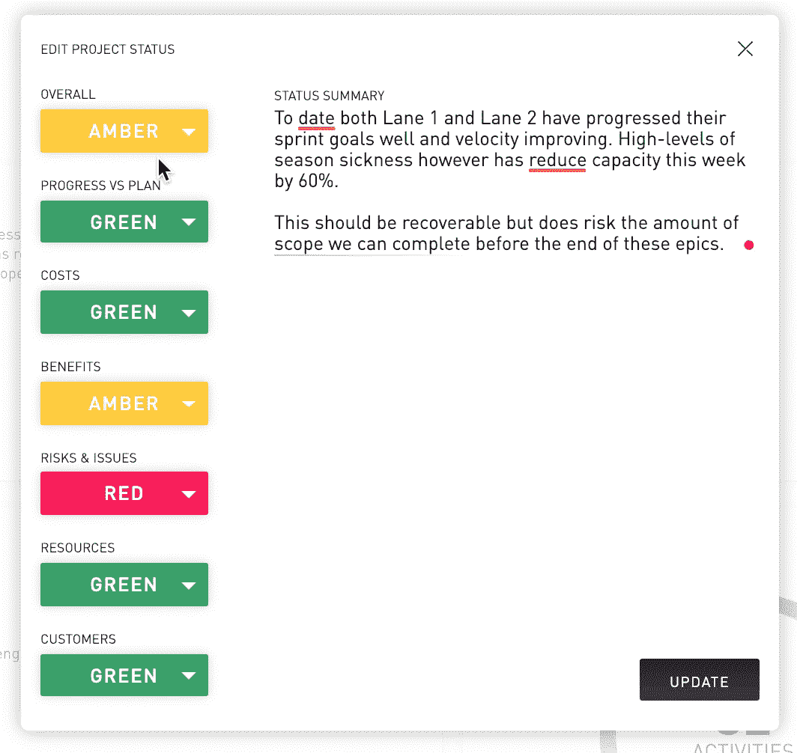
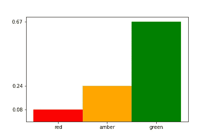
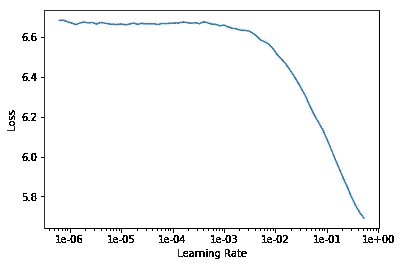
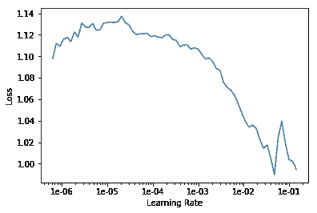

# 通过深度学习实现项目管理自动化

> 原文：<https://towardsdatascience.com/automating-project-management-with-deep-learning-bd5b851235eb?source=collection_archive---------6----------------------->

## 如何使用自然语言处理对项目状态更新进行分类


# 介绍

在数据驱动的项目管理未来，项目经理将得到人工智能的增强，人工智能可以突出项目风险，确定资源的最佳分配，并自动化项目管理任务。

例如，许多组织要求项目经理定期提供项目状态更新，作为交付保证过程的一部分。这些更新通常由文本注释和相关的红-琥珀色-绿色(RAG)状态组成，其中红色表示失败的项目，琥珀色表示有风险的项目，绿色表示正在进行的项目。如果我们能自动化这个过程，使它更加一致和客观，那不是很好吗？

在这篇文章中，我将描述我们如何通过应用自然语言处理(NLP)将文本评论自动分类为红色、琥珀色或绿色状态来实现这一点。



Updating a project status in Sharktower, Mudano’s data-driven project management platform

# 训练项目管理语言模型

为了确保我们的 RAG 状态分类器取得好的结果，我们首先需要建立一个语言模型，它理解项目经理使用的特定语言。

仅仅在几年前，训练一个定制的项目管理语言模型需要大量的文本和强大的计算能力。然而，将迁移学习应用于 NLP 的最新进展允许我们在几分钟内在一个适度的 GPU 上使用相对较小的数据集训练一个定制的语言模型。

在迁移学习中，我们采用在大型通用数据集上训练的模型所学习的权重，并使用它们作为在不同数据集上训练新模型的起点。这是一个非常有用的技术，因为它允许我们在数据有限的情况下训练高性能的语言模型。

[Mudano](https://mudano.com/) 已经收集了一个小型(但丰富)的数据集，该数据集涵盖了许多大型 IT 转型项目的项目状态更新。我们将使用此数据集首先训练一个自定义项目管理语言模型，然后训练 RAG 状态分类器。

## 探索数据

我们首先将数据加载到一个`pandas.DataFrame`中，并查看一个示例项目状态更新。我们的数据以一种`.csv`格式存储，由一列文本评论和一列相关的 RAG 状态组成。我们可以如下加载它:

```
import pandas as pddatapath = '/path/to/data/'
datafile = 'project-updates.csv'df = pd.read_csv(datapath+datafile)
```

从我们的数据集中随机选取一个示例文本注释:

```
df['text'][42]
```

> 所有活动继续在阶段关口批准的情况下进行计划。\ n \对数据库的分析已完成，当前正在评估使系统符合要求的选项。一旦完成，将提出将系统纳入项目范围的请求。\ n \ nA 已确定对下游的影响，如果在源系统中删除信息后对其进行查询，将返回空响应。正在进行调查，以了解这种影响是否可以接受，或者是否需要采取行动。

文本非常干净，我们不需要做任何额外的清理。

根据经验，我们知道项目经理更可能报告绿色状态，而不是琥珀色或红色状态。让我们快速检查一下我们的数据是否如此，然后绘制结果:

```
labelcounts = df.groupby(["label"]).size()
label_sum = len(df["label"])
class_imbalance = [(count/label_sum) for count in labelcounts]
```



正如我们所怀疑的，绿色状态更新比琥珀色状态更新的可能性大得多，而红色状态更新的可能性最小。当我们训练我们的 RAG 状态分类器时，我们将需要考虑这种类别不平衡。

## 深度学习入门

现在我们已经探索了我们的数据，我们可以使用机器学习对其建模。深度学习是机器学习的一个分支，它使用在大型数据集上训练的深度神经网络，特别适合于语言建模和文本分类等任务。为了构建我们的深度学习模型，我们将使用`fastai`库。

`fastai`是一个高级深度学习库，针对典型的机器学习问题，如图像和文本分类、图像分割和协同过滤，大大简化了深度神经网络的训练。

要安装`fastai`库，我们可以简单地使用`conda`包管理器，如下所示:

```
conda install -c pytorch -c fastai fastai
```

然后我们可以导入主`fastai`库和`fastai.text`模块:

```
from fastai import *
from fastai.text import *
```

## 将数据加载到 fastai

现在我们已经导入了`fastai.text`模块，我们可以使用它的内置函数轻松加载和处理我们的数据。由于我们的数据是基于文本的并且是`.csv`格式的，并且由于我们正在构建一个语言模型，我们使用`TextLMDataBunch.from_csv`函数将我们的数据加载并处理到一个数据集中:

```
data_lm = TextLMDataBunch.from_csv(datapath, datafile)
```

令人惊讶的是，这就是我们准备训练我们的自定义语言模型！

不过，在我们这样做之前，有必要花点时间深入了解一下`fastai`在幕后所做的巧妙的数据处理。

## 标记化、数字化和分裂

与图像数据不同，原始文本数据不能直接输入到机器学习模型中，需要处理成数字格式。要做到这一点，我们需要将文本分割成标记，然后可以为这些标记分配数值。

默认情况下，在`fastai.text`中，文本标记化在单词级完成，标记化中包括单词的标点符号和缩写。`fastai.text`还会自动删除 HTML 符号，并添加特殊标记来替换未知标记。

一旦文本被标记化，`fastai.text`就会将标记列表转换成整数，并计算每个标记出现的频率。默认情况下，`fastai.text`保留 60，000 个最常用的标记，并删除在文本中出现不到两次的标记。这些标记是用于训练语言模型的词汇。在我们的例子中，由于相对较小的数据集，我们只有一个`994`令牌的词汇表。

`fastai`还可以方便地将数据分为训练集和验证集。

## 训练自定义语言模型

我们通过在`fastai`中定义一个语言学习者对象来构建我们的定制语言模型:

```
learn_lm = language_model_learner(data_lm, pretrained_model=URLs.WT103, drop_mult=0.5)
```

我们使用之前定义的 data bunch(`data_lm`)和一个预训练的语言模型(`pretrained_model=URLs.WT103`)作为学习者对象的输入，并将 dropout 设置为`0.5`以避免过度拟合(`drop_mult=0.5`)。

`fastai.text`默认使用 [AWD-LSTM](https://arxiv.org/abs/1708.02182) 模型，我们选择通过提供在 [WikiText-103](https://www.salesforce.com/products/einstein/ai-research/the-wikitext-dependency-language-modeling-dataset/) 数据集上训练的预训练模型来利用迁移学习。

为了开始训练我们的模型，我们需要决定一个合适的学习速率。幸运的是，`fastai`有一些非常有用的内置工具，可以很容易地为此选择一个最佳值。

我们可以使用`fastai`学习率查找器(它在一定的学习率范围内运行一系列小型培训任务),然后绘制损失与学习率的关系图:

```
learn.lr_find()
learn.recorder.plot()
```



然后，我们在最小损失之前选择一个学习率，就像杰瑞米·霍华德在[fast . ai](https://www.fast.ai/)Coders 实用深度学习课程中推荐的那样。从上面的情节，我决定了一个`1e-01`的学习率。

为了训练我们的模型，我们只需从我们的学习者对象中调用`fit_one_cycle`方法，输入我们想要训练的时期数(在本例中为`20`)以及我们使用学习率查找器找到的最佳学习率:

```
learn_lm.fit_one_cycle(20, 1e-1)
```

使用我们相对较小的数据集，在 Nvidia Tesla K80 GPU 上训练超过 20 个纪元只需要几分钟，并给出了`34.3`的验证困惑分数。

还不错！但我们肯定可以在这方面有所改进。

在第一次训练中，我们只训练了 LSTM 模型的最后一层。`fastai`库允许我们“解冻”模型的早期层并训练它们。

在我们的第二次训练运行中，我们将使用较低的学习率来微调我们的模型，并使用`slice`函数衰减模型中早期层的学习率:

```
learn_lm.unfreeze()
learn_lm.fit_one_cycle(20, slice(1e-2/10, 1e-2))
```

这背后的直觉是，模型中的早期层已经学习了语言的基本方面，所以我们不想改变太多。

在解冻模型的早期层并使用超过 20 个时期的衰减学习率进行训练之后，我们得到了验证困惑分数`3.3`。

让我们看看我们的定制项目管理语言模型在生成项目更新评论方面做得如何:

```
learn_lm.predict("This project is", n_words=10)
```

> 该项目现已完成，目前正在工作过程中。

这是相当惊人的！该模型理解语法和标点符号，并在正确的上下文中使用项目管理特定的单词。

让我们保存自定义语言模型编码器，以便在分类器中使用:

```
learn_lm.save_encoder('lm_enc')
```

# 训练 RAG 状态分类器

现在我们有了一个定制的项目管理语言模型，我们可以构建一个模型来将文本注释分类为红色、琥珀色或绿色状态。

我们需要做的第一件事是创建一个文本分类数据库，就像我们在训练语言模型时所做的那样:

```
data_clas = TextClasDataBunch.from_csv(datapath, datafile, vocab=data_lm.train_ds.vocab, bs=32)
```

为了创建文本分类数据束，我们需要为该函数提供我们的定制语言模型词汇表(`vocab=data_lm.train_ds.vocab`)和训练批量大小(`bs=32`)。

接下来，我们定义一个文本分类学习器对象，使用文本分类数据束作为输入，并在`0.5`设置 dropout:

```
learn_clas = text_classifier_learner(data_clas, drop_mult=0.5)
```

然后，我们加载之前保存的定制语言模型编码器:

```
learn_clas.load_encoder('lm_enc')
```

我们现在可以开始训练我们的 RAG 状态分类器，但是为了确保我们得到好的结果，我们需要一种方法来处理我们在探索数据时注意到的显著的类别不平衡。如果我们不处理这一点，分类模型很可能会简单地学习预测我们输入的任何文本评论的多数类(`green`)。

我们可以处理类别不平衡的一种方式是计算不同类别的平衡，并使用这种平衡的逆来加权每个不同类别的损失函数，即，如果类别出现得更频繁，则该类别被扣分。

这只是我们在探索数据时计算的`class_imbalance`的倒数，可以很容易地输入到我们的交叉熵损失函数中:

```
weights_balance = [(1-count/label_sum) for count in labelcounts]
loss_weights = torch.FloatTensor(weights_balance).cuda()
learn_clas.crit = partial(F.cross_entropy, weight=loss_weights)
```

现在我们已经处理了类别不平衡，我们可以训练我们的 RAG 状态分类器。我们遵循与训练自定义语言模型完全相同的过程。

首先，我们运行`fastai`学习率查找器并绘制结果:

```
learn_clas.lr_find()
learn_clas.recorder.plot(skip_end=15)
```



然后，我们开始使用最佳学习率(`1e-2`，取自上面的图)和我们选择训练的时期数(`20`)来训练分类器模型:

```
learn_clas.fit_one_cycle(20, 1e-2)
```

由于这是一个高度不平衡的多类分类问题，我们不能使用准确性作为我们模型的性能度量。相反，我们将使用微观 F1 分数作为我们的性能指标，它考虑了精确度、召回率和类别不平衡。

在这个初始训练周期之后，我们的分类模型达到了 F1 分数`0.77`。我们解冻早期的层并微调我们的模型:

```
learn_clas.unfreeze()
learn_clas.fit_one_cycle(20, slice(1e-3/10, 1e-3))
```

那就是我们！我们有一个 RAG 状态分类器，它使用一个定制的项目管理语言模型，并且达到 F1 分数`0.79`。

让我们看看 RAG 状态分类器在我们从一个项目更新中输入一个文本注释示例时是如何工作的。

## 分类示例

> 数据里程碑 31/05 将无法实现，当前重新计划日期正在审核中。这是由于数据接收挑战，特别是“同步排序”数据迁移问题、平台复杂性和 IT 发布治理流程。
> 
> 由于技术 SME 可用性造成的持续数据来源延迟，解决方案里程碑面临风险；升级继续优先考虑集团 IT 和技术部门的计划
> 
> 工作正在进行中，以制定流程，商定计划中使用的工具，并确定流程改进的可行性、交付的逻辑分组，以纳入优化的计划。

```
learn_clas.predict(example)(Category **red**, tensor(2), tensor([0.0018, 0.0034, 0.9948]))
```

我们的模型正确地将上面基于文本的评论分类为**红色**状态更新，它读起来肯定像一个红色状态！

# 结论

在这篇文章中，我已经向你介绍了如何通过迁移学习，使用在相对较小的数据集上训练的定制语言模型，来构建深度学习文本分类器。

通过利用`fastai`库的功能，我们现在有了一个定制的项目管理语言模型和 RAG 状态分类器，我们可以使用它来基于文本评论自动确定项目的状态。

这只是一个例子，说明了 [Mudano](https://mudano.com/) 如何通过使用机器学习来自动化项目管理任务，从而使项目经理能够专注于真正重要的事情。

*你想为一些世界上最大的公司做类似的项目吗？或者帮助开发支持自主项目的产品？如果有，那就在这里* *查看 Mudano 的面向客户端的数据科学家和 R & D 数据科学家开放职位* [*或者在*](https://mudano.com/join/)[*LinkedIn*](https://uk.linkedin.com/in/euan-wielewski)*上联系我。*