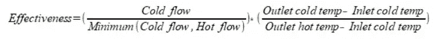
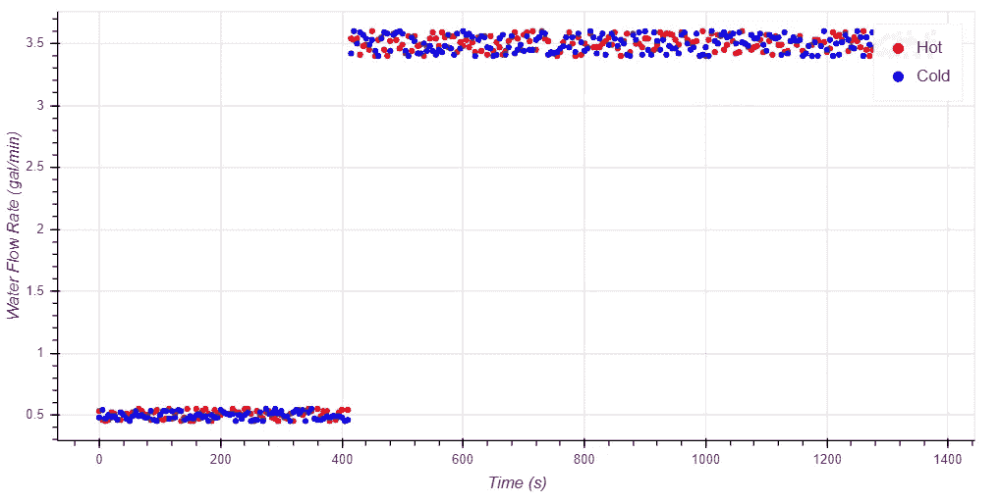
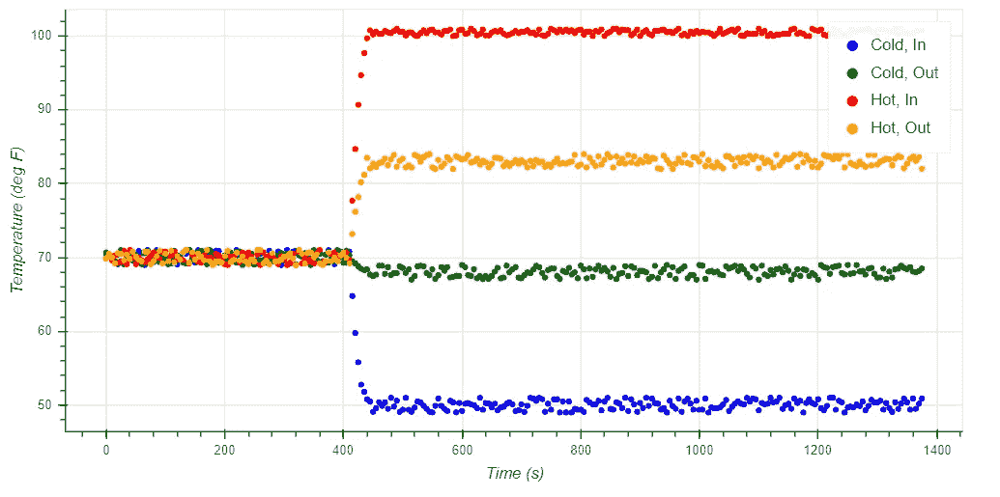
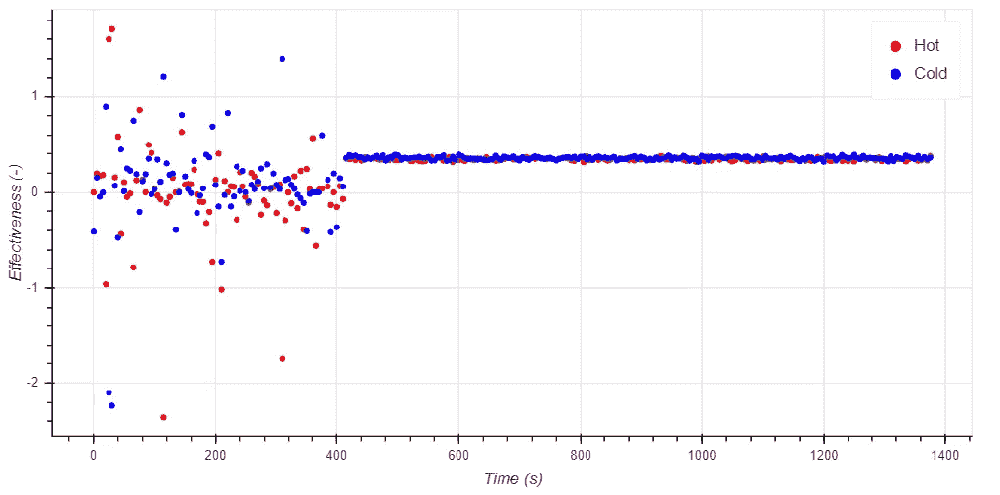
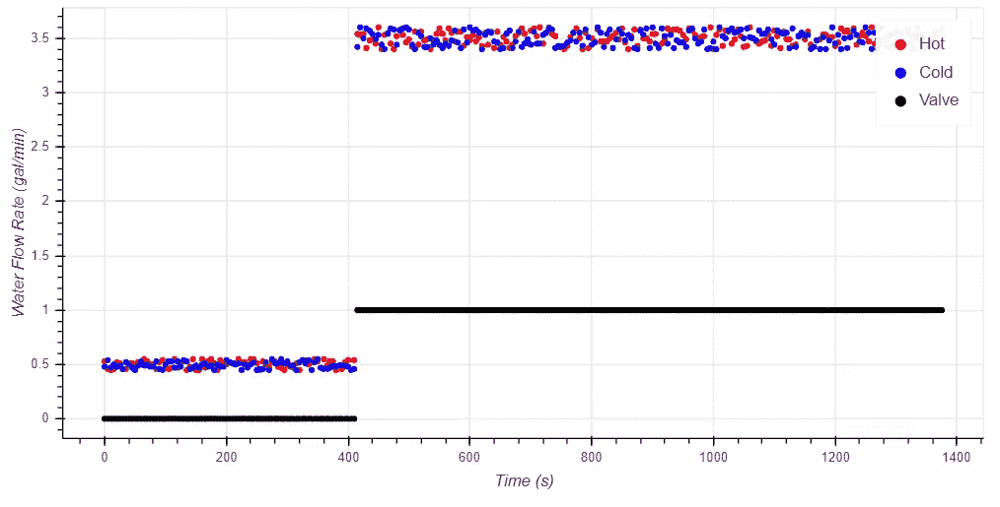
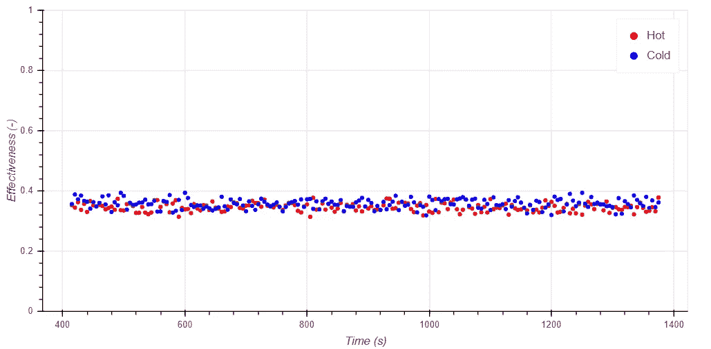
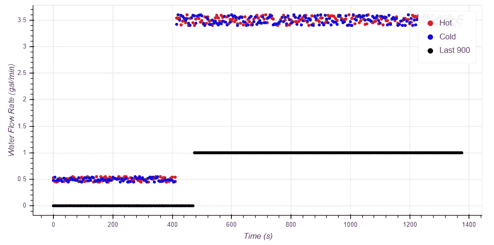
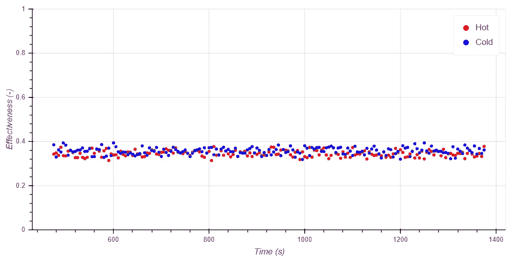
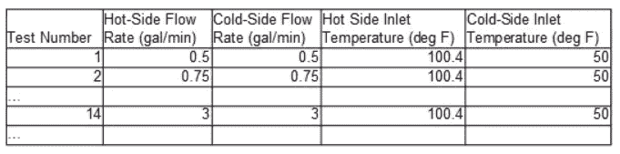

# 自动化科学数据分析第 2 部分:

> 原文：<https://towardsdatascience.com/automating-scientific-data-analysis-part-2-12331b46003?source=collection_archive---------22----------------------->

## 如何构建您的项目，以便 Python 程序能够理解您的数据文件


自动化科学数据分析的第一步是确保您的程序能够理解每个文件中包含的数据。这一步有三个主要挑战:

*   首先，来自测试的数据必须以一种程序能够识别数据的重要部分的方式来组织。许多测试在进入具有可用数据的测试部分之前会有预热阶段、调节阶段和/或过渡阶段。为了分析数据集，程序必须使用一致信号来识别要分析的正确周期。本文将介绍几种潜在的解决方案，您可以使用它们来克服这一挑战。
*   第二，程序必须有识别每个测试条件的方法。这些条件对于执行计算以理解数据，以及将结果存储在适当的位置都至关重要。这篇文章将介绍几种不同的方法来指导你的程序获得每个测试的条件。
*   第三，每个测试的数据必须有自己独特的文件，前面的建议才能起作用。有时来自整个项目的数据文件在一个文件中，这使得识别每个测试的条件更加困难。本文将提供两个解决方案来帮助您分离这些文件，为每个测试创建一个单独的数据文件。

# 为自动化实验室数据分析设计数据集

可重复数据集允许创建程序，每次都以完全相同的方式处理数据集，无需修改。与此同时，所有的实验和/或模拟数据集都将是复杂的，在整个测试过程中会发生变化，或者在比其他人更感兴趣的时期发生变化。因此，目标是在潜在的不可重复的过程中创建可重复的信号。

有几种方法可以做到这一点。它们包括使用阀门状态或控制设定点作为表明试验已改变阶段的信号，将测量条件与设定点进行比较，或使用试验时间。这些选项将以热交换器的单次测试为例进行说明。

## 引入单个数据集

本主题将使用模拟逆流换热器测试过程中发生的情况的示例数据集进行描述。这不是实际的实验室数据；相反，它是专门为演示这些概念而创建的人工数据集。当表征热交换器时，感兴趣的主要输出是稳态效率。确定有效性的公式如公式 1 所示。根据等式 1，该测试中的重要测量值是装置两侧的流速、入口温度和出口温度。



Equation 1: Heat Exchanger Effectiveness

图 1 和图 2 显示了可能来自典型测试的示例数据，图 1 显示了水流速数据，图 2 显示了温度数据。数据集模拟了一个测试，该测试在设备两侧具有相同的流速，热侧水温为 100.4 度，冷侧水温为 50 度。为了模拟实验数据中固有的可变性，在人造数据集中加入了一些随机性。

为了便于讨论，需要注意的重要一点是，这个测试有三个阶段。第一阶段是测试的条件阶段。在这一阶段，整个系统用 70 度的水冲洗，以确保装置有一个稳定的启动条件。第一阶段可以被识别，因为温度数据都是大约 70 度，并且流速接近 0.5 加仑/分钟。在第二阶段开始之前，该阶段持续测试的第一个 410 秒。第二阶段是预热阶段，此时热水和冷水进入设备，设备接近稳态运行。因为流速从大约 0.5 加仑/分钟突然跳到大约 3.5 加仑/分钟，所以它可以被识别。第三阶段是测试的稳态有效性部分。在第三阶段，流速相当稳定在 3.5 加仑/分钟，热侧入口温度相当稳定在 100.4 度，冷侧入口温度相当稳定在 50 度。因为系统运行稳定，所以它用于识别设备在稳态条件下的性能。该阶段从 440 秒开始，直到测试结束。



Figure 1: Example Water Flow Data from a Typical Test



Figure 2: Example Temperature Data from a Typical Test

图 3 显示了使用图 1 和 2 所示的数据和公式 1 计算的有效性。在测试的前两个阶段计算的有效性是没有价值的。这是因为在测试过程中，系统不是在稳定状态下运行的，而稳定状态的有效性才是我们所关心的。



Figure 3: Calculated Effectiveness From the Sample Data

图 3:使用样本数据计算的有效性

请注意，在试验的不同阶段，稳态有效性有很大的差异。这些差异给自动化数据分析带来了挑战。由于每次测试的预期结果是计算装置在稳定状态下的平均有效性，包括前两个阶段的数据将产生错误的结果。这需要过滤数据集，以便分析集中在所需的部分，并设计实验来实现它。

# 分离所需数据集的方法

有无数种方法可以分离出所需的数据集。诀窍是根据个人的需求和对可用数据的控制，找到一种适用于任何给定应用程序的方法。本节将描述几种不同的方法，同时比较它们的优缺点。

## 使用控制信号

分离所需数据的最有效方法是在数据集中打印一个控制信号。该控制信号陈述了识别测试的适当阶段的测试的一些条件。使用该控制信号过滤数据集允许分析器减少数据集以仅包括相关数据。

使用示例热交换器分析，打印流量控制阀的状态将达到此结果。阀的状态必须改变，以使通过装置的流速在第一阶段结束时从 0.5 加仑/分钟突然变为 3.5 加仑/分钟。打印该控制阀信号为程序提供了一个坚实的点，以识别调节阶段已经结束，测试阶段已经开始。图 4 显示了添加了控制阀信号的典型测试的相同流量数据。



Figure 4: Valve Status and Flow Data in a Typical Test

图 5 显示了通过阀门状态信号过滤的来自同一数据集的有效性数据。由于使用了该阀门信号，该有效性数据集仅包括当有流体通过该装置时的数据(阶段 2 和 3)。包含第 2 阶段的数据会导致少量的错误，尽管远远没有包含第 1 阶段的数据那么多。图 5 所示的有效性数据的稳定性表明，稳态期间的平均有效性是一个精确的计算结果。



Figure 5: Effectiveness Data Filtered by a Valve Signal

## 使用已知的时间

分离所需数据部分的第二种方法是过滤数据以选择特定的时间段。这种方法效果很好，因为它给了用户对结果数据集的最大控制权。与使用控制信号相比，该方法可以将数据集单独隔离到第三阶段，而不包括第二阶段。从第二阶段移除数据将略微增加结果的准确性。使用基于时间的控制的缺点是，它要求用户在每次测试中确定一个相同的时间段。如果与最初的测试计划有任何偏差，那么分析脚本必须进行相应的修改。

示例数据集中的第三阶段开始于 440 秒，因此这是用于分析数据的逻辑时间条件。然而，没有办法确定每一个测试都将相同地进行，并且第三阶段将在每次 440 秒时开始。因此，稍后设置过滤器可以提高分析的安全性。不利的一面是，分析是使用更少量的数据完成的，但是影响应该是可以忽略的，因为测试的稳态部分是 935 秒长。图 6 显示了过滤数据对测试最后 900 秒的影响。



Figure 6: Effect of Filtering the Data to the Last 900 Seconds

使用测试最后 900 秒的数据会将结果数据集隔离到测试的第三阶段。它还会排除样本数据中第三阶段的一小部分，以防第二阶段在其他测试中变慢。同时，900 秒转换为 15 分钟，这对于识别设备的稳态操作来说绰绰有余。图 7 显示了过滤后仅包含样本数据集最后 900 秒的有效性数据。



Figure 7: Effectiveness Data Filtered to the Last 900 Seconds

# 如何确定实验室测试的条件并拆分大数据文件

该过程的下一步是编写您的脚本，以便它知道它所分析的每个测试的条件。该程序必须能够确定测试条件，以执行必要的计算，并正确存储数据，供以后进一步分析。有几种方法可以向程序提供测试条件信息，包括以下方法:

*   以数据文件的名称写入测试条件，
*   将测试编号放在数据文件的名称中，并引用测试计划，以及
*   从数据集中读取测试条件。

这些解决方案都有一个共同的假设，即每个测试都来自一个单独的数据文件。然而，有时数据集在单个数据文件中包含几个测试。在这种情况下，必须开发另一种算法来将大数据文件分割成单独的数据文件。解决这一问题的一些可能方法包括:

*   基于测试之间的已知调节期分割数据集，以及
*   使用测试中打印的控制信息。

以下章节详细介绍了三种确定测试条件的方法。

## 将条件写入数据文件的名称中

这种策略使用数据文件的名称来存储测试条件。这样，分析程序可以在打开文件时读取条件。这种方法的一个主要优点是测试条件也容易被读者理解。不利的一面是文件名可能会变得又长又麻烦。

例如，假设使用以下参数进行测试:

*   热端和冷端流速均为 3 加仑/分钟，且
*   热端入口温度为 100.4 华氏度，且
*   冷端入口温度为 50 华氏度

以下是包含此信息的文件名示例:

flow hot = 3 _ flow cold = 3 _ temperature hot = 1004 _ temperature cold = 50 . CSV

请注意，文件名中不能使用小数点，因此热端入口温度应写成“1004”而不是“100.4”。

为了从这个文件名中读取条件，数据分析脚本需要一个算法来读取文件名的内容。最简单的方法是创建一个算法来读取位于两个标识符之间的值。这些标识符是用于将参数与文件名中的描述性术语分开的字符。在我们的例子中，它们是“=”和“_”。继续热交换器的例子，四个参数的值可以用下面的代码来标识。

```
def Find_Between(String, First, Last):try:Start = String.index(First) + len(First)End = String.index(Last, Start)return String[Start:End]Flow_Hot = float(Find_Between(filename, ‘FlowHot=’, ‘_FlowCold))Flow_Cold = float(Find_Between(filename, ‘_FlowCold=’, ‘_TemperatureHot’))Temp_Hot = float(Find_Between(filename, ‘_TemperatureHot=’, ‘_TemperatureCold’))/10Temp_Cold = float(Find_Between(filename, ‘_TemperatureCold=’, ‘.csv’))
```

Find_Between 需要三个输入:1)正在搜索的完整字符串，2)感兴趣部分之前的字符串部分，以及 3)感兴趣部分之后的字符串部分。然后，它返回位于描述符之间的字符串。如果没有找到指定的描述符，它将返回一个错误。

Find_Between 定义之后的四行代码调用函数来标识文件名中指定的四个参数的值，并将它们转换为 float 类型。在 T_Hot 的情况下，该值除以 10，因此程序将其视为 100.4 而不是 1004。

## 在文件名中引用测试号

另一种解决方案是在文件名中打印测试号，并让程序打开测试文件来识别条件。这种方法实现起来不太复杂，并且数据文件的名称也更短。然而，文件名的描述性要差得多，这使得手动识别每个测试的内容更加困难，如果这被证明是重要的话。

例如，考虑名为“14 HX 2018 年 1 月 30 日. csv”的文件。该文件代表 2018 年 1 月 30 日进行的第 14 次热交换器试验。为了识别测试条件，程序需要识别它是测试号 14，并通过参考测试矩阵来识别测试 14 的条件。下面一行代码可以识别测试号:

```
Number_Test = int(filename[0:3])
```

这段代码读取文件名中的前两个索引，在本例中为“14”，并将它们转换为一个整数值。注意，在只有一位数的测试中，返回的字符串后面会跟一个空格。转换为整数时，空格会被删除。

然后必须参考测试矩阵，根据测试矩阵确定测试条件。它可以用熊猫来打开。read_csv 函数，如下所示。

```
Test_Matrix = pd.read_csv(r’C:\Users\JSmith\DataAnalysis\TestMatrix.csv’)
```

注意，代码中的路径是完全虚构的，并且必须被修改以读取测试矩阵的位置。

最后一步是从测试矩阵中读取测试条件。这是通过使用。熊猫锁功能。假设测试矩阵如表 1 所示。测试编号中显示“…”的行表示矩阵中有额外的测试，但没有显示出来。



可以使用下面的代码来确定测试的条件。

```
Flow_Hot = Test_Matrix.loc[Number_Test, ‘Hot-Side Flow Rate (gal/min)’]Flow_Cold = Test_Matrix.loc[Number_Test, ‘Cold-Side Flow Rate (gal/min)’]Temperature_Hot = Test_Matrix.loc[Number_Test, ‘Hot-Side Inlet Temperature (deg F)’]Temperature_Cold = Test_Matrix.loc[Number_Test, ‘Cold-Side Inlet Temperature (deg F)’]
```

此代码将搜索使用 pandas.read_csv 读取第 14 行的数据帧时创建的 Test_Matrix 数据帧，其中 Test_Number = 14，并从相应的列中提取值，如每行代码中所指定的。通过这种方式，可以识别每个测试的条件，并为以后的分析做好准备。

## 从数据文件中读取测试条件

最后一个选择是读取文件中的数据，并根据发生的情况确定测试条件。这个选项是最不准确的，因为它有错误识别条件的风险，应该被认为是最后的手段。这种方法的优势在于它不需要实验室测试人员的帮助，并且可以识别未指定数据文件的测试条件。

请记住，测试的稳定状态部分是在测试的最后 920 秒进行的。测试的标称条件可以通过计算在此期间每个点的平均值来近似。可以使用下面的代码来估计四个必需的参数。

```
Flow_Hot = Data_File[‘Hot-Side Flow Rate (gal/min)’][-50:].mean()Flow_Cold = Data_File[‘Cold-Side Flow Rate (gal/min)’][-50:].mean()Temperature_Hot = Data_File[‘Hot-Side Inlet Temperature (deg F)’][-50:].mean()Temperature_Cold = Data_File[‘Cold-Side Inlet Temperature (deg F)’][-50:].mean()
```

这四行代码选择每个数据列中的最后 50 个条目，并计算平均值。这提供了测试稳定状态期间该数据点的平均值，以及代表测试条件的近似值。

下一步是确定运行测试时使用的标称条件。因为测量数据永远不会与标称条件完全匹配，所以测试矩阵中指定的值与分析脚本确定的值之间会有细微的差异。使用测试矩阵来确定脚本中的标称值可以更容易地跟踪结果。这是通过将测试中的识别值与测试矩阵中的标称值进行比较，并识别差异最小的情况来实现的。考虑以下可用于识别标称 Flow_Hot 值的代码。

```
Test_Matrix = pd.read_csv(r’C:\Users\JSmith\DataAnalysis\TestMatrix.csv’)Test_Matrix[‘Difference Flow Hot (gal/min)’] = abs(Test_Matrix[‘Hot-Side Flow Rate (gal/min)’] — Flow_Hot)Flow_Hot = Test_Plan.loc[Test_Plan[‘Error_Flow_Hot’][Test_Plan_First:Test_Plan_Final].idxmin(), ‘Hot-Side Flow Rate (gal/min)’]
```

这段代码中发生了三件事:

1.第一行读取测试矩阵。

2.第二行在表中创建一个新列，该列标识每个测试的标称条件和当前测试的估计条件之间的差的绝对值。

3.第三行标识标称条件和测量条件之间差异最小的行，并将 Flow_Hot 设置为等于为该测试指定的热端流量。

请记住，该代码返回的标称条件与测试过程中发生的情况最接近。在测量不确定度较高或每次测试之间标称条件差异较小的情况下，该代码可能会识别不正确的标称条件。因此，这种方法应被视为最后的手段。

# 拆分数据文件

所有先前描述的方法都假设每个测试都有一个独立的数据文件。如果数据是通过包含在一个大数据文件中的几个测试交付的，那就不行了。在这种情况下，脚本必须将不同的测试从数据集中分离出来，并创建单独的数据文件。这可以通过识别可重复的信号并在该信号出现时创建新的数据文件来实现。在我们的热交换器示例中，可重复信号的两个示例包括:

*   每个测试在开始前都有一个冲洗期。冲洗期用于确保设备在可重复的条件下开始每次测试。在 70 华氏度时，装置两侧的流量为 4.15 加仑/分钟。流速和/或温度条件可用于识别该冲洗周期。
*   控制阀用于引导水流通过试验装置的不同部分。一种阀门配置指示冲洗周期，而另一种指示测试周期。流量阀配置是识别冲洗周期的另一种选择。

注意，使用控制阀状态的第二种选择比使用温度和/或流量条件更可靠。这是因为一些测试可能使用类似于刷新周期的条件，并且存在脚本混淆两者的风险。

一旦选择了标识符，就必须编写代码来定位发生这种情况的实例，并相应地创建新的测试文件。这可以通过删除表示刷新周期的数据并识别表索引发生变化的实例来完成。以下代码显示了一个示例，其中当“电磁阀 1 状态(-)”= 0 时发生冲洗，当“电磁阀 1 状态(-)”= 1 时进行测试。

```
Data_File = pd.read_csv(r’C:\Users\JSmith\Data.csv’)Data_File[‘Index’] = Data_File.indexData_File = Data_File.drop(Data_File[Data_File[‘Solenoid Valve 1 Status (-)’] == 0].index)Data_File = Data_File.reset_index()Data_File[‘Index_Shift’] = Data_File[‘Index’].shift(periods = -1)Data_File[‘Index_Shift’] = Data_File[‘Index_Shift’] — Data_File[‘Index’]End_Of_Tests = []End_Of_Tests = End_Of_Tests + Data_File[Data_File[‘Index_Shift’] > 1].index.tolist()End_Of_Tests.append(Data_File.index[-1])
```

该代码执行以下操作:

1.前两行读取数据文件，并创建一个标题为“Index”的列，该列与表的索引相匹配。

2.第三行删除表中“电磁阀 1 状态(-)”= 0 的所有行，从而删除代表冲洗周期的所有代码部分。

3.第四行重置表的索引，这样看起来好像没有删除任何行。请注意，标题为“Index”的列在此步骤中没有更改。

4.第五行创建了一个名为“Index_Shift”的新列，它复制了“Index”中的值，但在表中上移了一行。它提供了一种简单的方法来识别从一行到下一行有多少“索引”变化。

5.第六行将任何给定行中的“Index_Shift”更改为等于“Index”减去“Index_Shift”。在测试的稳定状态部分，该值等于 1。在清除周期被移除并且数据现在从一个测试跳到下一个测试的情况下，“Index_Shift”将大于 1。

6.最后三行创建了一个名为“End_Of_Tests”的数组，数组中的条目表示与任何给定测试中的最后数据读数相对应的行的索引。它用“Index_Shift”大于 1 的任何行的索引填充。它还接受数据集中的最终索引，因为“Index_Shift”方法不会将该行标识为测试中的最终读数。

这段代码运行后,“End_Of_Tests”数组提供了一个列表，列出了与每个测试的结尾相对应的所有索引。然后，代码需要将数据集分割成单独的文件，并将它们另存为新文件。带有描述性名称的 csv 文件。这可以通过以下步骤实现:

1.创建一个循环遍历“End_Of_Tests”数组的 for 循环。

2.使用**中描述的技术，从数据文件**中读取测试条件，以确定每个测试的标称条件。

3.为描述测试条件的每个数据文件创建一个文件名。这样做的代码类似于:

```
File_Name = “FlowHot=” + str(Flow_Hot) + “_FlowCold=” + str(Flow_Cold) + “_THot=” + str(T_Hot) + “_TCold=” + str(T_Cold)
```

这将创建一组单独的数据文件，可以使用包含测试条件的文件名对这些文件进行单独分析。它们已经准备好被打开，并使用**中描述的技术理解，将条件写入数据文件的名称**。

# 后续步骤

前一篇文章关注于分析独立测试的独立结果。到目前为止，我们已经讨论了如何设计允许自动化的测试，如何从数据文件中识别测试的条件，如何根据需要分割文件，一些可用于分析数据的有用的 Python 包，以及如何自动确保测试和分析是有效的。下一篇文章将关注如何逻辑地存储这些数据文件以方便以后对数据集的分析，如何从存储的结果生成回归，以及如何验证/记录这些回归的有效性。