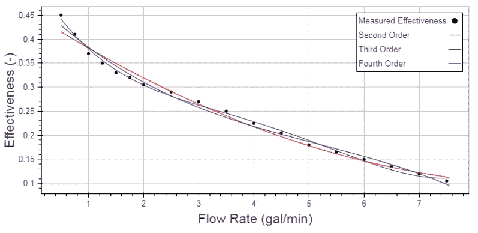
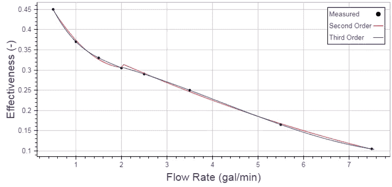

# 在自动化数据分析过程中生成回归

> 原文：<https://towardsdatascience.com/automating-scientific-data-analysis-part-4-110d14421527?source=collection_archive---------26----------------------->

## 如何从完整的数据集推导、验证和记录回归


这是教您如何自动化科学数据分析的四篇系列文章中的第六篇。[第一篇文章](https://medium.com/@petergrant_81989/automating-scientific-data-analysis-part-1-c9979cd0817e)介绍了概念，提供了动机，并描述了一般过程。第二篇[、](https://medium.com/p/a26bd749fa8d/edit)、[第三篇](https://medium.com/p/10d2ee9a62f9/edit)和[第四篇](https://medium.com/@petergrant_81989/checking-automated-data-analysis-for-errors-a97a22a35ad7)文章描述了如何控制数据集、识别每个测试中的条件、处理数据以及检查数据错误。第五篇[文章描述了如何以逻辑方式存储数据，以便于生成回归。这第六篇，也是最后一篇文章将教你如何从这些结果中开发回归，并验证和记录结果模型。](https://medium.com/@petergrant_81989/automatically-storing-results-from-analyzed-data-sets-ed918d04bc13)

# 从存储的数据生成回归

最后一个基于 Python 的实验室数据分析自动化主题是从存储的数据中生成和验证回归。这往往是实验室数据分析项目的最终目标，在宣布项目完成之前，还有几件事情需要考虑清楚。生成回归时，必须考虑以下主题:

*   如何确定回归的最优阶，
*   用 numpy 创建一维回归，
*   scikit 简介-学习创建 n 维回归，
*   验证模型，以及
*   可视化回归和验证的结果。

本节偶尔使用回归预测热交换器性能的例子。有关该技术的介绍，以及用于建模的测试和数据分析，请参见[第 2 部分](https://medium.com/@petergrant_81989/automating-scientific-data-analysis-part-2-12331b46003)。

# 确定最佳回归结构

回归的顺序对最终模型的预测精度有着巨大的影响。高阶回归更加灵活，能够比低阶回归更好地统计匹配数据集，或者匹配更复杂的数据集。然而，增加的灵活性可能会导致模型在统计上看起来很好地符合数据，但在数据集中的测量点之间进行预测时却有很大的不准确性。低阶回归不太灵活，通常也难以在统计上匹配数据，但提供了更稳定的预测。这可能导致测量点的精度较低，但测量点之间的精度较高。

这种差异是由数据集中的数据点数量造成的。需要更多的数据点来创建更高阶的稳定回归。图 1 和图 2 清楚地显示了这种影响。两个图都显示了二阶、三阶和四阶回归。图 1 显示了使用完整数据集创建的回归。注意回归中没有显著的差异。四阶回归比三阶回归更接近数据集，三阶回归比二阶回归更好。但它们都非常接近，并且由于趋势与测量数据显示的趋势非常接近，因此可以相信它们能够准确预测中间值。在这种情况下，显然应该选择 4 阶回归。



Figure 1: Example Regression Created from a Thorough Data Set

图 2 中的回归不是这样的。图 2 显示了使用同一组测量数据的子集创建的回归。在这种情况下，4 阶回归再次比 2 阶或 3 阶回归更好地匹配测量的数据点。然而，对于高阶回归来说，既太复杂又没有足够的数据。当他们试图用有限的数据集来匹配数据点呈现的曲线形状时，他们变得不太稳定。这可以通过三阶回归，尤其是四阶回归的波动来观察。虽然四阶回归明显地与测量数据相匹配(三者中最好的),但是它不能被信任在数据集的边界内进行插值。在流速高于 3.5 加仑/分钟时尤其如此。


Figure 2: Regressions Created from a Limited Data Set

这个问题有几种可能的解决方法。它们按优先顺序排列如下:

*   收集更多数据以创建更好的数据集，
*   将数据集分成多个部分，并生成多个低阶回归，以及
*   尝试从当前可用的选项中确定最佳回归。

## 收集更多数据

通过提供更多的约束点，收集更多的数据会产生更稳定的回归。当确定新的测试来改进数据集时，请指定填补当前数据集中较大空白的测试。例如，如果添加额外的点来填充从 3.5 到 5.5 加仑/分钟和从 5.5 到 7.5 加仑/分钟的间隙，图 2 所示的简化数据集将更加完整。

## 分割数据集

拆分数据意味着确定多个部分，每个部分可以有单独的、平滑的回归，将数据集拆分成多个部分，并为这些拆分的数据集创建单独的回归。虽然它减少了每次回归的数据量，但它为它们的匹配创建了更平滑的形状。因此，即使数据集较小，也有可能得到更平滑的曲线和更好的匹配。在这种情况下，分割数据集，从 0.5-2 加仑/分钟创建一个回归，从 2.5-7.5 加仑/分钟创建第二个回归，会产生更好的结果。图 3 显示了使用前面提到的分割创建二阶和三阶回归的结果。



Figure 3: Regressions Created from a Limited Data Set, Split at 2 gal/min

结果显示，与使用单一数据集相比，使用分割数据集可以获得更好的匹配。分裂发生在 2 加仑/分钟，并且通过二阶回归预测的突然增加而明显。该凸起显示了在 2.0-2.5 加仑/分钟范围内使用二阶回归的误差增加。除了该区域，二阶回归与数据集非常接近。三阶回归在分界点没有显示出同样的不确定性，并且在整个 0.5–7.5 加仑/分钟范围内与回归非常接近。这表明，以 2 加仑/分钟的速度分割数据集，并为以上和以下创建单独的回归的方法对于该数据集非常有效。

## 确定最佳选项

最低效的方法是从可用选项中选择最佳回归，这是在不可能收集更多数据并且拆分数据集不能产生令人满意的结果时使用的方法。在这个数据集和图 2 所示的回归中，这意味着使用四阶回归。二阶回归可能是三个选项中最平稳的一个，但它明显高估了低流速时的有效性，低估了高流速时的有效性。三阶回归更接近，但也不太稳定。四阶回归非常接近地匹配数据点和趋势，直到 3.5 加仑/分钟。从 3.5 加仑/分钟到 5.5 加仑/分钟，它将预测过高，从 5.5 加仑/分钟到 7.5 加仑/分钟，它将预测过低；然而，在该范围内的不准确预测对所有三个选项都是真实的，并不比三阶回归更引人注目。当使用这种回归时，重要的是要记住它在低于 2.5 加仑/分钟时非常精确，在更高的流速时不太可信。

# 使用 Numpy 创建回归

NumPy 是 Python 中可用的科学计算工具包。在它提供的众多工具中，有一个用于创建一维回归的工具集。主要的两个工具是:

*   polyfit:该工具使用用户提供的 x 和 y 数据确定 1 维 n 阶多项式的系数。NumPy.polyfit 以语法“numpy.polyfit(Data_x，Data_y，Order)”调用。
*   poly1d: poly1d 使用用户指定的系数创建一个回归，并将它们赋给一个变量，以便以后可以很容易地引用该回归。NumPy.poly1d 是用语法“numpy.poly1d(系数)”调用的。

如果结果的存储方式与存储中间结果以供以后分析的建议一致，这些工具可以很自然地生成结果的回归。该过程使用以下步骤:

1.打开包含所需数据的数据文件，并将其存储在数据框中。对于这个例子，数据帧将被称为“数据”

2.使用 NumPy.polyfit 确定数据集的系数，并将它们存储到变量中。这可以通过类似下面的代码来实现:

```
Coefficients = numpy.polyfit(Data[‘Flow Rate (gal/min)’], Data[‘Effectiveness (-)’], 2)
```

在这种情况下，将流速作为 x 数据、有效性作为 y 数据的二阶回归系数存储到变量“系数”中。在热交换器中，该数据集仅具有单个流率，表示在设备的任一侧具有相同流率的情况。

3.使用系数调用 NumPy.poly1d，将回归作为函数分配给变量。例如，上一步中的系数可用于通过以下方式创建回归:

```
Effectiveness_SecondOrder = numpy.poly1d(Coefficients)
```

现在，可以通过调用“有效性 _ 二阶”函数，使用二阶回归来估计该热交换器的有效性。

4.最后一步是调用函数来生成所需的回归估计值。如何使用它的几个例子如下:

*   如果使用回归来评估特定条件下的结果，请调用引用该条件的函数，并将其赋给一个描述性变量。例如，任一侧流量均为 2 加仑/分钟的热交换器的效率可通过下式确定和保存:

```
Effectiveness_2_GalPerMin = Effectiveness_SecondOrder(2).
```

*   另一种可能的用途是用估计回归值填充数据框的列。这在验证模型时非常有用，因为回归估计值可以存储在测量值旁边的数据框中，很容易进行比较。这可以通过类似如下的代码来实现:

```
Data[‘Effectiveness, Estimated, Second Order (-)’] = Effectiveness_SecondOrder(Data[‘Flow Rate (gal/min)’]
```

c.第三种可能性允许绘制平滑回归曲线，并使用 NumPy“arange”函数。NumPy.arange 创建用户指定的值范围。它的语法是这样的:

```
numpy.arange(Minimum Value, Maximum Value, Step)
```

例如，numpy.arange(0.5，7.6，0.1)从 0.5 开始创建一个范围，每个值以 0.1 为步长递增，最大值为 7.6。这对于绘制平滑曲线非常有用，因为这是一种在期望的时间间隔预测回归结果的快速方法。例如，以下代码将创建一个 x 和 y 数据集，用于以 0.1 加仑/分钟的间隔绘制回归曲线，从最小值 0.5 加仑/分钟到最大值 7.5 加仑/分钟:

```
x_array = np.arange(0.5, 7.6, 0.1)Effectiveness_array = Effectiveness_SecondOrder(x_array)
```

# Scikit 简介-学习

目前，创建 n 维 n 阶回归的最佳工具是 scikit-learn 软件包。它基于 scipy、NumPy 和 matplotlib，通常用于数据科学和机器学习领域。它提供了许多不同的回归工具，有许多不同的方法。那些有兴趣了解 scikit-learn 中所有功能的人应该查阅他们的文档，并准备学习许多不同类型的回归技术。了解数据科学的基本原理也将是有益的，关于 Coursera.org，吴恩达出版了一个信息丰富的免费课程。由于对数据科学和 scikit-learn 的全面讨论对于本文来说太长了，本节将重点介绍一些基本的线性回归技术。

使用 scikit-learn 创建线性回归的两个非常有用的工具是 1)sk learn . preprocessing . polynomial features 和 2)sk learn . linear _ model . linear regression。

多项式功能提供了一组矩阵运算，用于将数据转换成线性回归所需的形式。它创建一个矩阵，该矩阵由小于或等于用户指定的输入变量的所有组合组成。例如，使用具有两个输入变量(x 和 y)的多项式特征创建的准备二阶模型的矩阵将具有项[1，x，y，x2，xy，y2]。这种方法有时被称为“黑盒建模”,因为它并不试图理解模型行为背后的结构，而是旨在创建完全基于数学技术的匹配回归。

可以使用以下步骤创建输入矩阵:

1.  通过调用多项式 Features 并指定回归的顺序来创建 matrix 对象。请注意，scikit-learn 使用术语“程度”而不是“顺序”。
2.  为即将到来的线性回归安排正确格式的输入数据。对于多项式特性，这意味着单个矩阵包含指定每个测试条件的子矩阵。例如，具有三个测试和两个输入条件的输入矩阵将具有[[x_1，y_1]，[x_2，y_2]，[x_3，y_3]]的形式。
3.  对输入数据调用 polynomial features fit _ transform 函数，并使用 numpy.delete 移除第一行。

例如，以下代码使用两个输入“热流量(加仑/分钟)”和“冷流量(加仑/分钟)”为五阶回归生成正确的矩阵。请注意，输入数据矩阵是使用从有效性数据框中读取值的 for 循环创建的。

```
poly = PolynomialFeatures(degree=5)All_Flow_Pairs = []for i in Effectiveness.index: FlowRate_Hot = Effectiveness.loc[i, ‘Hot Flow Rate (gal/min)’] FlowRate_Cold = Effectiveness.loc[i, Cold Flow Rate (gal/min)’] All_Flow_Pairs.append([FlowRate_Hot, FlowRate_Cold]) All_Flow_Pairs_Transformed = poly.fit_transform(All_Flow_Pairs) All_Flow_Pairs_Transformed = np.delete(All_Flow_Pairs_Transformed, (0), axis = 1)
```

LinearRegression 旨在轻松接受该矩阵，并生成指定的回归。它提供了对这个过程特别有用的四个函数。它们是:

*   。拟合:此函数接受输入数据矩阵和匹配结果矩阵，并将多项式特征中指定的回归拟合到数据。这是创建回归的步骤。
*   。coef_:这个函数打印描述回归的系数。存储来自的结果。coef_ 到一个变量，并在程序结束时打印它，允许存储系数供以后外部使用。
*   。intercept_:如果所有输入都设置为 0，此函数将返回回归的值。
*   。score:该函数返回回归的 r2 值，与用于创建回归的数据集进行比较。它提供了回归预测输入数据集的能力的度量。这个概念将在下一节详细讨论。

以下代码延续了 PolynomialFeatures 中的示例，并显示了 LinearRegression 的函数如何创建、记录和测试回归。

```
clf = LinearRegression()clf.fit(All_Flow_Pairs_Transformed, Effectiveness[‘Effectiveness (-)’])n_Dimensional_Coefficients = clf.coef_n_Dimensional_Intercept = clf.intercept_n_Dimensional_Score = clf.score(All_Flow_Pairs_Transformed, Effectiveness[‘Effectiveness (-)’])
```

# 验证模型

模型开发中最重要的部分，也是这个概念文本中无法详细描述的部分，是验证。验证是确保模型生成的预测与建模的现象相匹配的过程。这是一个复杂的、多阶段的过程，永远不会真正结束。执行质量模型验证的步骤如下:

*   确保模型与用于创建它的数据集相匹配，
*   将模型预测与附加数据集进行比较，
*   发布报告，详细说明模型的优点、缺点和适当的应用。

## 验证模型

第一步是将模型预测与源数据进行比较。这一步通常被称为“验证”这一步的目标很简单:确保模型与用来创建它的实验数据相匹配。正如本书中所讨论的，在为创建模型而明确创建特定数据集的情况下，模型中的误差应该非常低。执行此步骤时，需要回答两个一般问题:

1.  模型是否在可接受的误差范围内与数据集匹配？
2.  数据集的哪些方面被模型很好地/差地表示了？

通常，如果误差小于用于收集数据的测量的不确定性，则认为模型在可接受的误差限度内与数据集匹配。这经常被用作极限，因为它代表了知识的极限；如果模型和测量值之间的误差小于测量值的不确定性，那么就没有办法知道模型是不完美的。

不可避免的是，这个模型在一些预测上会比其他的更好。识别和研究这些差异是很重要的。它们可能显示出模型中的缺陷，可能需要使用不同的建模方法来纠正它们。如果它们是对最终结果没有重大影响的小问题，那么记录下来就足够了。确定最佳回归结构一节对这些情况提供了一些回答。

## 验证模型

模型验证的第二步是将模型预测与第二个数据集进行比较。这是重要的一步，因为第一步并没有真正验证模型，它只是表明它能够匹配它在数学上被迫匹配的数据集。

这个挑战的解决方案是在测试计划中包含额外的测试，但是不要将它们包含在用于生成回归的数据集中。将它们保存在一个单独的数据集中，该数据集是专门为模型验证而创建的。这样，它们对回归没有影响，并提供了可用于验证检查的附加点。

验证数据集中的测试应该尽可能彻底地测试模型。包括在模型对输入变化高度敏感的区域进行测试，以确保模型在这些范围内的预测是正确的。包括模型中所有不同变量的变化，以确保它准确地预测模型响应这些变量变化的行为。在原始数据集中数据点之间有较大间隙的区域进行测试，以确保模型在这些区域保持稳定，如**所示，创建最佳回归结构**。

在此验证阶段，尝试回答与第一阶段相同的问题。模型在测量不确定度范围内准确吗？有比其他地方更准确的地方吗？如果在测量不确定度范围内不准确，可以改进模型吗？和以前一样，任何可以改进的问题都应该改进，任何不能改进的问题都应该记录下来。

## 证明文件

模型验证过程的最后一步是发布发现，同时认识到这比简单的“有效”或“无效”声明更复杂。没有一个模型在所有方面都有效，或者在所有方面都无效。简单地宣布一个模型无效并不代表即使是有限的模型也能提供的价值。宣布一个模型是“有效的”给人的印象是它准确地预测了一切，没有弱点。

这个问题的解决方案很简单:不要宣称模型是有效的，而是公布模型的优点和缺点。这为用户提供了对模型适当使用的更准确的理解，允许他们决定何时应该使用模型，何时不应该使用模型。它还提供了支持未来改进模型的文档。

作为一个例子，这些文章使用了发展回归预测热交换器的稳态效率的例子。该模型设计用于预测流速在 0.5 至 7.5 加仑/分钟之间时的稳态效率。只要装置两侧的流速相同，它就非常精确。这些模型没有解决超出该范围的流速，或者设备两侧流速不同的情况。此外，它是专为稳态有效性而设计的，不应用于瞬态模拟中的预测。

# 结论

这一系列的四篇文章已经向您介绍了编写自动分析科学数据集的程序所必需的所有概念。您已经了解了以下主题:

*   自动化数据分析的一些可能的好处，
*   自动化数据分析的程序结构，
*   如何构建数据集以实现自动化，
*   如何识别每个数据测试的条件，
*   如何拆分数据文件，
*   如何编写一个遍历每个数据文件的 for 循环，
*   如何分析每个文件中的数据，
*   如何检查每个文件中的数据是否有错误，
*   如何存储每个文件中的数据，以便随时用于生成回归，以及
*   如何从数据集生成、验证和记录最终回归。

希望这些文章已经帮助你发展了新的技能，也希望你可以用它们在你的职业生涯中找到更多的轻松和满足感。