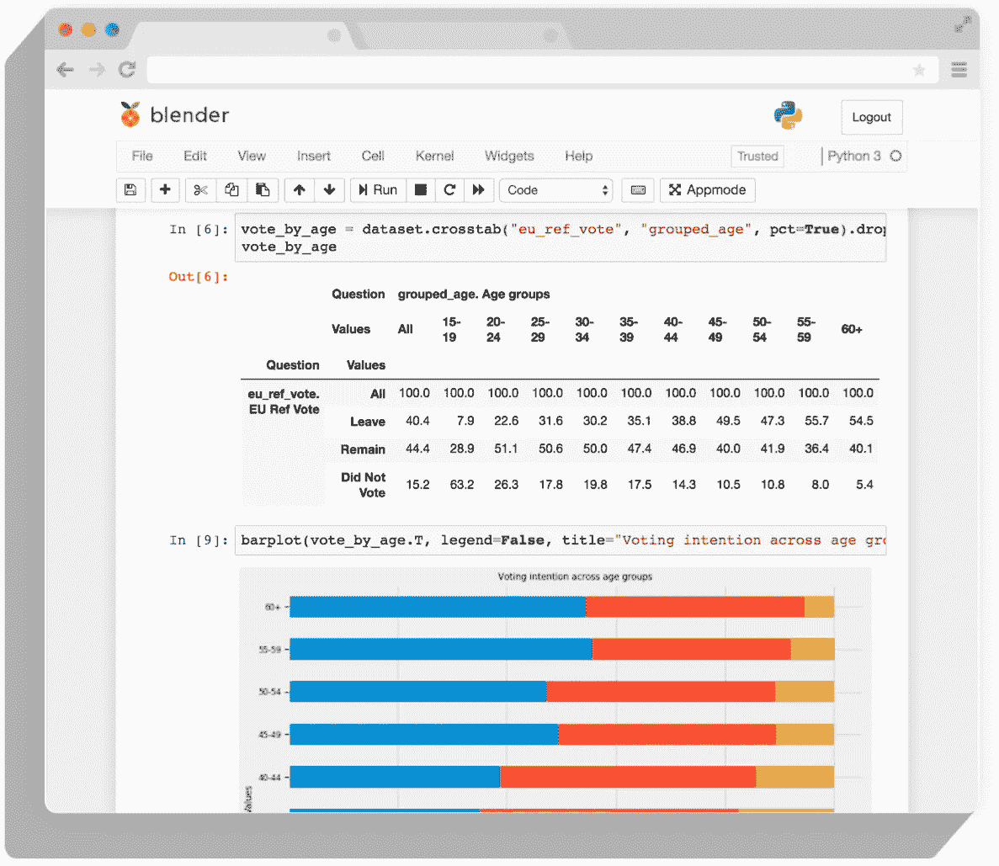
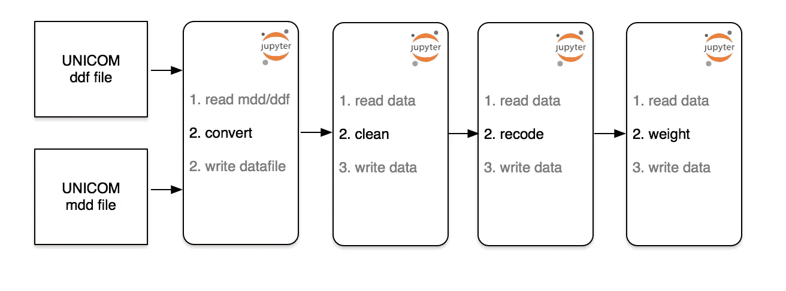
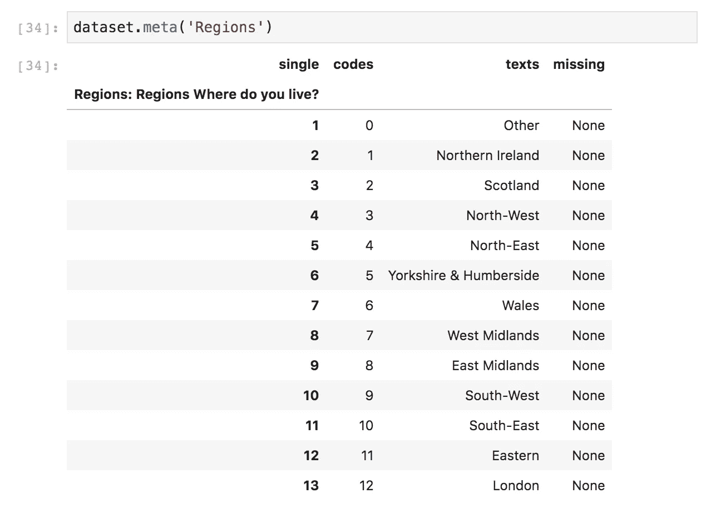
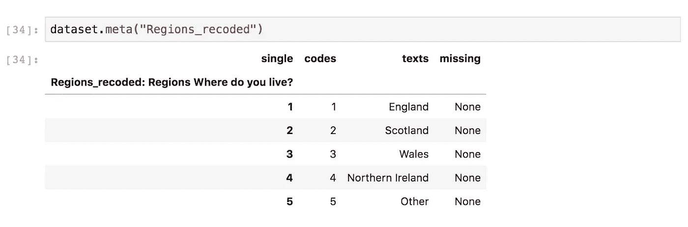
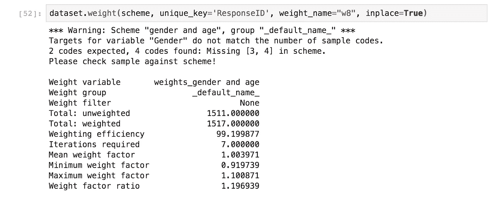
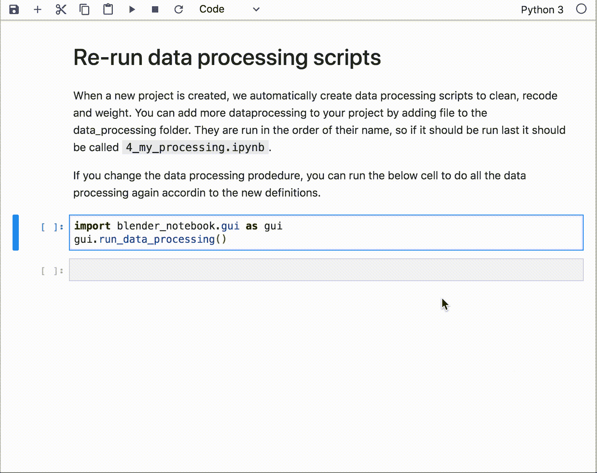

# 使用开源软件自动分析调查数据

> 原文：<https://towardsdatascience.com/automating-survey-data-analysis-with-open-source-software-f08f000bd672?source=collection_archive---------28----------------------->

## 第一部分:数据处理流程

你已经向电话里友好的声音承认，你要投票给怪物疯狂党；在那个弹出的在线测试中，你点击了百事可乐而不是可口可乐；你说你会在后续的客户满意度调查中高度推荐这家汽车经销商(但后来没有)。当全世界的人都向政治、医学、品牌、人力资源等领域的研究者表达自己的感受和看法时；数据最终在哪里？它是如何分析的？

## 市场研究仍在等待开源革命

在主流数据科学中，开源软件主宰着世界:如果你是认真的，你很可能，至少是部分地，在使用 Python 或 r。网飞的数据科学家在 Jupyter 笔记本上的指尖就能拿到公司的数据。AirBnb 开源了他们建立的工作流程自动化软件，以帮助他们[在登记后立即自动估算上市房屋的终身价值](https://medium.com/airbnb-engineering/using-machine-learning-to-predict-value-of-homes-on-airbnb-9272d3d4739d)。

让数据科学从业者如此强大的过多工具在很大程度上仍然不存在。市场研究人员依赖 SPSS、Merlin 和 Quantum 等专有软件，有可能成为数据世界的勒德分子。

## Jupyter 笔记本



A Jupyter Notebook showing the results of an opinion poll in both table and chart form using the open source Quantipy library.

本文是一系列文章中的第一篇，展示了开源软件如何使用 Jupyter 笔记本和各种其他开源库等工具，大规模提高分析调查研究数据的生产率、质量和安全性。

Jupyter Notebooks(以下简称笔记本)是一个始于 2014 年的项目，旨在为科学研究、可复制的工作流、数据叙述和分析创建一套一致的开源工具。这是一个易于使用的基于网络的平台，而且碰巧这项技术也非常适合调查数据。

我们的目标是鼓励行业抓住集体的木屐，拥抱即将到来的数据革命。

## 自动化数据处理工作流程

我们假定我们已经收集了数据。在这些文章中，数据处理包括清理、重新编码、合并和加权数据等任务。使用笔记本，我们可以将这些任务安排到生产线或工作流程中。许多繁重的工作是自动化的，但是过程是可适应的:当工作流程的任何部分发生变化时，只需点击一个按钮，就可以很容易地按照定义的顺序运行所有其他部分。

我们将使用开源库 Quantipy([python 3 端口在这里](https://www.github.com/quantipy/quantipy3))，并从将数据读入 Quantipy 数据集开始(该数据之前是从 UNICOM mdd/ddf 文件转换而来的，但在后面的帖子中会详细介绍)。

```
import quantipy as qp
dataset = qp.DataSet("opinion poll")
dataset.read_quantipy(
  path_meta="../data/interim/{}.json".format(filename),
  path_data="../data/interim/{}.csv".format(filename)
)
```

我们将创建三个不同的笔记本，每个笔记本执行三个任务中的一个；清理、重新编码和加权，以创建流水线。在管道运行之前，数据被转换(用一个笔记本),以便该过程总是从原始数据开始。在以后的管道中，我们将能够用一个直接从数据库读取的笔记本来替换数据转换笔记本。这将使我们能够为客户提供实时更新。



The data processing workflow is run across multiple Jupyter Notebooks. This will allow us to run the entire workflow with the papermill library when anything changes and share specific parts of the process with other projects.

在后面的文章中，我们将介绍上述文件的自动创建，但是现在，我们将手动创建它们。

现在我们有了数据集(在 Quantipy 中，我们有两个数据结构。元数据:用于描述数据，数据:用于实际记录)，我们可以编写组成管道的笔记本。我们从一个简单的 clean 命令开始

```
#file: 1_clean.ipynbdataset = dataset.filter('completed', {'SurveyCompletionStatus':6})
```

在这种情况下，清理是简单的，但在这里，用户可以，例如，使用机器学习来过滤掉欺诈性的答案。

接下来，我们记录数据。我们希望根据英格兰、苏格兰、北爱尔兰和威尔士对这些地区进行加权，但正如元数据所示，目前有太多地区无法应用该加权方案。



因此，我们希望通过将英格兰答案分组，但保留其他答案，来导出一个新变量。

```
#file 2_recode.ipynb# mapper arguments are: new code, new label, {variable: old codes}
mapper = [ (1,  'England', {'Regions': frange('3-5, 7-12')}),
           (2,  'Scotland',{'Regions': [2]}),
           (3,  'Wales',   {'Regions': [6]}),
           (4,  'Northern Ireland', {'Regions': [1]}),
           (5,  'Other',   {'Regions': [0]})
]# arguments: variable name, type (single response), label, mapper
dataset.derive('Regions_recoded', 
               'single', dataset.text('Regions'), mapper)
```



我们还将根据年龄对数据集进行加权，因此我们可以正确地表示不同年龄组的投票意向。记录单个响应变量(如 region)不同于记录一个数字。为了记录年龄变量，我们使用数据集的 band 命令。

```
# 2_recode.iypnbage_bands= [{"Younger than 18": (0, 17)},
             (18, 24),
             (25, 34),
             (35, 44),
             (45, 54),
             (55, 64),
             {"65+":(65, 200)}
            ]
dataset.band(name='Age', bands=age_bands,
             new_name='Age_recoded', label="Age groups")
```

我们现在准备应用权重。我们有一个加权方案，以确保我们的结果代表正确的性别、年龄和地区分布。

```
# 3_weight.ipynb
#
age_and_gender_targets = {
   'Gender': {
        1:49, 
        2:51
    },
    'age_recoded': {
        1: 21.3,
        2: 9.4,
        3: 13.4,
        4: 14,
        5: 13.7,
        6: 11.7,
        7: 16.5        
    },
    'Regions_recoded': {
        1: 84.2,
        2: 8.2,
        3: 4.7,
        4: 2.8,
        5: 0.1
    }
}
scheme = qp.Rim('gender, age, region')
scheme.set_targets(targets=age_and_gender_targets)
```



权重报告向我们展示了权重是合理的(有人在获取代表性样本方面做得很好)，任何响应的最大增加权重是 10%(最大权重因子)。

最后，将我们的管道存储在一个名为`data_processing`的目录中(关于我们的文件夹结构将在以后的文章中详细介绍)，这意味着无论何时发生变化，我们都可以按顺序运行它们，以使我们的数据跟上速度。我们为用户提供了一个笔记本，它调用一个运行所有数据处理笔记本的脚本，如下所示。



The run_data_processing script is a for loop that takes all notebooks in the data_processing directory and runs them with the python library papermill.

许多组织有复杂得多的重新编码和加权方案，开源软件可以处理所有这些——为了简洁起见，我们在这里保持简单。

在即将发布的帖子中，我们将介绍上述内容如何成为标准的“cookie cutter”文件夹结构的一部分，PowerPoint 文件、表格和在线仪表板的自动生成如何集成到上述过程中，以及如何将图形用户界面添加到该过程中，以使需要快速访问结果但没有时间编写代码的用户可以访问该过程。

盖尔·弗雷松是 [Datasmoothie](http://www.datasmoothie.com) 的联合创始人，这是一个专门从事调查数据分析和可视化的平台。