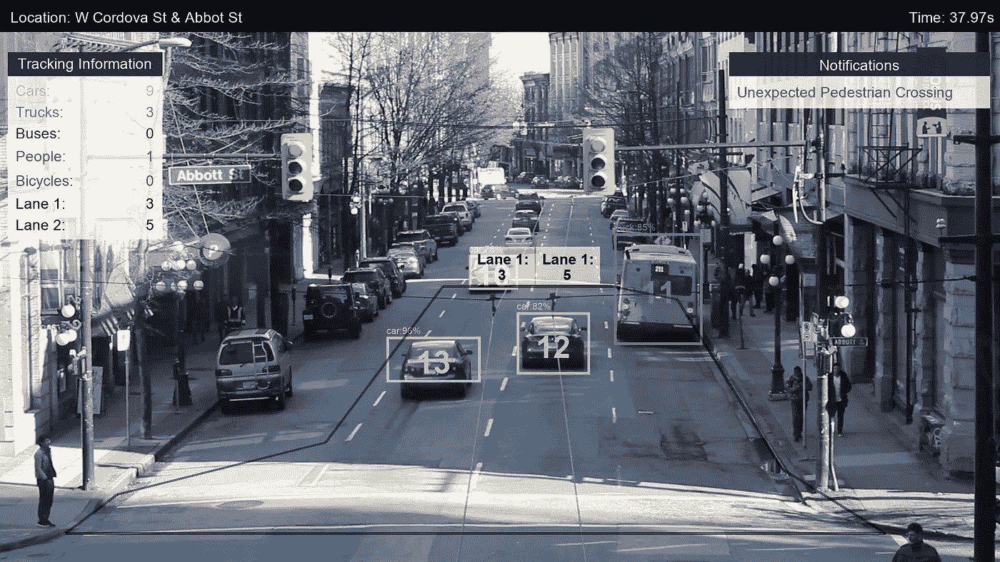
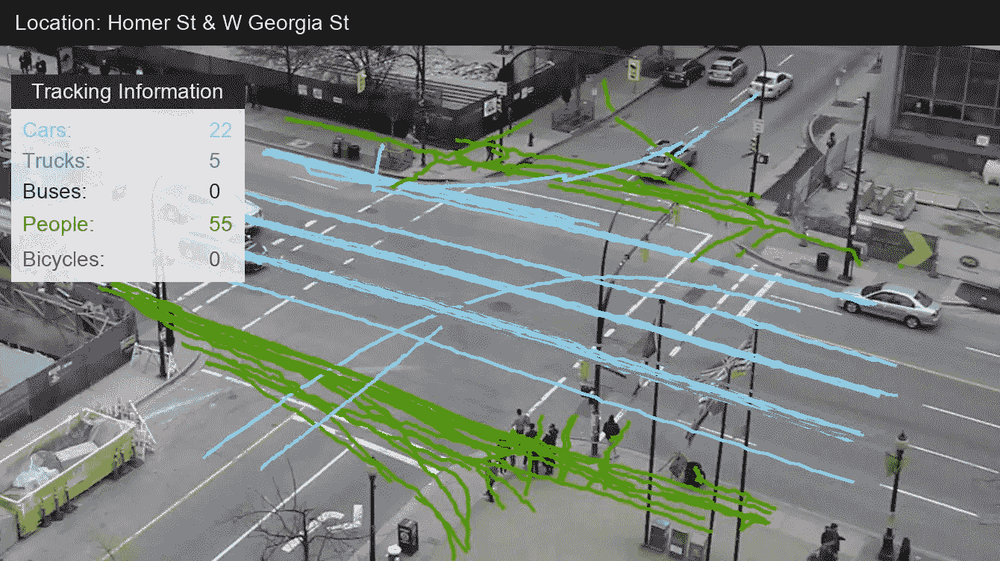

# 通过机器学习实现流量分析自动化

> 原文：<https://towardsdatascience.com/automating-traffic-analysis-with-machine-learning-6165a3abecb3?source=collection_archive---------21----------------------->

**总结**

数据科学和机器学习为改善公共空间提供了新的机遇。将这些技术用于智能城市可以使我们的社区更宜居、更可持续，并有利于当地经济。他们可以帮助理解城市规划和城市设计中的关键问题，如公共空间如何使用，有多少用户，用户是谁。

在本帖中，我们将查看一个概念验证系统，我们实现该系统是为了使用机器学习进行视频分析来回答这些问题。这是一种易于部署且经济高效的方法。我们将特别关注十字路口，那里的设计会影响交通拥堵、当地商业和行人安全。我们自身的经历、零事故目标(消除道路上的严重事故)和智慧城市计划推动了我们的工作。

要了解更多关于我们的技术，请给我们发一条[消息](https://inletlabs.com/contact.html)。

*“规划闹市区最好的方法，就是看看今天人们是怎么使用它的；寻找它的优势，并加以利用和加强。”—简·雅各布斯*

**简介**

Automated traffic detection and tracking, showing bounding boxes of tracked objects and lane counter on West Cordova at Abbot Street in Vancouver.

城市规划者的任务是建设实用、宜居和支持经济增长的城市。此外，他们还必须考虑环境影响、未来增长和不同用户群的需求。我们能否利用数据科学和机器学习，通过增加他们做出决策所需的信息来支持他们完成这些任务？**我们开发了一个基于自动视频分析的原型系统，该系统可以提供关于如何改善公共空间的关键信息。**在本帖中，我们将特别关注交通路口，因为不列颠哥伦比亚省正在追求[零视力](https://www2.gov.bc.ca/gov/content/transportation/driving-and-cycling/road-safety-rules-and-consequences/publications-legislation-and-data/bc-road-safety-strategy)的目标，即没有交通事故造成的死亡或严重伤害。

温哥华最糟糕的十字路口有哪些？根据 2013 年至 2017 年的工商银行数据,在主要街道和终端十字路口发生了 692 起交通事故，其中 256 起导致了伤亡。对于行人来说，东黑斯廷斯和主街以 35 起事故高居榜首。在城市的另一边，伯拉德街&太平洋区是对骑车人最危险的地方，发生了 34 起撞车事故。这些事故对相关人员及其家人来说是一场悲剧，通过增加城市和工行的成本来影响我们所有人。**如果某个地方经常发生事故，那么对街道设计的干预可以拯救生命。**

视频分析可以支持在危险路口的敏捷干预。**它可以帮助识别哪些行为会导致事故，以及交通模式是如何形成的。城市可以利用这些知识来实施适当的设计变更。之后，视频可以用来了解任何变化的影响。一项干预措施的成功是可以衡量的，而不必等待数年才能看到统计数据是否有所改善。这意味着，如果设计干预没有产生预期的影响，市政当局可以快速迭代。它还允许特定于位置的知识。骑自行车的人在伯拉德街和太平洋街需要的干预与在主街和东黑斯廷斯街需要的干预不同。**

Traces of one minute of traffic at the Homer Street and West Georgia intersection in Vancouver.

拍摄十字路口的视频成本低、设置快且易于处理。它不需要永久的基础设施，只需要访问合适的视点。这意味着摄像机可以快速安装，并且可以临时安装一段时间。我们使用的视频质量可以被当前一代的移动设备复制。视频分析可以有效地取代或补充当前的方法，如气动管、感应线圈和手动计数。视频分析的优势包括能够区分不同车道的交通、检测交叉路口转弯模式以及监控未遂事件等。此外，它可以独特地提供可靠的行人计数和运动模式，量化诸如行走速度、[粘性](https://www.planetizen.com/node/69454)、行人密度等信息。

**流量分析**

让我们来看看如何将机器学习应用于街道交叉口的视频，以及我们可以提取出来支持市政当局的数据。我们已经构建了一个概念验证系统，结合了深度学习(神经网络)和对象跟踪算法，可以自动处理视频。

我们将应用我们的系统来分析温哥华市区两个十字路口的视频。第一个是霍默街和西乔治亚，第二个是阿博特街和西科尔多瓦。这些位置提供了不同的街道景观和不同的交通流量。从西乔治亚的 Homer Street 的视频中，我们可以看到该系统可以处理大量的流量。在对**西科尔多瓦十字路口的分析中，我们还将看到如何自动发现意外的人行横道。**在对我们的代码库和系统进行初始设置后，分析进一步的交集是一项简单的任务。

Traffic Analysis at the Homer Street and West Georgia intersection in downtown Vancouver shown at 2x normal speed. The Traffic Information panel displays a count of the different types of traffic. The colours in the panel correspond to the bounding boxes in the video. The Plan View panel shows a top-down view of traffic at the intersection. A larger view of the Plan View panel is shown in the next video.

我们的仪表板上覆盖了我们计算机视觉算法的结果。已经被识别的交通流中的对象具有边界框，并且在场景中被分配了唯一的标识符。边界框的颜色与交通信息面板中的条目相对应。在那里，我们显示不同类型用户的数量。在这个场景**中，我们计算交通的种类:行人、骑自行车的人、汽车、卡车和公共汽车。**左下角是我们从视频数据中推断出的交通平面图(自上而下)。顶部的标题显示了视频的位置和时间。

Plan View of traffic at the Homer Street and West Georgia intersection in downtown Vancouver played at 2x normal speed. The Traffic Information panel displays a count of the different types of traffic, with colours corresponding to those in the Plan View Panel.

使用算法计数的一个优点是它可以很好地适应流量。我们的系统在视频中记录了 50 多辆汽车和 100 多名行人。即使是在一个短视频剪辑中，手动计算这一流量也是一项挑战和时间密集型任务。我们不仅统计了用户的数量，还统计了他们通过十字路口的路径。第二张图片显示了部分视频的交通轨迹。我们可以比较通过十字路口和转弯的车辆数量。我们还可以注意到一些行人开始在人行横道线外过马路。

我们的系统将交通流重新投影到自上而下的视图中。虽然我们目前对此操作采取简单的方法，但是更健壮的系统将实现几个特征。这些包括测量车辆的速度，以及不同用户之间的距离。**这将允许我们量化未遂事件**，例如当一辆行驶中的汽车与骑自行车的人或行人相距一定距离时。目前，我们有发生事故的数据，但没有可能导致用户选择不同路线或改变交通方式的千钧一发事件的数据。

Traffic going East on West Cordova at Abbot Street in downtown Vancouver.

自动化分析使我们能够识别和量化感兴趣的事件。我们在 Abbot 街的 West Cordova 的视频中定义了两个计数器，以确定每条车道上有多少辆车。如果该市想要取消街头停车，安装专用自行车道，或者考虑引入公交优先车道的影响，这些信息将非常有用。此外，我们可以将交通灯的时间整合到我们的视频中。我们这样做是为了在行人意外横穿马路时发出警报。我们可以调查这种情况是否经常发生，以及行人是否没有得到足够的机会在预定时间过马路。

由于我们的系统是一个概念验证，我们的功能可以改进，并开发新的功能。在交通识别方面存在失误——自行车可能会被误归类为人，汽车、卡车和公共汽车的标签有时会被混淆。我们还看到，当有一大群行人时，系统很难区分人们并跟踪他们，因为他们在人群中变得模糊。可以实现更严格的算法来处理这些情况。我们的概念验证依赖于单个摄像头。我们可以进一步扩展我们的系统，在多个视点加入相机，添加红外相机，并使用双镜头系统进行深度感知。

我们还能在哪里应用这项技术？温哥华市最近花了 500 万美元翻新罗布森广场。空间被充分利用了吗？我们可以使用自动视频分析来研究一天中空间的使用情况。这包括量化人们使用这个空间旅行、聚会和娱乐的模式。著名城市学家[威廉·h·威特](https://en.wikipedia.org/wiki/William_H._Whyte)在七十年代研究公共空间时使用的延时相机的现代升级版。同样，格兰维尔岛也在发生重大变化。这将影响行人的活动，以及行人/自行车/汽车的相互作用。**可靠的交通信息让我们能够最大限度地提高空间投资和收益。**

**结论**

利用机器学习，我们已经建立了一个概念验证系统，可以从视频数据中自动提供交通信息。我们已经将它应用于两个十字路口，表明它可以跟踪否则禁止手动计数的交通量，并且可以捕捉像意外行人穿越这样的事件。市政当局可以利用这些信息来改进不安全十字路口的设计，并测试干预措施的有效性，从而挽救生命和节省资金。这一简单高效的系统可以为实现零事故目标做出积极贡献，消除道路上的严重事故。

您是对这项技术感兴趣的组织吗？[联系我们](https://inletlabs.com/contact.html)了解更多信息。

*最初发表于*[T5【https://inletlabs.com】](https://inletlabs.com/2019/05/13/traffic_counter.html)*。*