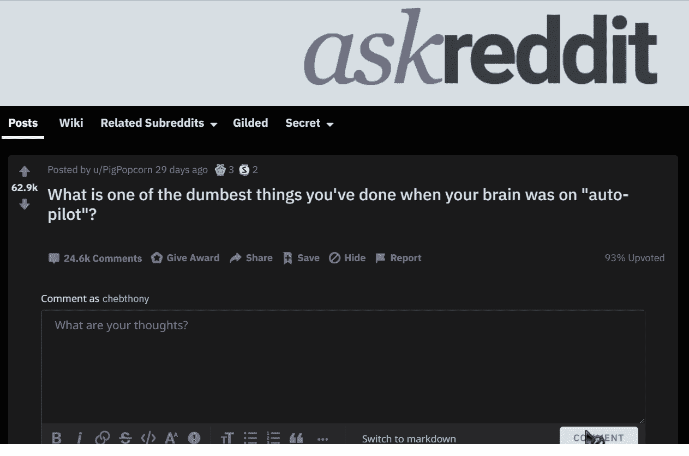
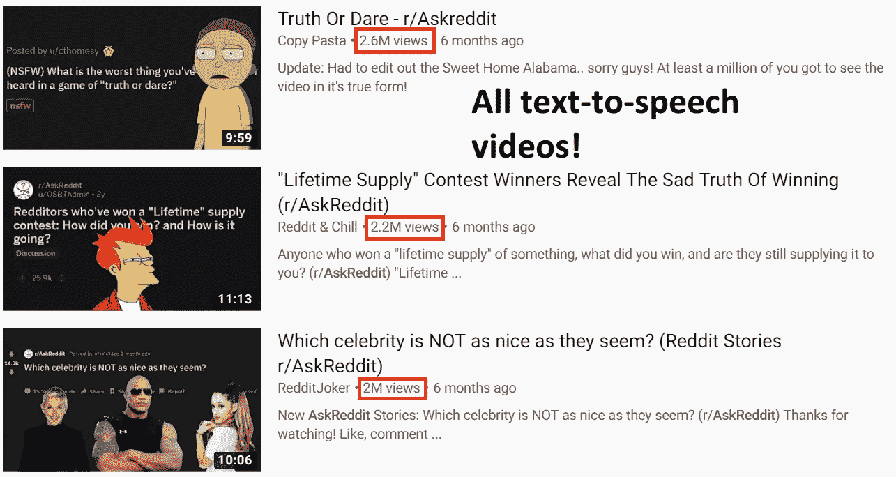
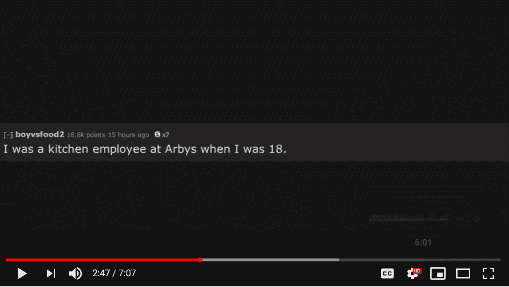
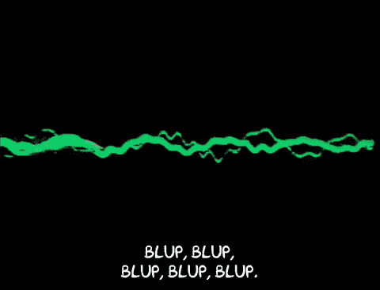
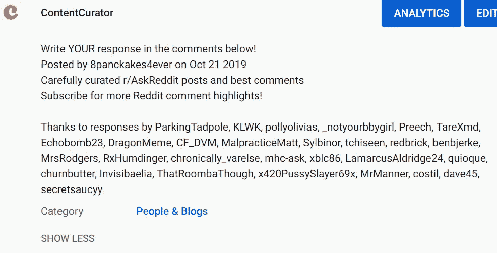

# 用 Python 实现病毒式文本到语音转换 YouTube 内容的自动化

> 原文：<https://towardsdatascience.com/automating-viral-youtube-content-creation-in-250-lines-of-python-6acc583ae318?source=collection_archive---------6----------------------->

turning a reddit thread into a video :)

最近有一种特定风格的 YouTube 视频涌入，其中使用文本到语音转换来读出 Reddit 上的帖子，并以某种幻灯片的形式显示评论的截图。不管这些视频有多原始，都无关紧要，因为它们已经有了成千上万的浏览量。

look at the views on these tts videos!

我很确定这些视频大部分是手动编辑的，因为它们的裁剪和截图对齐不一致。*当然***有可能从 **Reddit 线程** URL 自动生成**这些视频吗？

# 答案是肯定的！

下面是一个视频示例，大约在 ***2 分钟*** 内完全自动生成

这是在大约 250 行代码中使用多种技术实现的。行数通常不是什么值得夸耀的东西，但对我来说，这展示了 Python 编程及其充满活力的活跃社区的力量。

# 我的方法

首先，我们应该把问题分解成一堆更小的问题。

1.  拍摄 Reddit 帖子的“截图”
2.  宣读帖子的内容
3.  将截图+语音+背景音乐排序在一起
4.  上传到 YouTube！(带缩略图和音乐)

# 问题一:截图

我们不仅要为帖子创建一个截图，还要在帖子被读出时创建一个不同的图像。这使视频更有“讲故事”的感觉，并有助于观众跟随文本到语音的转换。

这个问题通过使用 [PRAW](https://pypi.org/project/praw/) 从 Reddit 获取帖子，并使用 [wkhtmltoimage](https://wkhtmltopdf.org/) 呈现模板得到了解决。我创建了自己的 HTML 模板，看起来有点像 Reddit 帖子，其中填充了帖子的详细信息(包括点数、奖项和用户名)，然后进行渲染。

这些评论被标点符号分开，给人一种“被读出”的感觉，并帮助它与文本到语音同步。

# 问题 2:文本到语音

source: [**giphy**](https://giphy.com/gifs/season-6-the-simpsons-6x6-26tk14hDexwwXlUDC)

我使用谷歌云的语音 API 免费层来驱动 TTS。采用了新的 Wavenet 语音，它使用深度学习来产生更真实的音调和重音。每个部分(由标点符号分隔)都被读出并保存到一个 mp3 文件中，确保我们审查帖子中的不良词语，并用家庭友好的替代词替换它们:)。

# 问题 3:排序

我发现了一个惊人的 Python 库，可以编程地创建视频内容: [**MoviePy**](https://zulko.github.io/moviepy/) **。**这是一个真正令人敬畏的库，它将 ffmpeg 包装成一个高级 API，用于排序、过滤器、音频和视觉特效等等。对于每个评论图片，我添加了相关的文本到语音转换 API 和一些我在 YouTube 上找到的免版税的 lofi 音乐。

背景音乐是从一个免版税的频道下载的，曲目下载后会随机播放。

# 问题 4: YouTube 和缩略图

每一个好的视频都应该有一个漂亮的缩略图，在尽可能短的时间内将观众吸引到所述视频的内容。我使用 [Canva](https://www.canva.com/) 和 [Pillow](https://pillow.readthedocs.io/en/stable/) 一起将视频的标题渲染到图像上。[2000 个最常用英语单词](https://github.com/first20hours/google-10000-english)中的 ***而非*** 的单词以灰绿色突出显示，以强调标题中最重要的单词。

the template before and after rendering

An example YouTube description.

生成的. mp4 和缩略图然后通过 YouTube API 上传。创建了一个简单的描述，对视频中包含的帖子的 Reddit 用户进行表扬。

总之，这是一个复杂但令人满意的项目，它集成了许多很酷的 Python 库。从 Reddit 网址到完全上传 YouTube 视频大约需要 5 分钟。我打算将来在脸书和 Instagram 上自动发布帖子。

订阅我的时事通讯，以便在我下次写作时得到通知:)