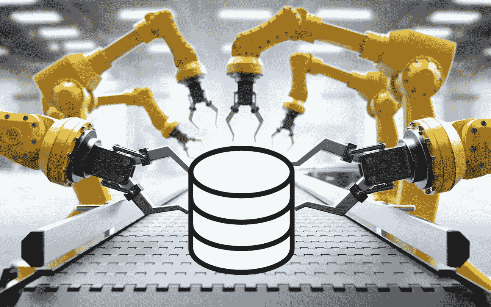

# 数据科学中的自动化

> 原文：<https://towardsdatascience.com/automation-in-data-science-f11fe389d49b?source=collection_archive---------7----------------------->

## 为什么我工作中技术含量最高的部分一直变得越来越容易，而最难的部分与 AI 完全无关。

A database enters an automated Data Science Factory. Actionable Insights are extracted and produced at the other end of the assembly line (not shown).

在我作为数据科学家的工作中，我注意到许多过去很难的任务因为自动化而变得越来越容易。

例如，AutoML 承诺将整个建模过程自动化。

虽然这很神奇，但数据科学家的工作不仅仅是实现机器学习模型。

事实证明，数据科学中听起来最性感的方面将首先被自动化，而最难自动化的方面是你最意想不到的。

# 概观

当你谈论数据科学时，大多数人关注的是人工智能和机器学习。但是数据科学家实际上把他们大部分时间花在非常不同的工作上。

本文将尝试列出一名优秀的数据科学家应该能够完成的所有类型的工作。对于它们中的每一个，我将研究它的自动化程度。在适当的地方，我会列出一些有助于自动化的工具。

如果你认为有一个(非商业)产品可以很好地自动化一些东西，或者如果你认为我错过了数据科学工作的一个重要方面，那么只要给我发消息，我就会把它包括在列表中。

# 1.与客户交谈

自动化状态:不可能

数据科学家工作的第一步，也可以说是最重要的一步是与客户交谈。

这不仅仅意味着“问客户问题是什么”。业务人员和数据科学家之间的理解存在巨大的鸿沟。

客户一般不知道数据科学家能做什么，数据科学家一般也不知道客户想要什么。

能够弥合这种理解上的差距是极其重要的。

许多公司实际上雇用经理来充当数据科学家和客户之间的中间人。这比让一个纯粹的技术数据科学家试图找出客户的需求要好。但是，了解客户业务环境的数据科学家更好，因为这省去了中间人，降低了重要信息在翻译过程中丢失的风险。

与客户交谈不会提高机器学习模型的性能(就像这样，本文大约一半的技术读者已经失去了兴趣)。相反，理解客户的痛点可以确保您首先构建正确的模型。如果客户不能真正利用这个模型来推动自己的利润，那么世界上最准确、表现最好的模型也是无用的。

与客户进行一个小时的讨论可以完全重新定义项目，并将项目的货币价值增加十倍。

我永远不会忘记当我告诉我的一个客户，我可以很容易地扩展我的模型，将数据分成十几个不同的类别，分析所有的类别，然后只报告有异常的类别时，他脸上的表情。事实证明，这位客户多年来一直手动执行这项任务，这耗费了他大量的时间。他没有要求我们自动化这一点，因为他根本不知道这是可能的，直到我提出来。如果没有那次讨论，我们会在利润较低的任务上浪费几个月的时间。

在很大程度上，与客户交谈可以确保你建立了正确的模型，这对于确保项目最终盈利是至关重要的。

在较小的范围内，与客户交谈也有一些同样重要的直接好处。例如，选择最有用的指标来训练您的模型。许多数据科学家根本不考虑这一点，只是简单地使用准确性，或 L2 损失，或他们在大学里被教导使用的任何东西。与客户进行五分钟的讨论可能会显示他们的利润实际上只来自前 5 名的结果，或者类似的东西。如果你不通过改变你使用的度量标准来解决这个问题，你就在错误的方向上优化了你的模型。

现在是可怕的消息:

几乎所有这些都不能有效地自动化。

和人说话的是 [AI-complete](https://en.wikipedia.org/wiki/AI-complete) 。如果有人真的能弄清楚如何实现这项任务的自动化，那么机器人的反叛将会在几天后到来。

换句话说:

> 数据科学家工作中技术性最低的部分是最难自动化的。

事实上，这是一个技术进步实际上可能让事情变得更难的领域:在家工作，只通过短信沟通，这真的不太可能让你发现客户真正想要的是什么。

我所见过的帮助解决这个问题的最有用的东西不是一个程序，也不是一个公司政策，而只是一台放在办公室中心位置的咖啡机。客户和数据科学家偶尔会在一起喝杯咖啡，这比我们做的任何事情都更能达成目标一致。

# 2.数据准备和数据清理

**自动化状态:**部分自动化。太主观，太多边缘情况，无法完全自动化。

数据科学家大约 80%的时间花在数据准备和清理上。

这包括:

*   获取数据。
*   将数据放入正确的格式中。
*   连接数据。
*   识别和修复数据中的错误和/或异常。

所有这些都非常耗时，而且非常无聊。

这能自动化到什么程度？

看情况。

这其中的一些部分根本不能自动化，因为它们依赖于客户端的交互。有时，清理有错误数据的表需要打电话给数据所有者并要求澄清。

但是大部分的 T2 可以自动化。

数据准备和清理中的大多数任务都可以通过对数据应用少量简单的启发式方法来解决，直到所有问题都得到解决。

启发式示例有:

*   如果一个表有日期，那么检查它们的分布是否受到周末、假日或其他可能相关的常规事件的显著影响。
*   如果一个表有手工输入的分类列，那么检查它们是否包含任何输入错误并纠正它们。
*   如果一列是数值型的，检查它是否有超出合理范围的值。

这些试探法往往非常简单，但问题是有成千上万的试探法，而且大多数都非常主观。

据我所知，不存在应该检查的所有试探法的现有综合列表，也不存在建议如何以有用的方式参数化主观试探法的综合方法。

数据科学家不是要有一个清单来完成工作，而是要观察情况，根据经验和直觉，想出最相关的启发式方法来自己测试。

更糟糕的是，数据中的一些工件是特定于客户端的。例如，数据库中的一个项目可能在一年前被重新分类，但是较旧的条目仍然使用旧的分类系统。只有了解了业务背景，并和客户谈过，你才能认识到这个问题。这不能完全自动化。在这种情况下，您能做的最好的事情就是自动指出数据中的异常，以节省数据科学家运行初始测试的时间。

总结一下:

*   原则上自动化数据准备和数据清理是可能的。许多简单的事情已经被流行的图书馆自动化了，或者至少变得非常容易。
*   有数以千计的边缘情况，你不能用一个单一的自动化系统有效地覆盖。
*   有些任务不能有效地自动化，因为它们依赖于与客户的交互。
*   尽管如此，这里仍有唾手可得的果实。我希望在未来的几年里，我们会看到这方面的进展。

## 自动化数据清理的工具

有很多很多小工具和库可以用来清理你的数据。它们中的每一个通常只为你节省一点点时间，但它确实会累积起来。你可以通过谷歌搜索找到最常见的数据清理工具。

您还可以找到许多数据清理程序的列表，这可以让您很好地了解哪些类型的清理任务已经解决。查看列表[这里](https://mode.com/blog/python-data-cleaning-libraries)，这里[这里](https://blog.kjamistan.com/automating-your-data-cleanup-with-python/)，这里[这里](/clean-your-data-with-unsupervised-machine-learning-8491af733595)，这里[这里](https://cudbg.github.io/lab/cleaning)。

使用这样的工具时要小心。如果您只是天真地运行自动清理工具并依赖默认设置，很容易意外损坏您的数据。在一个数据集中需要清理的错误在另一个数据集中可能是故意的选择。

还有 elody.com 的。它还处于初级阶段，但一旦发展起来，它应该对数据清理非常有用。参见[此处](https://elody.com/scenario/plan/12)的交互示例。(注:Elody 是我自己的网站。我专门构建它来帮助自动化数据科学。它还不是非常强大，但有望随着时间的推移变得越来越大。网站免费使用。)

# 3.数据探索和特征工程

**自动化现状:**部分自动化，前景看好

在准备和清理完数据之后，终于到了开始研究数据科学的有趣部分的时候了。

数据探索和特征工程都是关于在显微镜下检查数据并从中提取洞察力。

这个阶段有两个方面:

*   数据探索是关于理解数据。
*   特征工程是关于理解问题，并将数据与问题联系起来。

数据探索可以很好地自动化。仅仅少量的基本可视化就足以快速获得大多数类型数据的概览。有许多工具可以帮助我们做到这一点。

然而，这仍然需要数据科学家花时间查看图形。就像数据准备一样，您应该寻找一千种不同的异常。

还没有一个系统试图总结它们。虽然我们可以自动创建图形，使数据探索更容易，但实际的探索本身仍然需要由数据科学家来完成。

请注意，您在数据探索过程中的一些发现可能需要您与客户交谈以获得澄清，甚至可能迫使您返回到数据准备和清理阶段。例如，您可能会注意到数据分布在特定日期突然发生变化。当你向客户询问此事时，他们解释说这是因为他们改变了当天生成数据的方式，并且忘记告诉你了。突然之间，你不得不回过头来调整你的所有数据，以考虑到这一点。

像这样的情况不能自动处理，但是自动化系统仍然可以帮助您更快地识别这些异常。

最后，您在数据探索期间收集的所有见解需要与您对任务的理解相结合，以执行有效的特征工程。

令人惊讶的是，由于两个简单的观察结果，很多事情实际上是可以自动化的:

*   大多数(如果不是全部)通常在特征工程中创建的特征只是将基本功能应用于现有特征的结果。
*   可以测量某个特性的有用程度，并丢弃那些被证明无用的特性，这使得数据足够小，可以处理。

因此，几乎完全自动化特征工程实际上是可能的。

总之，理论上是这样的。

我还没有听说过自动化特征工程胜过专家手工特征工程的例子。看起来，至少在目前，专家知识仍然胜过这些自动算法。

(如果你正在阅读这篇文章，并且知道一个自动化特征工程成功击败专家的例子，请告诉我。)

尽管有目前的缺点，我期望自动化特征工程很快会变得有竞争力。

请注意，自动化特征工程意味着数据探索的一半原因已经消失，但无论如何，数据探索仍然很重要:

数据探索对于其他任务仍然有用，比如发现数据中的异常。找到这些有时非常有价值。

一个异常点十有八九是无关紧要的。第九次，这将意味着你的整个数据集是有缺陷的，你通过及早意识到它躲过了一劫。第十次，它将引发一个惊人的新见解，启动一个完整的衍生用例来解决一个完全不同的问题，并赚到原来项目五倍的钱。

## 自动化数据探索和特征工程的工具

**对于数据探索**，如果您使用 python，使用 numpy 和 pandas 进行分析，使用 matplotlib、seaborn 和/或 plotly 进行可视化。

这些软件包可以让你轻松地过滤、分组和可视化任何你想要的东西。唯一的问题是，你仍然需要手动写你想要的。

使用[镜头](https://pypi.org/project/lens/)自动完成你应该经常做的所有基本探索，从而为你节省更多的时间。

请注意，这不会自动完成所有工作。仍然有很多常见的情况需要记住自己检查，因为它们不容易从默认的可视化中读取。比如:日期受工作日、节假日等影响吗？如果你有地点日期，地点在哪个国家或城市？如果有多个表，它们是如何连接的？

**对于特征工程**，使用 [featuretools](https://www.featuretools.com/) 自动生成新特征。

请注意，使用功能工具时应该小心。这对于从数据中生成大量要素非常有用，但它仍有缺陷:

*   它显然没有从语义上理解数据，因此无法创建对人类来说显而易见的功能，但需要不同寻常的功能组合才能通过算法产生。例如，它可以很容易地从原始数据中生成“客户总共看了多少部电影”这样的特征，但是像“客户在电影发行的第一周内看了多长时间”这样复杂的特征就很难生成了。您可以告诉 featuretools 更深入并创建更多的功能，但这样您就会遇到第二个问题:
*   Featuretools 可以轻松创建大量的要素。这可能会导致过度拟合，因此您应该调查经过训练的模型，并检查它是否有意义。您可以使用 [shap](https://github.com/slundberg/shap) 来简化这一过程。

我自己的前述项目[elody.com](https://elody.com/)一旦成熟，也将能够处理数据探索和特征工程。

附录 2019–10–25:我最近了解到 getML 库，它解决了 featuretools 的一些缺点。

*   与 featuretools 不同，它不使用暴力方法。相反，它将特征工程的过程理解为另一种形式的机器学习。因此，它不会只是创建大量的要素，然后进行要素选择。相反，将使用有点类似于随机森林或梯度增强的机器学习算法来生成这些特征。
*   它拥有高效迭代阈值的算法，因此对于前面提到的“在电影发行的前 X 周内，客户观看电影的频率”这样的特性特别有用。
*   该工具不是开源的，但是有一个免费版本。更多信息，请参见[此处](https://get.ml/resources/how-getml-works/)。

# 4.系统模型化

**自动化现状:**全自动化，与专家数据科学家竞争

建模是数据科学家工作的核心部分。

在这里，我们将所有宝贵的数据转化为结果，然后我们的客户将这些结果转化为利润。

这是数据科学家在大学里花最多时间学习的部分，因此自然这也是数据科学中第一个完全自动化的部分。

建模是一个极其困难的过程，有许多不同的参数。然而，这也是一个非常严格的过程，所有参数都有数学上的明确定义，并且与现实世界的模糊性无关。这使得自动化建模比数据科学的任何其他方面都更有效。

建模可以进一步分解成不同的子任务。

*   模型构建
*   模型验证
*   超参数优化

(你也可以把特征工程算作建模的一部分。有些人这样做，但我选择把它作为一个独立的部分，因为特征工程仍然有一些非数学的方面，需要理解业务环境，而建模纯粹是一个数学问题。)

自动化这些子任务的特定部分的库已经存在很多年了，但是仍然需要专业知识来正确地使用它们。

现在，有一些库可以自动化整个建模过程。这些库只是按原样获取您的数据，并一次性从中构建一个完整的模型，不需要任何人工交互。

2019 年 5 月，[谷歌的 AutoML 在一场 KaggleDays 黑客马拉松](https://ai.googleblog.com/2019/05/an-end-to-end-automl-solution-for.html)中获得第二名。根据卡格尔的等级系统，许多参赛者都达到了大师或特级大师的水平。

一个完全自动化的系统击败了几个人类专家，这些专家聚集在一场比赛中，专门证明他们的技能。如果这个系统能够赢得这样的比赛，那么与不参加比赛的普通数据科学家相比，它的表现能好多少？

诚然，这个系统还不完善。比赛只持续了 8.5 个小时。这对一个自动化系统的运行来说已经足够了，但对人类竞争者来说，这还不足以启动。如果竞争持续更长时间，AutoML 也不太可能有同样的表现。

但是自动化模型构建工具每天都在改进。他们不断赢得足球比赛只是时间问题。

我完全期待数据科学家在 10 年内不再需要建立他们自己的模型。

## 自动化模型构建的工具

**建模过程的自动化部分**

这篇文章列出了自动化建模过程不同部分的工具。

即使你不想自动化你的整个建模过程，我也强烈推荐看看这些工具。他们可以节省你很多时间。

请注意，本文将特征工程视为建模的一部分，因此它还列出了一些可以简化特征工程的库。

**自动化整个建模过程**

运行 AutoML [要花钱](https://cloud.google.com/vision/automl/pricing)。

开源社区已经创建了 [Auto-Keras](https://autokeras.com/) 来取代它。

Auto-Keras 和谷歌的 AutoML 都使用神经网络作为他们建立的模型的基础。

还有其他使用不同类型模型的自动化机器学习库:

[本文](https://medium.com/georgian-impact-blog/choosing-the-best-automl-framework-4f2a90cb1826)对比了四个自动机器学习库 [auto_ml](https://github.com/ClimbsRocks/auto_ml) 、 [auto-sklearn](https://github.com/automl/auto-sklearn) 、 [TPOT](https://github.com/EpistasisLab/tpot) 和 [H2O 的 AutoML 解决方案](http://docs.h2o.ai/h2o/latest-stable/h2o-docs/automl.html)的性能。

结果:Auto-sklearn 在分类数据集上表现最好，TPOT 在回归数据集上表现最好。

但是，请注意，这篇文章是半年多前发表的，不包括 AutoML 或 Auto-Keras。所有这些库都在持续开发中。当你研究完哪一个是最好的，其中一半可能已经有了重大的更新。

# 5.客户演示和文档

**自动化状态:**不可能

一旦建模完成，我们有了结果，我们需要将这些结果呈现给我们的客户。这是一门独立的科学。

正如我之前提到的，数据科学家和他们的客户说着完全不同的语言。对一个人来说显而易见的东西，对另一个人来说可能是混乱的。

你需要把你花了几个月的时间处理的所有数据浓缩成一个单一的图形，让打字时需要看着键盘的人能够理解。这是一个不小的壮举。

让客户认同你的结果很容易，但如果你想让他们真正理解，你需要非常清楚，你的文档必须既简洁又全面。

这是一个小任务，但非常重要。

如果客户不明白应该如何使用它，那么即使是最好的项目也会变得毫无价值。没有什么比完美地解决一个问题更糟糕的了，只是看到它被扔掉，因为它的预期用户不明白如何使用它。

就像在项目开始时澄清需求所需要的最初的客户交互一样，这个任务是不可能自动化的。

# 6.部署到生产

**自动化状态:**取决于公司。可能完全自动化，也可能不可能。

一些数据科学项目只是关于构建原型。

其他项目要求我们将完成的项目转化为完全自动化的端到端解决方案，可以部署到生产中。

这是否可以自动化很大程度上不在数据科学家的掌握之中。

这几乎完全取决于客户使用的技术堆栈，以及他们设定的需求。

我有一个项目，我可以把我的项目包装在一个脚本中，它被接受用于生产。但是我也有一个项目，其中整个代码库需要重写，因为负责的经理想要使用另一种编程语言，并且没有提前告诉我们。

较小的公司可能会照原样接受您的代码，因为他们还没有针对生产部署的指导方针。

刚接触数据科学的大公司会让你费尽周折来部署你的代码。

与数据科学家合作得足够多的大公司将会建立一个系统(云、数据仓库、数据湖等)。).在这种情况下，该过程在很大程度上是自动化的。

# 摘要

总结一下:

*   与客户交谈和向客户解释结果是您最不愿意与数据科学联系在一起的两个工作方面，但它们也是最难自动化的方面。
*   数据准备和清理是部分自动化的，但很难完全自动化，因为有成千上万的特殊情况需要考虑。
*   数据探索和特征工程是部分自动化的，看起来特征工程将很快变得更加自动化。
*   模型建立已经完全自动化，并与专家竞争。
*   生产部署可以自动化，但这取决于客户。

# 结论

**我们能从中学到什么？**

如果你是一名数据科学家，你想确保你的技能在未来几十年仍然有需求，那么你应该*而不是*专注于机器学习方面(除非你实际上是该领域的研究人员)。

相反，你应该专注于学习如何理解业务，这样你才能更有效地与客户沟通。

一旦我们工作的技术方面实现了自动化，产生影响的最佳方式就是弥合技术和非技术之间的差距。