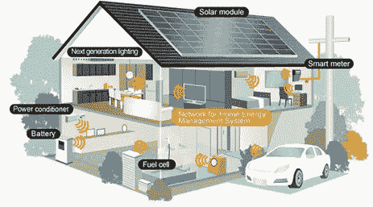
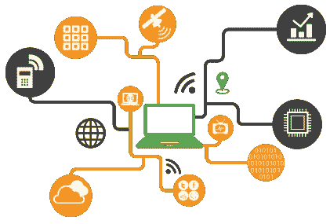
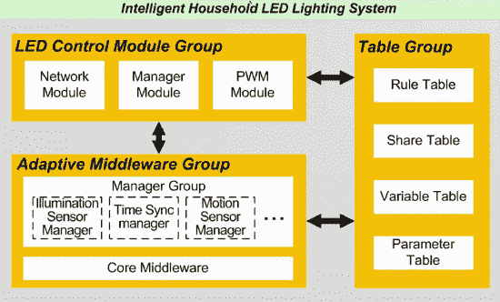

# 具有用户偏好管理的家用电器自动化

> 原文：<https://towardsdatascience.com/automation-of-home-appliances-with-user-preference-management-2c74c7e0dd2a?source=collection_archive---------36----------------------->

> 继我上一篇关于[强化学习在作业调度中的应用的文章之后，](https://medium.com/@siddhant.bhambri4/reinforcement-learning-in-job-scheduling-8b23ef6a596b)我决定进一步寻找机会，寻找另一个未开发的领域，在那里自动化可以成为系统的一个重要和必要的部分。过去，许多研究人员提出了许多解决节能问题的方法，而另一方面，在微控制器、处理器甚至智能电表等物联网系统的帮助下，已经开展了独立的研究来将这些电器转换为智能设备，这些智能设备可以持续跟踪能源消耗，并为用户提供各种使用统计数据。但是，智能家居环境的每个用户都能够理解和解释这些信息并从中获益吗？

[Example](http://kgs-ind.com/wp-content/uploads/2017/08/Home-Energy-Management-System.png) of an Home Energy Management System

在我们深入这个领域的技术方面之前，我认为我们有必要了解家庭能源管理系统(HEMS)到底是什么。我进一步请求您仔细阅读这篇文章，以获得更精确的解释。

正如您所理解的，HEMS 为用户提供了一个门户或界面，用户可以用它来控制和监视系统数据。这一点让我们思考这样一个问题:为什么人类有必要执行这些管理和监控设备使用数据的任务？从读取和分析使用数据到规划和采取适当的行动，并牢记用户偏好，怎样做才能取代人工干预来自动化整个端到端系统？

物联网在自动化这一过程的目标中发挥着非常重要的作用，其中需要满足两个目标-节能和用户偏好。用户对智能设备的监控可以帮助他或她实现防止全天任何形式的能量浪费的首要目标。然而另一方面，我相信强化学习可以使我们有可能提出一个解决方案来满足管理用户偏好的第二个目标。

[Internet of Things](https://www.happiestminds.com/Insights/internet-of-things/) can connect devices embedded in various systems to the internet. When devices/objects can represent themselves digitally, they can be controlled from anywhere. The connectivity then helps us capture more data from more places, ensuring more ways of increasing efficiency and improving safety and IoT security.

像环境保护基金、绿色和平组织和气候与能源解决方案中心这样的组织已经投入了大量的资金来制定尽可能有效利用能源的策略。这篇关于分析消耗能量的日常活动的文章的作者提出了一种分为三个部分的聚类方法。第一步是记录和维护用户在一天中的运动，然后显示每个活动进行了多长时间。最后，他们对一组用户的活动模式进行聚类，以分析他们之间的相似性和差异。另一篇有趣的研究文章谈到考虑电器制造商提供的信息，这些信息谈到这些设备可以工作的状态。然后，智能环境服务提供商开始发挥作用，在本文中，他们通常被作者称为 SESPs，他们执行手动评估设备状态的功能，以向用户推荐一组他们可以遵循的可行措施，从而降低他们的总能耗。这篇文章的作者首次提出了一种基于马尔可夫模型的智能方法，该方法考虑了一种奖励策略，并输出一种用户可以遵循的策略。这是一种强化学习方法，旨在找到问题的合理解决方案。然而，该过程仍然涉及通过人工干预进行一定程度的分析和监控，这不符合我们的主要目标。

其中一项研究考虑了用户的偏好以及节能的座右铭。考虑的变量是发光二极管(led)的最小和最大光强度、光强度的上升和下降周期以及无运动检测和光强度开始下降之间的周期。用户的存在和移动决定了一天中不同时间点的光强度。基于无线物联网的技术已被用于实施该系统，可通过简单的手机应用程序进行控制。

The authors present this middleware architecture in their [research](https://ieeexplore.ieee.org/document/6490243) for the functioning of their proposed algorithm.

1.  第一部分，即 LED 控制模块组，执行应用层上的功能，以控制系统中存在的所有 LED 的光强度。
2.  第二部分由自适应中间件组组成，它可以根据系统管理员的命令对系统进行修改。
3.  最后，第三部分是关于数据处理，以保持系统对 LED 控制的感知。

实验装置在一个 8 位微处理器上工作，该微处理器连接到各种传感器上，这些传感器主要分为运动检测传感器和光照明传感器，它们一起执行研究用户所处的外部环境的任务，从而为系统提供针对该环境中存在的 led 采取特定行动所需的必要参数。研究人员展示了三个案例——住宅和办公楼、仓库和停车场，解释了每一个案例中的用户满意度需求。

这项研究的唯一缺点也提供了一个非常可利用的研究机会，那就是提出一个考虑到两个重要因素的系统-

1.  外部环境不仅需要在用户存在时考虑设置中存在的设备的使用，还需要在不管用户的物理存在与否都需要打开该设备时考虑。因此，这可以确保外部环境的动态行为适应。
2.  该系统应该可以扩展到家庭中的其他设备，例如洗衣机、烘干机、加热管道等。因此，正如第一点所提到的，不管用户是否在现场，了解他们的使用模式都很重要。

研究人员早些时候也采用了其他方法，但几乎所有的方法都主要集中在节约能源的目标上。他们中很少有人提出了处理用户偏好的策略，但只有一定程度的人工干预。最后，我添加了一些我浏览过的出版物的链接，以理解这个特定问题陈述的上下文和细节。此外，我想请你给他们一个阅读和讨论的想法，可以带来和实施到动态的现实生活场景。

关于这篇文章的任何反馈或想法，以及研究出版物，都是最受欢迎的。如果有人愿意伸出手来分享他们对这一特定问题陈述的看法，我将不胜感激。

进一步阅读:

1.  [https://pdfs . semantic scholar . org/98 F4/a1ee 457304 e 793 a1 b 178 B4 d 61 cf 7 e 5d 3 a 7 cc . pdf](https://pdfs.semanticscholar.org/98f4/a1ee457304e793a1b178b4d61cf7e5d3a7cc.pdf)
2.  [https://www . tandfonline . com/doi/full/10.1080/09613218 . 2017 . 1356164](https://www.tandfonline.com/doi/full/10.1080/09613218.2017.1356164)
3.  【https://ieeexplore.ieee.org/document/5482712 
4.  [https://ieeexplore.ieee.org/document/5172913](https://ieeexplore.ieee.org/document/5172913)
5.  [https://www . research gate . net/publication/260523361 _ Autonomous _ Appliance _ Scheduling _ for _ home _ Energy _ Management](https://www.researchgate.net/publication/260523361_Autonomous_Appliance_Scheduling_for_Household_Energy_Management)