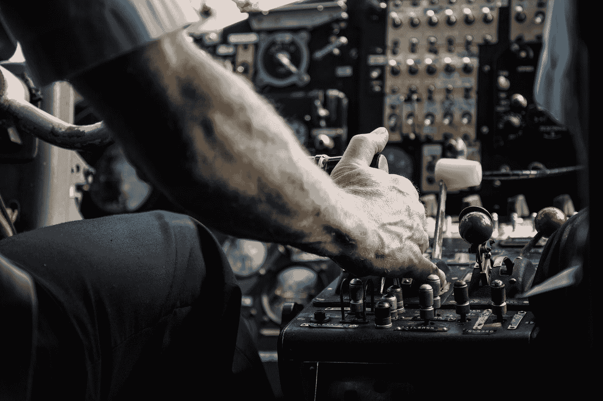

# 自动化、风险和强大的人工智能

> 原文：<https://towardsdatascience.com/automation-risk-and-robust-artificial-intelligence-ed8a73e2f2fa?source=collection_archive---------39----------------------->

## 托马斯·迪特里希教授关于涉及人工智能的社会技术系统需要高可靠性的访谈。

Photo by [Laurent Perren](https://unsplash.com/@laurent_perren?utm_source=medium&utm_medium=referral) on [Unsplash](https://unsplash.com?utm_source=medium&utm_medium=referral)

人工智能(AI)融入我们日常生活的方式怎么说都不为过。强大的深度机器学习算法越来越多地预测我们想看什么电影，我们会回复哪些广告，我们有多大资格获得贷款，以及我们有多大可能犯罪或在工作中表现出色。人工智能也正在彻底改变工厂、发电厂和自动驾驶汽车等物理系统的自动化，部署步伐正在迅速加快。然而，最近由[特斯拉](https://www.theguardian.com/technology/2018/jun/07/tesla-fatal-crash-silicon-valley-autopilot-mode-report)、[优步](http://fortune.com/2018/05/08/uber-autopilot-death-reason/)和[波音](https://www.theverge.com/2019/3/15/18267365/boeing-737-max-8-crash-autopilot-automation)制造的自动驾驶系统的致命故障凸显了在危险情况下依赖不透明和高度复杂的软件的相关风险。减轻此类系统带来的[危险](https://www.theatlantic.com/technology/archive/2017/09/saving-the-world-from-code/540393/?fbclid=IwAR0BEuIe9rOkl9wurqpTHRYAebXrdhoJ-5xcPQCMDeTbtnyR7hfVwawvxjA)是一个被称为[弹性工程](http://www.resilience-engineering-association.org/)的活跃研究领域，但人工智能的快速采用，加上其众所周知的算法透明度的缺乏，使得研究难以跟上步伐。

机器学习的先驱之一，Thomas Dietterich 教授在过去几年里一直在研究如何让人工智能变得更强大，特别是当它嵌入到一个复杂的社会技术系统中时，在这个系统中，人和软件的错误可能会传播到未经测试的政权中。保罗·沙尔(Paul Scharre)的新书《一个没有人的军队》(An Army of None)启发迪特里希教授深入研究高可靠性组织的文献，寻找潜在的解决方案。*它让我明白，仅仅让技术可靠是不够的，你还需要让围绕它的整个人类组织变得可靠；理解这意味着什么已经占用了我很多时间。【Dietterich 教授抽出一些时间与我讨论了他对人工智能伦理、人工智能安全的看法，以及他最近的文章 [*健壮的人工智能和健壮的人类组织*](https://link.springer.com/article/10.1007/s11704-018-8900-4) *。**

**伦理人工智能社区通常分为两组，一方是专注于公平或算法透明度的具体概念的工程师，另一方是对整个社会的伦理影响更感兴趣的社会科学家。你最近的文章似乎介于这两类人之间。**

> 总的来说，人工智能社区已经意识到社会科学的重要性。我真的追溯到社交媒体出现的时候，人们意识到社会科学家可以用它来研究关于人的事情。然而，他们需要计算机科学家的帮助来处理来自社交媒体的大量数据，所以我们开始看到计算社会科学的兴起。那是最初的开场。
> 
> 然后，人们开始思考社交网络中的影响力和思想传播问题，并出于广告目的最大化社交网络中的影响力，再次导致与社会科学家和经济学家的更多接触。然后，人们意识到，通过这些系统的工作方式，可能存在对不同亚群体造成伤害的偏见。我刚从 AIES 会议回来，那里举行了他们的第二次会议，几乎同时还有 FAT*会议，我认为这个领域的大部分人都意识到我们需要考虑更广泛的社会技术系统，而不仅仅是技术部分。它体现在所有这些不同的方面，我追求一个特定的方面，因为我关心这些高风险，高风险的决定。我现在也参与了这个由 CCC(计算社区联盟)协调的人工智能研究 20 年路线图的团队。我们已经举办了三次研讨会，人们说我们可以做 X，Y 和 Z，比如让计算机跟踪会议中或建筑物中的人，并理解他们的情绪。20 年前，人们会说:“太酷了”。现在每个人都在说，“但这可能被滥用得如此严重”，所以我们真的对这些事情的所有负面影响都很敏感。现在我们意识到，我们希望在未来 20 年看到的如此多的技术进步可能会产生可怕的后果，也可能会产生真正好的后果，所以这非常令人清醒。

你认为需要监管来避免这些后果，还是公司可以有效地自我监管？

> 我不是法律、法规和行业实践方面的专家，但在我看来，我们似乎看到了技术使用不当和围绕技术的不适当的组织结构。我们先来关注一下面部识别。我不知道你是否一直在关注麻省理工学院的 Joy Buolamwini 的工作，但我认为她一直在做非常有趣的工作，审计这些(商业)人脸识别系统的质量。在技术方面，我们没有任何标准来规定一家公司应该对这些系统做出什么声明，以及他们应该如何做出声明。例如，我认为所有这些公司系统，如果他们要销售这些产品，需要为他们所做的产出陈述给出精确的概率。看起来这些系统中的一些并没有给你一个置信度值，那些给你的也没有告诉你它意味着什么。如果当它说这两张照片有 90%的可能性是同一个人的照片时，那么它说的时间有 90%是正确的，那么这个概率将会被很好地校准。那将是某个特定人群的 90%。她的[Buolamwini 的]实验表明，有一些亚群的数量必须达到 60%左右，因为系统在某些亚群上表现不佳。
> 
> 美国公民自由联盟做了一个类似的实验，但不清楚他们是如何设置他们的门槛的。正如我在论文中所描述的，你会想到，在想要抓住所有坏人的警务情况下，你必须将检测的灵敏度设置得非常高，并且你会得到大量的假警报。事实上，这就是我们在南威尔士治安数字上看到的，这与我在欺诈检测或网络安全方面的经验非常一致。这里你有一个类似的问题，主要的挑战是大量的假警报。我的观点是，即使你是这些工具的非常有知识的用户，而且似乎大多数警察部门都不具备这样的资格，即使你有机器学习的博士学位，也不清楚在实践中应该如何设置这些系统的阈值，以及应该如何应用它们的最佳实践是什么。
> 
> 然后你必须对假警报造成的危害进行某种分析。这就是你需要审计人力组织和软件的地方。如果你是一个警察部门，你已经把它提高到 99%,并得到了大量的假警报，这不仅仅是多少人被拉进由于假警报。你可以想象，有人在这些系统上反复发出错误警报，所以这不是一个在人口中平均分布的随机税收。你被随机选中的时间的一部分，但它也可能总是发生在你身上！不知何故，您想审核这些组织，并问:您的误报率是多少，由此产生了哪些危害，您如何减少这些危害，什么是可接受的水平，谁在承担负担？

你提议的似乎是简单的黑盒式测试，可以在不侵犯供应商知识产权的情况下完成？

> 你需要说明这是通过什么样的图像数据库收集的。把它作为一个通用的应用程序来营销是不合适的，所以你真的需要为每个应用程序定制它。我非常怀疑目前正在市场上销售的这些东西在实践中是否真的能很好地实现它们的预期目的，因为它们不是在每个应用程序的基础上定制的。我不知道你是否需要监管，或者我们是否只需要教育市场。对我来说，供应商站在这个问题的前面，把它做好是明智的。

**像谷歌这样的大型组织开始雇佣专业伦理学家来调查人工智能的潜在风险；对于没有大量资源来抵消风险的小型团队，您有什么建议吗？**

> 我觉得我们现在还没有标准化的工具来支持这些。R&D 社区需要建立工具来支持这一点。

**有些工具是存在的，比如 IBM 的“公平 360 ”,但一个更大的问题是是否有人在关注系统的含义，比如什么可能出错，它会影响谁。在这些领域，资源较少的小型团队可能很难获得这种更广泛的思考。**

> 它需要成为我们标准方法的一部分。也许我们需要开发某种概念分析框架，人们可以通过它，比如一个清单，来思考他们正在营销的系统的更广泛的背景。例如，我们可以问一个简单的问题:“重复使用这个系统会发生什么？”。我们通常表述问题的方式是，我们关注它的单步使用。有一个 YouTube 视频推荐的例子，在机器学习中，我们将它表述为一个上下文多臂土匪问题。随着时间的推移，系统将逐步推荐越来越多的极端视频，所以你可以开始搜索清真菜，最后观看圣战招募视频！构建系统的人可能没有想到要查看迭代效果。所以这似乎是我们应该教每个人思考的事情。

在你的论文中，你提到了人工智能监控人类组织的可能性。AI 目前是否具备识别人类机构问题的能力？

> 这更多的是一个研究问题。我一直在努力调查现在谁在这个领域工作。我会说，现在，很少有能力来监控人类组织中团队的运作。在这种情况下，监控团队崩溃是很好的，但这很容易被管理层滥用，所以我不清楚具体如何做。一种情况是帮助团队训练，或者在有限的时间内。俄亥俄州立大学的大卫·伍兹致力于研究如何让团队更有弹性，他正在研究在极端条件下保持大型云计算服务器运行的开发人员。我认为我们需要在这一领域进行更多的研究，我主张国家科学基金会和国防部在更好地进行团队合作的研究上投入更多的资金。这是很自然的下一步。

**我们是在谈论对人类团队合作的实时监控吗？**

> 它目前更关注培训情况。然而，你可以看到我在担心自主武器系统方面的进展，这可能是我们可能为人工智能考虑的最高风险的应用。我们会非常关注团队的运作，你会希望对这些团队进行极端的监控，因为系统的可靠性取决于其最薄弱的环节。那可能不是软件，可能是人类组织。

[1]:我将机器学习(ML)与人工智能互换使用，尽管 ML 只是用于实现人工智能的一种技术。

[2]:请注意，波音 737 MAX 坠毁可能是由于[非冗余传感器故障](https://www.seattletimes.com/business/boeing-aerospace/failed-certification-faa-missed-safety-issues-in-the-737-max-system-implicated-in-the-lion-air-crash/)混淆了自动驾驶系统。

[3]:看到这里是对[多臂土匪问题](https://en.wikipedia.org/wiki/Multi-armed_bandit)的描述。