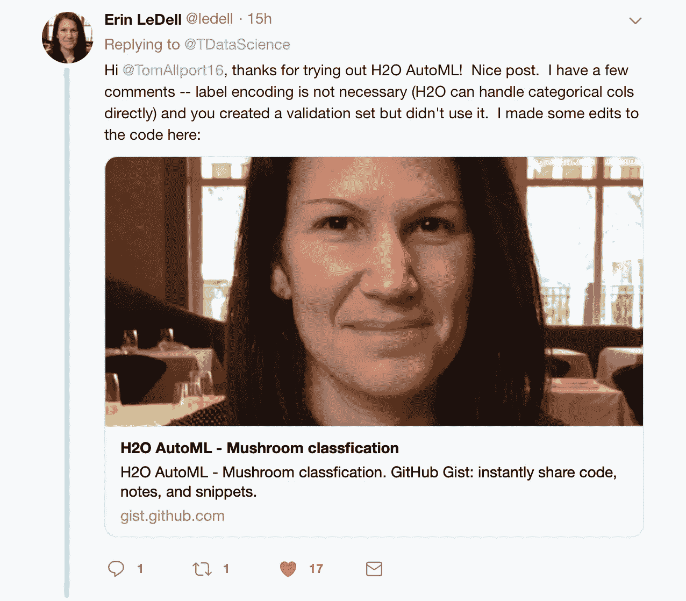
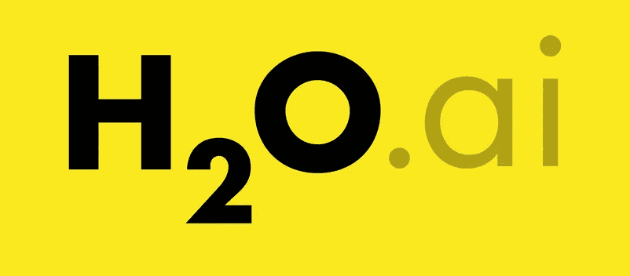
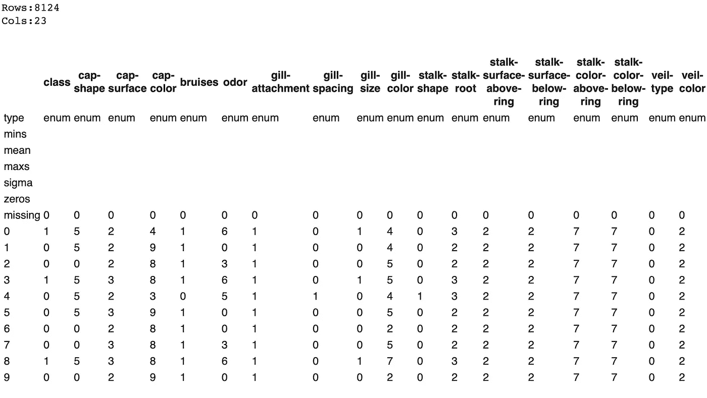
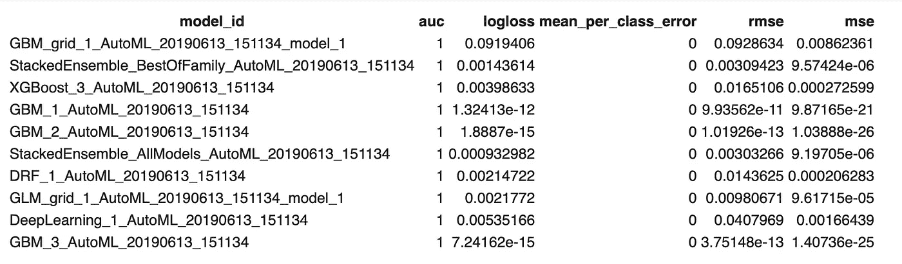
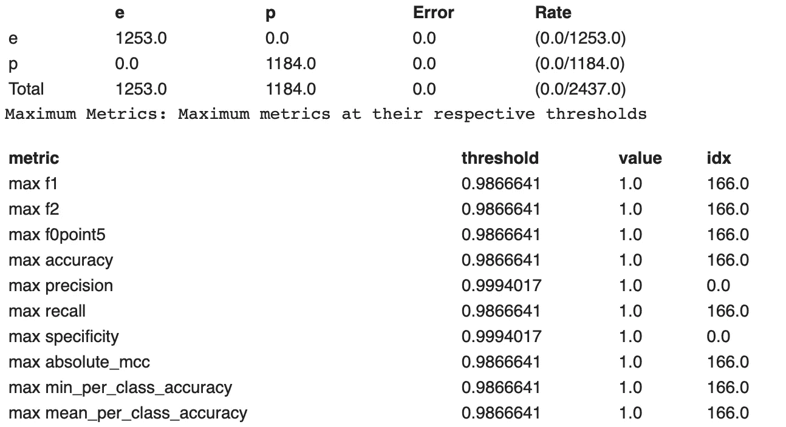

# AutoML —改进您工作流程的工具(已更新)

> 原文：<https://towardsdatascience.com/automl-a-tool-to-improve-your-workflow-1a132248371f?source=collection_archive---------13----------------------->


Photo by [Alex Knight](https://unsplash.com/@agkdesign?utm_source=unsplash&utm_medium=referral&utm_content=creditCopyText) on [Unsplash](https://unsplash.com/search/photos/robot?utm_source=unsplash&utm_medium=referral&utm_content=creditCopyText)

## 二进制分类中 H2O 自动机的改进

**在发表了我关于这个话题的原始文章后，** [**艾琳·莱戴尔**](https://twitter.com/ledell)**——H2O . ai 的首席机器学习科学家，为我提供了一些关于文章的很好的反馈。作为对此的回应，我决定在这篇文章中加入她的评论，以展示使用 AutoML 特性是多么容易。**



**我在整篇文章中用粗体显示了反馈部分以及她在文章结尾提供的要点。**

最近，对数据科学技能的需求激增，其增长速度超过了当前技能供应的速度。今天，很难想象一家企业不会受益于科学家和机器学习算法执行的详细分析数据。随着人工智能进入工业的每个角落，很难在每个可能的用例中满足数据科学家的需求。为了缓解这种短缺带来的压力，一些公司已经开始开发能够部分自动化通常由数据科学家执行的流程的框架。

AutoML 是一种将机器学习技术应用于数据的过程自动化的方法。通常，数据科学家会花大量时间进行预处理、选择功能、选择和调整模型，然后评估结果。AutoML 能够通过提供基线结果来自动执行这些任务，但也可以针对某些问题提供高性能的结果，并深入了解进一步探索的方向。



本文将介绍 Python 模块 H2O 及其 AutoML 特性。H2O 是一个基于 Java 的数据建模和通用计算软件。根据 H2O.ai:

> H2O 的主要用途是作为分布式(许多机器)、并行(许多 CPU)、内存(数百 GBs Xmx)处理引擎

AutoML 是 H2O 的一个功能，它可以自动构建大量模型，目标是在没有任何先验知识的情况下找到“最佳”模型。AutoML 不会为您赢得任何竞争，但它可以提供大量信息来帮助您构建更好的模型，并减少探索和测试不同模型所花费的时间。

他们 AutoML 功能的当前版本可以训练和交叉验证随机森林、极度随机森林、梯度增强机器的随机网格、深度神经网络的随机网格，然后使用所有模型训练堆叠集合。

堆叠(也称为元集成)是一种模型集成技术，用于组合来自多个预测模型的信息以生成新模型。通常情况下，堆叠模型(也称为第二层模型)的表现会优于每个单独的模型，因为它具有平滑的特性，能够突出表现最佳的每个基础模型，并贬低表现较差的每个基础模型。因此，当基本模型明显不同时，堆叠是最有效的。


Stacking visualized — Image from [http://supunsetunga.blogspot.com/](http://supunsetunga.blogspot.com/)

堆叠方法是通过混合或组合多个机器学习模型的预测来提高预测性能的程序。有多种集成或堆叠方法，从简单的投票或平均预测，到使用预测作为特征构建复杂的学习模型(逻辑回归、k-最近邻、提升树)。

机器学习模型预测的堆叠经常击败最先进的学术基准，并被广泛用于赢得 Kaggle 比赛。不利的一面是，它们通常在计算上很昂贵，但是如果时间和资源不成问题，那么预测性能的最小百分比改进可以帮助公司节省大量资金。AutoML 特性还可以大大减少运行这些堆栈方法所需的时间。

## 数据探索

本文将研究蘑菇分类数据集，该数据集可以在 Kaggle 上找到，由 UCI 机器学习公司提供。该数据集包含 23 个分类特征和 8000 多个观察值。数据分为两类，可食用的和有毒的。这些类分布相当均匀，52%的观察值在可食用类中。数据中没有遗漏的观察值。这是一个流行的数据集，Kaggle 上有超过 570 个内核，我们可以使用它来查看 AutoML 相对于传统工作流的性能。

## 运行 H2O

首先，您需要安装并导入 H2O Python 模块和 H2OAutoML 类，就像任何其他库一样，并初始化一个本地 H2O 集群。(这篇文章我用的是 Google Colab。)

然后我们需要加载数据，这既可以直接加载到“H2OFrame”中，也可以加载到 panda DataFrame 中(就像我对这个数据集所做的那样)，这样我们就可以对数据进行标签编码，然后将其转换为 H2OFrame。与 H2O 的许多东西一样，H2OFrame 的工作方式与 Pandas DataFrame 非常相似，但在语法上略有不同——H2O 汽车公司可以直接处理分类列，因此这一步是不必要的。

尽管 AutoML 将在初始阶段为我们完成大部分工作，但重要的是，我们仍然要对我们试图分析的数据有一个很好的理解，以便我们可以在它的工作基础上更进一步。

```
df.describe()
```



H2OFrame from df.describe()

类似于 sklearn 中的函数，我们可以创建一个训练测试分割，以便可以在一个看不见的数据集上检查模型的性能，以帮助防止过度拟合。值得注意的是，当分割帧时，H2O 没有给出精确的分割。它旨在有效处理大数据，使用概率分割方法而不是精确分割。例如，当指定 0.70/0.15 分割时，H2O 将产生期望值为 0.70/0.15 的测试/训练分割，而不是精确的 0.70/0.15。在小数据集上，结果分割的大小将比大数据更偏离预期值，在大数据上，它们将非常接近精确值 **—注意这里没有必要包括验证集，因为我稍后不会使用它，但如果需要的话可以使用它**。

然后，我们需要获取数据集的列名，以便将它们传递给函数。对于 AutoML，有几个参数需要指定`x`、`y`、`training_frame`、`validation frame`，其中`y`和`training_frame`为必需参数，其余为可选参数。您也可以在此配置`max_runtime_sec`和`max_models`的值。`max_runtime_sec`参数是必需的，`max_model`是可选的，如果不传递任何参数，默认为 NULL。`x`参数是来自`training_frame`的预测值向量。如果您不想使用您传递的帧的所有预测值，您可以通过将其传递给`x`来设置。

对于这个问题，我们将把数据帧中的所有参数发送到`x`(除了目标)并将`max_runtime_sec`设置为 10 分钟(其中一些模型需要很长时间)。现在该运行 AutoML 了:

在这里，该功能被指定为运行 10 分钟，但是可以指定模型的最大数量。如果您希望调整 AutoML 运行的过程，也可以传递大量可选参数来实现这一点。以下是 h2o 文档中的描述:

*   `x`:预测值列名或索引的列表/向量。只有当用户希望从预测值集中排除列时，才需要指定该参数。如果所有列(除响应之外)都应在预测中使用，则不需要进行设置。
*   `validation_frame`:该参数被忽略，除非`nfolds == 0`，其中可以指定一个验证框架，用于提前停止单个模型和网格搜索(除非`max_models`或`max_runtime_secs`覆盖基于度量的提前停止)。默认情况下，当`nfolds > 1`时，交叉验证指标将用于提前停止，因此`validation_frame`将被忽略。
*   `leaderboard_frame`:该参数允许用户指定一个特定的数据框，用于对排行榜上的模型进行评分和排名。除了排行榜评分之外，此框架不会用于任何其他用途。如果用户没有指定排行榜框架，那么排行榜将使用交叉验证指标，或者如果通过设置`nfolds = 0`关闭了交叉验证，那么将从训练框架自动生成排行榜框架。
*   `blending_frame`:指定用于计算预测的帧，该预测用作堆叠集合模型金属载体的训练帧。如果提供，AutoML 生成的所有堆叠系综将使用混合(也称为保持堆叠)而不是基于交叉验证的默认堆叠方法进行定型。
*   `fold_column`:为每个观察指定交叉验证折叠索引分配的列。这用于在 AutoML 运行中覆盖单个模型的默认、随机、5 重交叉验证方案。
*   `weights_column`:指定带有观察权重的列。将某个观察值的权重设置为零相当于将其从数据集中排除；给一个观察值一个相对权重 2 相当于重复该行两次。不允许负权重。
*   `ignored_columns:`(可选，仅 Python)指定要从模型中排除的一列或多列(作为列表/向量)。这是`x`论证的逆命题。

模型运行后，您可以查看哪些模型的性能最好，并考虑这些模型进行进一步的研究。

```
lb = aml.leaderboard
lb.head()
```



Leaderboard of best models from H2O AutoML

为了检查模型是否过度拟合，我们现在对测试数据运行它:

```
preds = aml.predict(test)
```

## 结果

AutoML 在测试数据上给出了 1.0 的准确度和 F1 分数，表明该模型没有过拟合。



Results for best model from AutoML on test data

很明显，这是 AutoML 的一个特例，因为如果不测试更多的数据，我们就无法在测试集上提高 100%的准确率。查看为这个数据集提交给 Kaggle 的许多内核，似乎许多人(甚至 Kaggle 内核机器人)也能够使用传统的机器学习方法产生相同的结果。

以下是艾琳·莱德尔提供的要点:

## 未来的工作

下一步是保存训练好的模型。有两种方法保存领导者模型——二进制格式和 MOJO 格式。如果你要把你的模型投入生产，那么建议使用 MOJO 格式，因为它是为生产使用而优化的。

现在，您已经找到了数据的最佳模型，可以进一步探索提高模型性能的步骤。也许训练数据上的最佳模型过拟合，而另一个顶级模型是优选的。也许可以为某些模型准备更好的数据，或者只选择最重要的特征。H2O 汽车公司的许多最好的模型使用集成方法，也许集成使用的模型可以进一步调整。

虽然 AutoML 本身不会让你在机器学习竞赛中获得冠军，但它绝对值得考虑作为混合和堆叠模型的补充。

AutoML 可以处理各种不同的数据集类型，包括二元分类(如此处所示)、多类分类以及回归问题。

## 结论

AutoML 是帮助(而不是取代)数据科学家工作的伟大工具。我期待看到 AutoML 框架的进步，以及它们如何让我们这些数据科学家和他们所服务的组织受益。当谈到特征工程时，一个单独的自动混合器当然不能胜过人类的创造性思维，但是 AutoML 是一个值得在你的下一个数据项目中探索的工具。

**再次感谢艾琳·莱戴尔的反馈，请务必关注她的** [**推特**](https://twitter.com/ledell) **。**


Image from TechRadar

## 关键词汇

*   AutoML —一个自动化一些通常由数据科学家执行的任务的框架。
*   H2 of frame——H2O 版的熊猫数据帧。
*   堆叠——一种采用多个不同模型并根据这些“子模型”的结果创建预测的模型。

# 进一步阅读

*   关于 H20 的教程，包括 AutoML 和其他功能—[http://docs . H2O . ai/H2O-tutorials/latest-stable/H2O-world-2017/AutoML/index . html](http://docs.h2o.ai/h2o-tutorials/latest-stable/h2o-world-2017/automl/index.html)
*   了解更多关于堆叠模型的信息—[http://blog . ka ggle . com/2016/12/27/a-ka gglers-guide-to-model-stacking-in-practice/](http://blog.kaggle.com/2016/12/27/a-kagglers-guide-to-model-stacking-in-practice/)