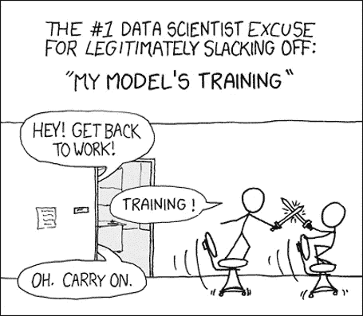
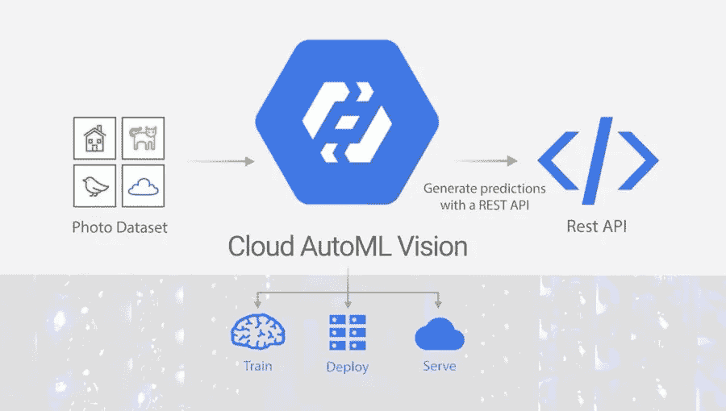

# AutoML 和 AutoDL:简化

> 原文：<https://towardsdatascience.com/automl-and-autodl-simplified-b6786e5560ff?source=collection_archive---------17----------------------->

## 看看机器学习新阶段的开始

## **什么是 AutoML？**

作为数据科学研究工程师，任何问题陈述中最耗时的任务是数据分析、试验和选择正确的算法和参数调整。所有这些都需要人类的专业知识，这也是数据科学家如今如此重要的原因。

*但是，如果这种人为干预能够被消除，那会怎么样呢？*如果这种模型能够自行选择正确的算法、进行数据分析和微调以获得完美的模型，那会怎么样？这就是 AutoML 的意义所在，也绝对是迈向完全自主系统的下一步。

其他类似的术语包括 AutoDL、AutoCV 和 AutoNLP，用于表示深度学习、计算机视觉和自然语言处理领域的模型。**通俗地说**，例如，AutoCV 旨在创建一个单一的系统，它可以处理任何计算机视觉问题，理解数据并选择正确的方法来处理数据，所有这些都无需任何人工干预。

## **为什么选择 AutoML？**

机器学习和人工智能现在很热门，近年来有很多研究方向被称为该领域的未来。AutoML，或者有些人喜欢称之为元学习，粗略地说，是一种关于学习的学习形式。

从一开始，对 ML 的研究就一直在上升，我们已经创建了各种各样的模型和系统，每一个都是针对特定的问题陈述的。然而，我们现在正处于一个阶段，我们可以结合这些模型，并在某种意义上，在层次结构上向上移动。因为我们的最终目标是达到层次的顶端并创建一个自治系统，所以我认为这些元模型的宣传绝对值得。

Google Cloud based AutoML services

## AutoML 和 ML 有什么不同？

在 ML 中，数据科学家首先从问题陈述和数据集开始。对数据进行分析和清理，确定一个性能指标，然后根据人类的直觉，对一些可能适用于数据集的模型进行实验。在我们最终得到一个可接受的模型之前，需要进行大量的功能工程和微调。

AutoML 试图尽可能多地自动化这个管道。虽然这些步骤中有一些比较容易自动化，比如模型微调，但是有一些非常困难，比如选择正确的架构/模型等等。**总而言之**，AutoML 就是要尝试创建一个单一的系统，可以在建模和训练过程的每一步都不需要人工干预。

## 它有多成功？

最近在 AutoML 和 AutoDL 领域做了很多工作。我认为这很大一部分功劳应该归功于 AutoML 最近的多个竞赛，试图改善这个领域并邀请创新的想法。

Google 已经创建了他们自己的基于云的 AutoML 平台，保证帮助那些对 ML 一无所知的人使用 ML。然而，使用他们的模型是非常昂贵的，而且只适合愿意花同样多钱的企业。

 [## Cloud AutoML -定制机器学习模型|谷歌云

### Cloud AutoML 帮助您利用有限的机器学习专业知识轻松构建高质量的定制机器学习模型…

cloud.google.com](https://cloud.google.com/automl/) 

也有很多成功的开源平台，如 Auto-Sklearn 和 Auto-keras，它们成功地为每个人提供了 AutoML 领域的最新进展..*免费！！*

 [## 弗赖堡汽车公司

### BOHB 结合了贝叶斯优化和超波段的优点，以达到两全其美…

www.automl.org](https://www.automl.org/) 

## 下一步是什么？

AutoML 已经看到了几年前不可能实现的成功，像谷歌这样的平台已经能够建立这样的系统，可以将数据科学家从通用机器学习管道的等式中移除。但是我们离真正的自治系统还很远。

*这个博客是努力创建机器学习领域简化介绍的一部分。点击此处查看完整系列*

 [## 机器学习:简化

### 在你一头扎进去之前就知道了

towardsdatascience.com](/machine-learning-simplified-1fe22fec0fac) 

*或者干脆阅读系列的下一篇博客*

 [## 情感分析:简化

### 看看自然语言处理的“你好世界”

towardsdatascience.com](/sentiment-analysis-simplified-ac30720a5827) 

## **参考文献**

*[1] Guyon，Isabelle 等，“2015–2018 年 AutoML 挑战赛系列分析。”(2017).
【2】何，，等，“Amc:面向移动设备的模型压缩与加速的 Automl”欧洲计算机视觉会议录(ECCV)。2018.
[3]佐夫、巴雷特和阔克诉勒。"强化学习的神经架构搜索."arXiv 预印本 arXiv:1611.01578(2016)。*