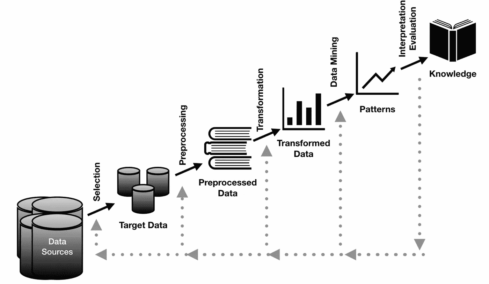
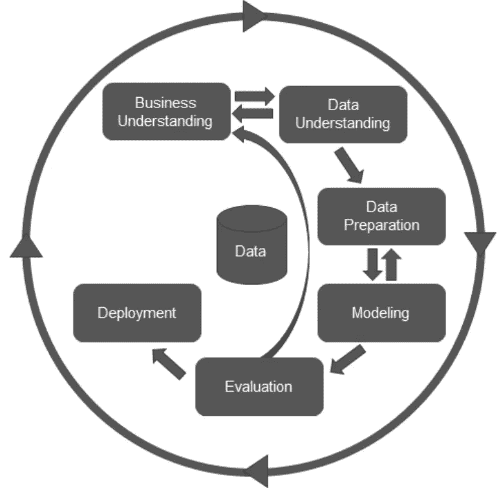
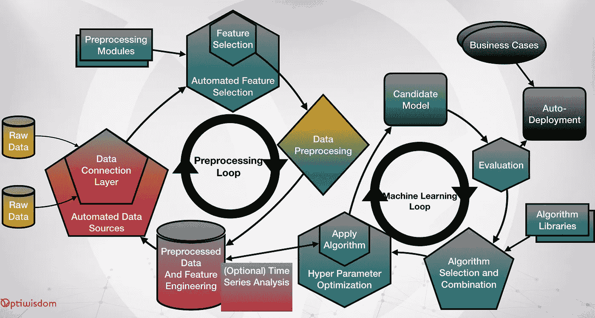
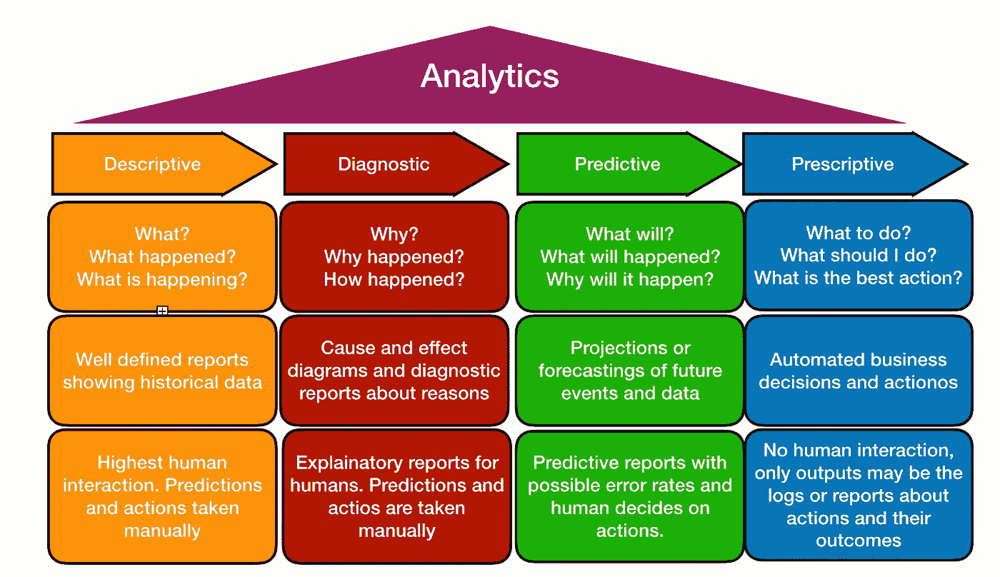
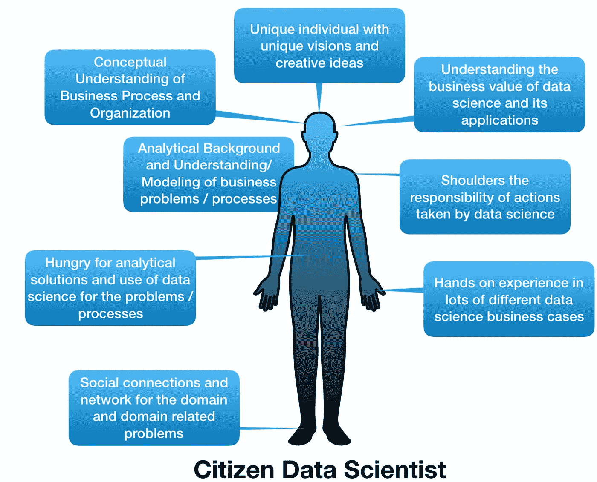
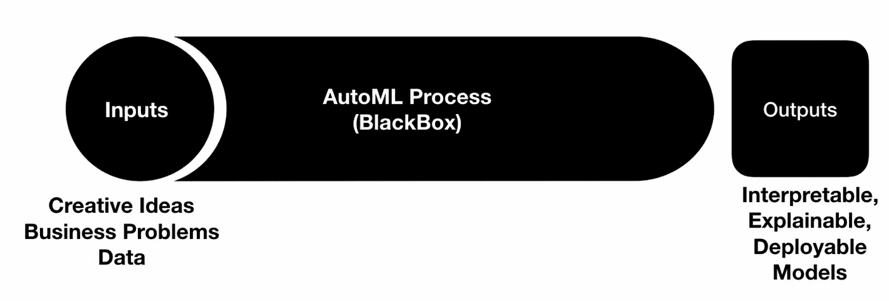
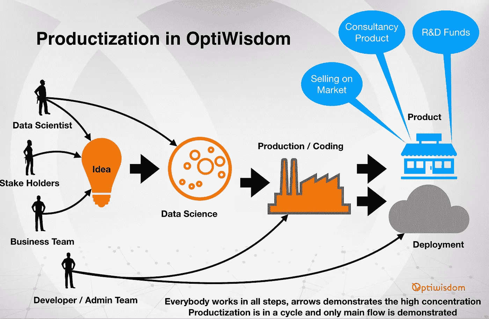
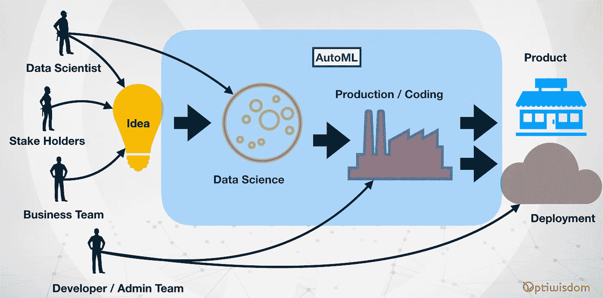

# AutoML:来自 OptiWisdom 的端到端介绍

> 原文：<https://towardsdatascience.com/automl-end-to-end-introduction-from-optiwisdom-c17fe03a017f?source=collection_archive---------7----------------------->

机器学习是人工智能研究的一个分支，也是计算机科学的一个分支。不断增长的数据量和处理能力也增加了对处理数据和通过挖掘数据之间的关系产生有用结果的需求。这种新趋势通常被称为数据科学或分析。有时，根据应用程序的不同，它可能被运行的平台称为大数据分析。另一方面，数据科学有两大支柱，即机器学习和统计学。

数据科学的趋势也吸引了对机器学习的研究，这是两个主要学科之一，另一个是统计学。机器学习是一个比较老的话题。一些研究者甚至可能在古希腊找到它的根源，那里的人们试图从早期犹太教或假人教中找到解决所有问题的通用公式，这与我们现代理解中的机器人非常相似。今天，机器学习也是一种形式的基础，我们每年都在使它们更加自动化。

在这个中级系列中，我们试图找到一个自动化机器学习(AutoML)过程的实践经验，我们通过理解机器学习的经典流程来开始这个概念。我们将看看什么是自动机器学习，什么不是自动机器学习。我们会明白为什么自动机器学习很重要，它通常会面临哪些问题。最后，我们将通过端到端的系统方法来实现自动机器学习过程。

写作将涵盖以下主题:

了解什么是 AutoML

知道为什么汽车很重要

理解什么不是自动的

理解 AutoML 的问题

学习自动化过程的端到端系统方法

**了解什么是 AutoML**

在最简单的定义中，AutoML 是机器学习过程的自动化。那么，我们从机器学习过程中了解了什么，我们如何使它自动化？

从数据科学项目管理技术可以很容易地理解文献中的机器学习过程，我们有三种主要的数据科学项目管理技术:

塞姆马

KDD

CRISP-DM

**取样、探索、修改、建模和评估**

**SEMMA** 代表取样、探索、修改、建模和评估，是最早的项目管理技术，在 KDD 和 CRISP-DM 中也包含了这种技术，所以对其进行详细描述并不重要。但是理解它很重要，因为它从采样数据开始，继续探索数据，修改模型或数据类型，然后为此目的创建模型，最后评估结果。这也是 AutoML 的一个非常初始的流程，我们将在后面介绍。

**数据库中的知识发现**

**KDD** 代表数据库中的知识发现，它是从数据中提取知识的最著名的方法之一。

KDD ( Knowledge Discovery on Databases)

它从任何系统中的数据开始，如数据库、大数据平台，甚至是来自物联网设备或社交媒体的流数据，经过 5 个步骤后，它会带来知识。在进入 KDD 步骤的细节之前，定义如下所示的数据和知识的概念可能是有用的:

DIKW Pyramid

上图展示了众所周知的 DIWK(数据、信息、知识和智慧金字塔)。

1.它从数字或字符开始，如在基线，数据级别。

2.它们没有意义，信息层带来了意义。例如，50 只是一个数字，但像“50 是约翰的年龄”这样的信息对我们来说有着特殊的意义。

3.从数据到信息的升级是另一本书的另一个故事，这一级别的大多数问题由数据库系统、数据仓库处理，并创建报告、仪表板或记分卡。

4.另一方面，从信息到知识层面的步骤是人工智能、机器学习或统计的问题，我们无法在大多数知识层面的问题中获得 100%的成功。例如，从约翰的照片中了解他的年龄可能是一个知识水平问题，我们在大多数情况下无法确定。

KDD 是一种利用数据解决知识水平问题的技术，如收集所有员工的照片和训练机器来预测人的年龄。

AutoML 的目标是在没有任何交互或至少最小化交互的情况下，自动完成从数据到知识级别的过程。在这篇文章中，你可以找到一步一步的方法，每一步的 KDD 和我们如何自动化的步骤。

KDD 从选择数据开始，这对于减少数据集和理解最重要的特征是很重要的。稍后，在 AutoML 中，我们将把这一层划分为数据连接层和特征选择，因为 AutoML 需要连接、选择和刷新这一过程，因为数据在大多数情况下是动态的，我们需要检查数据的更新。

数据预处理处理数据上的问题，如缺失值、异常值、噪声或脏数据等。因此，我们既要处理数据质量，同时又要尝试做一些预处理，以提高机器学习模型的成功率。同样，在 AutoML 中，目的是自动提高成功率，理解预处理策略，或尝试一些可能性，以优化机器学习模型的性能。由于我们正在以自动化的方式处理性能优化，我们不能将 AutoML 的步骤分成两个，像数据预处理或转换，我们一起处理这两个步骤。例如，在 AutoML 过程中的大多数时间，日期字段被自动检测(数据预处理的一个步骤)，缺失值或异常值被自动处理(数据预处理的另一个步骤)，一些特征如日、月、年、星期几或一年中的某一天被自动提取(数据转换的一个步骤)，有用的特征被选择，无用的被考虑(数据选择的一个步骤)。因此，AutoML 是整个过程的自动化，其中 KDD 处理几个步骤。

最后，数据挖掘步骤由 AutoML 中的模型选择步骤处理，AutoML 还处理模型的优化，稍后我们称之为超参数优化(HPO)。

在数据挖掘或建模步骤之后，第一个机器学习模型就可以使用了，但还有最后一个问题需要解决:我们如何才能理解模型的成功？怎么评价呢？满意标准是什么？

AutoML 和 KDD 方法的一个主要区别是评估步骤。解释/评估在数据科学中非常重要，它强烈要求数据科学家处理案例并开展工作。但是，在 AutoML 中，这个过程大多数时候是从评估标准开始的。

**跨行业标准处理—数据挖掘**

**CRISP-DM** : CRISP-DM 代表跨行业标准处理——数据挖掘，是业界使用最多、最广泛的数据科学工具。CRISP-DM 的步骤如下图所示:

CRISP-DM : Cross Industry Standard Processing — Data Mining

CRISP-DM 有 6 个步骤，从业务和数据理解开始，这对于任何数据科学项目都是必不可少的，并且大多数时候是业务分析师或数据分析师的工作，按照给定的顺序。

CRISP-DM 的其余步骤与 KDD 步骤非常相似，KDD 的数据选择、数据预处理和数据转换步骤被合并到 CRISP-DM 的数据准备步骤中。

从这个角度来看，CRISP-DM 非常类似于 AutoML 方法，其中整个 AutoML 过程可以总结为两个主要循环:数据准备循环和机器学习循环。

CRISP-DM 强调业务分析和数据分析的重要性。

**AutoML 步骤和模块**

在涵盖和比较了经典的机器学习/数据科学项目管理步骤和流程之后，有可能给出 AutoML 的系统图；

AutoML Approach from OptiWisdom

尽管有许多可供选择的方法来实现 AutoML 过程，但上述方法是 OptiWisdom 针对 SaaS 方法提出的端到端解决方案。用户能够加载/连接数据源，其余的问题，如预处理或模型选择和部署，都在 OptiWisdom 平台上解决。AutoML 图表，演示:

从原始数据源到部署自动生成的机器学习算法的流程。

该流程非常类似于 KDD 和 CRISP-DM 流程，并且具有两个主要循环，预处理循环和机器学习循环，类似于 CRISP-DM 步骤。

除了整个过程的自动化之外，AutoML 背后的基本思想是上图中每个步骤的自动化。

上图也给出了整个系统的一般视图，在某些情况下，AutoML 解决方案可能会考虑上述场景的一小部分。

例如，删除上述所有步骤，仅将单个机器学习算法直接添加到数据源并应用超参数优化，甚至可以被认为是 AutoML 解决方案。

在这篇文章中，更大的画面将被每个步骤的实践经验所覆盖，并且 AutoML 的每个步骤都通过实践方法在单独的章节中处理。它从数据层面开始，向上到知识层面。

**数据连接层**

原子化从数据连接层开始。除了连接到数据源的必要性，自动化系统还需要检查数据源上的更新和刷新。数据源中的更新可以是:

**新记录**发送到数据源，AutoML 方法通过推送通知检查更新，或根据时间刷新更新检查

**流数据源**，其中更新是问题本质的一部分，或者有时更新是**结构更新**，自动数据连接层需要检测这些变化并自我更新。

这一层的所有更新和刷新都与数据的形状直接相关。例如，向系统添加新标签是另一个问题，它在特征选择或特征工程阶段处理。

**功能选择/工程**

在这一层，AutoML 方法解决了具有冗余特征的问题。例如，在某些系统中，添加一个人的出生日期和年龄可能会有问题。特征选择试图找到多余的特征并消除它们。此外，降维或转换数据是特征选择和工程的一部分。系统在这一步可以考虑一些特征工程库。例如，从日期字段中自动提取一周中的某一天、一年中的某一天或一季是这一步骤中特征工程的重要部分。

AutoML 的所有步骤都在一个循环中，并且每一步都通过每次迭代中其他步骤的反馈来更新自己。例如，特征消除从数据预处理或选择的算法中获得反馈，并且可以根据来自这些步骤的反馈来更新选择的特征。

特性工程的细节和实例将在另一篇文章“数据源和数据选择的自动化”中讨论。

**数据预处理**

数据预处理是一个重要的阶段，也被认为是 KDD 或 CRISP-DM 方法中的一个重要步骤。有时，数据预处理是 ETL(数据仓库术语中的提取、转换和加载步骤)的一部分，或者称为数据质量、数据操作或数据混合，但它是所有数据相关研究的关键步骤。数据预处理步骤的目的是处理有关数据的问题，如脏/有噪声的数据或异常值的缺失值。

与 AutoML 的其他步骤类似，数据预处理也是循环中的一个步骤，某些操作可能会受到来自其他步骤的反馈的影响。例如，在一些 AutoML 解决方案中，离群值可能会被清除，而在其他一些解决方案中，离群值对于解决方案来说极其重要。

此外，传统的特征提取、消除或工程技术需要基于时间序列的分析方法。可选地，在一些特征工程方法中，应用时间序列解决方案。

数据预处理的输出是预处理的数据源，也是 AutoML 机器学习循环的第一步。在 AutoML 的机器学习循环的每次迭代中，预处理的数据将会发生变化，并且所需的更新将会反馈到 AutoML 的预处理循环。

数据预处理将在以后的文章中处理。

**组合/选择并应用算法/超参数优化**

将机器学习算法应用于预处理数据是 AutoML 中机器学习循环的第一步。在此步骤中，将应用从算法库中挑选的算法，并自动判断第一个结果。例如，根据目标字段的数据类型，如果有目标字段，问题可能是分类或回归。AutoML 方法检测问题类型，并且只关注与问题相关的算法。在优先应用与问题相关的算法之后，AutoML 方法可以反馈到 AutoML 的预处理循环，以及应用拥有算法的超参数优化(HPO)技术。

这一步有许多不同的优化技术，每一种都有一些优点和缺点。选择算法的细节将在第 8 章“正确算法的自动选择”中解释，结合多种算法求解将在第 9 章处理，最后超参数优化技术将在第 10 章解释。

**评估和部署**

AutoML 的最后一步是将解决方案，候选模型，部署到业务案例中。根据业务案例的不同，评估需要实地测试，实地测试也会提供一些有用的反馈。

整体评估和 AutoML 系统详细信息的目的，如商业案例和 AutoML 在现实生活中的应用，将在第 11 章中考虑，但在介绍性步骤中，记住下图所示的分析成熟度可能会有所帮助:

Types of Analytics

大多数时候，描述性分析不需要机器学习方法。对于并非在所有情况下都需要但对理解原因有用的诊断，数据科学家寻找原因并试图回答“是什么导致了这些结果？”。虽然在诊断分析中，数据科学有一些优势，但 AutoML 的优势始于预测分析，但 AutoML 在规定分析中更为重要，自动操作是规定分析的一部分。因此，一个设计良好的 AutoML 方法既可以自动采取行动，也可以从商业案例或现实生活的反馈中学习。

AutoML 方法是机器学习过程的端到端原子化，因此机器可以像在强化学习中一样从现实生活中学习。除了学习和提高系统的整体性能，AutoML 还可以提高动作的性能。

**AutoML 的目的**

AutoML 的目的可以列举如下:

经典数据科学管道中最大数量步骤的自动化

最少的人类互动

取得良好和令人满意的结果

低时间计算

上面列表中的第三和第四项也是经典数据科学的主要目标，但上面列表中的前两项对数据科学和机器学习有独特的新方法。

**了解 AutoML 的重要性**

AutoML 是机器学习研究中一个相对较新且不断增长的趋势。这种方法也吸引了像脸书这样的科技巨头，或者像 Gartner 这样的全球商业研究和咨询公司。脸书每月生成超过 30 万个机器学习模型，他们还有一个名为 Asimov 的项目，用于优化这些模型。另一方面，Gartner 声称，到 2020 年，超过 40%的数据科学将实现自动化。

Twitter 在 2015 年收购了一家机器学习初创公司 WhetLab，该公司为机器学习问题创建了更简单和自动化的解决方案。

AutoML 的三个核心目标可以列举如下:

性能优化:在理想情况下，AutoML 性能与问题或数据的复杂性无关。因此，AutoML 试图为各种输入和学习任务建立一个通用的性能

在过程中最少或没有人工干预:在理想情况下，AutoML 处理所有问题，并以自动化的方式解决问题

计算效率:在理想情况下，AutoML 在给定的有限资源或预算内产生最佳算法。

以上所有案例表明，行业内关于 AutoML 解决方案的趋势越来越明显。AutoML 的主要优势是:

AutoML 减少了例行程序，同时为数据科学过程中的创造性工作留下了巨大的空白

AutoML 是机器学习的一种民主化方式，它提出了一个新的术语，称为“公民数据科学家”，因此每个人都可以处理数据科学，并在他们的领域专业知识中使用机器学习算法。

AutoML 提供了一个标准化的机器学习解决方案，无论项目中数据科学家的资历如何。

AutoML 对行业有雪崩效应，因为它增加了员工、经理或所有利益相关者对机器学习相关解决方案的参与度。

**公民数据科学家和机器学习民主化**

AutoML 是一个重要的趋势，因为它提供了机器学习解决方案的民主化。一个相对较新的趋势叫做“公民数据科学家”,它也不是一个新的工作或组织中的一个职位。Gartner 将该术语定义为一个人，他处理预测性或规范性分析的开发，他不是来自统计或分析背景，并且他的主要工作不是开发模型。

下图所示的公民数据科学家形象全面参与并致力于业务流程和数据科学。

公民数据科学家也是数据科学世界和他拥有专业知识的领域之间的桥梁。

他收集信息，创建社交网络或梦想数据科学及其领域的未来项目。

此外，大多数公民数据科学家都在他们的背景中加入了新的技能，如对统计、数据处理、分析或数学的更广泛的理解。

他们还对组织的决策承担责任。

因此，在数据科学的新时代，数据科学是民主化的，任何背景的人都可以使用，而且他们在工作中处理什么并不重要，数据科学无处不在，每个人都必须了解并进行一些分析。

关于公民数据科学家的一个大问题是，不可能将所有专家都送回学校，教他们数据分析或机器学习模型。相反，趋势表明工具变得不那么复杂，并提供简单和可解释的解决方案。因此，经验丰富的数据科学家或机器学习专家正在致力于创造新的工具、系统或算法，这些工具受到更广泛的大众的更多需求。

**机器学习模型的标准化**

关于 AutoML 趋势的另一个重要问题是生产的机器学习模型的质量标准化。在行业中，总是要求有经验丰富的数据科学家或机器学习专家。“有经验”这个关键词对于大多数招聘广告来说都是至关重要的，甚至有时招聘广告的标语中会出现“资深”数据科学家。工业界已经意识到机器学习模型的质量。解决问题的模型在大多数时候并不是最佳解决方案，只有经验才能带来机器学习模型的质量，这可以质疑机器学习模型的工作情况、商业案例相关的成功率或未来风险。

AutoML 有解决问题的方案，并且独立于数据科学家的经验或资历，AutoML 生产部署就绪的模型。

除了业务案例或数据问题模型的标准化，标准化还带来了执行性能的标准。选择或组合的模型会受到资源或性能要求的限制。

**AutoML 在行业中的雪崩效应和学习转移**

AutoML 使机器学习项目易于访问和简单理解。此外，为来自任何领域或背景的专家提供了许多新的自动化工具。因此，新时代的机器学习变得更加容易实现。

AutoML 也可以将一个经验从一个案例转移到另一个案例。例如，一个专门从事人力资源的 AutoML 应用程序也可能为人力资源领域的特定应用程序带来一个标准的机器学习过程。零售业也有类似的情况。Amazon 是 web 上早期的推荐引擎实现者之一，它创建了一个基于 web 的零售商店，当时编写推荐引擎的最简单方式是一个简单的数据库查询，显示“谁买了这个项目，也买了这个项目”，这是一个非常原始的协同过滤版本。现在，这种方法适用于任何基于网络的零售商店，也是许多基于网络的零售商店现在必须的。很容易看出，即使是最简单最基础的机器学习系统，也能在短时间内成为行业标准。

数据是新的石油，新的数据驱动型公司正在几乎所有行业崛起。从第一个原始的亚马逊推荐系统开始不到几十年，现在机器学习系统几乎取代了一些行业的顶级管理。例如，网飞超过 75%的收入来自后台运行的推荐算法，公司的成功主要建立在他们部署的算法上。网飞基于用户行为准备电影推荐，这被称为协同过滤或用户是谁，也被称为基于内容的过滤，此外，它还根据用户的历史数据创建电影海报。因此，每次向用户推荐一部电影，用户都会得到一张为自己制作的独特的电影海报。

**了解什么不是 AutoML**

AutoML 不是神奇的盒子，自动解决所有问题。例如，AutoML 无法发明新的机器学习算法，或者无法保证某些情况下的最佳调整。

AutoML 不是一种扼杀所有数据科学工作并取代数据科学家的技术。恰恰相反，在数据科学的新时代，它是数据科学家的必备工具。AutoML 不会重复数据科学中的例行程序，如数据分析、数据清洗、特征提取或用几个问题测试多个机器学习算法，而是自动执行所有必要的例行程序，并将明智的决策留给数据科学家。

如下图所示，AutoML 可以被认为是一个管道，在一端，AutoML 获得创造性的想法作为输入，如业务问题或数据。另一方面，AutoML 为数据科学家的判断提供了必要的输出，并为数据工程师提供了部署就绪的模型。

AutoML BlackBox Approach

AutoML 也是人工智能和数据科学方法的游戏规则改变者。

例如，为深度学习系统提供更多 CPU、GPU 或 TPU 是一个非常常见的陷阱，它是一种面向抽象的机器学习自动化。

另一方面，AutoML 是研究社区的一个新视角和转变，它提供了自动化和机器学习的可解释性和可解释性。

在大多数情况下，AutoML 的结果是简单和可解释的，如生成决策树和显示关键决策节点以及算法上的数据流，而不是产生突触权重或神经网络中的激活函数参数。

**了解 AutoML 的问题**

AutoML 从最初的文献中就有一些明确定义的问题。例如，AutoML 最早的一个出现是由 Auto-Weka 推出的，最早定义的问题，现在仍然是一个重要的问题，就是 CASH(组合选择和超参数优化)。

另一个众所周知的问题正在从经典的机器学习理论中回归:没有免费的午餐定理。基本上，它说没有机器学习算法可以击败所有其他可能的算法。

AutoML 在参数优化方面有一个焦点问题。在选择了适合问题或数据的机器学习算法，或者甚至组合了算法可能性之后，现在的问题是超参数的优化。

**现金问题**

现金问题是文献中非常著名的早期问题之一。该问题简单地强调了在所有可能的算法中选择所有可能的好的机器学习算法，并组合它们以解决该问题。AutoML 主要解决监督学习问题。例如，分类和回归算法受到监督，并且更容易衡量算法的成功。在监督学习问题中，通过使用集成技术，如打包、提升、堆叠等，算法的组合是可能的并且相对容易。此外，可以通过使用共识学习来组合无监督学习算法，如聚类算法。在这两种情况下，AutoML 方法都试图为问题找到最佳的机器学习算法选择和组合。

**没有免费的午餐**

没有免费的午餐(NFL)定理是比 AutoML 方法相对更老的理论，并且表明在机器学习或优化中没有适合所有解决方案的尺寸。

这个术语从两个方面触及 AutoML，NFL 的第一个意义是关于选择机器学习算法。例如，有许多可供选择的机器学习算法，每种算法都有其原因，每种算法都有一些优点和缺点。如果有一个单一的算法，从各个方面支配所有其他可能的算法，那么生活会容易得多。不幸的是，这是不可能的，也没有这样的算法或捷径。AutoML 中 NFL 的第二个含义是机器学习算法的优化阶段，或者更具体地说是超参数优化。这个问题再次类似于机器学习算法的选择，这一次优化过程没有自由解。

这个类比来自于餐馆和菜单的隐喻。所以，菜单上列出了可能的解决方案，每一个餐盘都有价格。此外，根据你的饮食，餐馆的选择也很重要。例如，一个素食者在一家牛排店吃午餐会比午餐的平均价格高。所以从菜单上选择合适的餐馆和合适的项目是很重要的。最后，你午餐时间的朋友，也就是和你一起吃午餐的人，对你的选择范围也很重要。例如，如果你是一个素食主义者，如果你和一个肉食者共进午餐，那么午餐再次变得高于平均水平。

类似地，从菜单中选择菜单项——候选解决方案或可用算法列表中的算法——会产生一些外部影响，如哪些算法正在一起工作，或者您在哪个问题域中使用该算法。因此，算法的搜索本身是一个优化问题，同时优化所选算法的参数会使问题变得更加复杂，并带来多准则优化问题。

**超参数优化(HPO)**

在最一般的形式中，超参数优化是机器学习算法的超参数的优化。几乎所有的算法都有直接影响结果的超参数，除了为问题选择最佳算法外，为算法选择最佳参数也是一个重要的问题。

有许多方法可以解决这个问题和可能的解决方案，这个问题和可选的解决方案将在以后的文章中讨论。但是为了引入这个概念，一个非常原始的搜索过程可能是网格搜索，其中在一次迭代中搜索预定范围内的所有可能的参数。

HPO 实际上是一个稍微复杂一点的问题。超参数在大多数时候不是 2 或 3 维搜索空间，并且同时有超过 10 个参数需要优化。不幸的是，当需要优化的参数数量增加时，问题的复杂性也以指数方式增加。

没有一种算法能保证比网格搜索更好的解决方案，但是通过使用一些优化算法，一种更快的算法是可能的。

**学习端到端的系统化 AutoML 方法**

在传统的数据科学项目中，有三个基本步骤

1.数据科学项目从理解和分析问题和数据开始，

2.继续创建和实施模型和

3.在最后一步，项目被提升到可持续和可维护的阶段。

下图展示了大多数情况下数据科学流程的通用方法。该图解释了参与者的主要贡献，但是当然，参与者的参与并不限于图中所示的交互。例如，利益相关者和业务团队与产品和部署非常相关，但是图中只展示了关键的和主要的交互。

Productization of AutoML in OptiWisdom

这三个步骤还需要一些子步骤和参与者。

在构思阶段，利益相关者、业务团队和数据科学家一起工作。这里的理念是理解和定义问题，并创造性地提出解决方案。

在数据科学阶段，数据科学家致力于找到问题的解决方案，最后在生产或部署阶段，开发人员、系统管理员或数据工程师致力于实现最佳的可持续系统。

AutoML 旨在自动化数据科学，主要是生产/编码阶段。

AutoML 取代了人工操作，用优化和自动化的解决方案取代了常规工作，并为数据科学家和开发人员提供了更多从事更具创造性工作的机会。

Role of AutoML in Productization

上图展示了 AutoML 在整个系统中的主要部署。这个想法是数据科学和生产阶段的自动化，并最小化数据科学家和开发人员团队在这个过程中的贡献。