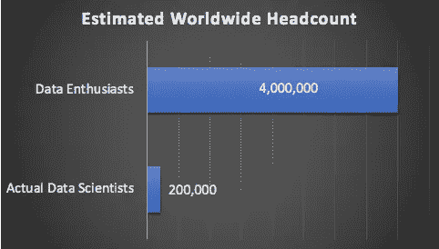
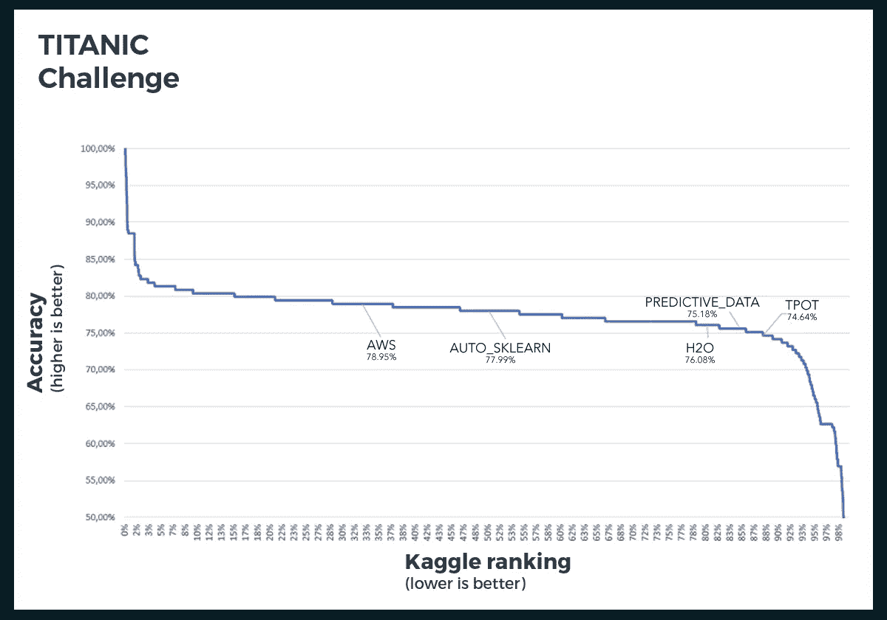

# 面向数据爱好者的 AutoML

> 原文：<https://towardsdatascience.com/automl-for-data-enthusiasts-30582b660cda?source=collection_archive---------17----------------------->

AutoML(自动化机器学习)会是允许任何有愿望的人(数据爱好者)创建机器学习模型的答案吗？

**谁是数据爱好者？**

*   想尝试机器学习的软件开发者
*   渴望成为数据科学家的大学生
*   希望提升自己水平的中层企业经理
*   希望区分其技能组合的分析师
*   许多其他人…

AutoML 通过自动化数据准备、特征提取、模型选择和模型调整，节省了数据科学家的大量时间。但是，它能让数据爱好者轻松地使用机器学习吗？

答案是它确实依赖于 AutoML 工具，其中有大量用户友好的*和*工具。

**挑战**

如果你不是数据科学家，只是想尝试机器学习(嘿，你甚至可能不会写代码)，我称你为数据爱好者。看下面的图表，数据爱好者比实际的数据科学家多得多(比例为 20 比 1)。

[Estimated from multiple sources including https://www.kdnuggets.com/2018/09/how-many-data-scientists-are-there.html](https://www.kdnuggets.com/2018/09/how-many-data-scientists-are-there.html)

现实是，在 400 万数据爱好者中，有些人还拥有令人敬畏的领域知识，如果配备了正确的工具，可以加速一个组织的机器学习工作。

**潜在解决方案**

AutoML 工具通常适用于以下情况之一(本文重点关注第二点):

1.  通过自动化部分模型构建流程，帮助当前的数据科学家提高工作效率
2.  让数据爱好者能够创建机器学习模型

并不是每个 AutoML 工具都能解决问题，因为大多数工具都集中在第一或第二点上。在下面的 8 个 AutoML 工具的比较中，你可以看到一半的工具在易用性方面被评为“红色”,这对于数据爱好者来说不是一个好的选择。

**面向数据爱好者的 AutoML 工具对比**

有许多方法可以分割 AutoML 包的过多工具(包括 MLaaS 服务)，但是我想把重点放在数据爱好者的三个重要考虑事项上。

*   易用性(你能不写代码就创建吗)
*   预算(有免费和高级版本)。免费试用<>。
*   定制(例如，交互式数据操作工具、模型交付选项)

这八个 AutoML 工具的比较实际上是当今可用的越来越多的 AutoML & MLaaS 解决方案的组合。包括一些大型企业玩家，如 [AWS ML](https://aws.amazon.com/machine-learning/) 、 [H2O](https://www.h2o.ai/) 和 [DataRobot](https://www.datarobot.com/) 。还包括你的开源强手，比如 [Auto-Weka](https://www.cs.ubc.ca/labs/beta/Projects/autoweka/) 、 [Auto-Sklearn](https://automl.github.io/auto-sklearn/stable/) 和 [TPOT](https://epistasislab.github.io/tpot/) 。这个团队被为数据爱好者开发的有前途的工具 [PredictiveData](https://predictivedata.ai/) 和 [MLJar 所充实。](https://mljar.com/)

当比较所评估的 8 个 AutoML 工具中的 4 个工具的性能时，下面是它们在[大型数据集](https://www.kaggle.com/c/titanic)上的表现。

Results sourced from [https://hackernoon.com/a-brief-overview-of-automatic-machine-learning-solutions-automl-2826c7807a2a](https://hackernoon.com/a-brief-overview-of-automatic-machine-learning-solutions-automl-2826c7807a2a)

**总结**

AutoML 在让机器学习变得更容易方面展示了巨大的进步，工具也在迅速改进。只要你能找到易用性、预算和定制的正确平衡，这些应该会让我们更接近挖掘 400 万数据爱好者的力量。