# 用于预测建模的 AutoML

> 原文：<https://towardsdatascience.com/automl-for-predictive-modeling-32b84c5a18f6?source=collection_archive---------4----------------------->

随着第一批成果在实践中得到应用，自动化机器学习成为越来越重要的话题，带来了显著的成本降低。我在 [ML 布拉格会议](https://www.mlprague.com/)上的演讲描绘了主要在预测建模领域的最新技术和开源 AutoML 框架。

我还展示了我们的研究，该研究部分由 Showmax 资助，在我们位于布拉格捷克技术大学信息技术学院的[联合实验室](https://tech.showmax.com/lab/)进行。

> 我还要感谢 Showmax 提供的计算资源，这使得我们的大量实验成为可能。

让我们从最近的谷歌营销[视频](https://www.youtube.com/watch?v=18Xg9bpKsvs)开始，解释谷歌人工智能如何在 Waymo 中应用他们的 AutoML。

# 深度学习自动化

谷歌人工智能应用 AutoML 寻找更好的卷积网络替代架构，对自动驾驶汽车中的图像进行分类。

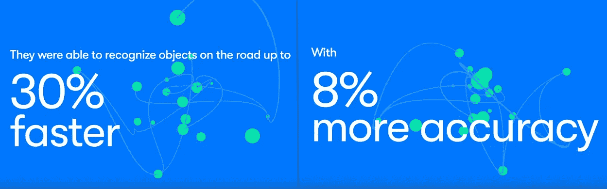

营销部门报告说速度提高了 30%,准确率提高了 8%,令人印象深刻。

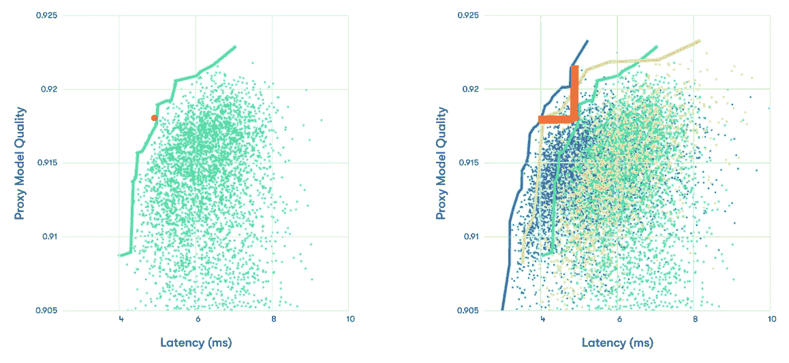

当你[仔细看](https://medium.com/waymo/automl-automating-the-design-of-machine-learning-models-for-autonomous-driving-141a5583ec2a)的时候，你发现 is 其实不是 AND 而是 OR。您可以在不牺牲精度的情况下获得高达 30%的加速，并在相同的速度下获得 8%的精度提升。无论如何，这些仍然是好数字，因此 AutoML 是值得努力的。图中的每个点代表一个卷积神经网络，目标是找到一个具有允许以最小延迟实现最佳分类性能的架构的网络(左上角)。

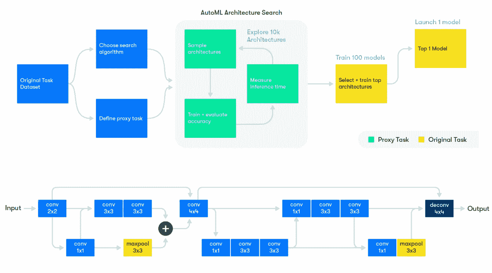

CNN 架构在一个简单的代理任务上进行评估，以减少计算成本，并评估不同的搜索策略。蓝点是由本文稍后描述的神经架构搜索策略评估的 CNN。

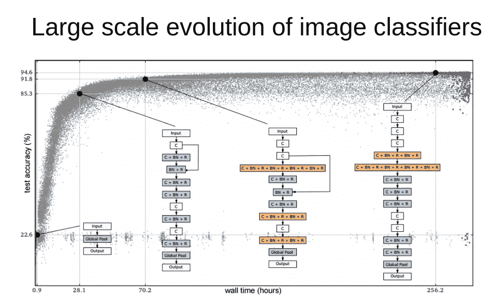

这些实验类似于更早的研究[CNN](http://proceedings.mlr.press/v70/real17a/real17a.pdf)的大规模进化，也需要大量的计算资源。

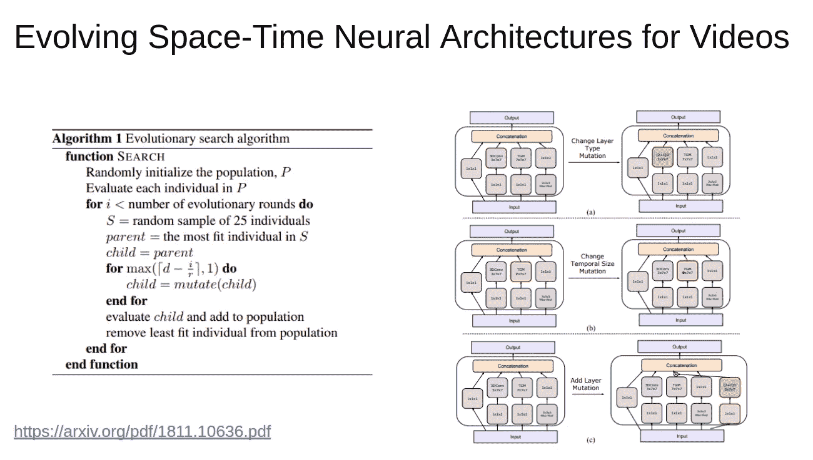

但与正在优化 3d 卷积神经网络的视频分类器的[架构搜索相比，它仍然便宜且容易。](https://arxiv.org/pdf/1811.10636.pdf)

进化搜索[也用于](https://arxiv.org/abs/1901.11117)优化转换器的编码器和解码器部分，表明在选择文本处理网络的架构时，神经翻译模型也可以得到很好的优化。

## 自动深度模型压缩

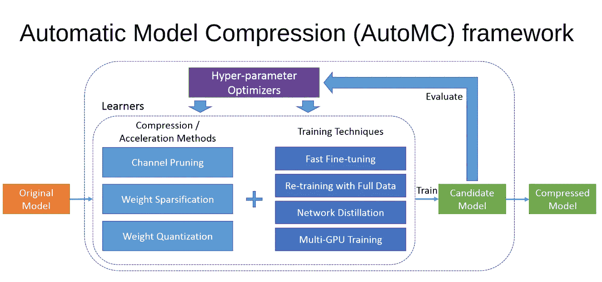

为了加快召回和简化深度 convnet 模型，可以使用 [AutoMC 开源框架 PocketFlow。](https://github.com/Tencent/PocketFlow)

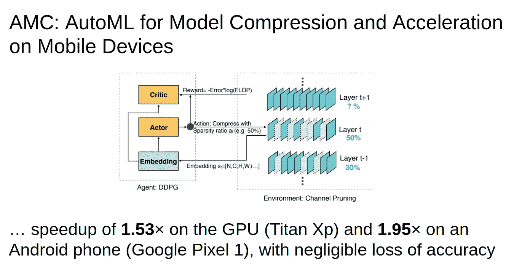

在向移动设备或嵌入式系统部署精确模型时，AutoMC 或 AMC 变得越来越有用。[报道](http://openaccess.thecvf.com/content_ECCV_2018/papers/Yihui_He_AMC_Automated_Model_ECCV_2018_paper.pdf)加速效果相当可观。

## 深度 AutoML 框架

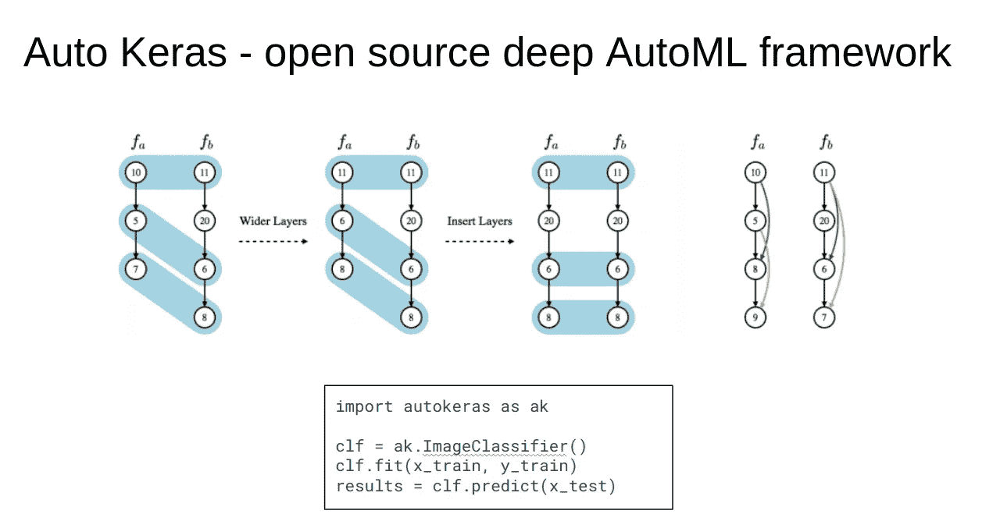

[Auto Keras](https://autokeras.com/) 使用[网络态射](https://arxiv.org/pdf/1806.10282.pdf)使贝叶斯优化更加高效。架构空间中的编辑距离(在架构之间遍历所需的更改数量)被用作相似性代理。正如您所看到的，用法非常简单，显然不需要手动指定参数。

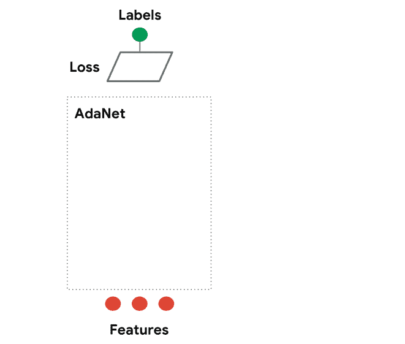

[AdaNet](https://github.com/tensorflow/adanet) 开源 AutoML 框架工作在 tensorflow 之上。关于用于搜索架构空间的进化技术的详细描述，你可以参考[谷歌人工智能博客](https://ai.googleblog.com/2018/10/introducing-adanet-fast-and-flexible.html)。

# 通用自动语言

我们已经调查了 AutoML 深度学习方法，但这只是你可以在预测建模中找到的 AutoML 技术的一个类别。一般来说，AutoML 方法在以下领域最有效，优化预测模型的性能和/或速度。也有许多其他标准可以考虑，如预测模型的可解释性，但 AutoML 优化这些标准的能力仍处于起步阶段。

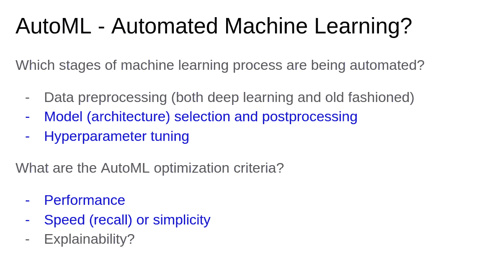

预测建模的数据预处理通常需要以更传统和过时的方式来执行，因为 convnets 只适用于某些数据源(图像、文本、语音..).除了神经网络之外，还有许多预测建模方法。这些方法通常有很多超参数。下面讨论为这个领域开发的 AutoML 技术。

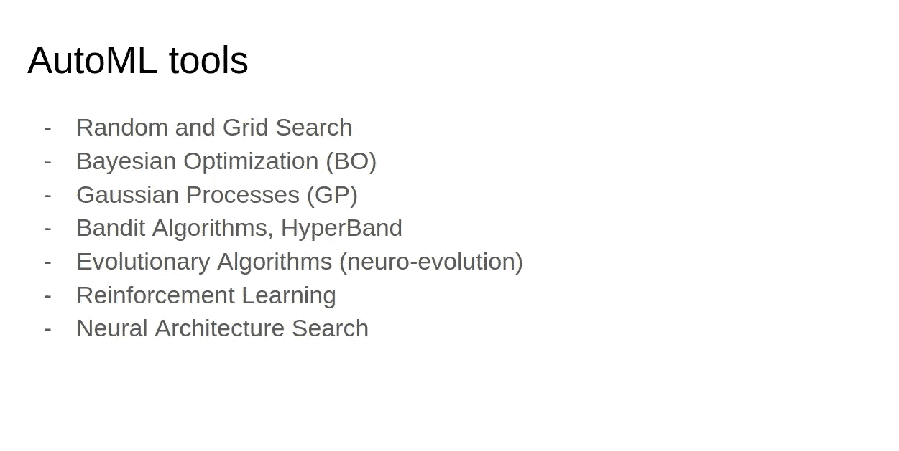

首先，看看可以在 AutoML 搜索中使用的一些通用工具。随机搜索的效率惊人地高，因此非常受欢迎。这主要是因为很难搜索建筑空间，因为它通常由相互依赖的连续和离散维度组成。

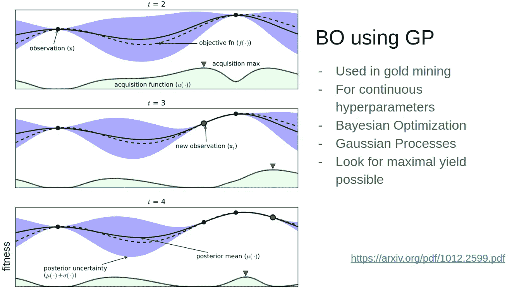

更有趣的技术之一是使用高斯过程的[贝叶斯优化](https://arxiv.org/pdf/1012.2599.pdf)。让我们假设你只有一个连续的超参数。你探索潜力最大的区域(上限)。

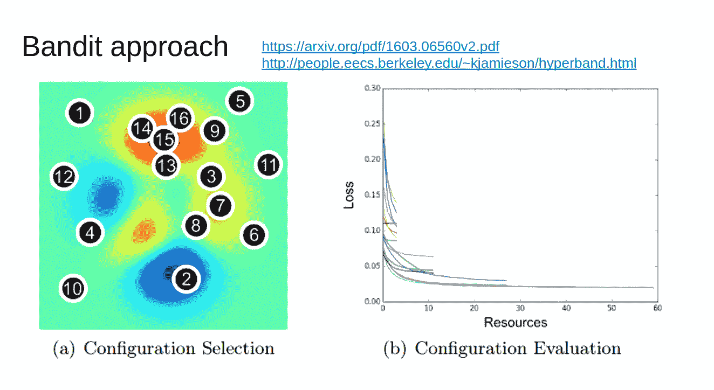

另一个有趣的技术是[超高频带](http://people.eecs.berkeley.edu/~kjamieson/hyperband.html)。这是土匪启发的方法，同时学习和评估几个架构，并杀死其中一半的时间。它有助于将计算资源[以指数方式分配给最有前途的架构](https://arxiv.org/pdf/1603.06560v2.pdf)。缺点是你可能会扼杀那些需要更多时间来优化的伟大架构。

# 数据挖掘的 AutoML 框架

在这里，我们介绍一些最流行的 AutoML 框架，用于更传统的预测模型，通常包括数据预处理。

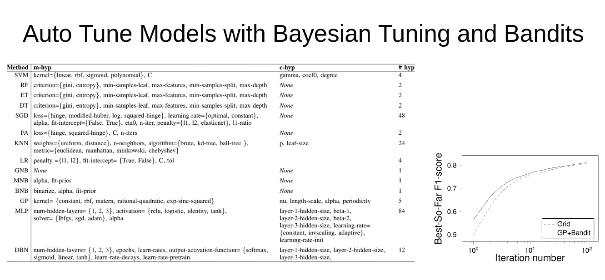

[ATM 开源框架](https://github.com/HDI-Project/ATM)使用[贝叶斯优化、GP 和土匪](https://www.youtube.com/watch?v=vz3D36VXefI)来[优化预测模型的超参数](https://cyphe.rs/static/atm.pdf)进行数据挖掘。

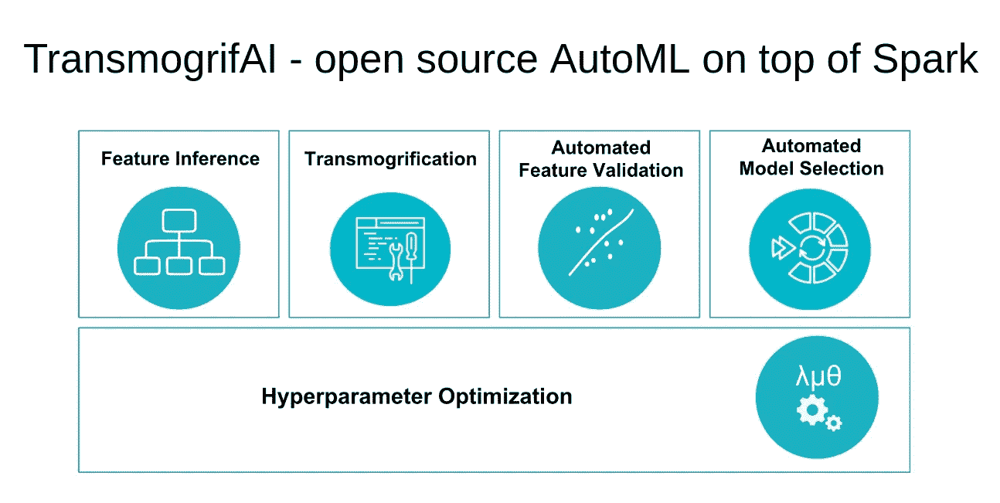

[TransmogrifAI](https://github.com/salesforce/TransmogrifAI) 还优化了数据准备阶段(如数据预测)。

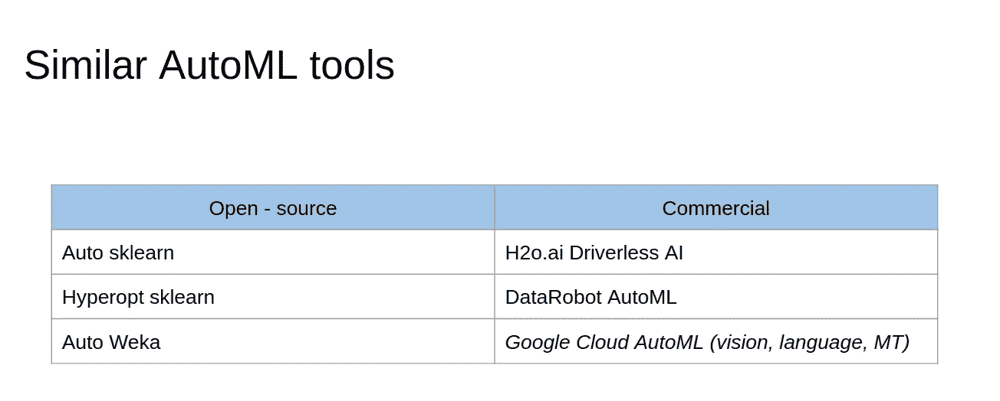

类似的工具还有很多，既有开源的(auto sklearn，hyperopt sklearn，auto weka)，也有商用的(h2o 无人驾驶，datarobot automl)。注意 Google Cloud AutoML 还没有提供类似的工具。提供的服务面向深度学习模型优化。

# 高级自动化方法

除了简单的超参数优化(甚至使用高级试探法)，还有许多有趣的方法可以在微观和宏观层面处理架构选择。

## 神经结构搜索

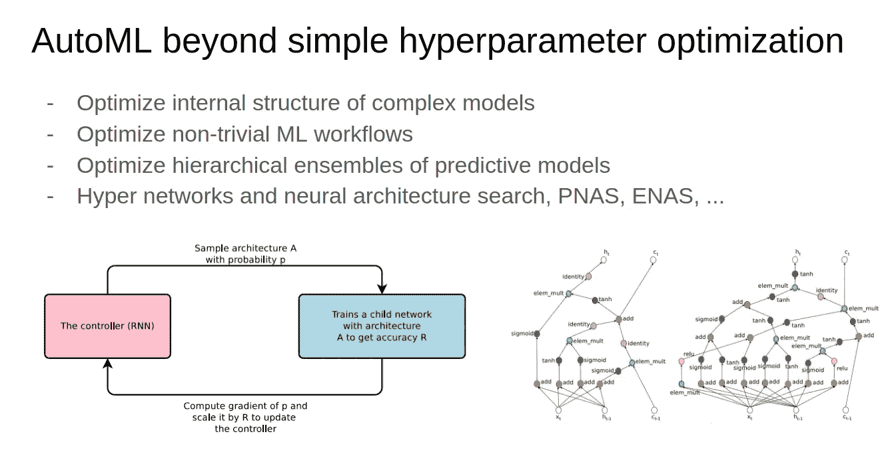

[神经架构搜索](https://en.wikipedia.org/wiki/Neural_architecture_search)是那些更高级的问题之一。可以参考 [NAS blogpost](/everything-you-need-to-know-about-automl-and-neural-architecture-search-8db1863682bf) 了解基本变种。

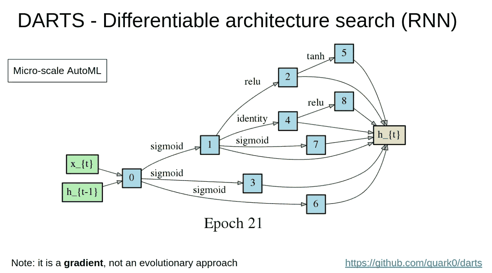

NAS 的一个巧妙方法是将架构选择映射到概率空间，并使用反向投影结合权重来优化架构，如[飞镖](https://github.com/quark0/darts)所示。

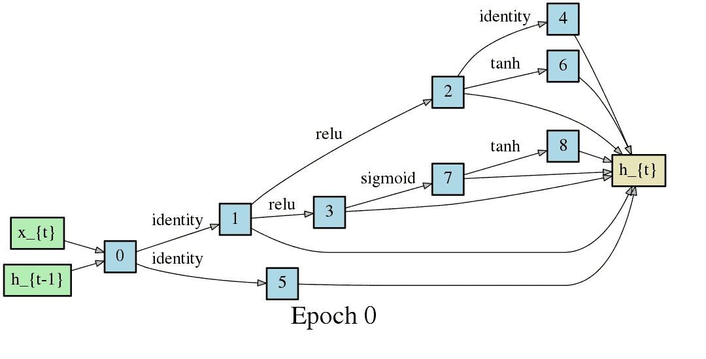

By using DARTS, you can optimize structure of recurrent neurons, but also structure of feedforward network.

另一种方法是将建筑映射到一个连续的空间，然后返回，例如 LSTM。

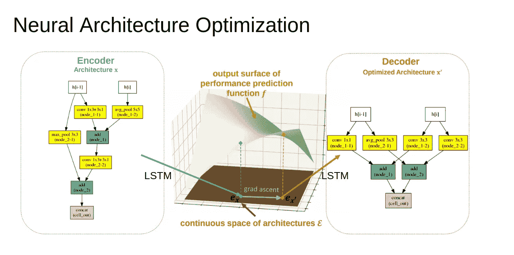

您可以在连续空间中执行梯度搜索，如 [NAO](https://arxiv.org/pdf/1808.07233.pdf) 所示。

## 搜索预测集合

在过去的二十年里，我一直试图找到有效的算法来搜索包括复杂集成在内的预测模型的架构。

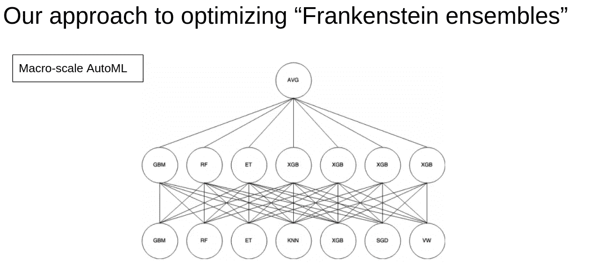

这样的组合经常赢得卡格尔比赛，并被戏称为弗兰肯斯坦组合。

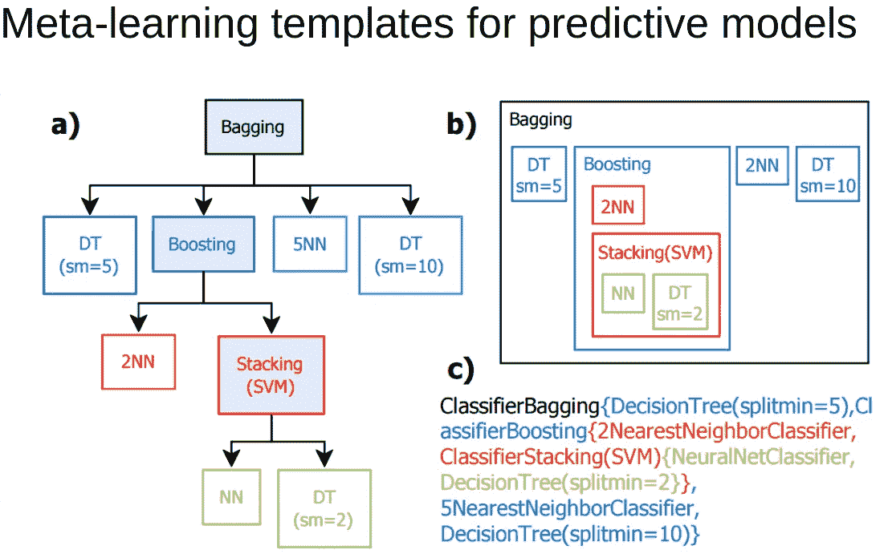

正如我们在[机器学习杂志文章](https://www.researchgate.net/publication/321987431_Discovering_predictive_ensembles_for_transfer_learning_and_meta-learning)中解释的那样，元学习模板形式化了分层预测集成。

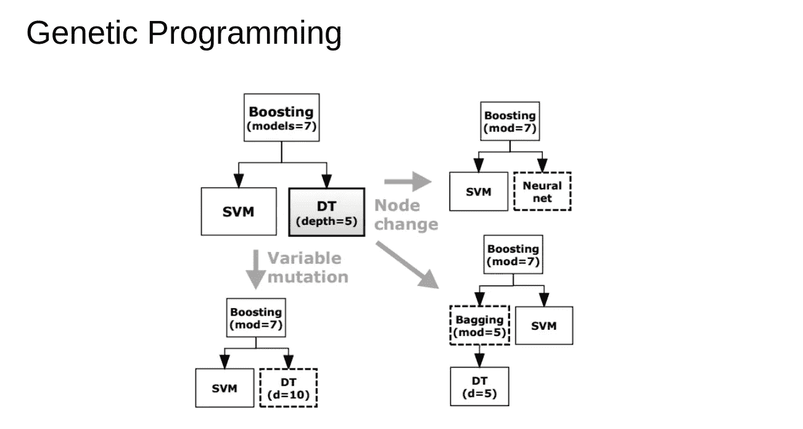

您可以使用进化算法(GP)来搜索架构。

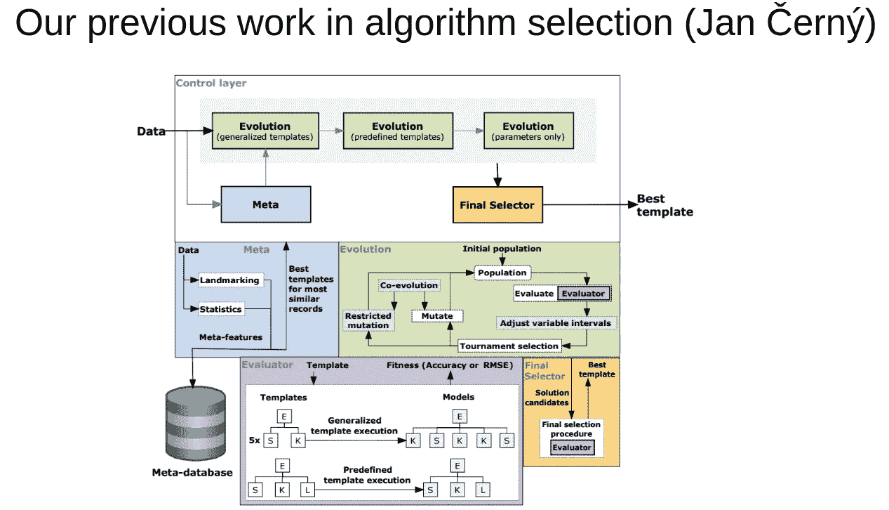

搜索代表良好执行的预测集合的好模板是相当复杂的任务。

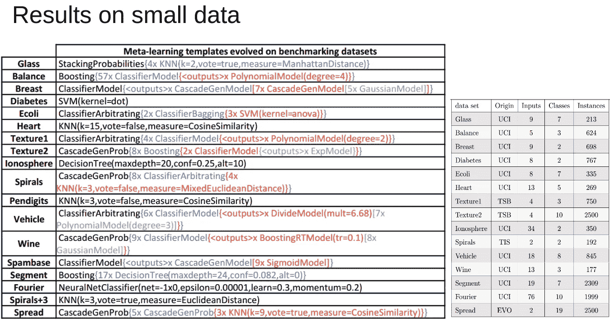

我们展示了 UCI 数据库中几个数据集的获奖架构。请注意，对于某些数据集，简单模型比复杂的分层集成更合适(集成并不更好，因此最好选择简单的预测模型)。

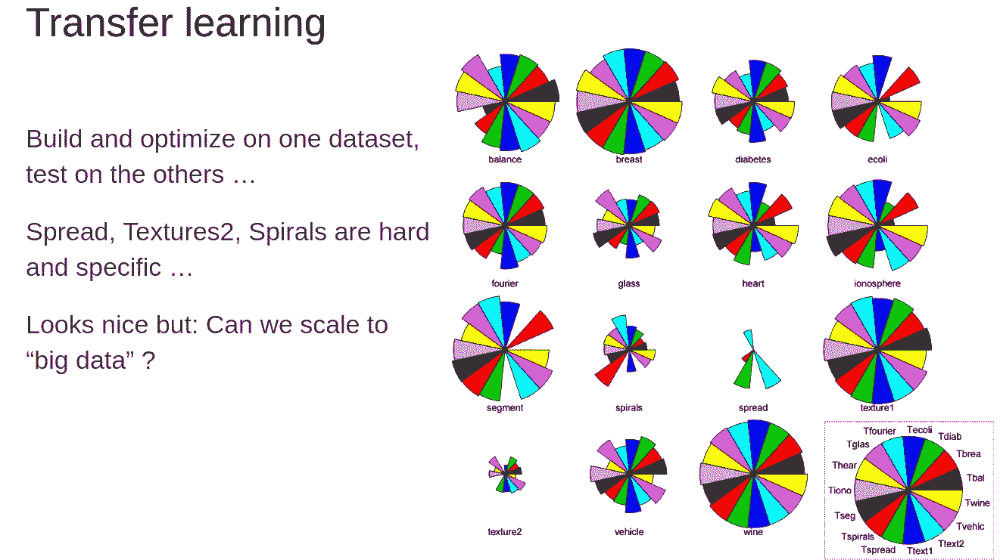

您可以在一个数据集上开发预测模型的体系结构，并在另一个数据集上对其进行评估。请注意，来自 UCI 的一些数据集非常琐碎(乳房、葡萄酒)，以至于您使用什么进行预测建模都无关紧要。

当我们试图应用我们的进化 AutoML 框架来显示最大流失预测数据集时，它的可扩展性不够。

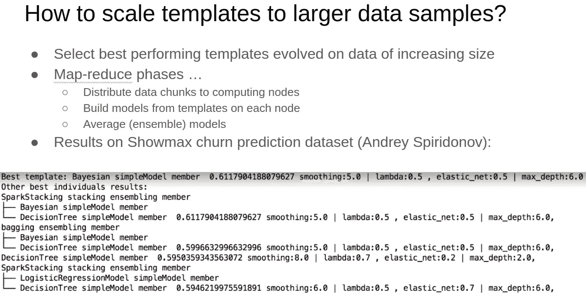

因此，我们在 Apache Spark 上重新实现了分布式数据处理的框架。我们正在 AutoML 过程中尝试新的有趣的概念和特性。

1.  逐渐增加的数据量被用于评估模板和选择跨演进的潜在客户
2.  我们能够从基本模型的群体开始，随着时间(代)增加模板的复杂性
3.  考虑到用户预先定义的时间量(随时学习)，流程被划分为多个阶段
4.  各种各样的方法被用来保持群体间的多样性，以及在个体模板的突变过程中
5.  我们执行多重协同进化(当前版本中的模板和超参数)。我们能够在模板群体中共享超参数。

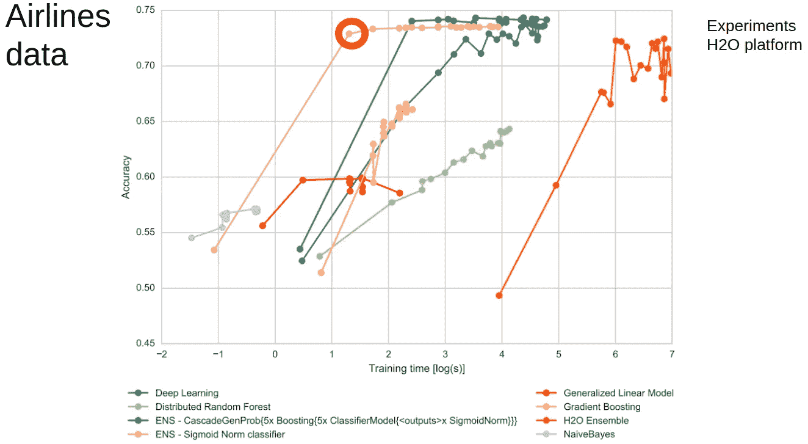

航空公司数据的结果表明，我们可以开发出预测模型，这些模型可以在相同精度的深度学习模型所需的时间内进行训练和回忆。

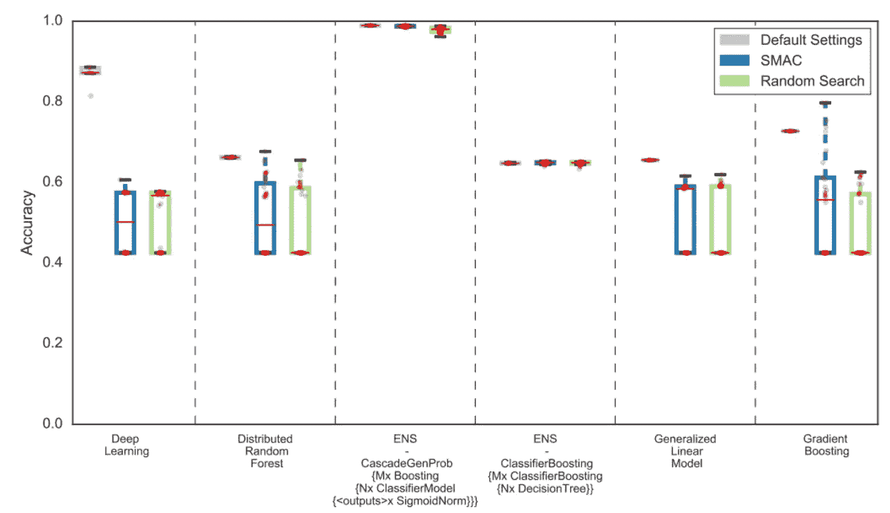

这些简单的预测模板对超参数调整不敏感，并且在这项任务中表现一贯良好。当然，你可以找到许多其他的任务，在那里你需要不同的基本方法，而不是我们到目前为止已经实现的方法，因此我们正在扩展这个组合。

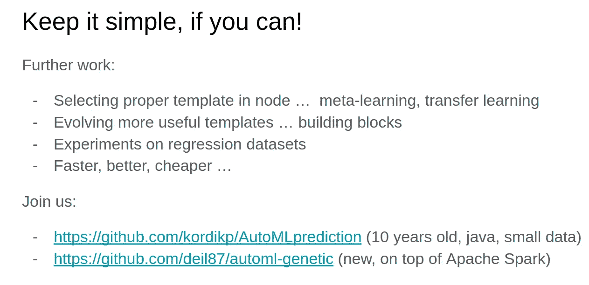

[加入我们](mailto:datalab@fit.cvut.cz)并为[项目](https://github.com/deil87/automl-genetic)做出贡献。

# 其他自动域

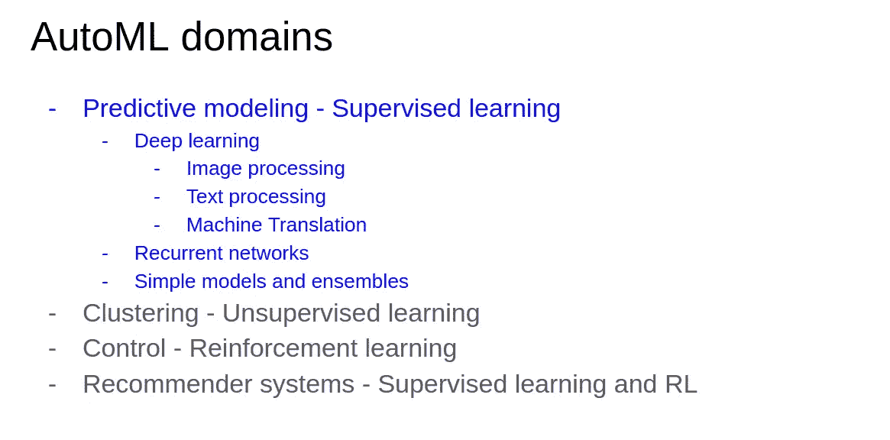

AutoML 可以应用于聚类，但难度要大得多。

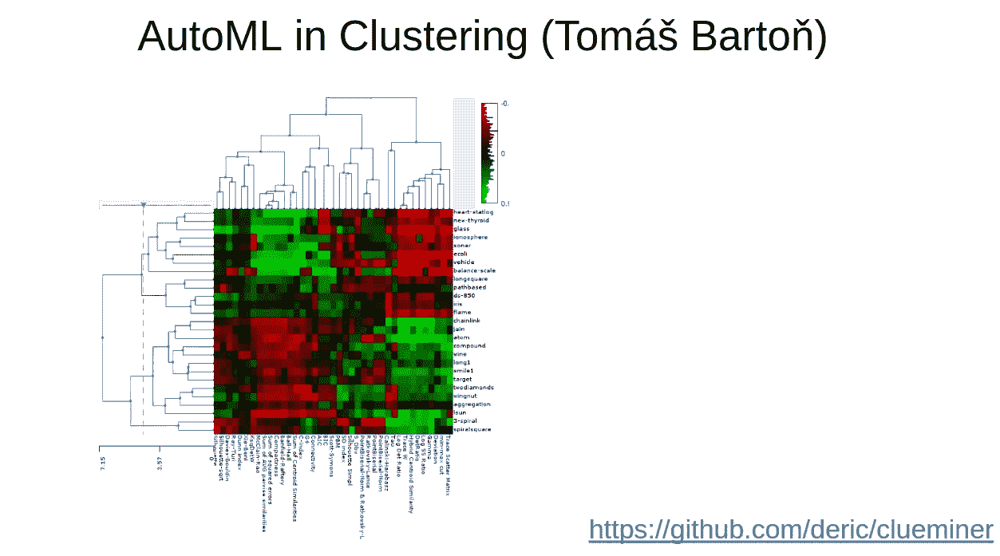

可以增加聚类算法的健壮性，并添加一些自动功能，如[自动切断](https://dl.acm.org/citation.cfm?id=3299876)。由于聚类的无监督性质，聚类集成的自动建模是困难的。你可以加入我们在这个[开源项目](https://github.com/deric/clueminer)中的努力。

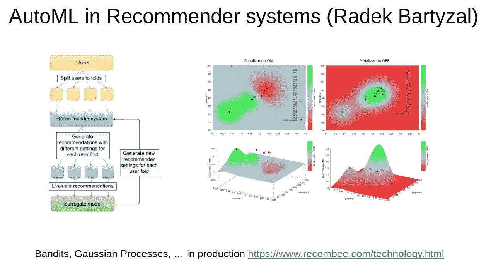

在[推荐系统](https://medium.com/recombee-blog/machine-learning-for-recommender-systems-part-1-algorithms-evaluation-and-cold-start-6f696683d0ed)中，AutoML 可以优化 recsys 集成和超参数的结构。我们在[recombe](https://www.recombee.com/technology.html)中结合了 bottom、GP 和其他方法，成功实现了一个大规模的在线生产自动化系统。

帮我们做[布拉格 AI superhub](https://prg.ai/en/) 。