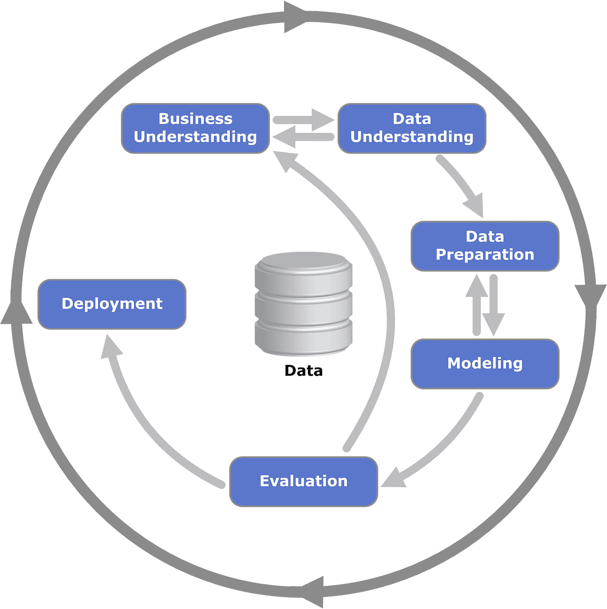
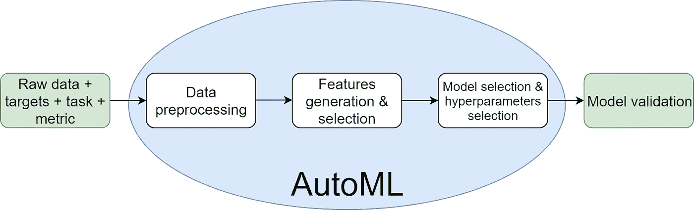
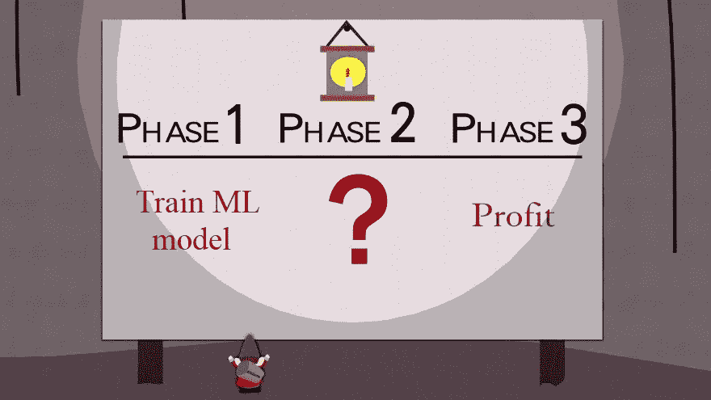
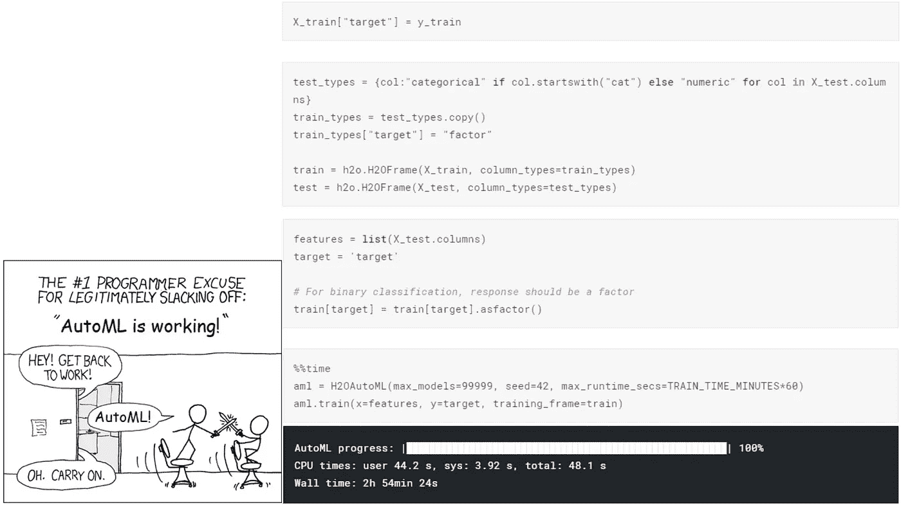
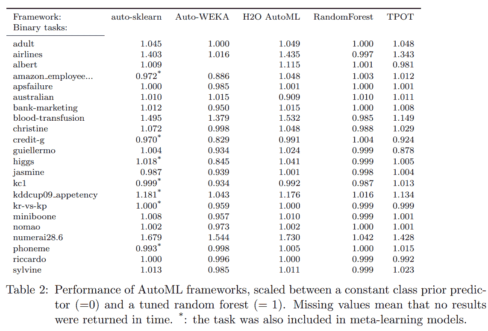
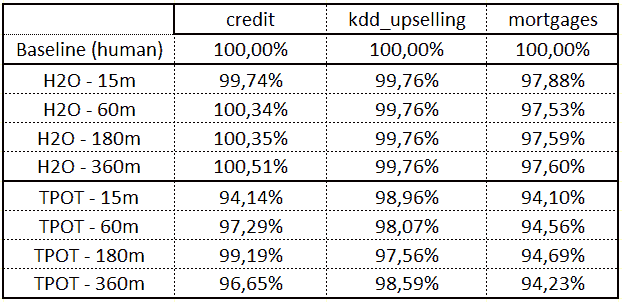
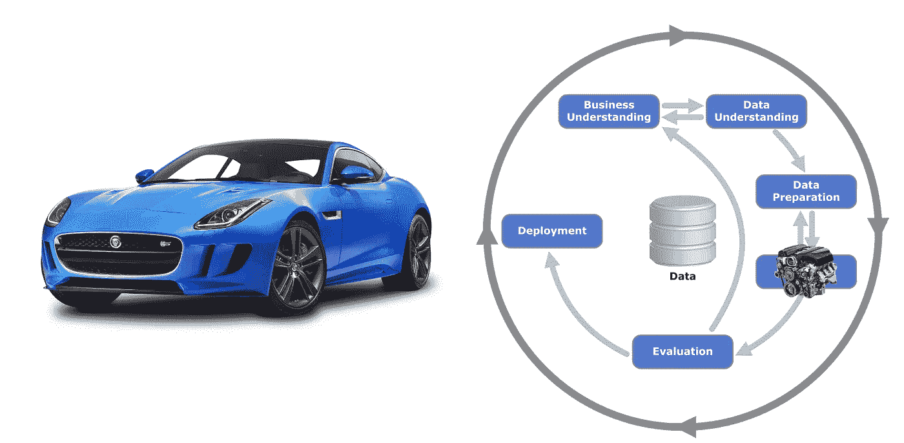

# AutoML 被夸大了

> 原文：<https://towardsdatascience.com/automl-is-overhyped-1b5511ded65f?source=collection_archive---------4----------------------->


Tom and Jerry, 70 Episode — Push-Button Kitty (1952)

我在工作中使用 AutoML，在一些 ML 比赛中与我的主要模型融合，并参加了两次 AutoML 比赛。我认为 AutoML 作为一个自动化建模过程的想法是非常好的，但是这个领域被过分夸大了。一些关键概念，如功能工程或超参数优化的元学习，将释放其潜力，但目前来看，boxed AutoML 作为一种工具只是浪费金钱。

I’ve made a presentation on AutoML topic during Nordic Data Science ML Summit 2019

# 什么是 AutoML？

## 数据科学项目

任何数据科学项目都包括几个基本步骤:从业务角度制定问题(选择任务和成功的衡量标准)，收集数据(收集、清理、探索)，构建模型并评估其性能，在生产中部署模型并观察模型在生产中的性能。



Cross-industry standard process for data mining

过程的每个部分对项目的成功都至关重要。然而，从机器学习专家的角度来看，建模部分是必不可少的，因为开发良好的 ML 模型可能会给公司带来很多价值。

在建模阶段，数据科学家解决优化任务:对于给定的数据集，目标-最大化选定的指标。这个过程很复杂，需要不同类型的技能:

1.  特征工程有时被视为艺术，而不是科学；
2.  超参数优化需要深入理解算法和核心 ML 概念；
3.  需要软件工程技能来使输出代码易于理解和部署。

AutoML 旨在帮助我们。


ML modeling is like an art, a science, and software engineering at the same time

## AutoML

AutoML 的输入是数据和任务(分类、回归、推荐等)。)，输出-生产就绪模型，能够预测看不见的数据。数据驱动管道中的每个决策都是一个超参数。AutoML 的想法就是找到这样的超参数，它可以在合理的时间内给出一个好的分数。

*   AutoML 选择了一个预处理数据的策略:如何处理不平衡数据；如何填充缺失值；移除、替换或保留异常值；如何对类别和多类别列进行编码；如何避免目标泄露；如何防止记忆错误；等等。
*   AutoML 生成新的特征并选择有意义的特征；
*   AutoML 选择模型(线性模型、K 近邻、梯度推进、神经网络等。);
*   自动调整所选模型超参数(例如，基于树的模型或架构的树和子采样的数量，神经网络的学习速率和时期数量)；
*   AutoML 制作了一个稳定的模型集合，如果可能的话，可以增加分数。



# 汽车的动机

## AutoML 将填补数据科学市场中“供应”和“需求”之间的缺口

现在更多的公司要么开始收集数据，要么希望实现所收集数据的潜力:他们希望从中获得价值。另一方面，没有太多具备合适背景的数据科学家来满足需求，因此出现了缺口。AutoML 有可能填补这一空白。

但是盒装解决方案能给公司带来任何价值吗？在我看来，答案是“不”

这些公司需要一个*流程*，但 AutoML 只是一个*工具*。先进的工具无法填补战略的缺失。在开始使用 AutoML 之前，考虑一个咨询公司的项目，它可以帮助您首先制定一个数据科学战略。大多数 AutoML 解决方案提供商都在做咨询，这并不是巧合。就像在这里迈出了第一步。



Doesn’t seem like a good plan, huh? (“South Park”, s2e17)

## AutoML 将节省数据科学团队的时间

根据 [2018 Kaggle ML 和数据科学调查](https://www.kaggle.com/headsortails/what-we-do-in-the-kernels-a-kaggle-survey-story)一个典型的数据科学项目有 15–26%的时间用于建立模型或选择模型。就“工时”和计算时间而言，这是一项艰巨的任务。如果目标或数据发生变化(例如，将添加新功能)，则应重复该过程。AutoML 可以帮助公司内的数据科学家节省时间，并将时间更多地花在更重要的事情上(比如在椅子上斗剑)。



Only a few lines of code is needed to start using AutoML

然而，如果数据科学团队的建模部分不是最关键的任务，那么您公司的流程中就有明显的问题。通常，即使模型性能的微小提高也可能为您的公司赚取大量金钱，在这种情况下，建模时间是值得的:

```
Oversimplified rules:if (Gain from model > Costs of DS team time) → Time savings are not needed.
if (Gain from model <= Costs of DS team time) → Are you solving the right problem? 🤔
```

为您的 DS 团队的日常任务编写脚本并在将来节省时间，而不是使用盒装解决方案，这是一个好主意。我已经为日常任务的自动化编写了几个脚本:自动特征生成、特征选择、模型训练和超参数调整，我现在每天都在使用。

## AutoML 胜过一般的数据科学家

不幸的是，我们没有任何有用的基准“表格 AutoML 对比人类”，除了“[一个开源的 AutoML 基准](https://arxiv.org/abs/1907.00909)”。论文作者将几个 AutoML 库的性能与一个调优随机森林的性能进行了比较。它在几个月前发表，在 2019 年 7 月 1 日。



我很好奇，并决定做我的基准。我将我的性能与 AutoML 解决方案在三个二元分类数据集上的性能进行了比较:[信贷](https://www.kaggle.com/c/home-credit-default-risk/data)、 [KDD 追加销售](https://www.kdd.org/kdd-cup/view/kdd-cup-2009/Data)和[抵押贷款](https://www.crowdanalytix.com/contests/propensity-to-fund-mortgages)。我在训练中分割数据集(随机 60%的数据，按目标分层)和测试部分(剩余 40%的数据)。

我的基线解决方案相对简单。我没有钻研数据，也没有创造任何高级功能:

1.  5 层折叠；
2.  Catboost 编码器用于分类列(如果您不熟悉 CatBoost 编码器，可以查看我以前的帖子:[基准分类编码器](/benchmarking-categorical-encoders-9c322bd77ee8))；
3.  数字列对的数学运算(+-*/)。新功能限制:500；
4.  模型:带有默认参数的 LightGBM
5.  混合排序的预测。

我为 AutoML 使用了两个标准库: [H2O](https://github.com/h2oai/h2o-3) 和 [TPOT](https://github.com/EpistasisLab/tpot) 。我分几个时间段训练他们:从 15 分钟到 6 小时。根据以下指标，我得到了令人惊讶的结果:

```
Score = (ROC AUC / ROC AUC of my baseline) * 100%
```



首先，几乎在所有情况下，我的基线都超过了 AutoML。我有点难过，因为我已经计划在办公室里放松一下，而 AutoML 正在做所有的脏活，但无论如何😒

其次，AutoML 的分数并没有随着时间的推移而提高，这意味着我们等待多长时间并不重要:它在 15 分钟内的分数和在 6 小时内的分数一样低。

AutoML 不是关于高分的。

UPD 16.10.2019:我想补充一点，我的基准并不是“人类 vs AutoML”比赛的最终点。我们显然需要更多关于度量的讨论(应该只是分数吗？分数+时间？元学习期间的 CO2 排放量等)以及不同数据集和任务的更多基准。

# 摘要

1.  如果你的公司想玩弄它的数据，第一次，考虑雇佣一个顾问。
2.  你应该尽可能使你的工作自动化…
3.  …然而，由于得分相对较低，盒装解决方案似乎不是正确的选择。

# PS:发动机不是汽车



在这篇文章中，我谈到了工具，但是重要的是要记住建模部分是整个数据科学项目管道的一部分。我喜欢这个比喻，其中项目被视为一辆汽车。这样一来，建模部分的输出——机器学习模型——就是一个引擎。

发动机，毫无疑问，是必不可少的，但不是整车。你可能会花很多时间来设计令人难以置信的、深思熟虑的和复杂的功能，选择你的神经网络的架构或调整随机森林的参数，从而创建强大的引擎。但是如果你没有注意到你汽车的其他部分，你所有的工作可能都是无用的。

模型本身可能会显示高分，但它不会被使用，因为您正在解决错误的问题(业务理解)，或者数据有偏差，您必须重新训练它(数据探索)，或者模型太复杂，所以它不能在生产中使用(部署阶段)。

最后，你可能会发现自己处于一个愚蠢的境地:经过几天或几周的艰苦建模工作，你正在驾驶一辆缓慢而健壮的自行车，车筐里装着跑车发动机。

工具必不可少；策略至关重要。

