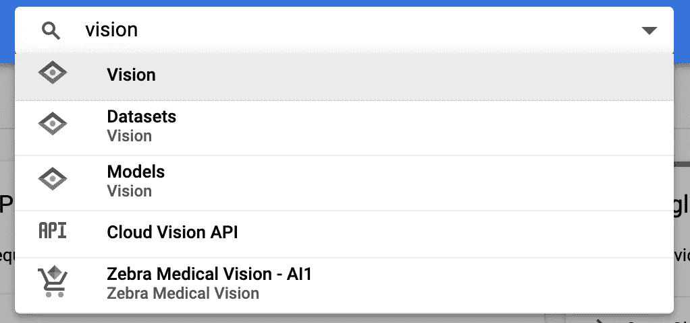
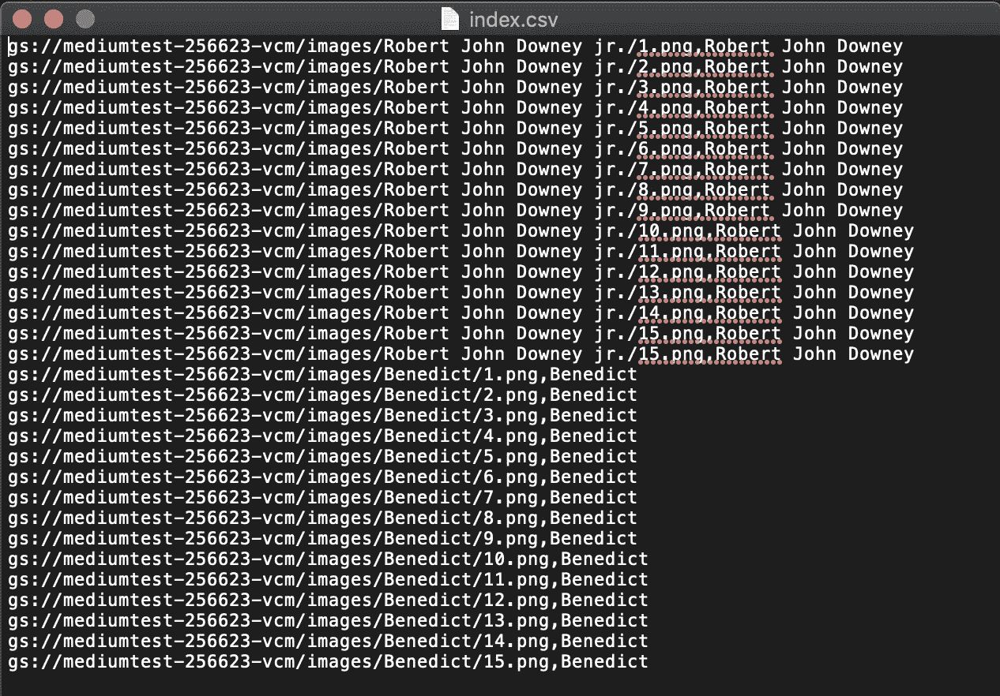

# AutoML Vision —如何训练您的模型？

> 原文：<https://towardsdatascience.com/automl-vision-how-to-train-your-model-c7e887051453?source=collection_archive---------11----------------------->

## 从头开始，训练自己的模型。


image from [https://gigazine.net/gsc_news/en/20180118-google-cloud-automl-vision](https://gigazine.net/gsc_news/en/20180118-google-cloud-automl-vision)

在之前的文章中，我们已经学习了如何在我们的 Python 项目中使用 Vision API。感谢谷歌，他们帮助训练这些 API，直接使用它们非常快速和方便。但是，如果我们需要用我们的数据训练一个新的模型，我们该如何实现呢？**拯救我们生命的汽车视觉来了。**

在进入 AutoML 之前，我想澄清一下 Cloud ML Engine、AutoML 和 ML API 之间的区别。


image from [https://blog.gcp.expert/cloud-automl-vision-application-1/](https://blog.gcp.expert/cloud-automl-vision-application-1/)

**ML API** 通过谷歌训练的模型提供 API 服务，我们可以使用这些 API 而不用担心任何人工智能部分。它包含许多 API，如[云语音 API](https://cloud.google.com/speech-to-text/) 、[云自然语言 API](https://cloud.google.com/natural-language/) 、[云翻译 API](https://cloud.google.com/translate/)
[云视觉 API](/ml-study-jam-detect-labels-faces-and-landmarks-in-images-with-the-cloud-vision-api-a80e89feb66f) 、[云视频智能 API](https://cloud.google.com/video-intelligence/?utm_campaign=japac-TW-all-en-dr-skws-all-all-trial-e-dr-1003987&utm_term=KW_cloud+video+intelligence+api&gclid=CjwKCAjwo9rtBRAdEiwA_WXcFlFkEVB8WrGg1NwtDlLTBpKsW5Os-LOe4EtoXdHitTWNRRTh1klXhRoC0egQAvD_BwE&utm_content=text-ad-none-none-DEV_c-CRE_278324358714-ADGP_Hybrid+%7C+AW+SEM+%7C+SKWS+%7E+T1+%7C+EXA+%7C+ML+%7C+M%3A1+%7C+TW+%7C+en+%7C+Video+%7C+api-KWID_43700024603633844-kwd-350028922693&utm_source=google&utm_medium=cpc) 、[云作业 API](https://cloud.google.com/solutions/talent-solution/) 。

[**AutoML**](https://cloud.google.com/automl/) 允许我们用我们的数据训练我们的定制模型**。它使用 NAS(神经架构搜索)来找到训练我们模型的最佳方法。我们唯一需要做的就是收集数据，提高模型的准确性。稍后我会详细介绍。**

最后一个是[T5 云 ML 引擎 。显然我们自己做所有的事情，包括建立一个预测模型，调整和训练它，以及其他非常复杂的事情。这是一个高度定制的引擎，如果你熟悉一些流行的框架，比如 Tensorflow，你可以试试。](https://cloud.google.com/ml-engine/)

好了，让我们开始今天的主题，训练我们的 AutoML 模型。
这是官方的 AutoML Vision API 教程链接。如果你喜欢使用命令行而不是 GUI，你可以考虑遵循这个指南。

 [## AutoML Vision API 教程|云 AutoML Vision |谷歌云

### 本教程演示了如何创建一个新的模型与您自己的一套训练图像，评估结果和…

cloud.google.com](https://cloud.google.com/vision/automl/docs/tutorial) 

以下内容分享如何一步一步用 AutoML 建立你的模型。

# 步骤概述

1.  配置您的项目环境。
2.  下载用于培训的图像。
3.  设置图像分类。
4.  创建 index.csv 并上传到 bucket。
5.  创建数据集并导入 index.csv。
6.  训练模型。
7.  用模型预测。
8.  用 Restful API 和 Python 请求 API。

# 第一步。配置您的项目环境。

1.  在 GCP 控制台中选择或创建一个项目。
2.  为您的项目启用计费。[了解如何启用计费](https://cloud.google.com/billing/docs/how-to/modify-project)。
3.  [创建服务账户并下载密钥文件](https://cloud.google.com/iam/docs/creating-managing-service-accounts#creating_a_service_account)。

## 一件重要的事情是，您需要为这个服务帐户选择角色`AutoML Editor`。


4.将环境变量`GOOGLE_APPLICATION_CREDENTIALS`设置为密钥文件。

更多详情，请参考[上一篇](/tutorial-google-vision-api-with-python-and-heroku-3b8d3ff5f6ef)。

# 第二步。下载用于培训的图像。

在训练模型之前，我们需要为它准备一些数据。收集它们的最快方法是从谷歌搜索下载。(也可以用自己准备好的数据)。

这里有一个非常棒的开源软件可以帮助你快速下载图片。

[](https://github.com/hardikvasa/google-images-download) [## hardikvasa/Google-图片-下载

### 用于“搜索”和“下载”数百张谷歌图片到本地硬盘的 Python 脚本！这个程序让你…

github.com](https://github.com/hardikvasa/google-images-download) 

我们将创建一个**。csv 文件**来列出图像的路径，所以通过用数字像`1.png` `2.png` …
来重命名图像文件会更容易处理它，因为我们没有可以用来实现它的参数，我创建了另一个分支来破解这个东西。

 [## mutant 0113/Google-图片-下载

### 用于“搜索”和“下载”数百张谷歌图片到本地硬盘的 Python 脚本！这个程序让你…

github.com](https://github.com/mutant0113/google-images-download/tree/name_the_images_by_numbers) 

下载它，然后使用关键字和限制参数运行下面的[命令。](https://google-images-download.readthedocs.io/en/latest/arguments.html)

```
python3 [path/to/googleimagesdownload.py] -k [keyword] -o [path/to/download/folder] -l [total download number] -f [image format] -t [image type]For example:
python3 ~/Documents/Github/google-images-download/google_images_download.py -k "Robert John Downey jr." -o 'images/' -l 100 -f png -t face
```

结果将是这样的:


然后**手动检查并过滤错误的图像**，因为有时可能会提取其他不相关的照片。

# 第三步。设置图像分类。

1.  搜索`Vision`。



2.在左侧菜单中选择`Databoard`，首先启用视觉 API。


3.选择`Image Classification -> Get started`。


4.启用计费并启用所需的 API 和修改权限。


点击`SET UP NOW`启用所需的权限。一个新的`bucket`将自动生成。

5.搜索`bucket`，点击`Storage`。


6.选择铲斗`your-project-name-vcm`。


7.选择`Upload folder`并上传用于训练的图像。


# 第四步。创建 index.csv 并上传到 bucket。

现在我们有了一桶图像。[下一步是给每张图片贴上标签，并把它们分成不同的用途——**训练**、**验证**和**测试**](https://cloud.google.com/vision/automl/docs/prepare) 。你可以自己定义或者让 Google 帮你把它们分成 **80 %用于训练，10 %用于测试，10%用于验证。**


index.csv 的内容如下所示:



然后也上传到桶中。


# 第五步。创建数据集并导入 index.csv。

1.  搜索`datasets`。


2.点击`NEW DATASET`。


3.命名数据集并选择`Single-Label Classification`。然后点击`CREATE DATASET`。


4.导入`index.csv`。


5.结果显示我们所有的图像都被标记。


# 第六步。训练模型。

1.开始训练模型。基本上你给的训练小时越多，准确率就越高。但是文档也告诉我们，如果模型停止改进，训练就会停止。记得点击`Deploy model to 1 node after training`。


2.等待 2 个小时的结果。


# 第七步。用模型预测。

点击`UPLOAD IMAGES`并上传图片，对您的模型进行快速测试。


它就像一个魔咒！


# 第八步。用 Restful API 和 Python 请求 API。

最后，我们可以使用 **Restful API** 或 **Python** 代码将模型集成到您的项目中。


在执行 Python 文件之前安装库`google-cloud-automl`。

```
pip3 install google-cloud-automl
```

运行命令行

```
python3 [your/local/image/path] [project_id] [model_id]
```

如果您收到权限被拒绝的消息，[请返回步骤 1，检查角色是否被正确启用。](https://medium.com/p/c7e887051453#20f2)

```
google.api_core.exceptions.PermissionDenied: 403 The caller does not have permission
```

API 结果:

```
payload {annotation_spec_id: "6728223911663632384"classification {score: 0.9954891800880432}display_name: "Benedict"}
```

今天到此为止。AutoML Vision 的完整教程真的是任重道远，尤其是环境建设。但是一旦你完成了这些步骤，你的下一个模型就容易多了。

享受你的模型，别忘了看看谷歌如何在`Reference links`中收费。希望帖子对你有帮助。如果你有任何问题或建议，请在下面留下评论。感谢阅读。👍

# 参考

 [## 格式化训练数据 CSV |云自动视觉对象检测|谷歌云

### 在准备了具有足够代表性的训练数据并将这些图像上传到 Google 云存储之后…

cloud.google.com](https://cloud.google.com/vision/automl/object-detection/docs/csv-format) 

了解 AutoML Vision 的使用价格。

[](https://cloud.google.com/vision/automl/pricing?_ga=2.103053760.-1976265311.1558404420&_gac=1.115807348.1571290023.Cj0KCQjw_5rtBRDxARIsAJfxvYCSejFli2i99QgkRrWpdfwkhM51S5aiLSPX6QTXh5yjuZV_L6xtEZsaAnOCEALw_wcB) [## 定价|云自动视觉|谷歌云

### Beta 本产品处于预发布状态，可能会有变化或支持有限。有关更多信息，请参见…

cloud.google.com](https://cloud.google.com/vision/automl/pricing?_ga=2.103053760.-1976265311.1558404420&_gac=1.115807348.1571290023.Cj0KCQjw_5rtBRDxARIsAJfxvYCSejFli2i99QgkRrWpdfwkhM51S5aiLSPX6QTXh5yjuZV_L6xtEZsaAnOCEALw_wcB) 

本文档包含有关 AutoML Vision 使用的当前限制和使用配额。

 [## 配额和限制|谷歌云

### Beta 本产品处于预发布状态，可能会有变化或支持有限。有关更多信息，请参见…

cloud.google.com](https://cloud.google.com/vision/automl/quotas)