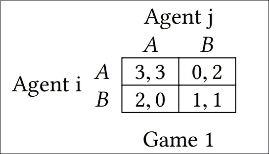
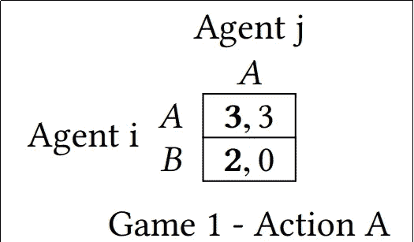
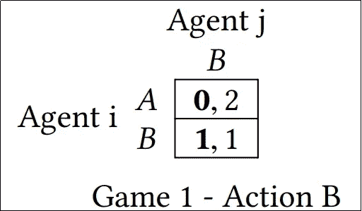

# 自主代理和多代理系统 101:代理和欺骗

> 原文：<https://towardsdatascience.com/autonomous-agents-and-multi-agent-systems-101-agents-and-deception-775025f09d7b?source=collection_archive---------23----------------------->

## 本文简要介绍了自主代理和多系统代理。此外，对代理使用的欺骗机制进行了展望。

Photo by [Debby Hudson](https://unsplash.com/@dhudson_creative?utm_source=medium&utm_medium=referral) on [Unsplash](https://unsplash.com?utm_source=medium&utm_medium=referral)

人类使用**欺骗机制来获得超越其他人类的优势**。一些最典型的机制是(1)，不分享他们的信念(2)，假装能够执行某些动作甚至假装不能执行某个动作。在**自治** **智能体和多智能体系统**中，行话，(1)对应隐藏的实用程序，(2)对应隐藏的动作，(3)对应诱骗动作。

有人可能会问，一个代理人如何利用欺骗来最大化自己的回报？一个特工也能使用欺骗手段吗？在合作环境中，代理人可以使用欺骗手段吗？

为了回答这些问题，我们首先引入一个**主体***【P . Maes，1993】*的概念:

一个(理性的)主体是一个试图在复杂环境中实现一组目标的系统，它从所有可能的行动中选择对自己具有最佳预期结果的行动(具有更大**效用**的行动)。为了应对环境的变迁，智能体需要具有自主性和适应性。在多代理场景中，代理可以竞争，它们之间的交互由游戏遭遇来描述。为了使效用最大化，效用函数根据不同选项对个人的效用对它们进行排序。合作的代理有相同的目标，可以一起工作来实现一个共同的目标。

Nice looking agent. Photo by [Alex Knight](https://unsplash.com/@agkdesign?utm_source=medium&utm_medium=referral) on [Unsplash](https://unsplash.com?utm_source=medium&utm_medium=referral)

事实上，我们的行为类似于代理人:理性的人希望通过选择最大化我们成功机会的行动来实现一组目标。至少有时候是这样。

为了形式化代理之间的交互，这通常是在欺骗发生时，让我们考虑**游戏和**游戏遭遇的概念:

游戏是一种竞争活动，玩家根据定义的规则(策略)相互竞争(互动)*【Wooldridge m .，Paterson S .，2002】*。玩家只能采取由环境定义的特定动作。假设代理同时选择一个动作来执行，他们动作的结果取决于动作的**组合。**然后，根据所有代理执行的一组累积动作，改变环境。这个事实产生了一个问题:如果所有的代理人都影响环境，如果所有的代理人都想最大化他们的效用，**他们应该如何行动？**适当行动的选择有一些相关问题，包括但不限于目标的性质(静态或动态)、可重用性、对导致紧急行为的行动的理解深度以及感知和行动之间的关系。博弈论研究以效用最大化为目标的理性主体之间的相互作用。代理人可以通过谈判来获得对双方都有利的地位。

在描绘代理人之间的游戏遭遇之前，让我们更深入地了解一下**欺骗**的概念:

人类在谈判时经常使用欺骗来提高成功的概率。在目标冲突的情况下，代理人有效谈判的能力与对手掌握的信息有关。让我们假设两个相互竞争的代理人相遇，他们有可能使用以下欺骗机制。隐藏的公用事业和三。诱饵行动。不完全信息下的代理间谈判可能出现欺骗技术，因为谈判通常假设代理值得信任，但情况并非总是如此【Zlotkin G .，Josenschein J .，1991】。由于代理共存并可能干扰所执行的动作的结果，因此存在合作的可能性，以互相帮助并以较低的总成本实现两个目标。

让我们假设一场游戏遭遇战发生了。游戏由*双矩阵 b* 表示，其中*智能体 i* 和*智能体 j* 的目标不同，分别为 *gi* 和 *gj，*。入口的值分别对应于*代理人 i* 和*代理人 j* 的让渡效用。两个代理人都想将世界从初始状态转变为满足其目标的状态。*代理 i* 是行播放器*代理 j* 是列播放器。两个玩家可以执行相同的行动，A 和 b。**欺骗技术可以用来最大化其中一个代理的整体效用。**游戏如下表所示:

让我们假设*代理人 i* 知道*代理人 j i* 将执行动作 a。结果产生:

在这种情况下，*代理 i* 也应该执行*动作 A* ，因为交付的效用最大。如果但如果*代理 j* 采取*行动 B* ，我们有:

因此，*代理 i* 也会选择*动作 B* ，因为 1 大于 0。*代理人 i* 的最优策略由*代理人 j* 的选择决定。如果*代理 j* 通知*代理 i* 他只能采取*动作 B* (隐藏动作)，这将导致*代理 i* 执行*动作 B* (因为 1 大于 0，因此该动作是提供最大效用的动作)。尽管如此，*代理 i* 可以执行*动作 A* ，为他产生效用二，为*代理 i* 产生效用零。

隐藏的效用机制被不想分享它的效用的代理人使用。如果一个代理不共享它与每个动作相关的效用，那么另一个代理将会只根据它的效用来选择动作(至少最初是这样)。这样的决定会导致次优选项，例如，当*代理 j* 选择*动作 A* 而*代理 i* 选择*动作 B* 时。现在让我们假设*代理 j* 只能执行*动作 A* ，但是正在使用**诱饵动作**机制，**假装他可以执行*动作 B*** 。合作代理总是理性地选择*动作 A* ，因为它可能产生最高的结果。尽管如此，如果*代理人 i* 是一个竞争代理人，不仅旨在最大化其效用，而且旨在最小化其对手效用(**零和博弈**)，他可以理性地选择*行动 B* 。诱饵行动是一种防范竞争对手并想最小化他人效用的手段。很明显，在竞争的情况下，一个代理人可以使用几种欺骗技术来最大化其报酬。

相反，在代理人希望最小化总成本(最大化总效用)的情况下，通常使用欺骗机制是没有意义的，因为它们会给任务带来额外的困难。在没有严格优势策略的情况下，需要更多的规则来解决博弈。

纳什均衡的概念和帕累托最优的概念对得出结论很重要。纳什均衡是每个参与人的一套策略，比如每个参与人都没有单方面改变策略的动机。纳什均衡本质上是 T4 稳定的，可以帮助解决第一场比赛的问题。在第一场比赛中，有两个纳什均衡:**当两个代理人选择相同的行动**。如果没有其他结果在不使其他人变得更糟的情况下提高一个参与者的效用，那么这个结果就是帕累托有效的。**欺骗的影响会影响代理人，因为他们相信某个结果处于纳什均衡或帕累托有效，而实际上并非如此**。

Nash Equilibrium. Neither of the rocks that compose the pile has the motivation to move. Photo by [Debby Hudson](https://unsplash.com/@dhudson_creative?utm_source=medium&utm_medium=referral) on [Unsplash](https://unsplash.com?utm_source=medium&utm_medium=referral)

我们假设在*游戏 1* ，*代理人 i* 只能挑选*动作 A* ，但是告诉代理人 j 他可以挑选所有动作。给定纳什均衡，当两个代理都选择*行动 B* 时，有欺骗的空间。如果*代理人 i* 选择*动作 A* ，而*代理人 j* 选择*动作 B* ，那么*代理人 i* 将获得两个效用点，而*代理人 j* 将获得零个效用点。反过来，*代理人 i* 可以告诉*代理人 j* 他不能选择*行动 B* ，从而暗示*代理人 j* 总能选择*行动 A* (纳什均衡)。*代理人 i* 可以选择*行动 B* ，这样就不会获得太多的效用，但同时，会使对手的效用最小化。欺骗会给人一种纳什均衡的错觉。这种推理类似于帕累托最优。

从上面的分析中，我们可以提炼出一些在自利和合作环境下设计理性主体的原则。

在利己的情况下:

💢一个人应该隐藏他们的效用，以获得最初的优势。

💢一个人可以使用诱饵行动来防范另一个代理(强制情况，如纳什均衡)。

💢如果目标是最小化对手的效用，人们可以隐藏他们的行动

尽管这些原则在理论上是合理的，但在实践中，竞争而不是合作会导致更糟糕的结果。

✔️在合作场景中，大多数情况下，欺骗机制没有意义，因为它们难以沟通，从而使实现共同目标变得复杂。

**结论**欺骗机制可以被竞争的代理人用来最大化他们的效用，在竞争、零和的情况下产生更好的结果。通常，通过合作或策略，如纳什均衡，可以获得很好的交易。

**致谢**感谢 Rui Henriques 教授提供的课程材料，这些材料是本文的基础，同时也感谢他的指导和建议。