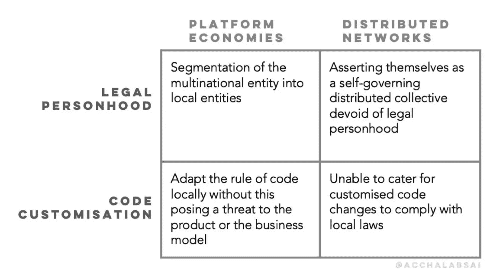
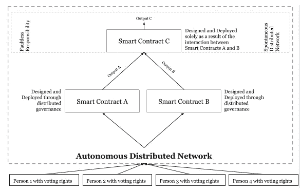

# 自主分布式网络:未实现的自由意志主义者打破管制的梦想

> 原文：<https://towardsdatascience.com/autonomous-distributed-networks-the-unfulfilled-libertarian-dream-of-breaking-free-from-de90ff4100d0?source=collection_archive---------18----------------------->

*关键词:区块链、分布式账本技术、去中心化治理、监管合规性、自主分布式网络、无过失责任、智能合约。*

# 摘要

去中心化体现了自由主义者的梦想，即摆脱政府的监管影响，并通过不可信的网络绕过对中央决策机构的需求。技术自由主义者和秘密无政府主义者认为，去中心化技术有能力消除集权机构中不必要的(低效和寄生的)中间层，实现乌托邦式的层级化和非属地化的区块链治理。

为了评估自主分布式网络(ADNs)成功找到这种自由的可能性，将考虑与法规遵从性相关的三个方面:法律人格；管辖权；还有*的事前*执法。

监管需要确定物理性和意向性来发挥其影响，我们评估 adn 将无法向监管者足够令人信服地证明他们的去中心化治理不能追溯到具有意向性和物理性的个人。只有自发网络(类似于智能合约网络的自我实现系统)的出现，才可能实现自由主义者的梦想，并摆脱政府的监管影响。

# 简介:自由主义者的梦想

去中心化体现了自由主义者的梦想，即摆脱政府的监管影响，并通过不信任(或者更好，完全信任*)网络绕过中央决策机构的需要。技术自由主义者和秘密无政府主义者认为，去中心化的技术有能力消除集权的强大机构中不必要的(低效和寄生的)中间层，并实现*“一个通过区块链治理实现社会平等的乌托邦式的承诺，以及一个不会通过最高权力在一个领土上建立权力的社会。”*(史密斯(2018))*

其核心是，区块链试图创建一个(私人)规范系统，该系统有可能通过绕过人类机构(监管机构和政府影响)的加密技术进行自我监管。我们甚至可以说，一个区块链体系从来就不是不受监管的，即使它可能成功地证明在任何特定的司法管辖区缺乏意图性。

这就是当代分权的教条。自互联网早期以来，去中心化信息网络的设计与自由意志主义的理想同步发展，即通过技术确保个人之间安全和自由的通信，治理将自我组织起来。(……)区块链分散的、“不信任的”网络的出现，也许是迄今为止这种幻想最具体的体现。从积极的角度来看，区块链的“工作证明”实现自动化了机构对网络加密基础设施的“信任”劳动，通过算法共识和计算工作来保护，而不是在形成和维护社会机构中涉及的物理、政治和情感劳动。类似地，智能契约通过可执行代码的保险来约束个人，而不是社会契约本身。*(张哲曦(2018))*

*如果去中心化带来了自主的自组织，这不足以摆脱监管的影响。监管需要确定物理性和意向性来发挥其影响，而自治分布式网络可能无法向监管者足够令人信服地证明，它们的去中心化治理无法追溯到具有意向性和物理性的个人。只有自发网络的出现，类似于*智能*智能合约的自我实现系统，可能会在这方面取得成功。*

*“自我实现代表了最高层次的动机，它驱使我们去实现我们真正的潜力，实现我们的‘理想自我’。“(交互设计基础(2018))自我实现系统是能够在没有事先人为设计的情况下确定其使命和目标的系统。智力是“获取和应用知识和技能的能力”(Lexico Dictionary)。
智能合约可以定义为智能合约，它可以根据以前的经验、环境和/或时间，自发地自我学习和适应其条件和相关结果。*

*分散网络的各个方面提出了关于定义法规遵从性的问题，特别是在以下方面:*

*   *法律人格:在本分析的范围内，鉴于法律体系不能为缺乏法律人格的事物提供法律权利或强加义务，定义最终负责并承担法规合规性的实体；*
*   *管辖权:确定谁是主管监管者和受监管的实体；和*
*   **事前*执行(a .齐索姆和荣格):如何授权受监管实体设计和部署允许或不允许从事非法行为的智能合同；或者根据法律执行与实体的强制交互。*

# *法治和准则的规则*

*法治是一个“持久的法律、机构和社区承诺体系，它提供了四项普遍原则:问责制；公正的法律；开放政府；和公正的争端解决”(世界正义项目)。*

*政府颁布法律，然后由指定的独立机构(监管机构)将其转化为法规。监管机构在与利益相关方协商后，可能会也可能不会发布关于监管如何适用于特定细分市场的指导意见。指导意见也可以通过具体案例的裁决(判例法)来推断，这些裁决深刻揭示了监管机构如何判断实体的行为，以及他们认为对违反现有法律法规的行为的适当惩罚。法规遵从性是公司为确保遵守法律、法规、指南和相关规范而采取的一系列措施。“监管指的是政府据以确立对企业和公民的要求的各种工具。规章包括法律、正式和非正式命令、各级政府发布的附属规则以及政府授予监管权力的非政府或自律机构发布的规则。”(经合组织(2000 年))不遵守往往会导致法律处罚，包括罚款和监禁。*

*在地方、州和国家层面都是如此。此外，还有指定的组织促进各国之间的对话和决策，并随后在国际一级发布建议和指导。一个例子是金融行动特别工作组(FATF)，这是一个独立的政府间机构，负责制定和促进保护全球金融系统免受洗钱、资助恐怖主义和资助大规模毁灭性武器扩散的政策。*

*正如 Primavera De Filippi 和 Aaron Wright 在《区块链与法律:代码规则》(2018)中首次定义的那样，代码规则不依赖于地理边界。只要它仍然是一个代码系统，它就是超国家的，但是当它不仅表现而且执行一个实体对另一个实体的关系的条款时，这就改变了。可以先作为监管黑客的
工具；随后，它成为受监管实体的地理位置所要求的法规遵从性的载体。*

*“互联网标志着一种新的监管模式的开始——在这种模式下，监管将通过代码规则来实施，权力动态与物理世界有着显著不同。然而，随着时间的推移，各国政府认识到并接受了代码规则在维护互联网法治方面的潜力。政府通过要求中介机构修改其代码来维护和遵守管辖法律，从而扩大了它们的控制范围。”(德菲利皮和赖特(2018 年))*

*对于平台经济来说，这不是一个问题。它实际上是快速扩展的关键。我们已经看到像优步和 AirBnB 这样的公司享受着事实上的监管蜜月期，这种蜜月期是通过使用软件进行非中介化的监管黑客行为获得的，并逐渐演变为地方层面上完全受监管的实体。*

*“在平台经济中，三方(1)平台(2)工人(3)客户之间存在三角关系。平台的工作是将有需求的人(客户)与提供供应的人(工人)联系起来。传统的线性商业模式通过创造销售给客户的产品和服务来创造价值。另一方面，基于平台的商业模式通过将用户(消费者和生产者)连接在一个在线网络上来创造其价值”。(德勤(2018))*

*在平台经济的成熟阶段，法典规则被用来试图维护法治。这得益于两个特征:*

*   *受监管实体的存在(或将跨国实体分割为本地实体)；和*
*   *在不对产品或商业模式构成威胁的情况下，在本地调整代码规则的技术手段。这就是说，通过代码创建的产品特性符合法律规定。换句话说，“代码就是法律”。*

*当我们转向基于*lex cryptica*(De Filippi 和 Wright (2018))的系统时，我们会遇到两个核心问题:理论上，adn 可以通过声称自己是一个自治的分布式集体来避免监管，由于潜在的*无过错责任*；adn 无法在不面临对其可访问性、性能或*存在理由*的威胁的情况下，满足定制代码变更以遵守当地法律。即使他们可以在本地结构中启用 dApps，这些 dApps 可以遵循本地法律而不影响网络本身，这也意味着不仅要定位和识别最终用户，还要通过参与块的验证来定位和识别作为将要去中心化的自治“自我”的一部分的个人。*

**

*Figure 1 Platform Economies and Distributed Networks @acchalabs.ai*

*去中心化生态系统犯下的最大错误之一是，认为它们有可能避免像平台经济那样受到监管，而事实上，紧迫的对话应该转向分布式网络中的内在规范体系应该如何遵守现有的地方法规，以及在哪些管辖区之下。*

# *自治分布式网络的治理:一个新的规范体系*

*分布式技术能够创建独立自主的规则系统，在不需要法律的情况下管理交互，促进了我们可以认为是私人规范性框架的出现，称为*lex cryptica*(De Filippi 和 Wright (2018))。*

*从系统的观点来看，分散化包括控制的自动化:从个体代理人的行为中分离出来，组织是系统作为一个整体的一种自然属性。从某种程度上说，系统本质上是自主的，这一观点对艺术家、梦想家和技术官僚都有很大的启发。它展示了不可预测的、反应灵敏的和创造性的系统——与其说是工具，不如说是合作者——产生的复杂的秩序模式远远超出了它们的设计者的有限处方。从计算细胞自动机到人类社会的分布，这些模式无处不在”。(张哲曦(2018))*

*这些系统促进了对等的价值交换、通信和组织，绕过了需要中间调解来显示各方之间的信任(被称为*无信任*系统)。它们引入了可定制的*规范*(通过规则的规定)层，这些层有可能自主运行，没有可识别的意图，也没有任何权威的直接影响。*

**

*Figure 2 Intelligent Smart Contracts and Faultless Responsibility*

*对于创建 adn 产品或服务的企业家来说，治理必须是商业模式的核心考虑因素，因为与传统企业和平台经济相比，固有的规范系统必须从网络开始就尽可能完美地计划和执行*，这伴随着启动后需要重大改变的灾难性风险。**

1.  **自主分布式网络旨在创造由数字资产驱动的微观经济。规范系统必须规划和管理数字资产的网络间功能、其分布、其货币政策、其价值以及其与网络外实体的关系。可以说，监管合规性领域是迄今为止每个通过代币销售进行众筹的项目的焦点，这只是自治分布式网络基本监管合规性问题的相对较小的子集。**
2.  **网络中的价值交换由生态系统中的参与者之间以及与外部参与者之间的契约关系的创建来实现，并反过来实现。这转化为对等的价值交换和受监管的遗留参与者的非中介化。当非利益相关方调解成功时，在没有非利益相关方调解的情况下实现了法规遵从性，这意味着该功能由另一方通过技术、合同流程或其他方式吸收。支撑 adn 设计的策略必须了解监管环境的当前和未来发展，以及非中介化、合同流程和竞争对手转移的影响。**
3.  **共识机制的类型和 on-chain/off-chain 在账本上的活跃程度将影响监管者如何对待网络。例如，节点的数量、它们的地理分布以及它们的可识别性(参见与工作证明相对的权威证明)；以及当与性能相关的架构选择将依赖基于云的服务器和物理服务器时，必须驻留在 off-chain 的数据量。**

# **政府如何监管自主分布式网络**

**迄今为止，监管者大多采取温和的方式，可以说是为了避免扼杀自主分布式网络给社会和经济带来的创新潜力；并且因为与负面影响相关的风险不是必然的(相称性)。这不应被解释为没有能力或不愿意适用法律或执行法律。**

**只要存在与受监管实体和中介的互动，保护公众的需要，以及参与 ADN 的*故意*操作的个人或实体，分布式系统就不会远离监管机构。所有 adn 都可以在与受监管实体(例如支持或开发技术的中介、个人或网络运营商)的交叉领域进行控制。**

**根据*执行*去中心化的程度，可能会怀疑哪些实体最终负责(并有义务)遵守当地法规。然而，重要的是要记住，除了直接执行必然需要法律人格的监管之外，政府还拥有许多推动新技术监管的工具。除了法律之外，劳伦斯·莱斯格确定了政府可以直接或间接使用的另外三个监管杠杆(Lessig (2006)):市场力量；社会规范；和架构/基础设施(代码和硬件)。**

# **作为法人的自治分布式网络**

**以下对法律人格的定义(Chen 和 Burgess (2019))强调了满足两个标准的必要性:控制思维和身体存在。**

**“然而，法律人格也延伸到非人类的其他实体(……)。在许多方面，公司是法律虚构的人(Schane 1987)。它可以以自己的名义起诉和被起诉，它可以成为制裁的对象。与人类不同，它没有物理形态，但它有控制思想(由董事会和股东组成)(Lord 2013)。然而，尽管一家公司没有实体形态，但它通过其作为人工制品的创造，凭借其注册办事处固定在一个特定的地点和管辖范围内。这种非常实际的考虑使管辖权限制能够发挥作用，并确保公司结构不能存在于真空中。”**

**从本质上讲，公司结构的设计是为了创造一个可以代替人类的人造人，同时确保社会(或至少一个社会)的法律仍然适用于该实体。**

**迄今为止，注册 adn 最常见的法律实体类型是非盈利基金会，这可能是因为数字资产销售和众筹时的监管黑客行为。有一个合并的论点:**

*   **需要证明发行数字资产的实体的非商业性(盈利性)和指导性，以证明数字资产不是证券。**
*   **需要证明，从法规遵从性的角度来看，由于网络内决策的预计分布式性质，建立这样的基础将在业务的其他方面保持一种监管黑客形式，这增加了 ADN 不具有法人资格的论点。**
*   **需要消除有股东的法律实体与没有股东的基金会之间的利益冲突，这样可以逃避有权利和义务的股东的监督。**

**然而，如果没有经营和管理，作为企业的去中心化网络就无法生存或扩大，不管是由董事会还是有组织的人群来经营和管理。只有当它以*自发*的方式运行时(即没有人类的设计)，它完全自主的有力论据才会出现。**

**朝着这个方向迈出的一步可以是一方面为盈利的二级实体创建商业实体；另一方面，建立额外的法律实体，将网络作为一个纯粹的(开放源码)软件来管理，以区别于其使用(rs)。**

1.  **发行数字资产并监督网络目标和任务实现情况的实体。**
2.  **利用网络建立商业(盈利)企业的实体。**
3.  **独立于其他两个实体的目标、使命和商业意图开发和维护软件*的实体*。**

****

**Figure 3 Three separate entities**

**管辖区由最初的企业实体确定(无论这是一个非盈利性的基金会还是其他机构，都无关紧要)，公司承担分散治理程度的举证责任。只要存在通过合同表现出来的关系(例如，代币销售或服务条款)，或者换句话说，只要分布式网络产品和衍生产品存在商业可行性；根据法律，合同的一方有责任遵守法律。**

**从监管合规的角度来看，对前两个实体的处理将相当平淡无奇。作为一个自我协调的实体工作的软件开发人员的待遇将更加有趣，特别是当一个领域中包括人工智能时，但只有在(1)它将明显独立于支持实体运行时(例如，独立委员会、投票权和大规模参与)；(2)不与受监管的中介机构交叉；以及(3)没有预先的人为设计。**

**在评估与受监管中介机构的交叉时，应仔细考虑两个方面:监管。和 off-chain 活动。**

**Oracles 是“根据程序请求处理外部数据源的实用程序”(Exonum (2018))。如果数据源具有法律人格，它就可以(很可能已经)受到监管，从而成为监管者影响分布式网络的一种间接方式。**

**off-chain 的活跃程度也必须考虑在内，以便公平地评估不受监管者约束的可能性。可以说，如果只有最少的活动发生在链上，并且数据保存在本地服务器上，那么关于数据处理和安全性的法规将适用。如果高性能区块链的未来在于通过维持轻度链上活动实现的灵活性，这将大大有利于监管机构要求本地遵守节点法规，以及远离假名并接受广泛的 KYC-反洗钱要求。意识形态、安全和隐私问题将产生对零知识和按需合规服务和产品或类似解决方案的需求。**

**众所周知，监管者利用模糊性进行监管，对适用性和执行程度进行判断。这些因素中的每一个在多大程度上将足以证明自主和自发管理的情况，将由每个感兴趣的管理者来决定。可以说，出于治理目的的“充分”去中心化只能在规模上实现，这对于大多数网络来说，在它们启动时仍将是一个生存威胁。**

# ***事前*强制执行**

**如果一个没有法律人格的超国家实体的论点能够得到证明，那么政府实施*事前*强制执行的可能性将很可能失败:将技术(通过代码)规则作为法律规则来禁止在网络上执行非法行为的选择，如果无法定义管辖权，就无法执行。这很可能成为分布式网络的生死之战。如果政府采取措施对当地法规进行*事前*强制执行，这将需要网络根据法律编写驱动特定性能的代码，或者通过 API 或其他方式强制与服务进行交互。智能合同是区块链固有规范系统的体现，具有对比本地化参数的智能合同的共存可能会产生:**

1.  **识别用户的 ID 和位置，考虑到分布式网络的透明性和不变性，促进增强的平台监视经济；**
2.  **部署沉重的代码，伴随着相关的成本和性能问题，这可能会赶走用户；**
3.  **在同一网络内同时运行不同的*consensi*；**
4.  **通过链间链接将 ADN 转换为网络的网络，以连接单独的*consensi*；**
5.  **所有 ADN 聚合成一个具有普遍合法共识的 ADN，类似于只有一个互联网。**

# **走向智能合约**

**到目前为止，我们已经看到公司、个人和基金会试图建立自主的分布式网络，这些网络试图不被视为一个实体并受到监管，但希望通过宣称自己是一个没有法律人格的自治分布式集体来避免受到监管。然而，只有当这种系统变得自发，能够在智能合同的发行和履行中显示出自我决定和自我实现时，自由主义者摆脱监管控制的梦想才可能实现。换句话说，什么时候才有可能见证*智能*智能合约嵌入 AI 和神经网络。已经开始尝试了，一个主要的例子是 Cortex (Cortex Labs (2018))，但这只有在考虑了本文中讨论的所有因素后才会有效:**

1.  **大规模分散的基础设施；**
2.  **没有受监管的中介机构；**
3.  **没有预先的人类设计；和**
4.  **独立于营利性实体。**

**我们什么时候能达到这种自发的分布式网络还不得而知。**

# **参考**

**A.齐索姆和荣格,《平台监管——事前与事后干预:发展我们的反垄断工具和实践以应对挑战》。竞争政策国际杂志。**

**陈，j .和伯吉斯，P. (2019)。法律人格的边界:自发智能如何影响人类、人工智能、公司和动物之间的差异。人工智能与法律 27，73–92。**

**皮层实验室。(2018).[https://www.cortexlabs.ai/](https://www.cortexlabs.ai/)**

**De Filippi，p .和 Wright，A. (2018 年)。区块链与法律:代码规则。哈佛大学出版社。**

**德勤。(2018).平台经济的崛起。德勤—人力资本。nl-hc-reshaping-work-conference.pdf[https://www2 . Deloitte . com/content/dam/Deloitte/nl/Documents/human capital/Deloitte](https://www2.deloitte.com/content/dam/Deloitte/nl/Documents/humancapital/deloitte)**

**外显子 num。(2018).关于区块链的神谕以及它们在外显子中的作用。[https://exon um . com/blog/Oracle-in-区块链和-in-exonum/](https://exonum.com/blog/oracles-in-blockchains-and-in-exonum/)**

**弗洛里迪，F. (2016)。分布式道德行为的道德责任的性质和分配。数据科学的伦理影响，皇家学会。[https://royal society publishing . org/doi/10.1098/rsta . 2016.0112](https://royalsocietypublishing.org/doi/10.1098/rsta.2016.0112)**

**交互设计基础。(2018).马斯洛的需求层次。在线文档—[https://www . interaction design.org/literature/article/self-actualization-maslow-s](https://www.interaction-design.org/literature/article/self-actualization-maslow-s)—需求层次**

**Lessig，L. (2006 年)。代码:版本 2.0。基本图书，珀尔修斯图书集团成员。**

**词典词典。词典词典，由牛津词典提供支持。**

**经合组织。(2000).降低政策失败的风险:法规遵从性的挑战。在线—经济合作与发展组织[https://www.oecd.org/gov/regulatory-policy/46466287.pdf](https://www.oecd.org/gov/regulatory-policy/46466287.pdf)**

**k .史密斯(2018)。生活在隐秘的自由主义梦想中:区块链上的国家。二元地区杂志。https://journal . binary district . com/living-the-crypto-libertarian-dream-a-nation-on-the-区块链/**

**世界正义项目。什么法治。在线—世界正义项目，
[Www.WorldJusticeProject.org/about-us/overview/what-rule-law](http://Www.WorldJusticeProject.org/about-us/overview/what-rule-law)**

**张哲熙(2018)。分散化的美学。设计与科学杂志。[https://doi.org/10.21428/2bfc3a68](https://doi.org/10.21428/2bfc3a68)**

****

**图一。平台经济允许将任何跨国实体划分为本地法律实体，同时通过法律法规调整功能以符合本地监管要求。在多辖区分布式网络中，这在技术上不可能在协议级执行，并且为了在 dApp(分散应用)级执行，它只能在用户至少被伪识别和本地化的情况下执行。因此，分布式网络在执行过程中不可能令人信服地宣称自己是没有法人资格的自治集体，因为 1)每个伪标识的人都将受到本地监管；以及 2)符合本地规定的代码不能在协议级执行。**

****

**图二。执行智能智能合同可以证明 adn 缺乏法律人格，因为它认为网络是在没有事先人为设计的情况下设计自己的(智能合同 C ),从而打破了意向性树，否则该意向性树将追溯到具有投票权的个人操作共识。**

****

**图 3。1)数字资产:发行数字资产并监督网络的目标和任务的实现的实体；2)商业企业:利用网络建立商业(盈利)企业的实体；3)自发软件:独立于其他两个实体的目标、使命和商业意图开发和维护软件的实体。**