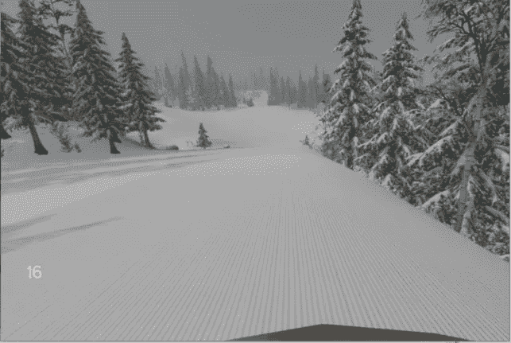
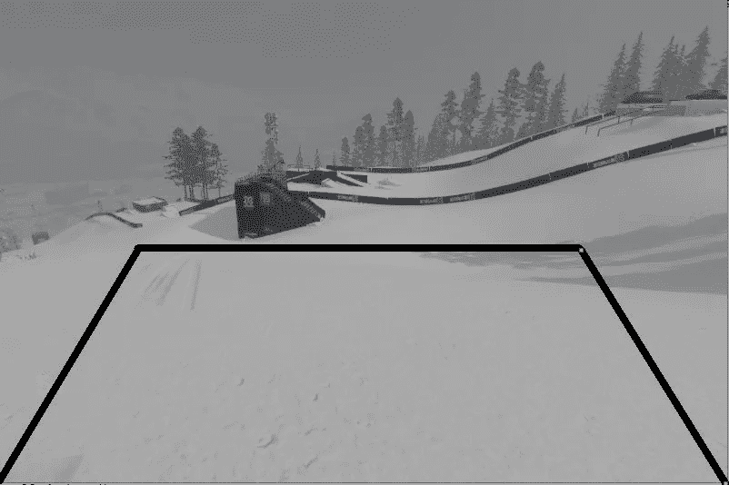
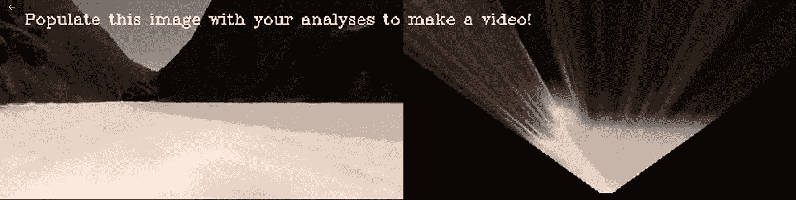
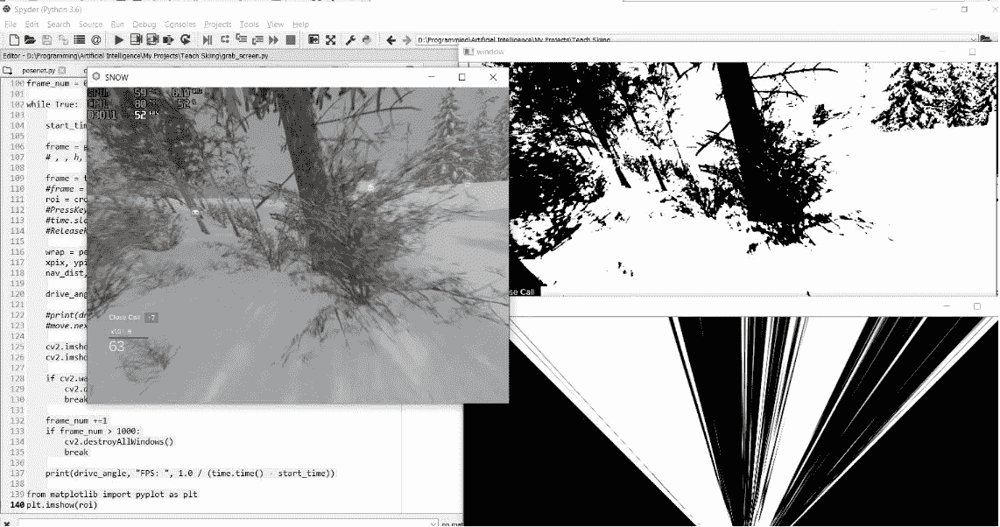
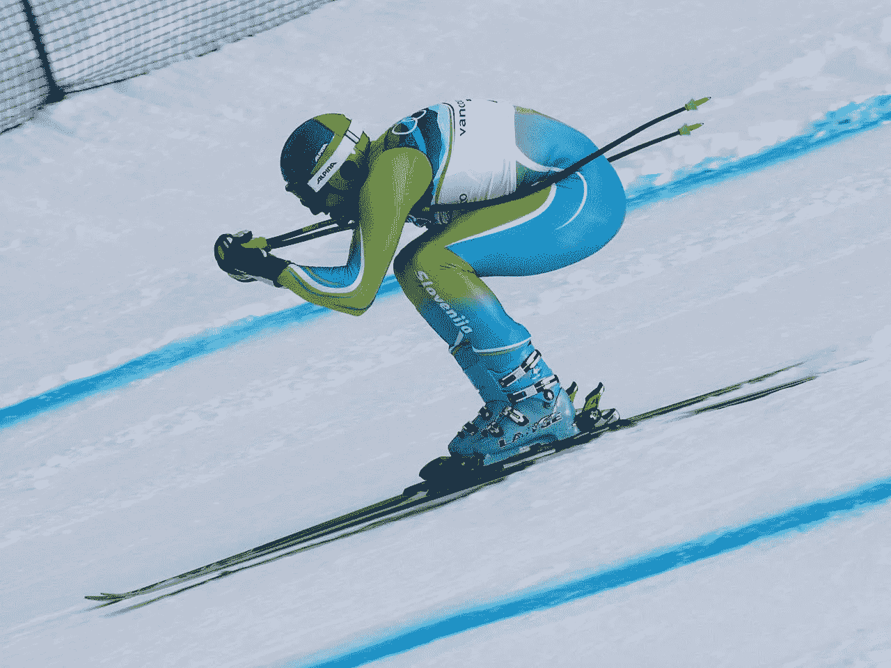
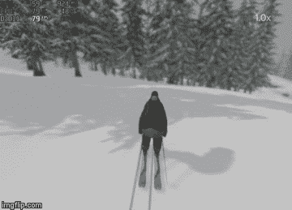
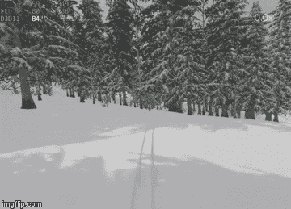

# 自主滑雪

> 原文：<https://towardsdatascience.com/autonomous-skiing-8adf8fd14e4f?source=collection_archive---------23----------------------->

## 现在我使用计算机视觉来制作自主滑雪者。

围绕自主代理、它们的应用和改进有很多研究。所以，我在想自动驾驶汽车，它可以在雪地上行驶而不会发生任何碰撞。不幸的是，我没有足够的资源和时间来建造一个具有特殊硬件的真正的机器人，它将设法在雪地上行驶。所以我决定在模拟器上运行我的实验。

我为这个项目选择的模拟器是名为《雪》(【http://www.snowthegame.com/】)的普通游戏。这个游戏是免费的(有免费的地图，也有需要付费才能进入的地图)。游戏非常简单。你有你能控制的人，你能玩两者，使用滑雪板以及滑雪。对于这个项目，我选择滑雪。这就是我们基于游戏的模拟器的样子。



Screen from the game SNOW

# 代码管道

在这篇文章中，我将尝试解释这种自动滑雪者的端到端管道。你可以在 [Github](https://github.com/Ersho/Autonomous-Skiing) 上看到整个项目的代码。不要犹豫为这个项目做贡献，或者问我任何问题。

[https://github.com/Ersho/Autonomous-Skiing](https://github.com/Ersho/Autonomous-Skiing)

# 获取输入

首先，我想解释一下如何从游戏中获取图像。由于雪不是一个真实的模拟器，没有特殊的代码允许我们从游戏中获取图像流，要获取图像流，我们必须使用 python 抓取屏幕并剪切整个屏幕所在的部分。下面是抓取图像并获取输入的代码。

```
def get_screen(*args):

    h_start, h_end = args[0], args[1]
    w_start, w_end = args[2], args[3]

    screen_pil = np.array(ImageGrab.grab(bbox = (h_start, 
                                                 h_end,
                                                 w_start, 
                                                 w_end, 
                                                 )))

    return cv2.cvtColor(screen_pil, cv2.COLOR_BGR2RGB)
```

这给了我们取自游戏的画面。但是，在我们继续之前，让我们讨论一下，如何使用 python 来操纵键盘按键。键盘上的每个键都有自己的十六进制表示。我们使用这些十六进制值来访问键盘上的键。

```
key_dict = {‘A’ : 0x1E, ‘B’ : 0x30, ‘W’ : 0x11,
 ‘S’ : 0x1F, ‘LSHIFT’ : 0x2A, ‘D’ : 0x20}
```

在为我们的键和它们的十六进制值设置了字典之后。我们为按键和释放按键的事件编写函数。这些函数位于“get_input.py”中。

现在，我们已经做好了开始感知和决策步骤的一切准备。

# 感觉

首先，我想对计算机视觉部分有一个简要的概述，这给了人工智能代理理解周围环境的可能性。

对我们来说幸运的是，雪对自动驾驶汽车来说是一个非常好的环境，因为它完全是白色的，我们必须从大部分是黑色或比灰色更暗的树木和障碍物中确定它。为了区分雪和障碍物，我们为我们的像素取一个阈值并实现函数，该函数接收一个输入图像帧并返回相同大小的二进制图像，其中白色是可导航区域，黑色是所有障碍物。

接下来，我们裁剪感兴趣的区域。这意味着，在分析图像时，我们不需要整个屏幕，我们只对我们面前发生的事情感兴趣，这样我们的滑雪者就可以根据他在前面的视野移动。基于这个事实，我们只裁剪图像的一小部分。这种技术给我们提供了一个更小的图像，这变得更有效地计算，以及我们只得到我们感兴趣的特定区域。如果你从人类的角度来看，为了导航，你只使用你面前的视力来避开障碍，你几乎不会对离你 100 米远的树木感兴趣。上面应用了相同的原理。



With black lines, I identify my region of interest

在我们得到裁剪区域后，我们进行透视变换来得到裁剪区域的鸟瞰图。这是使用两张图片后的效果。



This image is taken from Udacity Robotics Software Engineer Course

接下来，我们参照图像底部中心的滑雪者位置来计算像素位置。

然后，作为最后一步，我们计算导航角度，我们从[-15，15]剪辑。0 表示我们在前方移动而不转向，并且前方没有任何障碍物。15 表示我们转向右边，而-15 表示转向左边。

这就是我们最终视觉呈现的样子。



Left : Original Screen of the game, Right Above : thresholded image, Right Below : birds view

# 行动

我们已经完成了感知部分的实现，这给了我们对虚拟滑雪者所面临的环境的理解。下一步是决策过程。这是非常重要的一步。想想看，一瞬间你可以在水平场地滑雪，没有任何障碍。在这种情况下，导航角度始终为 0，您可以随时按下按钮 W 向前移动并增加速度。但是在这个模拟器中，按下 W 键会让滑雪者使用雪杖加速，并且不断地发送 W 键看起来会很可笑。

相反，按下“LFShift”允许滑雪者进入抱膝位置，并在增加速度的同时自由移动。如果我们想要有一个好的自主代理，我们应该在我们的决策步骤后面写逻辑。为了有效地解决这些类型的问题，我们创建了类决策。在这种情况下，我们有转向、加速、速度等参数。所以让我们首先讨论我们想要实现什么。



Tuck position

(按 W)。如果这种情况持续一段时间(比如连续 10 帧)，我们就开始进入抱膝状态(按下左移键)。当我们的角度在范围内(-7，7°)时，我们继续以抱膝姿势移动。但是，如果我们获得的导航角度低于或高于之前的值((-15，-7)，(7，15))，我们将根据角度进行转向，并慢慢停止滑雪者并重置状态，这意味着在降低速度后，我们将使用极点移动从头开始决策步骤。如果我们没有到达连续的 10 帧，由于导航角度在某处小于或大于阈值而进入折叠模式，我们继续以正常状态移动。更安全也更容易管理

注意**在抱膝状态下，我们的速度增加很多，在正常情况下，我们的 fps 范围是 1-5，这并不多。当我们的滑雪者速度很快，fps 下降到 1 时，决策步骤跟不上这个人的移动，所以它崩溃了。

# 实施决策过程

正如我们已经说过的，在我们的案例中，决策是最有趣和最具挑战性的任务。尤其是当我们想要从抱膝状态平稳过渡到带杆前进的时候。为此我们必须跟踪我们的人。因此，我们创建了一个名为 Decision 的对象。我们在其中定义了以下参数

```
self.vel = 0
self.acc = 0

self.tuck = 0
self.forward_time = 0
```

前两行用于创建变量，用于跟踪速度和加速度。在这种情况下，我们实际上并不跟踪物体的实际速度和加速度，而是将它们加上某个值，这样我们就大概知道，我们的速度有多快。这给了我们一个非常基本的概念，物体的速度和加速度。最后两个变量 tuck 和 forward_time 用于改变对象的状态。正如我们所说的，如果连续 10 帧后角度没有大的变化，我们改变滑雪者的状态，他进入抱膝姿势。名为 tuck 的变量定义了状态，当 tuck 为 0 时，我们使用极点向前移动，但当它为 2 时，这意味着滑雪者处于 tuck 位置。我们迭代“forward_time”来计算角度不变的连续帧的数量。

现在，让我们讨论一下我们的移动步骤

```
def next_move(self, angle):

  if self.tuck == 1:
    self.tuck = 2
    self.enter_tuck_state()

  if angle >= -0.2 and angle <= 0.2:

    if self.tuck != 2:
      self.accelerate(angle) 

    if self.forward_time > 20:
      self.tuck = 1
    self.forward_time += 1 
  else:
    self.steer(angle)

    if self.tuck == 2:
      self.tuck = 0
      self.forward_time = 0
      self.end_tuck_state()
      self.stop()

  if self.vel > 5:
    self.stop()
    self.vel -= 2
    self.acc = 0
```

我会一步一步地教你。首先，我们检查抱膝状态，如果为零，我们就保持在雪杖状态(滑雪者正在使用雪杖)。接下来，我们检查变量“角度”,它是上面给出的函数参数，在感知步骤中计算。如果角度接近 0，说明我们在移动，没有探测到前方有任何障碍物。正如你所看到的，如果发生这种情况，我们只需追加到我们的前进时间。如果我们的角度仍然接近 0°，并且我们的前进时间大于 20°，我们就进入塔克状态“1”。当我们再次调用这个函数时，如果我们的抱膝状态为 1，我们就进入抱膝状态，我们的滑雪者开始以抱膝姿势移动。如果我们的角度不接近 0，这意味着我们前面有一些障碍，我们立即转向角度方向，然后我们检查抱膝状态，如果我们处于抱膝状态，我们离开该状态，重置前进时间，我们通过调用函数“停止”来减慢我们的滑雪者。减速过程是必要的，这样我们的滑雪者不会获得太多的速度。因为在高速度下控制滑雪者变得更加困难，特别是在像我们 1-5 秒这样的低 fps 下。最后，我们来到了最后一个 if 语句。正如你所记得的，我们用变量“vel”来跟踪速度。我们在每次函数调用时检查这个速度。如果它变得大于某个值(在我们的例子中是 5)，我们减慢滑雪者的速度。
这是我们滑雪者的端到端决策步骤，效果非常好，这里有一个小演示。



Little Demo.

## * *注意

对于转向，您将看到两个功能“快速转向”和正常“转向”。在游戏雪中，如果你按下左移位，然后转向，它会更快地向右或向左移动。我实际上已经考虑到了这一步。并且将转向角度分为 2 步，如果在[-15，-7]，[7，15]之间，我使用快速转向，从[-7，0.5]，[0.5，7]我使用正常转向。

```
def steer(self, angle):
  if angle > 7:
   self.go_faster_right(angle)
  elif angle < -7:
   self.go_faster_left(angle)
  elif angle > 0.5:
    self.go_right(angle)
  elif angle < -0.5:
    self.go_left(angle)
```

# 结论

在这篇文章中，我解释了我是如何设法从普通的游戏 SNOW 中为我的自主滑雪示例创建模拟器的。在这个项目中工作非常有趣，它有一些很大的挑战，比如不要开得太快，快速机动，探测前面的每个障碍等等。

**这个项目是为实验和学习目的而设计的。**

# 进一步的改进

*   通过在任何其他方法上使用 2 帧中的差异来检测真实速度。
*   探测到上升。
*   边跳边机动。

# 参考

[1][https://www.udacity.com/course/robotics-software-engineer-nd 209](https://www.udacity.com/course/robotics-software-engineer--nd209)
【2】[https://python programming . net/game-frames-open-cv-python-plays-GTA-v/](https://pythonprogramming.net/game-frames-open-cv-python-plays-gta-v/)
【3】[http://www.snowthegame.com/](http://www.snowthegame.com/)