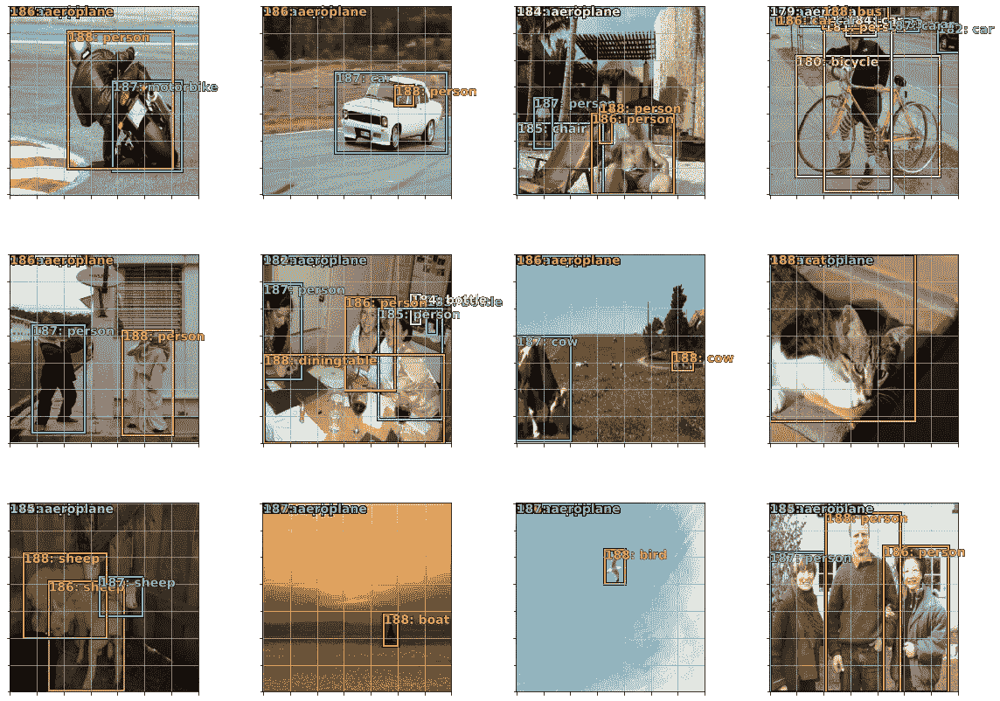

# 带 PyTorch 的自动卡车模拟器——微调和单发探测器

> 原文：<https://towardsdatascience.com/autonomous-truck-simulator-with-pytorch-3695dfc05555?source=collection_archive---------32----------------------->

这是上一篇[文章](https://medium.com/datadriveninvestor/how-i-developed-an-in-game-self-driving-vehicle-using-fast-ai-and-american-truck-simulator-2524891dbaf)的延续，在上一篇文章中，我做了如何使用 fast.ai 构建自动卡车模拟器的完整演练，但最终这些方法可以在任何需要微调预训练模型或开发预测边界框和类的模型的情况下工作。

现在，我的目标是浏览训练和推理过程的一些更技术性的方面，并解释它们如何在 PyTorch 中实现的细节。也可以参考[本 Github repo](https://github.com/jchaykow/trucksim) 中的代码库。

回想一下上一篇文章，这里有两个神经网络在工作。

1.  DNN 预测转向方向。
2.  预测汽车、人等的边界框和类别的 DNN。

# 微调转向模型

这两个网络都是从一个预先训练好的 resnet34 网络开始，并针对适当的任务进行微调。

可从`torchvision.models`获得预训练结果 34

```
**import** torchvision.models **as** modelsarch = models.resnet34(pretrained=**True**)
```

所有预训练的模型都已经在 1000 类 Imagenet 数据集上进行了预训练。

为了微调预训练的网络，我们基本上只是从一堆权重开始，这些权重已经嵌入了许多关于 Imagenet 数据集的信息。所以我们可以用两种方法之一。一种方法是通过设置`requires_grad=**False**`来冻结所有早期层，然后只为最终层设置`requires_grad=**True**` 。另一种方法是只使用所有的权重作为初始化，并在新的训练数据上继续训练。

对于选项 1，我们冻结早期层并仅训练最终层，我们可以为所有层设置`requires_grad=**False**` ，然后移除并替换最后的层(无论何时将层分配给网络，它都会自动将`requires_grad`属性设置为**真**)。

```
**class** Flatten(nn.Module):
    **def** __init__(self):
        super(Flatten, self).__init__()**def** forward(self, x):
        x = x.view(x.size(0), -1)
        **return** x**class** normalize(nn.Module):
    **def** __init__(self):
        super(normalize, self).__init__()**def** forward(self, x):
        x = F.normalize(x, p=2, dim=1)
        **return** xlayer_list = list(arch.children())[-2:]
arch = nn.Sequential(*****list(arch.children())[:-2])
arch.avgpool = nn.AdaptiveAvgPool2d(output_size=(1,1))
arch.fc = nn.Sequential(
    Flatten(),
    nn.Linear(in_features=layer_list[1].in_features, 
              out_features=3, 
              bias=**True**),
    normalize()
)
arch = arch.to(device)
```

如果你观察 resnet34 的架构，你可以看到最后一个 conv 模块后面是一个`AdaptiveAvgPool2d`和一个`Linear`层。

```
(2): BasicBlock(
      (conv1): Conv2d(512, 512, kernel_size=(3, 3), stride=(1, 1), padding=(1, 1), bias=**False**)
      (bn1): BatchNorm2d(512, eps=1e-05, momentum=0.1, affine=nn.Sequential, track_running_stats=**True**)
      (relu): ReLU(inplace=**True**)
      (conv2): Conv2d(512, 512, kernel_size=(3, 3), stride=(1, 1), padding=(1, 1), bias=**False**)
      (bn2): BatchNorm2d(512, eps=1e-05, momentum=0.1, affine=True, track_running_stats=**True**)
    )
  )
  (avgpool): AdaptiveAvgPool2d(output_size=(1, 1))
  (fc): Linear(in_features=512, out_features=1000, bias=**True**)
)
```

我们可以用`nn.Sequential(*****list(arch.children())[:-2])`去掉最后两层，然后用`arch.avgpool = nn.AdaptiveAvgPool2d(output_size=(1,1))`和另一个带有`Flatten`、`Linear`和`normalize`层的`nn.Sequential`把它们重新连接到末端。我们最终想要预测 3 个类别:左、右、直——所以我们的`out_features`将是 3。

现在，我们将为方向模型创建数据集和数据加载器。由于我们的数据只是图像和类[左，右，直]，我们可以只使用内置的 torch dataset 类，但我喜欢使用自定义类，因为我可以更容易地看到数据是如何提取的。

```
**class** DirectionsDataset(Dataset):
    """Directions dataset."""
    **def** __init__(self, csv_file, root_dir, transform=None):
        """
        Args:
            csv_file (string): Path to the csv file with labels.
            root_dir (string): Directory with all the images.
            transform (callable, optional): Optional transform
        """
        self.label = pd.read_csv(csv_file)
        self.root_dir = root_dir
        self.transform = transform **def** __len__(self):
        **return** len(self.label) **def** __getitem__(self, idx):
        img_name = os.path.join(self.root_dir,
                                self.label.iloc[idx, 0])
        image = io.imread(img_name+'.jpg')
        sample = image
        label = self.label.iloc[idx, 1] if self.transform:
            sample = self.transform(sample) **return** sample, label
```

我在 csv 文件中的图像名称没有扩展名，因此没有`img_name+’.jpg’`。

```
tensor_dataset = DirectionsDataset(csv_file='data/labels_directions.csv',
                  root_dir='data/train3/',
                  transform=transforms.Compose([
                                transforms.ToTensor(),
                                transforms.Normalize(
                  (0.5, 0.5, 0.5), (0.5, 0.5, 0.5))]))dataloader = DataLoader(tensor_dataset, batch_size=16, shuffle=**True**)
```

所以我们准备开始训练模型。

```
**def** train_model(model, criterion, optimizer, scheduler, 
                dataloader, num_epochs=25):
    since = time.time()
    FT_losses = [] best_model_wts = copy.deepcopy(model.state_dict())
    best_acc = 0.0
    iters = 0 **for** epoch **in** range(num_epochs):
        **print**('Epoch {}/{}'.format(epoch, num_epochs - 1))
        **print**('-' * 10) scheduler.step()
        model.train()  # Set model to training mode running_loss = 0.0
        running_corrects = 0 # Iterate over data.
        **for** i, (inputs, labels) **in** enumerate(dataloader):
            #set_trace()
            inputs = inputs.to(device)
            labels = labels.to(device) # zero the parameter gradients
            optimizer.zero_grad() # forward
            # track history if only in train
            model.eval()   # Set model to evaluate mode
            **with** torch.no_grad():
                outputs = model(inputs)
                #set_trace()
                _, preds = torch.max(outputs, 1)

            outputs = model(inputs)
            loss = criterion(outputs, labels) # backward + optimize only if in training phase
            loss.backward()
            optimizer.step() FT_losses.append(loss.item())
            # statistics
            running_loss += loss.item() * inputs.size(0)
            running_corrects += torch.sum(preds == labels.data)
            #set_trace()
            iters += 1

            if iters % 2 == 0:
                 **print**('Prev Loss: {:.4f} Prev Acc: {:.4f}'.format(
                     loss.item(), torch.sum(preds == labels.data) / inputs.size(0))) epoch_loss = running_loss / dataset_size
        epoch_acc = running_corrects.double() / dataset_size print('Loss: {:.4f} Acc: {:.4f}'.format(
            epoch_loss, epoch_acc)) # deep copy the model
        if epoch_acc > best_acc:
            best_acc = epoch_acc
            best_model_wts = copy.deepcopy(model.state_dict()) time_elapsed = time.time() - since
    **print**('Training complete in {:.0f}m {:.0f}s'.format(
        time_elapsed // 60, time_elapsed % 60))
    **print**('Best val Acc: {:4f}'.format(best_acc)) # load best model weights
    model.load_state_dict(best_model_wts)
    **return** model, FT_losses
```

在这个训练循环中，如果历元精度是迄今为止最好的，我们可以跟踪最佳模型权重。我们还可以跟踪每次迭代和每个时期的损失，并在结束时返回，以绘制并查看调试或演示的效果。

请记住，该模型在每次迭代时都被训练，如果您停止训练循环，它将保留那些权重，只需再次运行`train_model()`命令，训练就可以再次继续。要从头开始，请返回并使用预训练的架构重新初始化权重。

```
criterion = nn.CrossEntropyLoss()
# Observe that all parameters are being optimized
optimizer_ft = optim.SGD(arch.parameters(), lr=1e-2, momentum=0.9)
# Decay LR by a factor of *gamma* every *step_size* epochs
exp_lr_scheduler = lr_scheduler.StepLR(optimizer_ft, step_size=7, gamma=0.1)arch, FT_losses = train_model(arch, criterion, optimizer_ft, exp_lr_scheduler, dataloader, num_epochs=5)
```

# 微调边界框模型



sample data

同样，我们将使用预训练的 resnet34 架构。然而，这一次我们将不得不对它进行更多的编辑，以输出类预测和边界框值。此外，这是一个多类预测问题，因此可能有 1 个边界框，也可能有 15 个类。

我们将为该架构创建一个*自定义 head* ，其方式与我们替换方向模型中的层的方式类似。

```
**class** StdConv(nn.Module):
    **def** __init__(self, nin, nout, stride=2, drop=0.1):
        super().__init__()
        self.conv = nn.Conv2d(nin, nout, 3, stride=stride, padding=1)
        self.bn = nn.BatchNorm2d(nout)
        self.drop = nn.Dropout(drop)

    **def** forward(self, x): 
        **return** self.drop(self.bn(F.relu(self.conv(x))))

**def** flatten_conv(x,k):
    bs,nf,gx,gy = x.size()
    x = x.permute(0,2,3,1).contiguous()
    **return** x.view(bs,-1,nf//k)**class** OutConv(nn.Module):
    **def** __init__(self, k, nin, bias):
        super().__init__()
        self.k = k
        self.oconv1 = nn.Conv2d(nin, (len(id2cat)+1)*k, 3, padding=1)
        self.oconv2 = nn.Conv2d(nin, 4*k, 3, padding=1)
        self.oconv1.bias.data.zero_().add_(bias)

    **def** forward(self, x):
        **return** [flatten_conv(self.oconv1(x), self.k),
                flatten_conv(self.oconv2(x), self.k)]drop=0.4**class** SSD_MultiHead(nn.Module):
    **def** __init__(self, k, bias):
        super().__init__()
        self.drop = nn.Dropout(drop)
        self.sconv0 = StdConv(512,256, stride=1, drop=drop)
        self.sconv1 = StdConv(256,256, drop=drop)
        self.sconv2 = StdConv(256,256, drop=drop)
        self.sconv3 = StdConv(256,256, drop=drop)
        self.out0 = OutConv(k, 256, bias)
        self.out1 = OutConv(k, 256, bias)
        self.out2 = OutConv(k, 256, bias)
        self.out3 = OutConv(k, 256, bias) **def** forward(self, x):
        x = self.drop(F.relu(x))
        x = self.sconv0(x)
        x = self.sconv1(x)
        o1c,o1l = self.out1(x)
        x = self.sconv2(x)
        o2c,o2l = self.out2(x)
        x = self.sconv3(x)
        o3c,o3l = self.out3(x)
        **return** [torch.cat([o1c,o2c,o3c], dim=1),
                torch.cat([o1l,o2l,o3l], dim=1)]
```

因此，现在我们希望将这个自定义头连接到 resnet34 架构，我们有一个方便的函数来完成这项工作。

```
**class** ConvnetBuilder():
    **def** __init__(self, f, c, is_multi, is_reg, ps=**None**,
                 xtra_fc=**None**, xtra_cut=0, 
                 custom_head=**None**,pretrained=**True**):
        self.f,self.c,self.is_multi,self.is_reg,self.xtra_cut = f,c,is_multi,is_reg,xtra_cut
        xtra_fc = [512]
        ps = [0.25]*len(xtra_fc) + [0.5]
        self.ps,self.xtra_fc = ps,xtra_fc cut,self.lr_cut = [8,6] # specific to resnet_34 arch
        cut-=xtra_cut
        layers = cut_model(f(pretrained), cut)
        self.nf = num_features(layers)*2
        self.top_model = nn.Sequential(*layers) n_fc = len(self.xtra_fc)+1
        self.ps = [self.ps]*n_fc fc_layers = [custom_head]
        self.n_fc = len(fc_layers)
        self.fc_model = nn.Sequential(*fc_layers).to(device)
        self.model = nn.Sequential(*(layers+fc_layers)).to(device)**def** cut_model(m, cut):
    **return** list(m.children())[:cut] if cut else [m]**def** num_features(m):
    c=children(m)
    if len(c)==0: return None
    for l in reversed(c):
        if hasattr(l, 'num_features'): return l.num_features
        res = num_features(l)
        if res is not None: return res**def** children(m): **return** m **if** isinstance(m, (list, tuple)) **else** list(m.children())
```

使用这个`ConvnetBuilder`类，我们可以将自定义头和 resnet34 架构结合起来。

```
k = len(anchor_scales)
head_reg4 = SSD_MultiHead(k, -4.)
f_model = models.resnet34
modelss = ConvnetBuilder(f_model, 0, 0, 0, custom_head=head_reg4)
```

`k`是 9

我们现在可以通过`modelss`上的`model`属性访问模型。

损失函数必须能够接受分类(类)和连续值(边界框),并输出单个损失值。

```
**def** ssd_loss(pred,targ,print_it=**False**):
    lcs,lls = 0.,0.
    **for** b_c,b_bb,bbox,clas **in** zip(*pred,*targ):
        loc_loss,clas_loss = ssd_1_loss(b_c,b_bb,bbox,clas,print_it)
        lls += loc_loss
        lcs += clas_loss
    **if** print_it: 
        **print**(f'loc: {lls.data.item()}, clas: {lcs.data.item()}')
    **return** lls+lcs**def** ssd_1_loss(b_c,b_bb,bbox,clas,print_it=**False**):
    bbox,clas = get_y(bbox,clas)
    a_ic = actn_to_bb(b_bb, anchors)
    overlaps = jaccard(bbox.data, anchor_cnr.data)
    gt_overlap,gt_idx = map_to_ground_truth(overlaps,print_it)
    gt_clas = clas[gt_idx]
    pos = gt_overlap > 0.4
    pos_idx = torch.nonzero(pos)[:,0]
    gt_clas[1-pos] = len(id2cat)
    gt_bbox = bbox[gt_idx]
    loc_loss = ((a_ic[pos_idx] - gt_bbox[pos_idx]).abs()).mean()
    clas_loss  = loss_f(b_c, gt_clas)
    **return** loc_loss, clas_loss**def** one_hot_embedding(labels, num_classes):
    **return** torch.eye(num_classes)[labels.data.long().cpu()]**class** BCE_Loss(nn.Module):
    **def** __init__(self, num_classes):
        super().__init__()
        self.num_classes = num_classes**def** forward(self, pred, targ):
        t = one_hot_embedding(targ, self.num_classes+1)
        t = V(t[:,:-1].contiguous()).cpu()
        x = pred[:,:-1]
        w = self.get_weight(x,t)
        **return** F.binary_cross_entropy_with_logits(x, t, w, size_average=False)/self.num_classes

    **def** get_weight(self,x,t): **return** Noneloss_f = BCE_Loss(len(id2cat))**def** get_y(bbox,clas):
    bbox = bbox.view(-1,4)/sz
    bb_keep = ((bbox[:,2]-bbox[:,0])>0).nonzero()[:,0]
    **return** bbox[bb_keep],clas[bb_keep]**def** actn_to_bb(actn, anchors):
    actn_bbs = torch.tanh(actn)
    actn_centers = (actn_bbs[:,:2]/2 * grid_sizes) + anchors[:,:2]
    actn_hw = (actn_bbs[:,2:]/2+1) * anchors[:,2:]
    **return** hw2corners(actn_centers, actn_hw)**def** intersect(box_a, box_b):
    max_xy = torch.min(box_a[:, None, 2:], box_b[**None**, :, 2:])
    min_xy = torch.max(box_a[:, None, :2], box_b[**None**, :, :2])
    inter = torch.clamp((max_xy - min_xy), min=0)
    **return** inter[:, :, 0] * inter[:, :, 1]**def** box_sz(b): **return** ((b[:, 2]-b[:, 0]) * (b[:, 3]-b[:, 1]))**def** jaccard(box_a, box_b):
    inter = intersect(box_a, box_b)
    union = box_sz(box_a).unsqueeze(1) + box_sz(box_b).unsqueeze(0) - inter
    **return** inter / union
```

一旦设置了数据集和数据加载器，我们就可以在 bbox 模型的批处理输出中测试损失函数。

这里我们实际上需要一个定制的数据集类来处理这些数据类型。

```
**class** BboxDataset(Dataset):
    """Bbox dataset."""
    **def** __init__(self, csv_file, root_dir, transform=**None**):
        """
        Args:
            csv_file (string): Path to csv file with bounding boxes.
            root_dir (string): Directory with all the images.
            transform (callable, optional): Optional transform.
        """
        self.label = pd.read_csv(csv_file)
        self.root_dir = root_dir
        self.transform = transform
        self.sz = 224 **def** __len__(self):
        **return** len(self.label) **def** __getitem__(self, idx):
        img_name = os.path.join(self.root_dir,
                                self.label.iloc[idx, 0])
        image = io.imread(img_name)
        sample = image

        h, w = sample.shape[:2]; new_h, new_w = (224,224)
        bb = np.array([float(x) **for** x **in** self.label.iloc[idx, 1].split(' ')], dtype=np.float32)
        bb = np.reshape(bb, (int(bb.shape[0]/2),2))
        bb = bb * [new_h / h, new_w / w]
        bb = bb.flatten()
        bb = T(np.concatenate((np.zeros((189*4) - len(bb)), bb), axis=None)) # 189 is 21 * 9 where 9 = k **if** self.transform:
            sample = self.transform(sample) **return** sample, bb
```


mbb.csv

这个自定义的数据集类处理边界框，但是我们想要一个既处理类又处理边界框的数据集类。

```
bb_dataset = BboxDataset(csv_file='data/pascal/tmp/mbb.csv',
             root_dir='data/pascal/VOCdevkit2/VOC2007/JPEGImages/',
             transform=transforms.Compose([
                       transforms.ToPILImage(),
                       transforms.Resize((224,224)),
                       transforms.ToTensor(),
                       transforms.Normalize(
             (0.5, 0.5, 0.5), (0.5, 0.5, 0.5))]))bb_dataloader = DataLoader(bb_dataset, batch_size=16, shuffle=**True**)
```

在这里，我们可以连接两个数据集类，这样每个图像的类和边界框都会被返回。

```
**class** ConcatLblDataset(Dataset):
    **def** __init__(self, ds, y2):
        self.ds,self.y2 = ds,y2
        self.sz = ds.sz
    **def** __len__(self): **return** len(self.ds)

    **def** __getitem__(self, i):
        self.y2[i] = np.concatenate((np.zeros(189 - len(self.y2[i])), self.y2[i]), axis=None)
        x,y = self.ds[i]
        **return** (x, (y,self.y2[i]))trn_ds2 = ConcatLblDataset(bb_dataset, mcs)
```

其中`mcs`是具有每个训练图像的类的数组的 numpy 数组。

```
PATH_pascal = Path('data/pascal')
trn_j = json.load((PATH_pascal / 'pascal_train2007.json').open())
cats = dict((o['id'], o['name']) **for** o **in** trn_j['categories'])mc = [[cats[p[1]] **for** p **in** trn_anno[o]] **for** o **in** trn_ids]
id2cat = list(cats.values())
cat2id = {v:k for k,v in enumerate(id2cat)}
mcs = np.array([np.array([cat2id[p] **for** p **in** o]) **for** o **in** mc])
```

现在我们可以测试我们的客户损失。

```
sz=224
x,y = **next**(**iter**(bb_dataloader2))batch = modelss.model(x)ssd_loss(batch, y, **True**)tensor([0.6254])
tensor([0.6821, 0.7257, 0.4922])
tensor([0.9563])
tensor([0.6522, 0.5276, 0.6226])
tensor([0.6811, 0.3338])
tensor([0.7008])
tensor([0.5316, 0.2926])
tensor([0.9422])
tensor([0.5487, 0.7187, 0.3620, 0.1578])
tensor([0.6546, 0.3753, 0.4231, 0.4663, 0.2125, 0.0729])
tensor([0.3756, 0.5085])
tensor([0.2304, 0.1390, 0.0853])
tensor([0.2484])
tensor([0.6419])
tensor([0.5954, 0.5375, 0.5552])
tensor([0.2383])
loc: 1.844399333000183, clas: 79.79206085205078
```

**出动【1024】:**

```
tensor(81.6365, grad_fn=<AddBackward0>)
```

现在来训练 ssd 模型。

```
beta1 = 0.5
optimizer = optim.Adam(modelss.model.parameters(), lr=1e-3, betas=(beta1, 0.99))
# Decay LR by a factor of *gamma* every *step_size* epochs
exp_lr_scheduler = lr_scheduler.StepLR(optimizer, step_size=7, gamma=0.1)
```

我们可以像以前一样使用基本相同的`train_model()`函数，但是这一次我们将一个边界框和类的列表传递给损失函数`ssd_loss()`。

现在，我们已经在新的训练数据集上训练了我们的两个模型，我们准备在我们的卡车模拟器游戏中使用它们进行推理。

我鼓励您查看这个 Github repo 来了解完整的实现，您可以在其中训练模型、记录训练数据并在视频游戏上测试实现。

玩得开心！