# AutoViz:自动化可视化的新工具

> 原文：<https://towardsdatascience.com/autoviz-a-new-tool-for-automated-visualization-ec9c1744a6ad?source=collection_archive---------5----------------------->

© tadamichi — Shutterstock

数据科学家的任务通常是通过海量数据存储来提供可行的见解。然后对这些见解进行分析，以识别与商业智能甚至人类行为相关的模式。然而，使用所有类型的优化和聪明的算法来构建数据查询和机器学习管道可能是一回事。能够将艰巨的数据收集和建模的结果传达给不熟悉数据处理的同事完全是另一回事。这就是数据可视化的用武之地。

在他的书《好图表》中，Scott Berinato 感叹道:“*一个好的可视化可以比任何其他形式的交流更有力地传达信息和想法的本质和潜在影响*。”我们许多人都熟悉这样一句谚语:“*一幅画胜过千言万语。*“同样，在数据科学中，提供强有力的季节性模式、与成功营销活动相关的鲜明趋势或需要解决的显著异常值的有效可视化非常重要。小型数据集的可视化很容易且非常有益，但对于包含数百个(如果不是数千个)变量的大型数据集来说，这几乎是不可能的，在这种情况下，我们必须决定从数据集中突出显示哪些最佳洞察。除此之外，数据科学家必须经常使用非标准化的可视化库，这需要相当多的编码来获得具有适当影响的视觉效果。幸运的是，有一种替代方法可以使用这种暴力方法创建可视化。最近，在一次由 AutoViz 的设计者和作者所做的演示中，我了解到了一个名为 AutoViz 的库(AutoViz 是“自动化可视化”的缩写)。

# AutoViz:简介

AutoViz 解决了前面提到的在执行数据可视化工作时可能出现的许多挑战。可以使用一行代码调用该工具，方法是向它提供一个 pandas dataframe 对象或一个要导入的原始 csv 文件。
如果观察次数多，AutoViz 会随机抽取一个样本；同样，如果变量的数量很大(这可以由您决定), AutoViz 可以找到最重要的特性，并只使用那些自动选择的特性来绘制有影响力的可视化效果。用户只需向 AutoViz 传递一个参数，就可以设置样本行数和要可视化的最大特征数。AutoViz 能够适应任何数量的不同数据环境，例如回归、分类甚至时间序列数据。它的输出速度也非常快。

AutoViz 可以通过 4 个简单的步骤实现:

1.  使用“pip install autoviz”安装
2.  用“从 autoviz 导入。AutoViz_Class 导入 AutoViz_Class "
3.  实例化一个类“AV = AutoViz_Class()”
4.  使用我们的数据集在下面的行中运行一个实验:

# AutoViz 的优势

使用 AutoViz 进行可视化有很多好处。该库非常容易理解，可以使用 verbose=1 或 2 标志设置为高度详细模式。XGBoost 模型被重复用于确定最一致的特征集，每次通过使用随机的特征集来确定该特征集是重要的；然后，最突出的选定特征可用于指导未来的绘图和可视化。这听起来可能需要时间，但实际上，它很快就能完成。为了有效地做到这一点，AutoViz 将选择的变量分类为分类变量、数字变量、布尔变量、NLP 文本变量等等，以便理解如何最好地绘制它们。最后，使用内置的试探法，该工具将返回被认为具有最大影响的视觉效果。AutoViz 也非常系统化:它使用不同图表类型的所有选定变量，以便通过让图表自己说话来提供最佳见解。主观的领域知识往往会使经验丰富的数据科学家产生偏见，只选择少量图表来突出数据集的洞察力。AutoViz 对特征和图形的客观选择可以使用系统方法将数据团队引向最佳方法，并可以从项目一开始就极大地提高团队的生产力。

AutoViz 在实践中是什么样子的？当然，了解可视化库的唯一方法是观察它的一些情节。

# 数据集:网上购物者的意向

让我们从 [Kaggle](https://danrothdatascience.github.io/datascience/%5Bhttps://www.kaggle.com/roshansharma/online-shoppers-intention%5D(https://www.kaggle.com/roshansharma/online-shoppers-intention)) 获取在线购物者的意向数据集。这些数据包括一年中对不同在线购物者的大约 12，000 次观察。这是一项分类任务；我们试图根据功能集来预测在线购物者是真的会购买某件商品，还是只是“逛逛”。AutoViz 能够确认所有 17 个特征具有用于预测目标变量的有用信息。

下面所有的图表都是从 AutoViz 提供的数百张图表中挑选出来的。首先，有一个条形图，表示构成我们目标类的观察值的百分比。

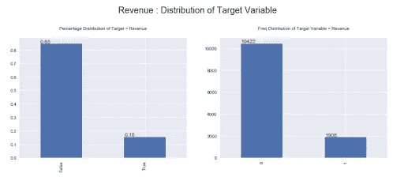

(*Image by author*)

显而易见，我们正在处理数据中的类别不平衡，因为所需的类别值(“True”)仅占总数据集的 15%。接下来，我们可以看到，当 AutoViz 提供每个数值变量的 KDE 图时，单个变量可能需要一些“处理”或“转换”。

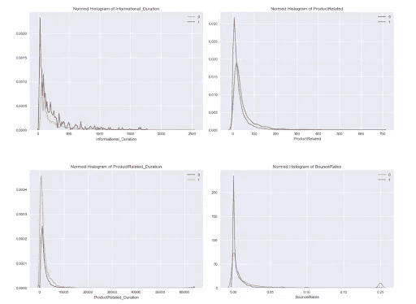

(*Image by author*)

从上面我们可以看到，所有四个变量都是右偏的，可能需要进行“对数转换”才能在线性模型中使用。这些图表将被证明在为以后的问题建模构建数据管道时非常有用。

可视化可以为不同变量之间的相互作用提供非常有力的证据。从下面的图表中可以看出，高水平的跳出率和退出率是收入流失的良好指标。他们表示，这些交易不会有收入。快速洞察，如果你知道如何阅读他们所说的“茶叶”！

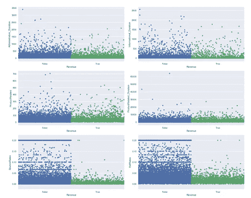

(*Image by author*)

我们可以通过检查在线购物购买的标准化直方图以及它们与某个特殊日子或节日(如情人节或圣诞节)的距离，来更深入地了解电子商务购买的时间安排。

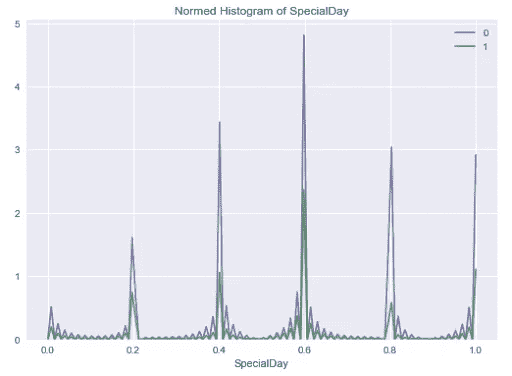

(*Image by author*)

活动高峰出现在某个特殊日子的前一周左右；尽管我们的班级不平衡，但大约 50%的游客会在这个时间窗口购买一件商品。这是一个关键的提示，当一个企业想要进行促销或瞄准潜在客户时。

# 数据集:Goodreads API

AutoViz 还能够提供使用 Goodreads API 收集的约 12，000 本书的信息可视化数据集。数据集包含图书的整体元数据，目标变量是图书的“平均评级”，这转化为回归分析。这一次，图书馆从数据集中删除了一些变量，如 ISBN 和书名，除了识别之外，它们不能提供太多的预测信息。有趣的是，它去掉了作者特征，这是我们通常认为与一本书的成功相关的东西。然而，由于在这个数据集中这是一个分类字符串变量，可能没有足够的证据来使用各种各样的作者姓名作为一个特征。

AutoViz 输出的关联热图表明，除了评级数量和书面评论数量之间的明显关系之外，大多数变量都不是高度相关的。有趣的是，页面数量和评论分数之间存在某种正相关关系。

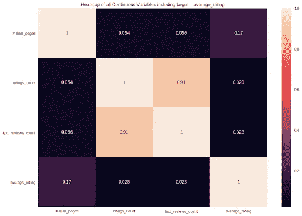

(*Image by author*)

通过分析下面的散点图，可以提取更多关于书籍页数的信息:

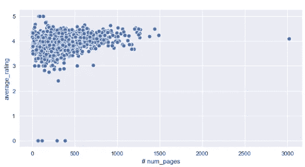

(*Image by author*)

页数较多的书籍的平均评分往往在 4 分以上。然而，值得注意的是，篇幅较短的书籍(100-250 页)能够获得高达 5 分的平均评论分数。然而，这些可能代表异常值，明智的做法是进一步检查这些高评级的书籍，以确保它们与其他条目具有相同的评论分数。总的来说，这给人的印象是，出版商可能希望将 1250-1500 页作为一本书的目标页数，以取得良好的业绩。

这些信息可以与 Goodreads 上的一本书的页数正态分布的知识相结合，因为许多书有大约 400-500 页。

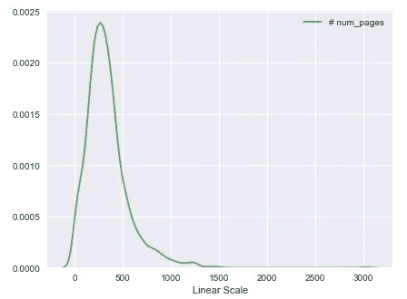

(*Image by author*)

然后，我们可以使用 AutoViz 输出的 violin 图，将一本书的页数分布与其他变量的分布进行比较。

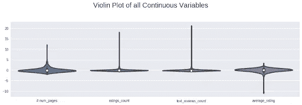

(*Image by author*)

平均图书评级也是正态分布，尽管是左偏的。负面评级可能是分布中的重要异常值。还可以观察到，一本书的评级数量看起来非常右偏；一小部分图书可能会获得过多的总评分。

# 数据集:AirBnB 房源数据

然后，AutoViz 能够熟练地可视化 AirBnB 房源数据，这些数据由位于西班牙马德里的 2 万个房源数据集提供。该数据库是托管在 [Kaggle](https://danrothdatascience.github.io/datascience/%5Bhttps://www.kaggle.com/rusiano/madrid-airbnb-data%5D(https://www.kaggle.com/rusiano/madrid-airbnb-data)) 上的 AirBnB 数据的关系集合的一部分，包括每个列表的床位和浴室数量、评论和日历预订等属性。在这个实验中，目标变量是 AirBnB 房源的评论分数。每个条目都有许多相关的特性，乍一看令人生畏。幸运的是，AutoViz 发现了许多低信息量的变量，可以排除这些变量以减少数据的方差。一些被排除在外的特征令人惊讶，例如价格、平方英尺或邻近的房源。

自动生成的图非常有助于了解不同列表的某些方面。例如，你可能会惊讶地发现，绝大多数 AirBnB 的房东会在被联系后一小时内回复。

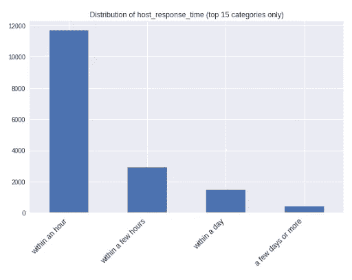

(*Image by author*)

主人提供他们的整个居住空间作为房源的一部分也很常见，尽管大约一半的时间房源可能只提供一个房间。然而，这是有道理的，一旦它被证实的事实是，大量的上市是一个公寓，而不是一个房子在马德里。

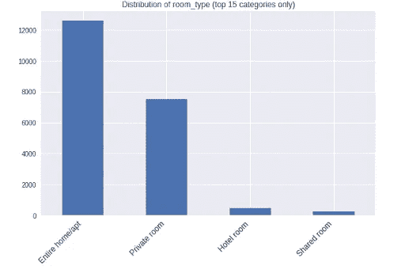

(*Image by author*)

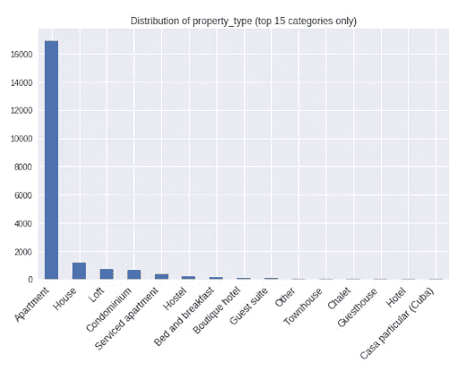

(*Image by author*)

我们的目标变量的预测因素呢？对 AutoViz 生成的热图的分析表明，与某个列表的评论评级最相关的特征是每月收到的评论数量。
许多 AirBnB 评论可能是正面的，因此这可能意味着 AirBnB 会员最好接待尽可能多的客人，并鼓励他们留下评论，因为随着时间的推移，这可以最有效地提高房源的评论分数。

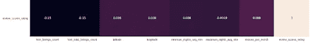

(*Image by author*)

有一个与房源审核分数负相关的特征，那就是 AirBnB 主机维护的房源数量。当列表从主持人那里得到更多个性化的关注，而不是作为不同住宿分配的一部分时，它们可能表现得更好。

# 结论

虽然这些只是 AutoViz 生成的图的一个示例，但不难看出自动化可视化是多么有帮助。在瞬间，该库能够生成高度信息化的图，并为数据科学家的建模或分析管道提供许多潜在的扩展途径。AutoViz 旨在整合到一个系统的迭代过程中。使用 AutoViz 可以有效地启动探索性数据分析(EDA );可以根据工具的分析选择要素，然后可以重复处理数据以实现自动可视化。一旦生成了强大的可视化效果，数据科学家现在就可以投入到建模中，或者用信息丰富的分析来交流数据。令人惊讶的是，自动化可视化选项如此稀少，作为一种客观和实用的工具，它有许多可以想象的用途，但 AutoViz 很好地完成了这个角色。现在让我们开始一些可视化！

你可以访问这个 jupyter 笔记本,里面包含了这些实验和其他实验。AutoViz 的 Github 库在这里[可用](https://github.com/AutoViML/AutoViz)，PyPi 页面在这里[可用](https://pypi.org/project/autoviz/)。非常感谢 AutoViz 的创建者和作者 Ram Seshadri。

*原载于 2019 年 12 月 28 日*[*https://danrothdatascience . github . io*](https://danrothdatascience.github.io/datascience/autoviz.html)*。*