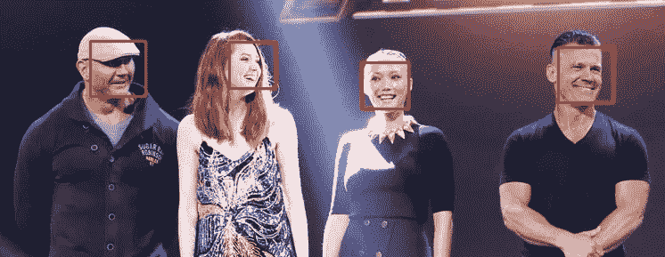
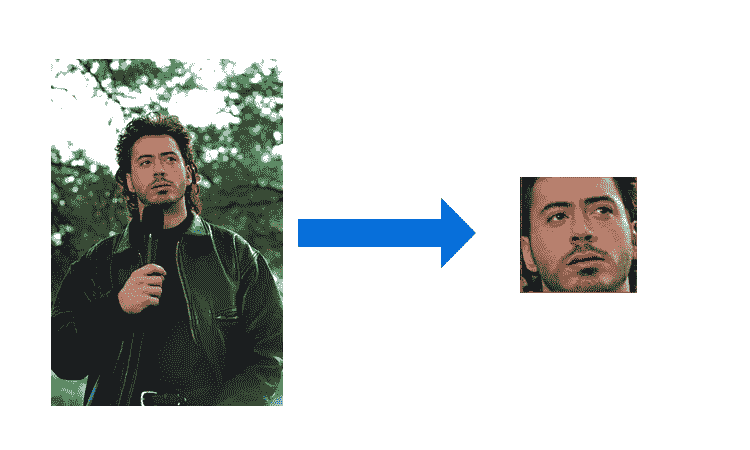
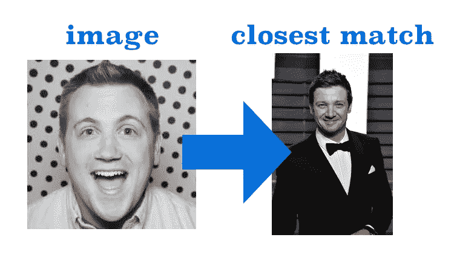
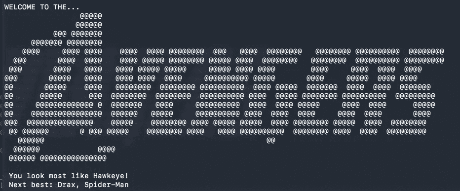

# 复仇者联盟，类似！

> 原文：<https://towardsdatascience.com/avengers-resemble-3549d60ae015?source=collection_archive---------22----------------------->

## 通过面部识别找到理想的服装



计算机视觉更有趣和更专业的用途之一是面部检测和识别。人类非常擅长识别人脸，但最近的趋势是，我们已经能够训练计算机做足够接近的工作，以保证在更多的应用中使用它。面部扭曲、老化，并向各个方向摆姿势，这给如何在多张图像中匹配它们带来了重大挑战。深度学习的进步，如 [FaceNet](https://arxiv.org/pdf/1503.03832.pdf) 研究，真正改变了游戏，使这些过程更容易执行，结果令人难以置信地准确。


Don’t look away from the Nozzle!

如果你害怕向计算机教授这样的技能意味着什么，我理解这种情绪。面部识别有许多积极的方面。举几个例子来说明它是如何非常有帮助的:在不断增长的数字世界中增加安全功能，[帮助寻找失踪人员](https://www.independent.co.uk/life-style/gadgets-and-tech/news/india-police-missing-children-facial-recognition-tech-trace-find-reunite-a8320406.html)，[帮助盲人在世界中导航](https://www.fastcompany.com/3050622/a-new-facial-recognition-mobile-app-from-listerine-helps-blind-people-see-smiles)，以及(潜在的)帮助建立更好的工具来打击犯罪。然而，隐私仍然是这项技术的主要关注点。作为一个社会，对于我们的形象被拍摄并用于某种分类目的，我们有什么样的舒适度？为了安全起见，在个人设备上可能感觉还可以，但是当你在外面的世界中得到有针对性的广告呢？这确实是一件棘手的事情，但是当我们继续研究它的时候，记住这一点很重要:

> “权力越大，责任越大”
> 
> u̶n̶c̶l̶e̶̶b̶e̶n̶̶f̶r̶o̶m̶̶s̶p̶i̶d̶e̶r̶-̶m̶a̶n̶.我，谈论面部识别

## 看起来像个英雄

这让我想到了一个使用面部识别的快速项目，希望能展示这项技术的创造性应用。

问题:快到万圣节了！你在一家服装公司工作，他们想为顾客提供一种有趣的互动方式，让他们找到最适合自己的服装。如果你使用面部识别来找到他们最像哪个演员，并根据这种匹配推荐服装，会怎么样？听起来像个计划。今年是复仇者联盟电影的重要一年，所以让我们用这些演员和他们相关的角色来创造一个复仇者联盟！

有一些很好的工具可以用于人脸检测和识别([比如 OpenCV](https://opencv.org/) )，但是我将使用 Python 库 [face_recognition](https://github.com/ageitgey/face_recognition) 进行演示。这是一个真正快速准确的包，使用 [dlib](http://dlib.net/) 的人脸识别构建，取得了一些令人印象深刻的结果(在“野生标签人脸”基准上的准确率为 99.38%)。检测图像中的人脸(查找并返回边界框位置)并获取人脸编码(人脸的矢量表示)就像三行代码一样简单:

```
import face_recognitionloaded_image = face_recognition.load_image_file('young_rdj.jpg')
face_location = face_recognition.face_locations(loaded_image)
face_encoding = face_recognition.face_encodings(loaded_image)[0]
```



厉害！只用了几行代码，我们就找到了这张脸，并将其转换成一个数字向量表示，我们可以用它来与其他图像进行比较。虽然大多数面部识别都在寻找真正的匹配(例如照片应用程序标记一张脸，并在所有其他图像中找到那个人，你的手机匹配用户的脸以允许访问)，我正在做的是寻找最好的“足够近”。以下是我为让我的复仇者联盟更相似而创建的一般工作流程和功能:

1.  下载复仇者联盟电影中每个演员的照片。我坚持以大家伙为主，甚至加入了几个 x 战警，因为漫画经典中有些也是复仇者。没有花哨的代码，只是大量的手动谷歌搜索和寻找良好的干净的图像。
2.  为图像编码过程创建一个函数，这样我就可以一次加载所有图像，并使用 list comprehension 来执行任务:

```
def image_to_encodings(file):
    """Return the face encodings from an image"""
    load_image = face_recognition.load_image_file(file)
    return face_recognition.face_encodings(load_image)[0]
```

3.通过我的函数运行所有图像，并创建一个新的字典，该字典包含角色名称及其带有面部编码的数组:

```
# Glob makes it easy to capture all jpgs filenames into a list
avengers_cast_files = glob.glob('avengers/*.jpg')# Getting character name from the file name
avengers_cast_names = [re.sub('.jpg|avengers/', '', image)
                           for image in avengers_cast_files]# Getting encodings
avengers_cast_encodings = [image_to_encodings(image)
                              for image in avengers_cast_files]# Creating dictionary with these new details
avengers_dictionary = {name: encoding for name, encoding 
                       in zip(avengers_cast_names, 
                              avengers_cast_encodings)}
```

4.酸洗我的编码字典。这使得我以后可以轻松打开它，而不必对我的已知面孔重新运行 face_recognition:

```
outfile = open('avengers_features.pkl','wb')
pickle.dump(avengers_dictionary,outfile)
outfile.close()
```

5.创建一个函数，根据已知的编码返回图像的最佳匹配:

```
def top_match(known_encodings, known_names, new_image_embed):
    """With list of known image names/encodings, 
        return closest match"""
    distances = face_recognition.face_distance(known_encodings, 
                                               new_image_embed)
    top = np.argmin(distances)
    return known_names[top]
```

6.测试添加新图像并查看最接近的匹配:

```
me = image_to_encodings('me.jpg')
top_match(list(avengers_dictionary.values()),
          list(avengers_dictionary.keys()),
          me)
```



鹰眼！我要了。

如果你想亲自尝试，你可以在 GitHub 上查看我的代码。它目前可以在终端上运行，带有一些有趣 ASCII 装饰:



这可能是最好的 web 应用程序，我可能会尝试进一步构建，但有趣的是看到这是如何工作的原则。尽情享受吧！