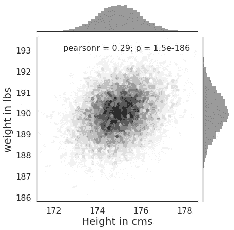
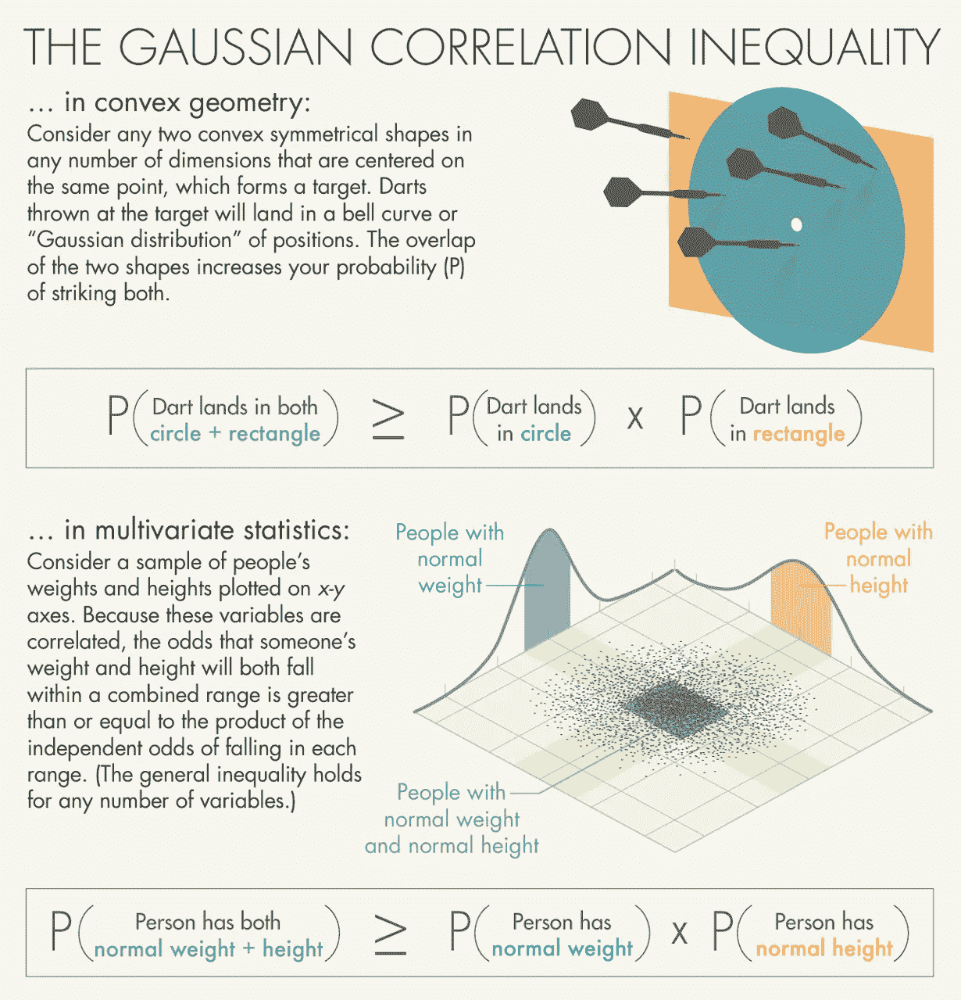
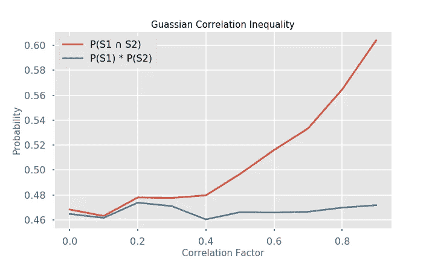
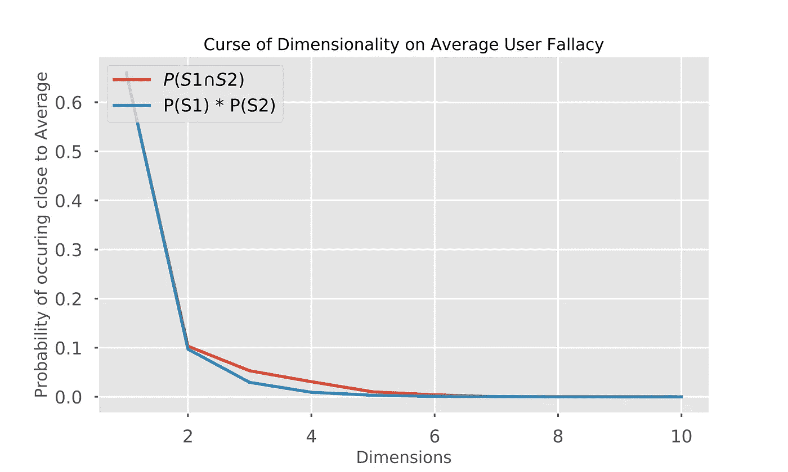

# 为普通用户设计的危险

> 原文：<https://towardsdatascience.com/average-user-fallacy-131a5ea90753?source=collection_archive---------22----------------------->


[Luke Tucker](https://luketucker.com/why-designing-for-the-average-is-designing-for-no-one/)

> 两个理论——一个思想实验——数字模拟——高斯相关说 whaaa——一个尺寸永远不会适合所有人——印度妈妈，最好的优化器

我最近遇到了两个概率理论，一个来自一个 T2 的朋友，另一个来自一个精彩的 T4 播客。在这篇文章中，我试图用《Think X》系列丛书的作者艾伦·唐尼的一个观点来解释这两种理论。我强烈推荐的 Think X 系列的前提是，如果你知道如何编程，你可以用这种技能来学习其他主题。这两种理论有一个共同点。


Image [Source](https://photodune.net/item/fashion-designer-designing-a-dress-on-mannequin/22928053)

让我们从一个思维实验开始。你是一家领先零售商新冬装系列的首席设计师。你有来自全国几家分店的现有和潜在顾客的身体尺寸数据。身体尺寸包括身高、体重、臀围、膝宽等。你的任务是提出适合大多数人的最佳标准设计。在验证所有主体尺寸大致遵循正态分布后，您得出结论，最好的方法是使用所有这些尺寸的平均值来达到您的最佳设计。

让我们来表示，

S1——距离平均身高在±K 标准差范围内的所有人的集合，S2——距离平均体重在±K 标准差范围内的所有人的集合…Sn。—距离实体 n 的平均值±K STD 范围内的所有人的集合。您明白了。

以上几组代表了接近平均水平的人，他们可以穿着为普通人设计的服装而不会引起太多骚动。谬误的根源在于这样一个事实，当你增加维度的时候，论点就分崩离析了。即使你通过为普通用户设计来最大限度地增加穿你设计的人，当你从多个角度看时，接近平均水平的人的数量很快接近零。当考虑到维数灾难时，一般用户谬误虽然有趣，但事后看来却很幼稚。

> 空谈不值钱。给我看看代码。莱纳斯·托沃兹。

尽管理论很吸引人，但它们几乎没有保留价值。为了说明这一点，我将尝试唐尼的方法，通过代码和模拟来理解它。

在上面的例子中，普通用户谬论没有解决的一个关键问题是维度之间的相关性。例如，身高和体重之间有很强的相关性。一个人越高，他认为所有的事情都是平等的。同样，人越高，膝盖越长。

我们假设平均身高 175 cm，平均体重 190 lbs。

```
mean = np.array([175, 190]) 
samples = 10000
corr_factor = 0.3
corr_matrix = np.array([[1.0, corr_factor],
                        [corr_factor, 1.0]])
```

假设它们与相关因子 **0.3** 相关，让我们尝试模拟来自高斯分布的数据。为了模拟多元相关数据，我们执行以下操作:

```
Correlated Data = Mean + Covariance * Uncorrelated Gaussian Data.
```

我们需要协方差来从不相关数据生成相关数据。协方差是相关矩阵的平方根。我们可以使用 [Cholesky 的分解](https://en.wikipedia.org/wiki/Cholesky_decomposition)来得到它，虽然方法并不精确。

```
chol = np.linalg.cholesky(corr_matrix)
```

通过取平方从协方差矩阵中恢复相关矩阵，确保 Cholesky 分解有效。

```
assert (
    ~np.isclose(chol @ np.transpose(chol), corr_matrix)
).sum() == 0, "Cholesky not working"
```

从不相关数据生成相关数据，

```
uncorr_data = np.random.randn(2, samples)print(f"Correlation of randomly generated data - \n{np.corrcoef(uncorr_data)}")corr_data = np.reshape(mean, [2, 1]) + chol @ uncorr_dataprint(f"Correlation of correlated data - \n{np.corrcoef(corr_data)}")>>> Correlation of randomly generated data - 
[[ 1\.         -0.02200527]
 [-0.02200527  1\.        ]]
Correlation of correlated data - 
[[1\.         0.28526392]
 [0.28526392 1\.        ]]
```

正如你所看到的，得到的相关性并不完全是 0.3。这取决于生成的样品组和样品大小。



A joint plot of Height vs Weight

体重和身高的平均值不同，但标准差相同。循环遍历数据集，找到距离平均值 K=1 个标准差范围内的点。

```
k = 1
normal_height = (corr_data[0] > mean[0] - k) & (
    corr_data[0] < mean[0] + k
)
normal_weight = (corr_data[1] > mean[1] - k) & (
    corr_data[1] < mean[1] + k
)
normal_height_weight = normal_height & normal_weight
```

`normal_height` 是一个二元向量，表示与平均身高的 K 个标准偏差内的所有值，对于`normal_weight`也是如此。`normal_height_weight` 是这两种情况的交集。

这为我们的第二个理论[高斯相关不等式](https://en.wikipedia.org/wiki/Gaussian_correlation_inequality)提供了一个很好的切入点。在转换话题之前，请记住，我们正试图说明增加维度是如何减少接近平均水平的人数的。



*Lucy Reading-Ikkanda/Quanta Magazine*

形象乍一看很混乱，名字也很拗口。让我们试着分解它。让我们从乘法的基本规则开始，

P(A ∩ B) = P(A) * P(B)，给定事件，是独立的。

但是在我们的例子中，我们知道 A 和 B 不是独立的，它们是相关的，由相关矩阵给出。

P(A ∩ B) = P(A) * P(B|A)。

高斯相关不等式表明，

P(A ∩ B) >= P(A) * P(B)

在我们的方案中，用 S1 和 S2 代替 A 和 B，我们知道 P(S1)和 P(S2) ~ 0.68，因为在高斯随机变量中，68%的数据落在钟形曲线均值的±1 标准偏差内

将 P(S1 ∩ S2)和 P(S1) * P(S2)相对于各种相关值绘图清楚地表明，当存在最小相关时，它们是相同的，但是当存在强相关时，P(S1 ∩ S2)稳定地开始增加，而 P(S1) * P(S2)保持相当恒定。



现在回到平均用户谬误，我们知道 P(S1 ∩ S2)小于 P(S1)，这意味着用户下降的概率从平均值±K STD 下降，因为你增加维度，尽管维度之间的相关性。

让我们模拟 n 维的相关数据，看看维数灾难对平均用户谬误的影响。我们将随机化维度之间的相关因子。

```
corr_values = np.random.random(((ndim ** 2 - ndim) // 2) - 1)
corr_matrix = np.identity(ndim)for row in range(0, ndim):
 for col in range(0, ndim):
  if row != col:
   corr_matrix[row][col] = corr_values[row + col - 1]
```



从上图可以明显看出，不考虑相关性，随着维度的增加，出现在跨维度均值附近的概率迅速降低，趋近于零。

你可以在这个笔记本里找到完整的代码。

# **一刀切:**

对于那些宽容的读者来说，让我们来看看一个为普通用户设计的可怕错误的真实例子。

[99pi](https://99percentinvisible.org/)—

> 在第二次世界大战期间，美国空军迅速扩张，伴随着性能下降和一连串的死亡，甚至在训练期间。多年来，空军的高死亡率一直是个谜，但在归咎于飞行员和他们的训练计划后，军方终于意识到驾驶舱本身是罪魁祸首，它不适合大多数飞行员。起初，他们认为这个数字太小了，而且自 20 世纪 20 年代以来，男性的平均年龄有所增长，所以在 1950 年，他们请俄亥俄州莱特空军基地的研究人员计算新的平均值。
> 
> 其中一名研究人员是年轻的哈佛毕业生吉尔伯特·s·丹尼尔斯。在他的研究中，测量了数千名飞行员的 10 个关键身体维度，丹尼尔斯意识到，他测量的飞行员没有一个在所有 10 个维度上都是平均水平。一个都没有。当他只看三维时，平均只有不到百分之五。丹尼尔斯意识到，为普通飞行员设计的东西，实际上并不适合任何人。

重温我们开始时的思想实验，作为一名首席设计师，现在知道了一般用户的谬误，你应该如何着手优化你的设计？在一个不受资源限制的理想世界中，解决方案应该是为每个人量身定制一套测量方法。但是现实世界从来没有那么简单。你总是被约束所束缚，需要取得平衡。一方面，你目睹了为普通人设计的恐怖，另一方面，定制适合每个人是不可能的。

# **印度妈妈，最佳优化师:**


[BeingIndian](https://www.youtube.com/channel/UChAlpEbfW1y9auiBC08ZwGQ)

普通用户谬误并非无处不在。例如，如果您正在设计一把椅子、一个汽车座椅或一个现代化的驾驶舱，您并不局限于固定的尺寸。您可以使用杠杆和其他机构来让众多的身体尺寸舒适地接触到它们。这些动态系统让用户可以在连续的设计空间中无缝导航。但是有些设计本质上受制于普通用户的谬误。这些系统内部具有一定的刚性，使其无法进行动态调整。

裙子就是一个完美的例子。一旦购买，大小保持不变。因此，服装制造商基于利润最大化的动机，试图接触尽可能多的人，同时仍然减少他们必须生产的不同尺寸的品种。这就产生了以 S、M、L、XL 等不同的离散时间间隔制作衣服的系统，从而解决了普通用户的谬误问题。让我们考虑一下最糟糕的情况，裙子开始缩水，你开始增重，测试你裙子的完整性。这似乎是一个不可能解决的问题，但对一个印度妈妈来说不是。她如何解决这个难题相当巧妙。她单枪匹马地决定你将得到一个比你目前的大小，以支持她的格言，

*“你从来不为你现在的自己买，而是为你将成长为的那个人买”。*

然后，她骄傲地从您身边走过，完全知道她得到了您想要的，同时优化了产品的寿命，从而降低了长期成本。如果这不是一个完美的优化，我不知道是什么。