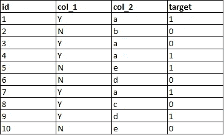
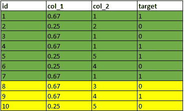
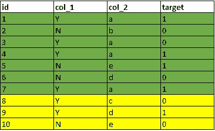
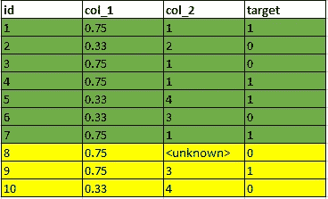

# 避免数据泄露—在处理之前拆分您的数据

> 原文：<https://towardsdatascience.com/avoid-data-leakage-split-your-data-before-processing-a7f172632b00?source=collection_archive---------23----------------------->

## 生产中模型失败的一个潜在原因

Kai Kai @ River Safari Singapore

> **经验法则:**在对数据进行任何处理之前，将数据集分成训练集和测试集。否则可能会有数据泄漏，使模型评估过于乐观。

你们中的一些人可能有这样的经历:

*   您的模型在您的本地测试集上得分很高，但在 Kaggle 排行榜上表现不佳
*   您的模型在概念验证期间正常工作，但在生产环境中会急剧下降

这些可能是由于**数据泄露**造成的。

## 什么是数据泄露？

数据泄漏是指训练数据集和测试数据集之间意外共享信息。这种信息共享会给模型一个关于测试数据集的“提示”,并生成看似最佳的评估分数。然而，由于模型过度拟合测试数据，它无法准确预测未来的未知数据集，即 Kaggle 测试数据或生产实况数据。

数据泄露的一个常见原因是由于**列车数据处理后的测试分割。**

## 示例:处理后由于分割导致的数据泄漏

假设我们有以下数据集，并希望使用列 1 和列 2 来预测目标。

按顺序执行以下步骤:

Example: raw dataset for classification

Example: train test split after processing

1.  将第 1 列中的 Y 和 N 替换为其各自的目标平均值。
2.  标签根据词汇顺序对列 2 进行编码。
3.  分割数据集。前 7 行用于训练，后 3 行用于测试。
4.  使用训练数据训练模型，并根据测试数据进行验证。

**发生数据泄露！**

对于步骤 1，Y 的值是用 4 / 6 计算的，这表明数据集中有 6 个 Y，其中 4 个有正目标。由于数据在处理后被拆分，这些信息会在训练数据集和测试数据集之间意外共享。在第 4 步中，模型从 4 个 y 开始训练，并以某种方式“期望”测试数据中的两个 y，其中一个具有正目标。这会导致对模型性能的预期过于乐观。

类似地，对于步骤 2，第 5 行的字母*‘e’*被编码为 5，因为它知道完整的数据集具有’*‘a’*，‘*b’*，*‘c’*和*‘d’。*这些信息也在训练和测试数据之间泄露。

## 简单的解决方案:在处理前拆分

上面提到的问题有非常大的负面影响，但是解决方案很简单——在处理之前分割。让我们用相同的例子，但不同的步骤:

Example: train test split before processing

Example: transform train and test data with same encoders

1.  分割数据集。前 7 行用于训练，后 3 行用于测试。
2.  对于训练数据:将第 1 列中的 Y 和 N 替换为它们各自的目标平均值。标签根据词汇顺序对列 2 进行编码。保存这些编码器。
3.  对于测试数据:用相同的编码器转换数据。
4.  使用训练数据训练模型，并根据测试数据进行验证。

请注意，Y 被替换为 0.75，因为训练数据中有 4 个 Y，其中 3 个有正目标。字母*‘e’*编码为 4，因为训练数据中没有*‘c’*。测试数据被认为是前所未见的，并遵循类似的模式。因此，它们用来自训练数据的相同编码器进行变换。

首先拆分数据有两个主要好处:

1.  降低数据泄露的风险。
2.  未来看不见的数据将以与测试数据完全相同的方式处理，从而确保模型性能的一致性。

感谢阅读！