# 避免这些致命的建模错误，这些错误可能会让你失去职业生涯

> 原文：<https://towardsdatascience.com/avoid-these-deadly-modeling-mistakes-that-may-cost-you-a-career-b9b686d89f2c?source=collection_archive---------10----------------------->

我喜欢看到数据科学家使用高级包，创建令人眼花缭乱的展品，并试验不同的算法。数据科学家可以让电脑燃烧一整天。一件很酷的 t 恤、一杯咖啡和一台笔记本电脑——这就是他或她所需要的一切。虽然他们的名字听起来很疯狂，但一些数据科学家新手不断犯常见的错误——我称之为致命错误。这些基本的错误会损害数据科学家的可信度，并可能让一个有前途的数据科学职业生涯付出代价。我在这篇文章中的目标很简单:我希望你在读完这篇文章后，永远不要犯这种类型的错误。Python 和 R 代码都有提供。

我写过关于各种数据科学主题的文章。为了方便使用，你可以将我的总结文章“[数据人学习之路——培养你的技能，推动你的职业发展](https://medium.com/@Dataman.ai/dataman-learning-paths-build-your-skills-drive-your-career-e1aee030ff6e)”加入书签，这篇文章列出了所有文章的链接。

**(1)为什么“日期时间”变量是最重要的变量？**

请小心 yymmdd:hhmmss 格式的任何 DateTime 字段。您不能在任何基于树的方法中使用此变量。如图所示，这个变量出现在变量重要性图表的顶部。原因是这个字段几乎成为每个记录的唯一标识符。这就好像您在决策树中使用了“id”字段。我确信你需要导出年、月、日、工作日等等。从这个领域。记住，特征工程是捕捉可重复的模式，比如一年中的月或周，来预测未来。在某些模型中，您可能会使用“年份”作为变量来解释过去的任何特殊波动。但是您永远不会使用原始日期时间字段作为预测值。

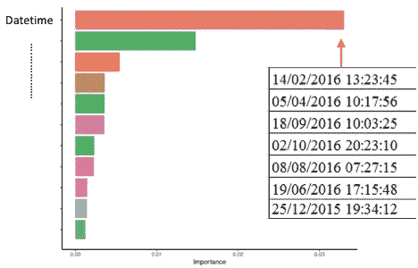

**(2)小心变量**中的‘0’、‘99’或‘999’

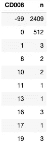

它们通常是缺失值，被系统设置为极值。在参数回归中，不要盲目地将它们用作数值。“-99”和“-999”可能由不同的系统设置。它们携带一些独特的信息，不会随机丢失。这个普遍存在的问题不能由诸如库(mice)这样的软件盲目处理。

**(3)连续变量有' NA '，' 0 '，'-99 '或'-999 '怎么办？**

我建议您将连续变量绑定，将特殊值“0”、“99”和“NA”作为它们的类别(可能还有其他方法)。首先，你可以得到变量的切割点:

**R 代码:**

分位数看起来像这样:

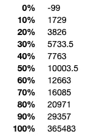

然后使用上述切割点来绑定变量，以创建一个新的变量。下面的代码也保留了特殊值。我使用函数`cut()`将连续变量切割成分类变量。我使用`case_when()`来分配'-999 '、'-99 '、' 0 '和' NoData '(注意这种语言是 R 语言，但是这个概念也适用于其他语言。)

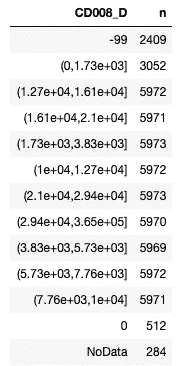

**Python 代码:**

`pd.qcut()`将数值离散化成大小相等的桶。缺失数据怎么办？所以我用`add_categories()`添加了一个新的类别。记住`pd.qcut()`产生的数据类型是分类的，而不是字符串。

**(4)你强制一个分类变量成为基数变量**

基数变量是数值变量，其值是有序的。非基数变量，通常是分类变量，是其值不能排序的变量。例如，变量性别“男性”和“女性”的值不能排序。

假设您需要将一个分类变量(比如性别)转换为一个数值变量来运行回归。假设您将 1 分配给“男性”，将 2 分配给“女性”。您错误地将分类变量强制为基数变量！

下面是具有值“h5”、“android”、“api”和“ios”的分类“AP006”。我打印出每个值和前 20 条记录的计数统计数据(第一条记录是“android”，第二条是“h5”，依此类推。)值“h5”没有理由高于或低于其他值，即，没有基数性质。如果如下创建一个新变量“newvar ”,品牌“android”的价值就荒谬地比“h5”的价值高两倍。这个错误应该避免。

**R 代码:**

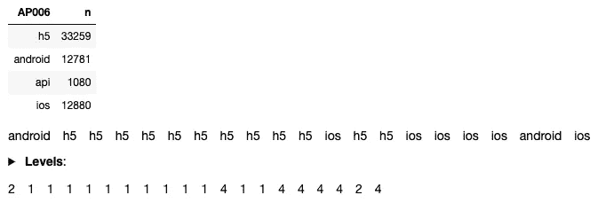

**Python 代码:**

你需要做的是使用`pd.get_dummies(train['AP006'],dummy_na=True)`创建虚拟变量。有关更多处理方法，请参见“[将分类变量编码为数字的数据科学家工具包](/a-data-scientists-toolkit-to-encode-categorical-variables-to-numeric-d17ad9fae03f)”。

**(5)预测中的新分类值**

假设您将训练好的模型应用于测试数据，并得到一条错误消息。你意识到测试数据中的一个变量比训练数据中的一个变量有更多的类别。下面我用一个例子来说明。测试数据中的变量“Education”有一个不在训练数据中的额外类别“Ph.D .”。这个错误导致您的预测停止，并且该观察没有接收到预测值。

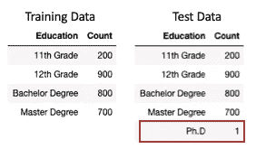

在 Kaggle 比赛中，通常有三个数据集:训练、测试和提交。在您的训练和测试数据中，您可能有很好的模型性能，但是您的模型在您的提交性能中失败得很惨。提交数据中的变量可能具有在训练或测试数据中看不到的新类别。即使您重新对数据进行了采样或者选择了不同的方法来创建培训和测试数据，也可能会出现此问题。

以下两种方法处理这个问题。首选方法 1。

方法 1:将任何未知值适当编码为“其他”或者合并到另一个类别中。这是一个很好的编程实践:即使您在训练数据中看不到任何新值，您仍然会保留一个类别，以备可能会有新值。下面的代码将任何未知组合成“硕士及以上学历”。以便相应地组合测试数据中的“博士”记录。

**R 代码:**

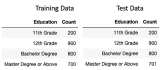

方法 2:使用你的训练和测试数据来创建新的变量。在这种情况下，将观察到新的类别“博士”。然而，这种方法仍然不能避免任何未来的未知值。

**Python 代码:**

 [## 通过我的推荐链接加入 Medium-Chris Kuo/data man 博士

### 阅读 Chris Kuo/data man 博士的每一个故事。你的会员费直接支持郭怡广/戴塔曼博士和其他…

dataman-ai.medium.com](https://dataman-ai.medium.com/membership) 

**(6)忘记处理回归中的异常值**

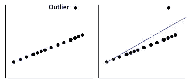

展示中的异常值导致你的回归倾向于那个观察值。你的预测会有偏差。所以记得把你的因变量和自变量分别削减到 1%和 99%。这意味着如果一个变量的值低于 1%，你将把它设置为 1%，如果高于 99%，把它限制在 99%。有些人可能会尝试 5%和 95%。

**(7)要求线性回归中因变量的正态假设**

因变量 Y 不需要遵循正态分布，但是预测 Y 周围的**误差应该遵循正态分布*。数据科学家经常从因变量的直方图中检查正态假设。在这种特殊情况下，如果因变量服从正态分布，那么误差将是。然而，概念是*线性回归的误差应遵循正态分布，或者因变量具有条件正态分布。*回想一下线性回归的定义:在 X 的每一个值上，都有一个正态分布的 Y 的条件分布。线性回归的四个基本假设是:*

*   *X 和 Y 之间的关系是线性的*
*   *误差呈正态分布*
*   *误差的同方差(或者，线周围的等方差)。*
*   *观察的独立性。*

*根据大数定律和中心极限定理，线性回归技术中的普通最小二乘(OLS)估计仍将近似正态分布在真实参数值周围。因此，在大样本中，即使因变量违反了“正态假设”规则，线性回归技术的使用仍然有效。*

***(8)要求线性回归中预测值的正态假设***

*预测者的 Xs 怎么样？回归并不假设预测值有任何分布。唯一的要求是检查是否存在异常值(您可以使用箱线图来检查异常值)。如果是，应该对预测值应用封顶和垫底技术。*

***(9)你在决策树中做分布假设吗？***

*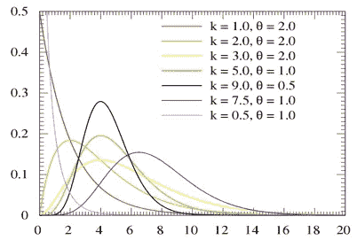*

*在参数形式(如线性回归)中，您检查目标变量的分布以选择正确的分布。例如，如果目标变量显示伽玛分布，则在广义线性模型(GLM)中选择伽玛分布。然而，**决策树不对目标变量做出假设。**处理决策树的基本原则是将每个父节点分割成尽可能不同的节点。它没有对原始群体或最终群体的分布做出任何假设。因此，在实现决策树时，分布的性质并不重要。*

***(10)在决策树中，你是否对预测因子进行了封顶和保底？***

*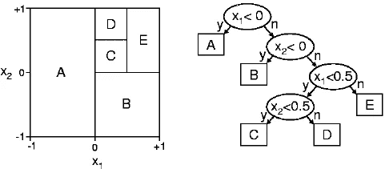*

*在参数形式(如线性回归)中，您必须通过将异常值限制在 99%(或 95%)和 1%(或 5%)来处理异常值。在基于树的算法中，你不需要在决策树中做封顶和垫底。或者换句话说，决策树算法对异常值是鲁棒的。树算法基于相同的值分割数据点，因此异常值不会对分割产生太大影响。这取决于您对超参数的设置。*

***(11)我的树中没有显著的变量或者只有很少的变量***

*您可能将复杂性参数(cp)设置得太高。复杂性参数(cp)部分是每个节点所需的模型的最小改进。这是分割该节点改善相对误差的量。如果分裂原始根节点将相对误差从 1.0 降低到 0.5，则根节点的 CP 是 0.5。*

***(12)决策树中存在多重共线性的变量是否丢弃？***

*当多元回归模型中的一个预测变量可以通过其他预测变量以相当高的准确度进行线性预测时，就会发生多重共线性。当您为分类变量创建虚拟变量时，您在回归模型中删除了一个变量。**然而，决策树和提升树算法不受多重共线性的影响。**在完全相关的变量中，决策树将只选择一个提供最佳分割的变量。*

***(13)忘记标准化 K-means 中的变量***

*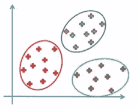*

*K 均值聚类可能是最流行的无监督技术。它给你很好的聚类结果。但是，如果不将变量标准化到相同的量级，聚类结果和业务应用可能是灾难性的。*

*我用一个简单的例子来解释一下。假设 P1、P2 和 P3 在(X，Y)空间中的位置是(3000，1)、(2000，2)、(1000，3)。K-means 计算出 P1 和 P2 之间的距离为 1000.0005。因为 X 的量级支配 Y，结果被 X 错误地驱动*你需要做的就是把 X 和 Y 拉到同一个量级。*在本例中，X 被带到 X2，用于 K-means 计算距离。*

*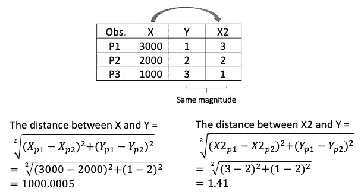*

*这里我提供几个方法:*

***(1)缩放至(0，1):***

*r 代码:*

*Python 代码:*

***(2) Z 分数:***

*r 代码:*

*Z-score 的 Python 代码可以在下面找到。*

***(13)独立标准化训练和测试数据***

*当您标准化数据以训练您的模型时，请记住只有训练数据用于拟合定标器转换，然后定标器用于转换测试输入数据。一个常见的错误是独立缩放 x_train 和 x_test。*

*下面是正确的做法。`StandardScaler()`用于从 x_train 数据中学习比例，然后应用于测试数据。*

*为什么我们不能对训练数据和测试数据分别进行独立的扩展呢？让我来说明建模的目的。一个模型将被用来对未来的未知数据进行评分。我估计你也同意，如果训练数据有了尺度，那么未来的数据也应该先有尺度，再由你的模型打分。我们不知道未来数据的均值和标准差，我们假设它们的行为与训练数据相同。因此，我们只能使用训练数据的平均值和标准差来应用于测试数据。让我用一个极端的例子来说明这一点。假设未来数据漂移并变得与训练数据非常不同，则未来数据的均值和标准差将不同于训练数据的均值和标准差。这种数据漂移是严重的，应该向模型用户发出警告。对数据漂移现象感兴趣的读者，推荐阅读《[监控你的机器学习模型性能](https://medium.com/dataman-in-ai/monitor-your-machine-learning-model-performance-23b9e9772ca8)》一文。*

* [## 通过我的推荐链接加入 Medium-Chris Kuo/data man 博士

### 阅读 Chris Kuo/data man 博士的每一个故事。你的会员费直接支持郭怡广/戴塔曼博士和其他…

dataman-ai.medium.com](https://dataman-ai.medium.com/membership)*