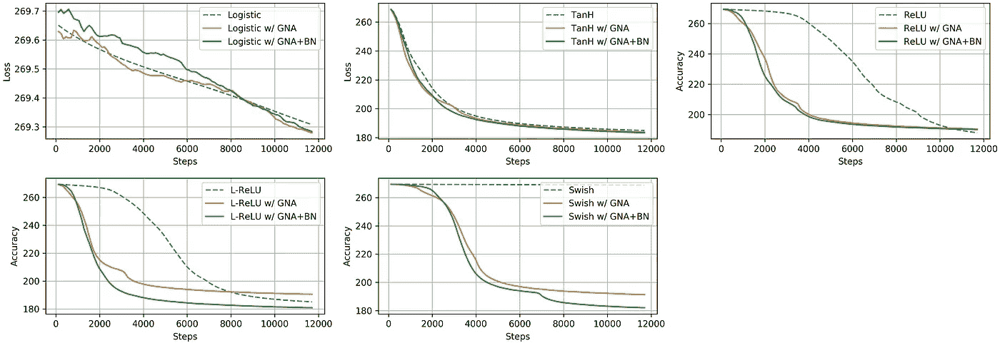

# 使用梯度噪声添加避免消失梯度问题

> 原文：<https://towardsdatascience.com/avoiding-the-vanishing-gradients-problem-96183fd03343?source=collection_archive---------24----------------------->

> 也发表在[https://afagarap . works/2019/09/05/avoiding-vanishing-gradients . html](https://afagarap.works/2019/09/05/avoiding-vanishing-gradients.html)

# 介绍

神经网络是用于逼近函数的计算模型，该函数对数据集特征 ***x*** 和标签 ***y*** 之间的关系进行建模，即 ***f(x) ≈ y*** 。神经网络通过学习最佳参数 ***θ*** 来实现这一点，使得预测***f(x；θ)*** 和标签 ***y*** 最小。它们通常借助于在输出层观察到的误差的反向传播，通过基于梯度的算法进行学习。

Illustrated using [NN-SVG](http://alexlenail.me/NN-SVG/index.html). A feed-forward neural network with two hidden layers. It learns to approximate the target label **y** by learning the appropriate ***θ*** *parameters with the criteria of minimizing the difference between its output label* ***f(x;******θ)*** *and target label* ***y****.*

通过这种学习范式，神经网络在一些任务中产生了有希望的结果，如图像分类([Krizhevsky et al .(2012)](http://papers.nips.cc/paper/4824-imagenet-classification-with-deep-convolutional-neural-networks.pdf)；【何等(2015) )、图像生成([布洛克等(2018)](https://arxiv.org/abs/1809.11096)； [Goodfellow 等人(2014)](http://papers.nips.cc/paper/5423-generative-adversarial-nets)；[拉德福德等(2015)](https://arxiv.org/abs/1511.06434)；[朱等(2017)](http://openaccess.thecvf.com/content_iccv_2017/html/Zhu_Unpaired_Image-To-Image_Translation_ICCV_2017_paper.html) 、语言建模([德夫林等(2018)](https://arxiv.org/abs/1810.04805)；[霍华德和鲁德(2018)](https://arxiv.org/abs/1801.06146) 、音频合成([恩格尔等人(2019)](https://arxiv.org/abs/1902.08710)； [Oord 等人(2016)](https://arxiv.org/abs/1609.03499) )，以及图像字幕( [Vinyals 等人(2015)](https://www.cv-foundation.org/openaccess/content_cvpr_2015/html/Vinyals_Show_and_Tell_2015_CVPR_paper.html)；[徐等(2015)](http://proceedings.mlr.press/v37/xuc15.pdf) 等。然而，对于神经网络来说，这种优势并不总是如此。在 2012 年通过赢得 ImageNet 挑战赛而东山再起之前，训练神经网络是出了名的困难。

困难是由许多问题造成的，例如，计算能力和数据不足以利用神经网络的全部潜力。在很大程度上，这是因为神经网络对初始权重很敏感( [Glorot 和 Bengio，2010](http://proceedings.mlr.press/v9/glorot10a/glorot10a.pdf?hc_location=ufi) )，并且由于以下任何一个或两个原因，当梯度值降低到无穷小的值时，它们往往会过早地停止学习( [Hochreiter 等人，2001](https://www.bioinf.jku.at/publications/older/ch7.pdf)):(1)它们的激活函数具有小范围的梯度值，以及(2)它们的深度。这种现象被称为*消失梯度*问题。

上述问题的第一个原因是我们对这篇文章的关注。换句话说，当我们用基于梯度的算法和反向传播来训练深度神经网络时，会出现*消失梯度*问题，其中通过每个隐藏层反向传播的梯度减小到无穷小的值，模型学习所需的信息不再存在。

自然，已经提出了许多解决方案来缓解这个问题，例如，使用不同的激活函数( [Nair 和 Hinton，2010](https://www.cs.toronto.edu/~hinton/absps/reluICML.pdf) )，以及使用剩余连接( [He 等人，2016](http://openaccess.thecvf.com/content_cvpr_2016/html/He_Deep_Residual_Learning_CVPR_2016_paper.html) )。在本文中，我们以激活函数的形式回顾了消失梯度问题的许多提议的解决方案，但是我们将我们的架构限制为前馈神经网络。我们还将研究一种实验方法，这种方法可以帮助避免消失梯度问题，也可以帮助它们更快更好地收敛。

# 批量归一化的梯度噪声添加

已经提出了几个研究工作来解决消失梯度问题，这些工作包括但不限于引入新的激活函数和新的架构。

最简单的神经网络结构将由具有逻辑激活函数的隐藏层组成，该逻辑激活函数用基于梯度的学习算法和反向传播来训练。这种架构的问题是其激活函数将隐藏层值压缩为[0，1] ∈ ℝ.用该函数反向传播的梯度具有最大值 0.25(见表 1)，因此这些值变得饱和，直到没有更多有用的信息供学习算法用于更新模型的权重。

Table 1\. Activation functions for neural nets, together with their respective derivatives, and critical point values.

多年来，这个问题的主流解决方案是使用双曲正切，最大梯度值为 1(见表 1)。然而，梯度值仍然会因该函数而饱和，这可以从图 1 中看到。因此，引入了校正线性单位(ReLU)激活功能( [Nair 和 Hinton，2010](https://www.cs.toronto.edu/~hinton/absps/reluICML.pdf) )。

ReLU 激活函数具有相同的最大梯度值 1，但其优于逻辑函数和双曲正切函数的优势在于其激活值不会饱和。然而，ReLU 具有其自身的缺点，即，由于其最小梯度值为 0，它触发了“死亡神经元”的问题，即，神经元没有激活值。所以，是的，即使它避免了非负值的饱和，它的负值也会触发死亡神经元现象。

由于这个缺点，ReLU 的变体之一是 Leaky ReLU，它有一个简单的修改，具有略高于零的下限。反过来，这种修改允许模型避免饱和梯度值和“死神经元”问题。

Figure 1\. Plotted using [matplotlib](https://matplotlib.org/). Activation function values, their gradients, and their noise-augmented gradient values. For instance, adding Gaussian noise to the gradients of the logistic activation function increases its maximum value, i.e. from 0.25 to approximately 1.047831 (from a Gaussian distribution having a mean value of 0 and a standard deviation value of 0.5).

但是，尽管进行了这种修改， [Ramachandran 等人(2017)](https://arxiv.org/abs/1710.05941v1) 声称已经开发出了一种比 ReLU 更好的功能，即“Swish”激活功能。上述函数可以描述为逻辑加权线性函数，其最大梯度值约为 1.0998(如表 1 所示)，在 CIFAR 数据集(使用 ResNet)、ImageNet 数据集(使用 Inception 和 MobileNet)和机器翻译(使用 12 层变压器模型)上的性能优于 ReLU。

虽然这些解决方案更侧重于制定新的激活以改善神经网络的学习，但 [Neelakantan 等人(2015)](https://arxiv.org/abs/1511.06807) 的工作介绍了一种简单而有效的改善神经网络性能的方法。该方法是简单地添加梯度噪声，以改善非常深的神经网络的学习(见等式。1).它不仅提高了神经网络的性能，而且有助于避免过拟合问题。虽然作者没有明确说明他们提出的解决方案旨在缓解消失梯度问题，但可以这样看，因为训练期间计算的梯度是膨胀的，因此有助于避免导致消失梯度问题的饱和梯度值。

Eq. 1\. The gradient noise addition approach for improving the learning of deep neural networks.

时间步长 *t* 处的标准偏差σ然后通过以下等式迭代退火，

Eq. 2\. The annealing function helps to shift the gradient values away from zero during early training iterations.

在 [Neelakantan et al. (2015)](https://arxiv.org/abs/1511.06807) 的原始论文中，η参数是从{0.1，1.0}中选取的，而γ参数在他们所有的实验中都被设置为 0.55。

TensorFlow 2.0 用于实现本文实验的模型及其计算。为了实现退火梯度噪声添加，我们简单地增加使用`tf.GradientTape`计算的梯度，通过添加来自等式 1 产生的高斯分布的值。1 和 Eq。2.也就是说，使用`tf.add`，如代码片段 1 的第 7 行所示。

Snippet 1\. Model optimization with annealing gradient noise addition.

最后，这种方法通过使用批量标准化得到进一步增强([约夫和赛格迪，2015](https://arxiv.org/abs/1502.03167) )。因此，利用这种方法，在训练会话开始期间，层激活将被迫呈现单位高斯分布。

# 实证结果

在接下来的实验中，MNIST 手写数字分类数据集( [LeCun，Cortes，and Burges，2010](http://yann.lecun.com/exdb/mnist/) )用于训练和评估我们的神经网络。每个图像都被整形为 784 维向量，然后通过将每个像素值除以最大像素值(即 255)进行归一化，并添加来自标准偏差为 5e-2 的高斯分布的随机噪声，以提高在数据集上收敛的难度。

## 提高梯度值

在训练过程中，我们可以观察神经网络学习时的梯度分布。在图 2 中，我们以具有逻辑激活函数的神经网络为例。由于逻辑激活函数具有最小的最大梯度值(即 0.25)，我们可以考虑观察其梯度分布中值得注意的变化。

Figure 2\. Figure from TensorBoard. Gradient distribution over time of neural nets with logistic activation function on the MNIST dataset. Top to bottom: Baseline model, experimental model with GNA, and experimental model with GNA + batch normalization.

从上面的图表中我们可以看出，从基线配置到实验配置，模型的梯度分布急剧变化，即从相当小的值(对于两层神经网络为+/- 4e-3，对于五层神经网络为+/- 5e-6)到相对大的值(对于两层和五层神经网络均为+/- 4)。虽然这并不能保证优越的模型性能，但它确实让我们了解到，将有足够的梯度值在神经网络中传播，从而避免梯度消失。我们转到下一小节来检查模型的分类性能。

## 分类性能

使用具有动量的随机梯度下降(SGD )(学习速率α = 3e-4，动量γ = 9e-1)在扰动的 MNIST 数据集上训练模型 100 个时期，小批量大小为 1024(对于两层神经网络)和小批量大小为 512(对于五层神经网络)。我们的网络包括(1)两个各有 512 个神经元的隐藏层，和(2)五个隐藏层，每个隐藏层有以下神经元:512，512，256，256，128。两种网络架构的权重都是用 Xavier 初始化来初始化的。

我们可以在图 3-6 中观察到，使用实验方法，梯度噪声添加(GNA)和 GNA 批量归一化(BN)，有助于神经网络在损失和准确性方面更快更好地收敛。

Figure 3\. Plotted using [matplotlib](https://matplotlib.org/). Training loss over time of the baseline and experimental (with GNA, and GNA + batch normalization) two-layered neural networks on the MNIST dataset.

Figure 4\. Plotted using [matplotlib](https://matplotlib.org/). Training accuracy over time of the baseline and experimental (with GNA, and GNA + batch normalization) two-layered neural networks on the MNIST dataset.

Table 2\. Test accuracy of the baseline and experimental (with GNA, and GNA + batch normalization) two-layered neural networks on the MNIST dataset.

从表 2 中，我们可以看到，使用 GNA 和 GNA+BN 的测试精度值显著提高，尤其是在基于逻辑的神经网络上。

Figure 5\. Plotted using [matplotlib](https://matplotlib.org/). Training loss over time of the baseline and experimental (with GNA, and GNA + batch normalization) five-layered neural networks on the MNIST dataset.

Figure 6\. Plotted using [matplotlib](https://matplotlib.org/). Training accuracy over time of the baseline and experimental (with GNA, and GNA + batch normalization) five-layered neural networks on the MNIST dataset.

Table 3\. Test accuracy of the baseline and experimental (with GNA, and GNA + batch normalization) five-layered neural networks on the MNIST dataset.

从表 2 的结果可以看出，所有的基线双层神经网络都通过 GNA 和 GNA+BN 得到了改善。然而，对于五层神经网络(见表 3)，基于 ReLU 的模型未能提高测试精度。此外，我们可以看到，在这种配置中，基于 TanH 的神经网络比基于 ReLU 的模型具有更好的测试精度。我们可以将这归因于我们使用了 [Xavier 初始化](http://proceedings.mlr.press/v9/glorot10a/glorot10a.pdf?hc_location=ufi)(其中 TanH 的性能最佳)而不是 [He 初始化](https://www.cv-foundation.org/openaccess/content_iccv_2015/html/He_Delving_Deep_into_ICCV_2015_paper.html)(其中 ReLU 的性能最佳)。

总的来说，五层神经网络的这些结果支持早先的陈述，即梯度值的膨胀不一定保证优越的性能。

但这里有趣的是基线模型与 Swish 激活功能的大幅改进——测试准确率提高高达 54.47%。

尽管在两层神经网络的结果中，基于 Swish 的模型比基于 ReLU 和基于漏 RELU 的模型具有稍低的测试精度，但我们可以看到，对于五层神经网络，基于 Swish 的模型比基于 ReLU 的模型具有更高的测试精度(但比基于漏 ReLU 的模型稍低)。这在某种程度上证实了这样一个事实，即 Swish 在更深的网络上优于 ReLU， [Ramachandran 等人(2017)](https://arxiv.org/abs/1710.05941v1) 在其 12 层变压器模型的结果上展示了这一点。

# 结束语

在本文中，我们概述了在神经网络中关于一组激活函数(逻辑、双曲正切、校正线性单位、低界校正线性单位和逻辑加权线性单位)传播的梯度值。我们使用了一种结合梯度噪声添加和批量标准化的方法，试图缓解消失梯度的问题。我们看到，在测试准确性方面，模型性能提高了 54.47%。此外，使用实验方法，模型比它们的基线对应物收敛得更快更好。

我们在这篇文章中的探索只是冰山一角，因为有很多事情可以讨论关于消失梯度的问题。例如，如果我们尝试 Xavier 和 He 初始化方案，并将它们与基线和实验方案的零初始化和随机初始化进行比较，结果如何？添加梯度噪声有多大帮助？也就是它还能帮助一个 30 层以上的神经网络吗？如果我们也使用层归一化或权重归一化会怎么样？它将如何公平地对待或对待残余网络？

我希望我们在这篇文章中已经覆盖了足够多的内容，让你对渐变消失的问题以及避免这个问题的不同方法有更多的了解。

完整代码可在[这里](https://github.com/afagarap/vanishing-gradients)获得。如果你有任何反馈，你可以通过[推特](https://twitter.com/afagarap)联系我。我们也可以通过 [LinkedIn](https://www.linkedin.com/in/abienfredagarap/) 联系！

如果你喜欢读这篇文章，也许你也会发现我关于在 TensorFlow 2.0 中实现自动编码器的博客[很有趣！](https://medium.com/@afagarap/implementing-an-autoencoder-in-tensorflow-2-0-5e86126e9f7)

# 参考

*   克里日夫斯基、亚历克斯、伊利亚·苏茨基弗和杰弗里·e·辛顿。"使用深度卷积神经网络的图像网络分类."*神经信息处理系统的进展*。2012.
*   何，，等，“深度残差学习在图像识别中的应用”*IEEE 计算机视觉和模式识别会议论文集*。2016.
*   布洛克，安德鲁，杰夫·多纳休和卡伦·西蒙扬。"高保真自然图像合成的大规模 gan 训练." *arXiv 预印本 arXiv:1809.11096* (2018)。
*   伊恩·古德菲勒等着《生成性对抗性网络》*神经信息处理系统的进展*。2014.
*   拉德福德，亚历克，卢克·梅斯，和苏密特·钦塔拉。"深度卷积生成对抗网络的无监督表示学习." *arXiv 预印本 arXiv:1511.06434* (2015)。
*   使用循环一致对抗网络的不成对图像到图像翻译。IEEE 计算机视觉国际会议论文集。2017.
*   伯特:用于语言理解的深度双向转换器的预训练。arXiv 预印本 arXiv:1810.04805 (2018)。
*   霍华德杰里米和塞巴斯蒂安.鲁德。“用于文本分类的通用语言模型微调。”arXiv 预印本 arXiv:1801.06146 (2018)。
*   《甘瑟思:对抗性神经音频合成》arXiv 预印本 arXiv:1902.08710 (2019)。
*   《Wavenet:原始音频的生成模型》arXiv 预印本 arXiv:1609.03499 (2016)。
*   展示和讲述:一个神经图像字幕生成器。IEEE 计算机视觉和模式识别会议录。2015.
*   徐，凯尔文，等。“展示、参与和讲述:视觉注意下的神经图像字幕生成”机器学习国际会议。2015.
*   格洛特，泽维尔，和约舒阿·本吉奥。"理解训练深度前馈神经网络的困难."第十三届人工智能与统计国际会议论文集。2010.
*   《递归网络中的梯度流:学习长期依赖的困难》(2001).
*   奈尔、维诺德和杰弗里·e·辛顿。"校正的线性单位改进了受限的玻尔兹曼机器."第 27 届机器学习国际会议录(ICML-10)。2010.
*   Ramachandran，Prajit，Barret Zoph 和 Quoc V. Le。"嗖嗖:一个自门控激活功能."arXiv 预印本 arXiv:1710.05941 7 (2017)。
*   加入梯度噪音可以改善深度网络的学习。arXiv 预印本 arXiv:1511.06807 (2015)。
*   约夫、谢尔盖和克里斯蒂安·塞格迪。"批量标准化:通过减少内部协变量转移加速深度网络训练."arXiv 预印本 arXiv:1502.03167 (2015)。
*   勒昆、扬恩、科琳娜·科尔特斯和 C. J .伯格斯。" MNIST 手写数字数据库."美国电话电报公司实验室[在线]。可用:【http://yann.lecun.com/exdb/mnist】(2010):18。