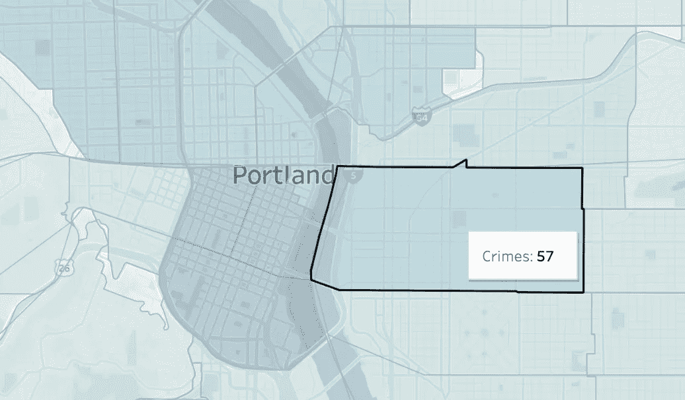
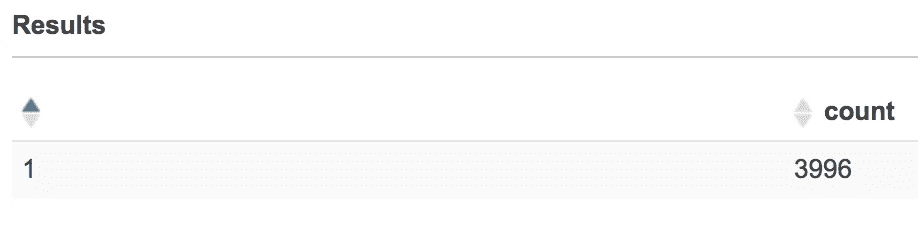

# AWS Athena 帮助找到波特兰最糟糕的停车地点

> 原文：<https://towardsdatascience.com/aws-athena-helps-to-find-the-worst-place-to-park-your-car-in-portland-ffb5195cfd9?source=collection_archive---------28----------------------->



[My Tableau Public](https://public.tableau.com/profile/achernyshova#!/vizhome/PortlandCrime_16126542652560/Map)

在参观完波特兰之后，或者上周末，我决定探索一些公开的关于这个城市的数据集。在本帖中，我们将使用Athena geo 查询来计算每个波特兰社区中与车辆相关的事件(车辆被盗)的数量以及停车位的数量。之后，我们将计算每个停车位的事故数量，以识别危险区域。

我们将使用三个数据集:

*   2019 年发生在波特兰的所有事件的警方报告。您可以在此下载该数据集[(点击“下载开放数据”选项卡)](https://www.portlandoregon.gov/police/71978)
*   波特兰停车点坐标，你可以下载这个数据集[这里](http://gis-pdx.opendata.arcgis.com/datasets/ddd0f467686b422e88e40eb34aa9202f_210)
*   波特兰街区边界的 JSON，你可以在这里下载它(选择 GeoJSON 格式)

开始使用 SQL 探索数据集的一种快速简单的方法是使用 AWS Athena 数据库和 S3。创建一个 S3 桶(我称之为波特兰犯罪分数)。

对于事件文件，在桶中创建一个文件夹“crime_data”。将下载的 CSV 文件导入文件夹。之后，转到 AWS 控制台，打开 Athena 服务并运行以下查询来创建一个表(用您的替换 S3 存储桶名称):

```
CREATE EXTERNAL TABLE IF NOT EXISTS sampledb.incidents (
  `Address` string,
  `CaseNumber` string,
  `CrimeAgainst` string,
  `Neighborhood` string,
  `OccurDate` string,
  `OccurTime` string,
  `OffenseCategory` string,
  `OffenseType` string,
  `OpenDataLat` float,
  `OpenDataLon` float,
  `OpenDataX` float,
  `OpenDataY` float,
  `ReportDate` string,
  `OffenseCount` int 
)
ROW FORMAT DELIMITED FIELDS TERMINATED BY ',' STORED AS TEXTFILE LOCATION 's3://portland-crime-score/crime_data/'
TBLPROPERTIES ('skip.header.line.count'='1');
```

对于停车位，创建一个名为“parking_data”的文件夹并导入相应的文件。运行以下查询来创建表:

```
CREATE EXTERNAL TABLE IF NOT EXISTS sampledb.parking (
 `X` float,
 `Y` float,
 `OBJECTID` string,
 `ModifiedBy` string,
 `ModifiedOn` string,
 `ModifiedUsing` string,
 `Comments` string,
 `NonAssetID` string,
 `Status` string,
 `Owner` string,
 `MaintResp` string,
 `LocationID` string,
 `ImagePath` string,
 `Metered` string,
 `APPZone` string,
 `UseCode` string,
 `ParkingDuration` string,
 `Rotation` string
)
ROW FORMAT DELIMITED FIELDS TERMINATED BY ',' STORED AS TEXTFILE LOCATION 's3://portland-crime-score/parking_data/'
TBLPROPERTIES ('skip.header.line.count'='1');
```

对于邻域边界文件，创建一个名为“neighborhoods_data”的文件夹，并导入相应的文件。邻域数据存储在嵌套的 JSON 文件中，这就是这次表模式看起来不同的原因:

```
CREATE EXTERNAL TABLE neighborhoods (
    type string,
    features array<
        struct<type: string,
            properties: struct<OBJECTID: string,
                  NAME: string, 
                  COMMPLAN: string,
                  SHARED: string,
                  COALIT: string,
                  HORZ_VERT: string,
                  MAPLABEL: string,
                  ID: string,
                  Shape_Length: string,
                  Shape_Area: string
            >,
            geometry: struct<type: string,
              coordinates: array<array<array<string>>>
            >
        >
    >
)
ROW FORMAT SERDE 'org.openx.data.jsonserde.JsonSerDe'
LOCATION 's3://portland-crime-score/neighborhoods_data/';
```

让我们看一个表**事件**和运行几个 SQL 查询来浏览数据。首先，让我们看看我们有多少记录:

```
select count(*) 
from **incidents;**
```


```
select * 
from **incidents** 
limit 10;
```


如我们所见，一些记录没有事件的坐标。如果我们在网站上检查数据集的元数据，就会发现它们是被故意删除的:


让我们看看没有坐标的记录有多少:

```
select count(*) as count 
from **incidents** 
where OpenDataLat is Null or OpenDataLon is Null;
```



我们将从进一步的探索中排除那些记录。现在让我们看看文件中有哪些类型的事件:

```
select distinct OffenseType 
from **incidents**;
```


共有 46 种事件类型。让我们关注与车辆相关的问题:

```
select distinct OffenseType 
from **incidents** 
where OffenseType like '%Vehicle%'
```


现在，让我们创建一个仅包含 Athena 车辆事故地理点的表，并查看在应用所有这些过滤器后我们有多少行:

```
**incident_points** as (
select ST_POINT(opendatalon, opendatalat) 
from **incidents** 
where OffenseType in (
  'Motor Vehicle Theft', 
  'Theft From Motor Vehicle', 
  'Theft of Motor Vehicle Parts or Accessories') 
  and OpenDataLat is not NULL 
  and OpenDataLon is not NULL
)
select count(*) as incident_count 
from **incident_points**;
```


现在，让我们创建一个包含所有停车点的地理点的表，这次我们不需要过滤任何内容:

```
**parking_points** as (
  select ST_POINT(x, y) as point 
from **parking**
)
select count(*) as parking_count
from **parking_points**;
```


现在，让我们来看一个邻域数据集。让我们解析 JSON 来提取边界坐标并创建 Athena 支持的 Polygon 类型的对象。我找不到一种简单的方法来解析 Athena 中的 GeoJSON。[文档](https://docs.aws.amazon.com/athena/latest/ug/geospatial-input-data-formats-supported-geometry-types.html)没有说支持它。这就是为什么我必须用 json 执行一系列操作来提取所需的坐标。

首先，让我们看看表邻域中有什么:

```
select * 
from **neighborhoods**;
```


整个文件被解析成一行。我们需要从具有数组类型的 features 列中提取数据。让我们像这样解除数组嵌套:

```
select type, feature 
from **neighborhoods**
CROSS JOIN UNNEST(features) AS t(feature)
```


每个要素代表一个邻域。现在我们可以像这样访问它的值:

```
select feature.properties.Name as name, feature.geometry.coordinates[1] as shape 
from **neighborhoods**
CROSS JOIN UNNEST(features) AS t(feature)
```


这里我们有一个邻域名称和一个带有边界坐标的数组。我们的目标是将这些坐标转换成 varchar 格式，Athena 可以将它解析成这样的多边形对象:*SELECT ST _ Polygon(' Polygon((1 1，1 4，4 4，4 1))')。*要做到这一点，我们应该将坐标连接成一个字符串。此外，两个名为“MC UNCLAIMED #13”和“CRESTWOOD”的街区的坐标格式很奇怪，无法解析，所以我把它们从列表中排除了。让我们运行以下查询:

```
with **neighborhood_coords** as (
  select feature.properties.Name as name,
  feature.geometry.coordinates[1] as shape 
  from **neighborhoods**
  CROSS JOIN UNNEST(features) AS t(feature)
  where feature.properties.Name != 'MC UNCLAIMED #13' AND    feature.properties.Name != 'CRESTWOOD'
),
**unnest_nodes** as (
  select name, array_join(node, ' ') as node_str 
  from **neighborhood_coords**
  CROSS JOIN UNNEST(shape) AS t(node)
)
select * from **unnest_nodes**;
```


我们把邻居的坐标提取到多列中。现在我们需要做的就是用字符串连接将它们聚合回来:

```
**suburbs** as (
  select name as suburb_name, ST_POLYGON('polygon ((' || array_join(array_agg(node_str), ', ') || '))') as poly from **unnest_nodes** group by name 
)
select * from **suburbs**;
```


现在，让我们将我们的小区与停车点连接起来，计算每个小区的停车位数量。我们将使用 Athena 函数 ST_CONTAINS 来检查停车点是否位于边界多边形内:

```
**suburb_parking** as (
  select suburb_name, count(*) as parking_count from **suburbs** 
  join parking_points on ST_CONTAINS(poly, point)
  group by suburb_name order by parking_count desc
)
select * from **suburb_parking** limit 10;
```


正如我们所见，市中心有最多的停车位。

现在，让我们看看发生事故的街区，统计每个街区的事故数量:

```
**suburb_incident** as (
  select suburb_name, count(*) as incident_count from **suburbs** 
  join incident_points on ST_CONTAINS(poly, incident_point)
  group by suburb_name order by incident_count desc
)
select * from **suburb_incident** limit 10;
```


黑兹尔伍德记录的事故数量最高，市中心位居第二。

最后，让我们计算事故数量与停车点数量之间的比率:

```
select suburb_parking.suburb_name, CAST(incident_count as double)/parking_count as crime_score 
from **suburb_incident**
join suburb_parking on suburb_incident.suburb_name = suburb_parking.suburb_name
order by incident_count/parking_count desc;
```


**令我们惊讶的是，像里士满这样名字好听的社区每个停车位的事故数量最高，而西北区是最安全的地方，每个停车位发生 0，056 起事故。**

整个查询如下所示:

```
with **regions_coords** as (
  select feature.properties.Name as name, feature.geometry.coordinates[1] as shape from **neighborhoods**
  CROSS JOIN UNNEST(features) AS t(feature)
  where feature.properties.Name != 'MC UNCLAIMED #13' AND feature.properties.Name != 'CRESTWOOD'
),
**unnest_nodes** as (
  select name, array_join(node, ' ') as node_str from **regions_coords**
  CROSS JOIN UNNEST(shape) AS t(node)
),
**suburbs** as (
  select name as suburb_name, ST_POLYGON('polygon ((' || array_join(array_agg(node_str), ', ') || '))') as poly from **unnest_nodes** group by name 
),
**parking_points** as (
  select ST_POINT(x, y) as point from **parking**
),
**incident_points** as (
  select ST_POINT(opendatalon, opendatalat) as incident_point from **incidents**
  where OffenseType in (
    'Motor Vehicle Theft', 
    'Theft From Motor Vehicle', 
    'Theft of Motor Vehicle Parts or Accessories') 
  and OpenDataLat is not NULL 
  and OpenDataLon is not NULL
),
**suburb_parking** as (
  select suburb_name, count(*) as parking_count from **suburbs** 
  join parking_points on ST_CONTAINS(poly, point)
  group by suburb_name order by parking_count desc
),
**suburb_incident** as (
  select suburb_name, count(*) as incident_count from **suburbs** 
  join incident_points on ST_CONTAINS(poly, incident_point)
  group by suburb_name order by incident_count desc
)
select suburb_parking.suburb_name, CAST(incident_count as double)/parking_count as crime_score 
  from **suburb_incident**
  join suburb_parking on suburb_incident.suburb_name = suburb_parking.suburb_name
  order by incident_count/parking_count desc;
```

下次我去波特兰的时候，我会查看这些信息，找到最好的住处。