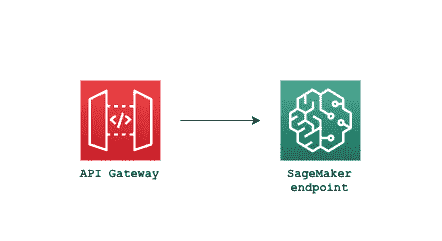
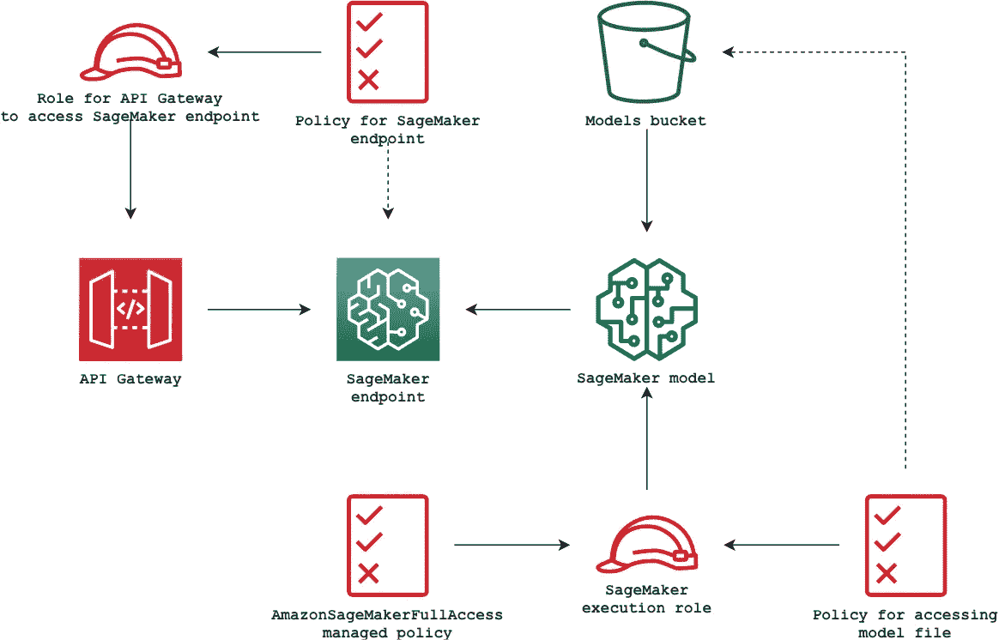

# AWS SageMaker 端点作为带有 API 网关的 REST 服务

> 原文：<https://towardsdatascience.com/aws-sagemaker-endpoint-as-rest-service-with-api-gateway-48c36a3cf46c?source=collection_archive---------8----------------------->

有许多方法可以将 AWS SageMaker endpoint 部署为 REST 服务，其中一种方法在 AWS 博客中使用 Lambda 函数进行了介绍。在本文中，我将展示如何在不涉及 Lambda 等主动组件的情况下实现这一点。我们将要设置的体系结构概述将具有以下简单结构:



## 模型准备

首先，让我们为 sage maker——特别是 MNIST——训练一个演示模型。这段代码将进行训练，并在当前目录下创建`model.tar.gz`文件。

确保在执行培训脚本之前运行`pip install tensorflow`。

脚本会将模型文件保存在`./model/{timestamp}`目录下，并在当前目录下创建`model.tar.gz`。通常，在为 SageMaker 创建模型时，您还需要提供包含您的推理代码、web 服务器、相关库等的 docker 映像。但是因为我们使用 tensorflow 模型，我们可以利用 AWS 管理的`[sagemaker-tensorflow-serving](https://github.com/aws/sagemaker-tensorflow-serving-container/)`容器作为推理图像。所有繁重的代码和样板代码都已经打包在这个映像中。我们只需要提供模型文件和可选的定制代码来进行推理前/后处理。

服务容器只接受`application/json`内容类型作为输入。我们可以添加定制的推理代码来处理额外的内容类型，比如图像负载，但这超出了本文的范围。

## 部署

创建模型文件后，我们可以继续 AWS 部署。以下是在此设置中使用的 AWS 资源的更详细的架构



Detailed diagram of AWS resources

*请注意，所有示例都是使用 terraform 0.12(带有 HCL 2 语法)*构建的。

首先，我们将创建 S3 桶，并将模型包上传到桶中。

现在我们可以创建 SageMaker 模型并部署端点。

*请注意，此处创建的 IAM 角色仅用于演示目的，不要在生产中使用* `*AmazonSageMakerFullAccess*` *策略。*

端点部署由两个主要部分组成(除了 IAM 角色之外)。

首先，创建模型。它封装了角色、S3 桶中的模型文件、推理 docker 映像和一些环境变量。如前所述，我们使用的是 AWS 托管推理映像，它属于`520713654638` AWS 帐户。

其次，端点配置和端点本身被创建。

部署通常需要 5-6 分钟，请耐心等待:)

现在让我们测试端点。我们需要一些`JSON`格式的测试数据。可以使用以下代码片段从 MNIST 数据集中提取它

它会将单个图像保存到`payload.json`文件中，并将预期的结果打印到 stdout 中(本例中为`7`)。您可以更改`idx`变量，以提取其他图像。请注意，整个结果封装在附加数组中，因为 API 可以一次对多个图像进行推断。现在我们可以调用`sagemaker-runtime invoke-endpoint`来做预测。

```
$ aws sagemaker-runtime invoke-endpoint --endpoint-name mnist-test --body file://payload.json --content-type application/json result.json
{
    "ContentType": "application/json",
    "InvokedProductionVariant": "main"
}$ cat res.json
{
    "predictions": [[0.0, 0.0, 0.0, 0.0, 0.0, 0.0, 0.0, 1.0, 0.0, 0.0]
    ]
}
```

**到目前为止一切顺利，但我们仍然只部署了 SageMaker 端点。现在有趣的部分来了——与 API Gateway 的集成。**

让我们先创建常规的东西，即 API Gateway REST 资源、方法和方法响应。

最后，让我们创建与 SageMaker 的集成。为了使集成工作，我们需要另一个 IAM 角色，允许 API 网关 InvokeEndpoint 访问和集成资源本身。

这段代码中最重要的一行是集成资源中的 URL，*，它在 AWS 文档*中既没有文档也没有示例。

```
arn:aws:apigateway:${var.region}:runtime.sagemaker:path//endpoints/${aws_sagemaker_endpoint.endpoint.name}/invocations
```

请注意，双斜线(`//`)是有意的，没有它们集成将不起作用。成功部署后，terraform 将输出调用端点 URL。我们可以使用我们的`payload.json`通过`curl`进行预测:

```
$ curl -XPOST [https://**{api-gw-id}**.execute-api.eu-central-1.amazonaws.com/predict](https://omxuj9h9of.execute-api.eu-central-1.amazonaws.com/predict) -H "Content-Type: application/json" -d [@payload](http://twitter.com/payload).json
{
    "predictions": [[0.0, 0.0, 0.0, 0.0, 0.0, 0.0, 0.0, 1.0, 0.0, 0.0]
    ]
}
```

## 限制

有关更多详细信息，请查看 API 网关和 SageMaker 端点限制。值得注意的是

*   API 网关将最大有效负载限制为 10 MB
*   SageMaker 的最大执行时间为 60 秒

## 结论

这是制作灵活的 RESTish 推理端点的非常快速、简单、稳定和成本有效的方法。它还可以扩展到支持

*   基于认知或静态密钥的授权
*   VPC 私人部署
*   以及 API 网关的所有其他特性
*   使用 SageMaker 自动缩放
*   利用弹性推理获得 GPU 能力

感谢阅读。