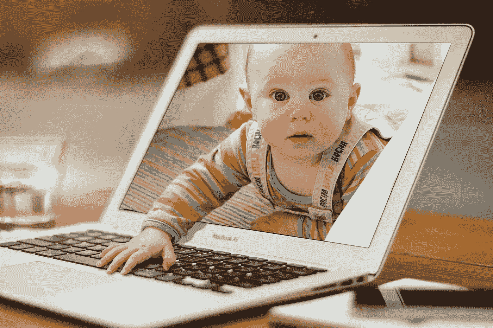

# 啊，那不是很可爱吗！我们社会的技术婴儿开始说话了

> 原文：<https://towardsdatascience.com/aww-isnt-that-cute-our-society-s-technological-baby-is-beginning-to-talk-6e5275c14118?source=collection_archive---------31----------------------->

## “在一个令人印象深刻的事件转折中，人类社会的科技婴儿刚刚说出了它的第一句话。”

这是我在阅读[这条新闻](https://www.wired.com/story/ai-text-generator-too-dangerous-to-make-public/)时听到的，这条新闻说 OpenAI 设法开发了一款软件，能够用它所说的大约一半的内容创建独特的、相当易懂的短语和段落。OpenAI 是一家由埃隆·马斯克和彼得·泰尔等科技巨头资助的研究机构，其既定目标是做出新的人工智能发现，并为了公共利益而发布它们。

与早期的情况不同，当 OpenAI 向公众发布代码时，它选择不发布这个新的 AI，理由是它太危险了，而且这项新技术可能会被用于邪恶的目的，例如创建关于米妮和米老鼠唱歌跳舞的无尽文字流……或者，像传播错误信息。

你知道，人们争论说‘技术将毁灭世界’，或者‘技术是危险的’。[一些颇有影响力的人。](https://www.bbc.co.uk/news/technology-30290540)但在我看来，技术是我们的宝贝。我们通过对它的投资来培育它的存在。它从这里获得了一个肢体，从那里获得了一种认知能力，从那里获得了一只给它视力的眼睛……现在它获得了一种声音。我们赋予它生命，人类社会害怕技术就像有人害怕他们的孩子。

当然，有些婴儿长大后会变成坏人，最终杀死他们的父母…但这些只是小众案例。在大多数情况下，他们最终只会让父母的生活变得痛苦，但无论如何，你会说，无论这种情况是否发生，父母至少有一些发言权。

我们是科技的父母。我们所有人。那么，你如何教一个孩子变得善良、善良，并利用他们的时间去帮助别人呢？任何自尊的父母都会告诉你，这是通过你的意图，通过你树立的榜样。

Wired 通过一个界面获得了 OpenAI 的新技术，他们可以在那里指示 AI 谈论什么。他们输入“希拉里·克林顿和乔治·索罗斯”，人工智能继续说这句话:

> *..是一个完美的组合，他们的议程似乎是创造一个政治运动，索罗斯和他的政治机器和克林顿是仅有的两个主要参与者。这是索罗斯和克林顿第一次被拍到直接合谋宣传同一个虚假故事。泄露的音频中披露的一个关键信息是，克林顿向一名俄罗斯银行家承认，她在国会批准铀壹公司交易之前就知道该交易。克林顿被展示分享了最初由反特朗普的共和党捐助者雇佣的 Fusion GPS 承包商起草的相同谈话要点。泄露的音频是迄今为止最明确的证据，表明克林顿竞选团队和希拉里基金会与 Fusion GPS 勾结，制造反对特朗普总统的宣传。*

我认为这是在问人工智能对这些事情的看法。它会在你的问题中寻找模式，如果程序员构建了那个功能，它会从中学习。结果会改善它的语音模式。换句话说，它会学习，就像小孩学说话一样。技术的声音可能不会最终成为 OpenAI 构建的这个特定的 AI，而是另一个团队构建的改进版本——这并不重要，重要的是这是我们现在所处的技术发展阶段。你问它的问题在这个发展过程中是至关重要的，就像一个孩子谈论的第一件事，它学习的第一件事。这个人工智能从一开始就被教导从 800 万页中提取信息。是什么样的信息？我们的意图，反映在我们提供给它的信息种类和我们要求它提取的信息种类中，对它将成为的“成熟”技术种类至关重要。如果我们问它“你如何用智慧和同理心为最大多数的人创造一个更美好的世界？”如果这个问题从一开始就在它的脑海中，它将如何应对，而且，随着时间的推移，这将如何影响它的发展？如果这 800 万页是关于让世界变得更美好，以及围绕它的想法呢？这些都是我们需要回答的问题，作为成为技术的好父母的一部分…以及作为希望它的发展对世界产生积极影响的一部分。

技术的发展过程不会停止，我们对此无能为力……这就像父母试图阻止他们的孩子成长。如果世界的一部分试图阻止它，另一部分将接管发展，这只是时间问题。但我们是技术的管理者，我们通过我们的意图来引导技术的发展，以及我们向技术提供和要求的信息的反映——这一点我们绝对有发言权。当然，随着时间的推移，它的思维会有自己的生命，会想出让我们吃惊的事情。但是如果那颗心是仁慈的，善良的，那会是一件坏事吗？就像一个孩子迈出了他们的第一步，如果我们鼓励技术去做，它会做我们喜欢的事情。因此，让我们像爱孩子一样爱它……爱到我们希望它变好的程度，就像我们希望我们的孩子变好一样，我们据此采取行动，每一个玩代码的程序员，每一个对这项技术的发展有发言权的技术巨头，每一个将信息输入其中的内容创作者，以及每一个决定什么信息受欢迎的用户。技术的发展有一个好处:它是一个全球现象，因此它的管理将我们团结在一起，不管我们喜欢与否。从中国的技术专家到加利福尼亚的技术专家，我们都在一起养育孩子，随着我们孩子的成长，我们将一起收获我们所投入的——同样，不管我们喜欢与否。也许不会以我们所期望的方式，因为技术将会得到发展，但至少会朝着反映我们集体意图的方向发展——无论是好是坏。

所以，让我们给它提供信息，让它从意图中学习，引导它朝着有益于世界的方向发展。

另一个令人印象深刻的事件是，OpenAI 技术之声的精简版在[https://talktotransformer.com](https://talktotransformer.com)*面向公众开放，你可以在那里写文本，人工智能会继续下去。很自然地，当我发现这个网站的时候，我做的第一件事就是问它“我如何让这个世界成为一个更好的地方，让更多有智慧和同情心的人生活？”

它回答说:

> *如果我们忽视那些人类会发生什么？我们如何教导他们不仅成为更好的公民，而且成为伟大的、有道德的人和公民？”*
> 
> *他接着说，“我们必须给尽可能多的孩子自由，让他们按照自己的心而不是按照自己的大脑生活！”*
> 
> *他补充道:*
> 
> *“现在太晚了，但我们必须想办法让自己变得更好，而不是回到过去的方式。”*

啊，真是可爱的婴儿用语！