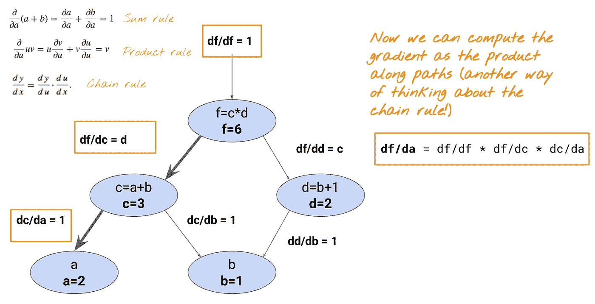

# 反向传播在 7 分钟内揭开神秘面纱

> 原文：<https://towardsdatascience.com/back-propagation-demystified-in-7-minutes-4294d71a04d7?source=collection_archive---------12----------------------->

在过去的 10 年里，表现最好的机器学习实现，如面部识别和语音识别器，都源于一种称为“深度学习”的技术深度学习由神经网络组成，神经网络是一种通过分析训练样本来执行某种任务的手段。神经网络的神经元如何从训练样本中学习？

有三个步骤。

1.  *让你的神经网络猜测输出。*
2.  *评估你的人际网络表现如何。*
3.  *根据第二步的评估修改/训练你的神经网络。又名反向传播*

# 第一步。让你的神经网络向前传递猜测。

当你使用神经网络进行预测时，

为了训练一个神经网络，你需要评估你的预测有多好。这就是损失函数发挥作用的时候。

# 第二步。评估你的网络做得有多好。

损失函数将输出的预期值与神经网络的预测值进行比较。损失函数最常见的例子之一是[均方误差](https://en.wikipedia.org/wiki/Mean_squared_error) (MSE)。它会计算真实值和预测值之间的差异，并对其求平方。你对结果求平方的原因是为了使负差不相关。

如果你有多个预言和真理，这就是你所做的。

在这种情况下，

你的损失函数会给出 36 的误差。你想让你的均方差尽可能的低。理想情况下，你想让它为 0，但我们会对任何足够接近它的值感到满意。

# 第三步。修改/教授你的神经网络

你的误差值在下图的某处。你可能需要增加重量或者减少重量来达到最小误差。这个步骤叫做**反向传播**。为了达到这个达到最小误差的目标，有多种方法可以采用。我将讨论两种流行的方法。

[https://www.edureka.co/blog/backpropagation/](https://www.edureka.co/blog/backpropagation/)

## 方法 1。求导并设其等于 0，然后求解

在微积分课上，我们学过，为了达到最优点，你可以对输入求函数的导数，设为 0，然后求解。

通过求解 **w** ，我们得到 **w =真值/输入**。在这种情况下，事实是 12，输入是 3，所以我们的 w 变成了 4。我们终于教会了我们的神经网络！

这种方法简单快速，但并不总是有效，因为大多数损失函数没有封闭形式的导数。

## 方法 2。梯度下降

微积分中的梯度是偏导数的集合。事实证明，梯度是最陡的上升方向。如果前面的句子让你感到困惑，你需要知道的是，当你求导时，这个值会告诉你，该往哪个方向走，才能到达图上的最高点。然而，我们想要到达最低点，因为我们的图的 y 轴是误差，并且我们想要最小化误差，我们将通过取梯度的负的值**来到达梯度的相反方向。**

[https://www.youtube.com/watch?v=b4Vyma9wPHo](https://www.youtube.com/watch?v=b4Vyma9wPHo)

你从图上的某个地方开始，为了达到最小值，你一直朝着梯度的相反方向前进。您可以在下面的 python 实现中看到梯度下降。

# 链式法则

在上面的例子中，只有一个权重，这在现实世界中并不常见。让我们来看一个多重权重的例子，以及如何应用链式法则来计算导数。

我们将用图表来表示权重和损失函数。请注意,“a”和“b”代表权重,“f”代表我们希望最小化的损失函数。我们将使用链式法则来看看调整权重是如何影响输出的。

[https://twitter.com/random_forests](https://twitter.com/random_forests)

损失相对于权重的梯度可以用两种方式表示，因为有两个权重。如果要为上面的向前传递定义一个函数，它应该是这样的:

[https://twitter.com/random_forests](https://twitter.com/random_forests)

先来计算一下 **dL/da = df/da** 。问题是损失函数 **f** 不知道 **a** 。每个节点只知道它的相邻节点。

[https://twitter.com/random_forests](https://twitter.com/random_forests)

因此，为了计算 df/da，需要使用[链式法则](https://www.khanacademy.org/math/ap-calculus-ab/ab-differentiation-2-new/ab-3-1a/a/chain-rule-review)。简单地说，当你有复合函数时，就要用到链式法则。

[https://i.pinimg.com/originals/c2/f1/a3/c2f1a350856c3ee7c66fdcec1c66b3f3.gif](https://i.pinimg.com/originals/c2/f1/a3/c2f1a350856c3ee7c66fdcec1c66b3f3.gif)

由于 df/da 不能直接从不知道节点 **a** 的 **f** 节点中计算出来，所以你将做 **df/da = df/dc * dc/da。**

现在，让我们计算 **dL/db = df/db** 。由于有两条边从节点 b 出来，当我们反向传播时，我们需要使用求和规则来添加两条路径到节点 **b** 。

[https://twitter.com/random_forests](https://twitter.com/random_forests)

每条路径都可以用链式法则来计算:df/dc * dc/db 和 df/dd * dd/db，最后我们可以对它们求和。

实际上，这些权重是矢量化的，所以当我们进行反向传播时，所有权重都是同时计算的。

# 反向传播的复杂性

让我们把我们的神经网络想象成一个图形。一个节点代表一个操作，一条边代表一个权重。为了计算每个权重的梯度，每个边必须至少访问一次。因此，反向传播的复杂度与边数成线性关系。

# 如何快速达到最低？

在反向传播时，有时可能需要一段时间才能达到最小值。你可以做一些小技巧/调整来快速达到最小值。

1.  **调整学习率**

学习率是您乘以梯度的值，要从损失函数中减去该值才能达到最小值。

[https://twitter.com/random_forests](https://twitter.com/random_forests)

如果你让学习率变小，你可以确保达到最小值，但这需要一段时间。

[https://twitter.com/random_forests](https://twitter.com/random_forests)

如果你的学习率太大，你可能无法达到最小值，因为你可以跳过最小值。所以你想让学习率大到足以收敛到足够快接近最小值，然后再调整到足够小以达到最小值。

**2。调整势头**

通过使用动量，过去步骤的梯度被累积，而不是仅使用当前步骤的梯度来引导搜索。

[https://blog.paperspace.com/intro-to-optimization-momentum-rmsprop-adam/](https://blog.paperspace.com/intro-to-optimization-momentum-rmsprop-adam/)

使用动量的原因如下。在上图中，考虑点 a。如果我们将这些向量相加，相反的方向会抵消，因此沿着 **w1** 方向的分量会抵消，但是 **w2** 方向会增加，这是我们想要达到最优的理想路径。

**3。改变批量**

Batch 是计算梯度的整个训练集。您可以一次选择随机训练样本(**随机**)或一次使用一小批数据(**小批量**)，而不是使用整批数据。

[https://twitter.com/random_forests](https://twitter.com/random_forests)

随机方法大大减少了计算梯度下降的时间；然而，它一次只使用一个例子，所以它的最佳路径更嘈杂，比批梯度更随机。但是它不会有很大的影响，因为我们不关心这种方法走的是什么样的道路(只是现在)，只要在较短的训练时间内达到了最小点。

# 本地和全局最小值

如果我们有多个最小值，我们希望达到全局最小值。然而，我们可能会陷入局部最小值，如下图所示。

[https://twitter.com/random_forests](https://twitter.com/random_forests)

在这种情况下，摆脱局部最小值的最佳方法是随机重启。摆脱局部最小值的一种方法是随机重启，这增加了在其他地方达到最小值的概率。

[https://twitter.com/random_forests](https://twitter.com/random_forests)