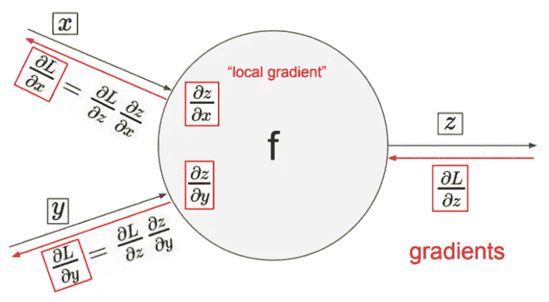
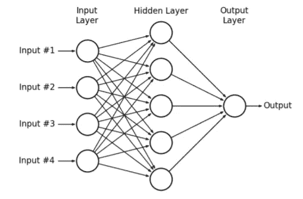

# 简化反向传播

> 原文：<https://towardsdatascience.com/back-propagation-simplified-218430e21ad0?source=collection_archive---------10----------------------->

这篇文章解释了什么可能是反向传播最基本的实现。我假设读者对反向传播(+梯度下降)有坚实的理论理解，只是不知道如何开始实现它。

Back-prop 是一种比较容易理解但实际编码起来要困难得多的算法。很多时候，你只是理解了背后的数学，感觉很舒服(如果你理解基本的多元微积分和线性代数，这并不难)，然后继续使用预定义版本的 back-prop 训练神经网络。你为什么不呢？基本上所有的深度学习框架(TensorFlow，Chainer，Caffe…等等。)附带已经实现的 back-prop。用自动微分之类的花哨东西(PyTorch！)，你作为用户基本没什么要做的。这也是在训练你自己的神经网络时一半的问题出现的地方。人们简单地认为，互连任何层的组合都是很酷的。使用 back-prop，梯度将神奇地向后流动，并产生下一个国家的艺术预测！

但可悲的是，这种情况不常发生。这就是为什么理解 back-prop 很重要。对我个人来说，自从我自己实现了 back-prop，在最初的几次尝试中，我让我的神经网络做我想让它们做的事情的成功率高得多。安德烈·卡帕西有一篇关于这方面的优秀的[文章](https://medium.com/@karpathy/yes-you-should-understand-backprop-e2f06eab496b)，你绝对应该看看。足够有说服力了，开始吧。

Summary of back-prop at one particular neuron ([Source](https://www.youtube.com/watch?v=i94OvYb6noo))

上图从一个神经元的角度解释了算法。这里， **L** 是在前一次向前传递中所做预测的成本值。梯度( **δL/δz** )由该神经元从网络中它的前几层接收。我们从这个图像中得到一个想法，即每个神经元的局部梯度( **δz/δx** 和 **δz/δy** )、输出( **z** )和激活( **x** 和 **y** )需要存储在存储器中以供以后计算。这些用于计算梯度( **δL/δx** 和 **δL/δy** )以向后传递，该梯度将被先前层的神经元接收。具体如何操作将在下面的章节中给出。

这篇文章的完整代码可以在[这里](https://github.com/ksivaman/simple-net)找到。本文解释了重要的部分，其余的只是让一切运行的样板代码。我们将创建一个简单的前馈神经网络，只有线性层(+激活)来分类钞票是否是伪造的。我们将使用[这个](http://archive.ics.uci.edu/ml/datasets/banknote+authentication)数据集，该数据集具有基于纸币图像的 4 个特征:小波的方差、小波的偏斜度、小波的曲率和熵。根据纸币是否是伪钞，目标为 0 或 1。在这个数据集中总共有 **1372 个观察值**，可以分成训练集和验证集。

变量名是不言自明的，变量前面的前缀' *d_'* 表示它存储变量后面的导数' *d_* ' (' *d_this'* 存储' *this'* '的梯度)。

Fig 1: A simple linear feed-forward network we will use ([**Source**](https://pdfs.semanticscholar.org/f7fe/6ef2feff4eb014fedc5a6a5ff14a94892f81.pdf)**)**

上图显示了我们将用于分类的网络。4 个输入对应于特征，输出是分类器的预测(0 或 1)。隐藏层将由 relu 激活，输出层将由 sigmoid 激活(以获得类概率)。

# 参数初始化

开始之前的第一件事是初始化我们网络的参数值。不同图层的权重和偏差将作为键值对保存在单独的字典中。这是相当基本的，可以使用下面的代码片段来完成:

*   参数' *layers'* 是一个列表，包含每层神经元数量的整数值。因此，根据图 1 中的架构，这将是一个包含 4、5 和 1(默认)的列表。

# 成本函数和度量

接下来要做的事情是制定损失函数，并找出一个衡量标准来检查我们的网络在每次转发时的性能。我们将使用简单的二元交叉熵损失作为成本函数，使用准确度作为评估度量。这些很容易计算，可以通过以下方式完成:

“y_pred”是预测类，“*train _ Y”*是基础事实。

*“get _ class _ from _ probs*”是一个效用函数，用于获得预测的类值(0 或 1)，而不是从 sigmoid 函数获得的概率。

# 激活和衍生

计算激活及其导数的简单效用函数是重要的。在我们的例子中，我们将有 4 个这样的函数:sigmoid、relu、Sigmoid 的导数和 Relu 的导数。这可以使用下面的代码片段来完成。注意 relu 的导数只是一个单位阶跃函数*。*

' *d_init* '参数是初始化梯度。对于最后一个层，该值将为 1，并且该值将是所有先前层直到当前层的梯度的累积乘积。

# 前进传球

这是最简单的部分，我们执行矩阵乘法，在每个阶段添加偏差，通过激活函数运行输出，并得到最终结果。代码分为两部分:一层正向传递和整个正向传递。下面给出了一层向前传递的代码。由 n 个神经元组成的层的参数:

*   *input_activations* :表示进入该层的激活值。是一个维数为(n，x)的矩阵，其中 x 是训练数据样本的数量(在我们的例子中是 1097，从总共 1372 个观察值中使用 80%的训练分割)
*   *权重*:该层的权重矩阵。是一个维数为(m，n)的矩阵，其中 m 是下一层神经元的数目。
*   *偏置*:该层的偏置矩阵。是维数为(m，1)的矩阵
*   *激活*:该层的激活可以是 sigmoid 或 relu(在我们的例子中)。

下一步是使用前面的函数创建整个向前传递，其代码如下所示。这里的关键是**将该层的输出值**保存在字典中，在通过激活函数之前和之后。当使用链规则向后传递渐变时，这些是必需的。这些参数是:

*   *train_X* :训练数据。是维数为(n，x)的矩阵，其中 n 是第一层中神经元的数量，而 x 是训练数据样本的数量。
*   *params_w* :存储不同层的权重矩阵及其对应关键字的字典。关键字的形式是“权重 1”、“权重 2”…值是矩阵本身。
*   params_b:字典存储不同层的权重矩阵及其对应的关键字。关键字的形式是“bias1”、“bias 2”…值是矩阵本身。
*   *图层*:同参数初始化章节 **init** 。
*   激活:不同隐藏层和输出层的激活值。对于我们的例子，默认是我们将要使用的，R 代表 relu(隐藏层)，S 代表 sigmoid(输出层)。

# 偶数道次

这是最棘手的部分。这也和向前传球一样，可以分为单层传球和整体向后传球。单层向后传递包括几个步骤:

*   找出当前层中使用的激活函数(第 7-12 行)。
*   使用传递到该点的累积梯度和该层的输出值计算局部梯度(第 15 行)。(还记得早先把它们保存在字典里吗？)
*   计算当前层的权重矩阵的梯度(第 18 行)。
*   计算当前层的偏差矩阵的梯度(第 21 行)。
*   为当前层计算进入该层矩阵的激活的梯度(第 24 行)。

注意使用*链规则*计算梯度。下面给出了带有以下参数的代码片段:

*   *curr_grad* :当前累积的梯度从它前面的所有层传递到这一层。是 shape(n，x)的矩阵，其中 n 是当前层的神经元数量，x 是训练样本的数量。
*   *curr_weight* :前一层到当前层变换的权重矩阵。是形状(n，p)的矩阵，其中 p 是前一层中神经元的数量。
*   *curr_bias* :从前一层到当前层转换的偏差矩阵。是一个形状矩阵(n，1)。
*   *curr_out* :从该层向前传播时的输出矩阵。是一个形状矩阵(n，x)。
*   *prev_act* :正向传播过程中进入该层的激活。是一个形状矩阵(p，x)。
*   *激活*:该层使用的激活类型。(' R': relu，' S ':S 形)

现在我们有了从一层计算梯度的方法，我们可以通过对我们的前馈神经网络中的所有层重复使用该函数(显然以相反的顺序)来容易地反向支持整个网络。从 one_layer_backward_pass 函数计算的梯度保存在'*梯度*字典中。在执行梯度下降时，这些梯度稍后将用于更新参数(权重+偏差)。

注意:损失函数相对于网络预测的梯度必须在主循环之外计算。这已经在下面代码片段的第 10 行完成了。通过对' *cross_entropy_loss* '函数(由预测和实际标签参数化)相对于预测' *y_pred'* 进行求导来得出这个公式是很简单的。

这些参数是:

*   *y_pred* :网络在正向传递过程中对目标值的预测数组。长度为 n 的数组，其中 n 是训练样本的数量。
*   *train_Y* :训练数据的标签(0 或 1)。长度为 n 的数组。
*   *activation_dict* :一个字典，存储进入所有层的激活。根据“act0”、“act1”、“act2”…形式的关键字对除最后一层之外的所有层进行索引。
*   *output_dict* :存储所有层输出的字典。除第一层外，根据所有层**的‘out 1’、‘out 2’、‘out 3’…形式的关键字进行索引。**
*   *params_w，params_b，layers，activate* : 这些参数与正向传递部分的函数*正向传递*中的含义相同。

这里需要注意的重要事项是:

*   反向过程中的层的反向迭代。
*   激活进入一个层，输出从它出去。一层的输出是下一层的激活。由于这个原因，对于 n 层网络，' *activation_dict* 中的激活索引从 0 到 n-2，而' *output_dict* 中的输出索引从 1 到 n-1。

# 参数更新和培训

难的部分完成了！现在我们要做的就是更新参数，用梯度下降法训练网络。在这个玩具示例中，我们将使用批量梯度下降，但当训练数据丰富时，您最好使用小批量梯度下降以提高效率。使用以下函数更新权重和偏差。这些参数是:

*   *params_w* ， *params_b* ，*层*:这些参数与正向传递部分的*正向传递*功能中的含义相同。
*   *gradients* :包含偏差和权重梯度的字典，使用该字典更新偏差和权重。这是在' *backward_pass'* 函数中计算的。关键字是“d_weight1”、“d _ weight 2”…等等。和“d_bias1”、“d_bias2”..等等。

最后，可以使用以下步骤来训练网络:

*   初始化参数。
*   完成一次向前传球。
*   计算损失。
*   完成一次向后传球。
*   更新参数。

以下是训练网络的代码:

就是这样！真的就这么简单。现在剩下要做的就是用看不见的数据测试我们的网络。为了更彻底地理解，重要的是亲自尝试，在头脑中运行数学和计算，并查看网络不同阶段的梯度、权重和偏差的维度。关键是不要混淆反推和梯度下降。Back-prop 仅用于计算网络各个阶段的梯度，而梯度下降使用这些梯度来更新网络的参数。我在这里省略了测试代码(本质上只是一次向前传递)，但是你可以在这里看到我的完整实现[(包括训练验证分割和测试网络)。谢谢你一路走过来！](https://github.com/ksivaman/simple-net)

# 其他资源

*   [https://medium . com/@ karpathy/yes-you-should-understand-back prop-e 2f 06 eab 496 b](https://medium.com/@karpathy/yes-you-should-understand-backprop-e2f06eab496b)
*   [https://www.youtube.com/watch?v=i94OvYb6noo](https://www.youtube.com/watch?v=i94OvYb6noo)
*   [https://towards data science . com/let-code-a-neural-network-in-plain-numpy-ae7e 74410795](/lets-code-a-neural-network-in-plain-numpy-ae7e74410795)
*   [https://www . cs . CMU . edu/~ mgormley/courses/10601-s17/slides/lecture 20-back prop . pdf](https://www.cs.cmu.edu/~mgormley/courses/10601-s17/slides/lecture20-backprop.pdf)