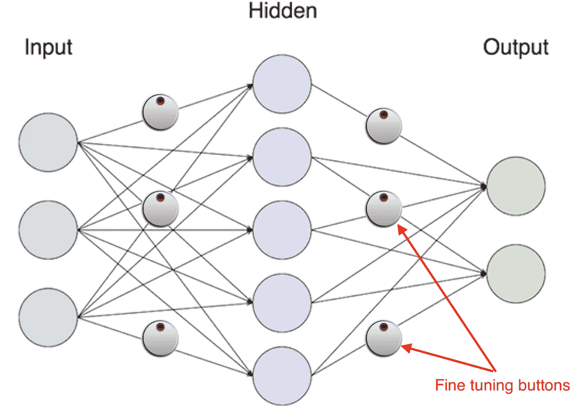

# 反向传播，简单的方法(第 1 部分)

> 原文：<https://towardsdatascience.com/back-propagation-the-easy-way-part-1-6a8cde653f65?source=collection_archive---------5----------------------->

## 反向传播的简单详细解释

**更新**:学习和练习强化学习的最好方式是去 http://rl-lab.com

在关于[梯度下降](/gradient-descent-the-easy-way-5240ca9a08da)的文章之后，反向传播很好地利用了这种技术来计算神经网络中权重的“正确”值。

**重要提示:**这篇文章包含了相当多的等式，然而它们都是有逻辑联系的。读者应该有耐心阅读它们，并理解它们是如何构建的。这对很好地理解反向传播技术是必不可少的。

与梯度下降方法一样，我们再次借用无线电比喻来帮助理解反向传播的直觉。在另一篇文章中，为了得到可接受的输出，只需要处理一个按钮，而在这里，我们有许多需要调整的按钮。

上图显示，在连接两个节点的每条线上都有一个微调按钮(即使它们没有全部显示出来)。

如前所述，我们的工作是调整这些按钮，使输出误差最小，这意味着有效输出尽可能接近预期结果。

在梯度下降中，我们讨论了一个微调参数𝜃和误差或损耗𝓛之间的简单关系，在这种情况下，我们有一个更复杂的关系。
然而，我们将从仅考虑一个神经元开始慢慢地进行。

# 一个神经元的情况

作为提醒，单个神经元接收一个或多个输入 ***x*** 并将每个输入乘以某个权重 ***w*** *，*将它们相加并加上偏差 ***b*** ，然后应用激活函数 ***g()*** 来产生输出

**

*为了能够评估神经元的输出，使用了损失函数𝓛。一个这样的损失函数可以是𝓛(y，ŷ) = (y - ŷ)*

*当然，目的是确定 ***w*** 和 ***b*** 的值，以便最小化𝓛.*

*通过查看神经元架构，我们可以很容易地注意到以下的 ***事件链***:
***wᵢ***的变化导致 ***z*** 变化，
变化导致***z***g(z)*变化，
变化导致 ***g(z)*****

**为简单起见，让我们称之为 ***a = g(z)*** ，由此可见 ***ŷ = a.***
上述链式反应可以使用[链式法则](https://en.wikipedia.org/wiki/Chain_rule)导出，该法则规定输出相对于 **wᵢ** 的变化是两者之间相位的偏导数的乘积:**

****∂𝓛/∂wᵢ=∂𝓛/∂a * ∂a/∂z *∂z/∂wᵢ****

**让我们单独考虑每个术语:**

****∂𝓛/∂a**= ∂((y-ŷ))/∂a = ∂((y-a))/∂a =-(y-a)=**a-y****

****∂a/∂z**= ∂g(z)/∂z =**g’(z)**(其中 g’(z)是 g(z)的导数)。注意 g(z)可以是任何可导函数)**

****∂z/∂wᵢ**= ∂(x1*w1+x2 * w2+…+xᵢ*wᵢ+…xn *wn)/∂wᵢ
=∂(xᵢ*wᵢ)/∂wᵢ=***xᵢ*****

**将每一项替换为它的值将得到∂𝓛/∂wᵢ
**∂𝓛/∂wᵢ=(a-y)* g’(z)*xᵢ****

**让我们定义𝛿如𝛿 = (a - y) * g'(z)，∂𝓛/∂wᵢ的最终形式将是:**

****∂𝓛/∂wᵢ*=𝛿*xᵢ*t65】****

**如果你还记得那篇[梯度下降](/gradient-descent-the-easy-way-5240ca9a08da)的文章，为了找到最小化𝓛的𝜃，我们迭代下面的等式，直到∆𝓛变得太小或为零:
𝜃𝑛₊₁ = 𝜃𝑛 -𝛂。∆𝓛**

**同样的逻辑也适用于神经网络。
对于每个 I，**wᵢ⁺=wᵢ-**𝛂***∂𝓛/∂wᵢ=wᵢ-**𝛂****𝛿*xᵢ*** *其中*w \u\u\u\u 是 w \u 的新值。
**重要:**对于每一个 I 我们迭代 **wᵢ** 足够的次数，直到 **∂𝓛/∂wᵢ** 变得足够小**

**使用相同的逻辑我们也可以找到变化的效果***b***:
**∂𝓛/∂*b*=∂𝓛/∂a * ∂a/∂z *∂z/∂*b*** 由于∂z/∂b = 1 并且所有其他项已经被计算过**∂𝓛/∂*b =𝛿*** 接下来是***b*⁺=*b ***∂𝓛/∂*b*=*b*-**𝛂****𝛿*** *其中 b* ⁺是 *b* 的新值。
再次我们保持迭代 ***b*** 足够的次数，直到 **∂𝓛/∂ *b*** 变得足够小。******

# 两个神经元的情况

现在让我们以两个神经元按顺序排列为例(它们形成两层)。

在开始之前，值得注意的是符号已经改变，以适应新的架构。上标数字表示层。例如，z、b、a、g 属于层#2，而 z、b、a、g 属于层#3。
另外值得一提的是，层#2 的输出是单值 **a** ，乘以下一层的权重 **v** 。

## 第三层

我们将首先从最后一层(层#3)开始，因为它的结果将用于前一层。

一连串的事件并不奇怪。
v**变化**引起 **z** 变化，
z 变化引起 **g (z )** 变化， **g (z )** 变化**𝓛(y**变化。

使用链式法则，我们计算导数∂𝓛/∂v:
**∂𝓛/∂v =∂𝓛/∂a * ∂a /∂z * ∂z /∂v**

如前所述，我们单独计算每一项:

∂𝓛/∂a = a - y

**∂a /∂z = g '(z )** (其中 g '(z)是 g (z)的导数)

∂z /∂v = a

所以∂𝓛/∂v 变成了**∂𝓛/∂v =(a-y)* g’(z)* a**

我们来定义一下**𝛿=****(a-y)*****【g’(z)** 接下来就是 **∂𝓛/∂v = 𝛿 * a**

同样我们可以找到**∂𝓛/∂*b =𝛿*t93】**

## 第二层

现在让我们移动到第二层。
链式反应开始于对 **wᵢ** 施加影响 **z** ，
z**的变化**影响**g(z)**
g(z)的变化影响 **z** (注意在这一点上 **v** 被认为是固定的)
z**的变化**影响**g(z)** 

导数方程为
**∂𝓛/∂wᵢ=(∂𝓛/∂a * ∂a /∂z * ∂z /∂a)* ∂a /∂z * ∂z/∂wᵢ**

我们已经计算了 **∂𝓛/∂a** 和**∂a /∂z**，至于其余的可以很容易地推导出来。
**∂z /∂a**= ∂(a * v))/∂a =**v**
**∂a /∂z**= ∂g(z )/∂z =**g '(z)**
**∂z/∂wᵢ=xᵢ**

替换完每一项但其值
∂𝓛/∂wᵢ=((a**-y)* g**'【z】)* v)* g '(z)*xᵢ
我们已经将𝛿定义为𝛿=(a-y)* g '【z】
**∂𝓛/∂wᵢ=𝛿* v * g '(z)*xᵢ******

**让我们定义 **𝛿** 为 **𝛿 = 𝛿 * v * g '(z )**
这将给出∂𝓛/∂wᵢ: **∂𝓛/∂wᵢ = 𝛿 * xᵢ** 的最终形式**

**同样我们可以找到∂𝓛/∂b =𝛿**

# **L 层序列**

**现在考虑一个有 L 层的网络，每层只包含一个神经元。这样的网络看起来会像下图。**

****

**通过使用与上述相同的逻辑，我们可以找到反向传播所需的不同组件。**

**所以对于 l 层
**𝛿ᴸ=****(aᴸ-y)*****gᴸ'(zᴸ)** 对于任何其他层𝒍<l
**𝛿ˡ=𝛿ˡ⁺* wˡ⁺*gˡ'(zˡ)****

**对于任何层，𝒍≤l **∂𝓛/∂wˡ=𝛿ˡ*aˡ⁻
∂𝓛/∂bˡ=𝛿ˡ** 其中 a **ˡ** ⁻是层 1 的输出，或者如果我们在层 1，它将是输入 x**

**梯度下降的公式求**w*ᵢ*ˡ**(𝒍层的权重，神经元 I)即
t5】w*ᵢ*ˡ⁺= w*ᵢ*ˡ-𝛂***∩w*t = w*t = w*
**重要:**对于每个 **w *ᵢ* ˡ** 我们迭代足够的次数，直到 **∂𝓛/∂w *ᵢ* ˡ** 变得足够小*****

# **一般情况**

**具有多个神经元的多个层**

****

**在这一节中，我们有多层神经网络，每层有多个神经元，而不是我们迄今为止使用的一个。
回想一下，在前面的例子中，我们每层有一个神经元，对于层 l，我们得到了**𝛿ᴸ=****(aᴸ-y)*****【gᴸ'(zᴸ】**
和 **𝛿ˡ=𝛿ˡ⁺* wˡ⁺*gˡ'(zˡ)**对于层𝒍 < L
这只是针对每层中的一个神经元。
当我们每层有多个神经元时，我们必须为每层的每个神经元计算 **𝛿** 。
所以现在只有上标字母的变量如 **𝛿ᴸ，w ˡ** 是**向量**和**矩阵，**而同时有上标和下标字母的变量如 **𝛿 *ᵢ* ˡ** 和 **wˡ *ᵢᵣ*** 都是单值。由于我们有多个输出层，损失函数𝓛(y，ŷ) = (y - ŷ)的定义不再充分。我们必须考虑所有的输出神经元。于是我们定义代价函数为所有输出神经元的平方和
**c =∑*ᵢ*(y*ᵢ*−ŷ*ᵢ*)。****

**因此，到目前为止，我们计算的公式将具有向量形式:**

****

**其中∇aC 是成本 **C** 相对于网络输出的变化向量 **a *ᵢ* ᴸ** ，也就是 **∂C/∂a *ᵢ* ᴸ。** ⊙运算符是成员向量/矩阵乘法。**

# **反向传播算法**

1.  ****输入 x:** 设置第一层的输入。**
2.  ****向前:**对于每层 l = 2，3，…，l 我们计算
    **zˡ=wˡaˡ⁻+bˡ**
    和
    **aˡ=gˡ(zˡ)** 。**
3.  ****输出误差𝛿ᴸ:** 在输出层我们计算矢量
    **𝛿ᴸ**=∇ac⊙g**ᴸ**’(z**ᴸ**)。这将是反向传播的开始。**
4.  ****反向传播:**我们向后移动，对于每一层 l=L-1，L-2，L-3，…，2 我们计算每一层的误差
    **𝛿ˡ**=(**wˡ⁺**)**ᵀ*****𝛿ˡ⁺**)⊙**gˡ'(zˡ**。
    然后我们使用梯度下降公式更新各层的权重:
    **wˡ⁺*ᵢᵣ=*wˡ*ᵢᵣ-***𝛂***𝛿ˡ*ᵢ** a*ᵣ*̿** 和
    **b̿****
5.  *****输出:**最后，我们将计算每层的权重 **w** 和偏差 **b** ，以最小化成本函数 **C** 。***

# ***结论***

***反向传播可能很难理解，在代码中实现更难，因为它很容易与矩阵和向量及其维数纠缠在一起。然而，对于初学者来说，重要的是付出足够的努力来获得关于这项技术的足够的直觉，因为这将帮助他们获得神经网络的深入知识。***

## ***相关文章***

***第二部分:[反向传播的实际实现](/back-propagation-the-easy-way-part-2-bea37046c897)
第三部分:[如何处理矩阵的维数](https://medium.com/@zsalloum/back-propagation-the-easy-way-part-3-cc1de33e8397)***