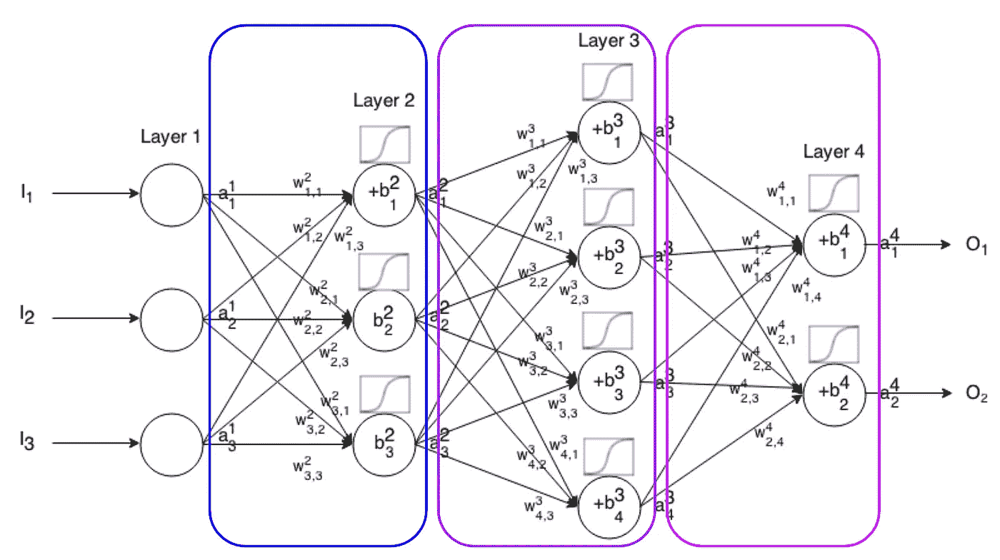
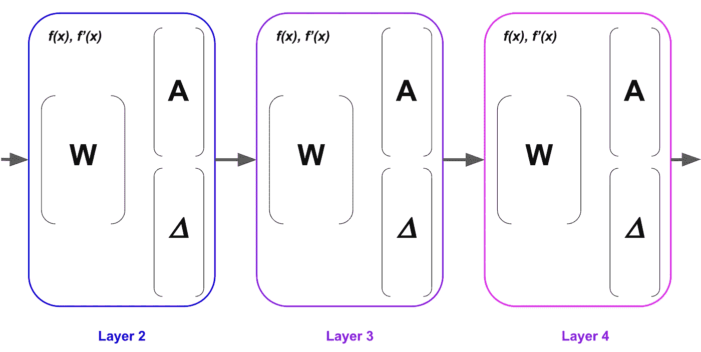
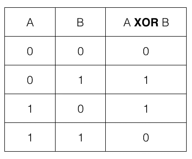

# 反向传播，简单的方法(第 2 部分)

> 原文：<https://towardsdatascience.com/back-propagation-the-easy-way-part-2-bea37046c897?source=collection_archive---------7----------------------->

## 反向传播的实际实现


**更新**:学习和练习强化学习的最好方式是去 http://rl-lab.com

在[第一部分](/back-propagation-the-easy-way-part-1-6a8cde653f65)中，我们已经看到反向传播是如何以最小化成本函数的方式导出的。在本文中，我们将看到实现方面，以及一些避免常见陷阱的最佳实践。

我们仍然处于简单模式，一次处理一个输入。

## 图层类别

考虑下图所示的全连接神经网络。



每个层将由包含权重、激活值(层的输出)、梯度 dZ(图像中未示出)、累积误差δ(𝚫)、以及激活函数 ***f(x)*** 及其导数***f’(x)***的层对象来建模。存储中间值的原因是为了避免每次需要时都要计算它们。

**建议:**最好围绕几个类来组织代码，避免把所有东西都塞进数组，因为很容易丢失。



请注意，输入图层不会由图层对象表示，因为它只包含一个矢量。

```
**class** Layer:

    **def** __init__(self, dim, id, act, act_prime, 
                 isoutputLayer = **False**):
        self.weight = 2 * np.random.random(dim) - 1
        self.delta = **None** self.A = **None** self.activation = act
        self.activation_prime = act_prime
        self.isoutputLayer = isoutputLayer
        self.id = id
```

Layer 类的构造函数将以下内容作为参数:

*   dim:权重矩阵的维数，
*   id:整数作为层的 id，
*   act，act_prime:激活函数及其导数，
*   isoutputlayer:如果该层是输出，则为 True，否则为 False。

它将权重随机初始化为-1 到+1 之间的数字，并设置要在对象内部使用的不同变量。

图层对象有三种方法:

*   向前，计算层输出。
*   向后，将目标和输出之间的误差传播回网络。
*   更新，根据梯度下降更新权重。

```
**def** forward(self, x):
    z = np.dot(x, self.weight)
    self.A = self.activation(z)
    self.dZ = self.activation_prime(z);
```

forward 函数通过输入 **x** 计算并返回层的输出，并计算和存储输出 A = activation (W.X)。它还计算并存储 dZ，即输出相对于输入的导数。

反向函数采用两个参数，目标 y 和 rightLayer，即假设当前层是𝓁.的层(𝓁-1)

它计算从输出向左传播到网络起点的累积误差增量。

**重要提示**:一个常见的错误是认为反向传播是某种环回，其中输出被再次注入网络。所以不用***dZ = self . activation _ prime(z)；*** 有的用途 ***self.activation_prime(一)*** *。*这是错误的，因为我们要做的只是计算出输出 a 相对于输入 z 的变化，这意味着根据链式法则计算导数**∂a/∂z**= ∂g(z)/∂z =**g’(z)**。这个误差可能是因为在 sigmoid 激活函数 **a = 𝜎(z)** 的情况下，导数**𝜎'(z)= 𝜎(z)*(1-𝜎(z)= a *(1-a)。**这给人一种输出被注入网络的错觉，而事实是我们正在计算 **𝜎'(z).**

```
**def** backward(self, y, rightLayer):
    **if** self.isoutputLayer:
        error =  self.A - y
        self.delta = np.atleast_2d(error * self.dZ)
    **else**:
        self.delta = np.atleast_2d(
            rightLayer.delta.dot(rightLayer.weight.T)
            * self.dZ)
    **return** self.delta
```

backward 函数的作用是根据以下公式计算并返回增量:


最后，更新函数使用梯度下降来更新当前层的权重。

```
**def** update(self, learning_rate, left_a):
    a = np.atleast_2d(left_a)
    d = np.atleast_2d(self.delta)
    ad = a.T.dot(d)
    self.weight -= learning_rate * ad
```

## 神经网络类

正如人们可能猜测的那样，层形成了一个网络，因此类 NeuralNetwork 用于组织和协调层。
它的构造器采用层的配置，这是一个长度决定网络层数的数组，每个元素定义相应层中的节点数。
例如[2，4，5，]表示网络有 4 层，输入层有 2 个节点，接下来的隐藏层分别有 4 个和 5 个节点，输出层有 1 个节点。第二个参数是用于所有层的激活函数的类型。

fit 函数是所有训练发生的地方。它首先选择一个输入样本，计算所有层上的前向，然后计算网络输出和目标值之间的误差，并通过以相反的顺序调用每层的反向函数(从最后一层开始到第一层)将该误差传播到网络。
最后，为每一层调用更新函数来更新权重。

这些步骤重复的次数由参数 epoch 确定。

训练完成后，可以调用预测函数来测试输入。预测功能只是整个网络的一个前馈。

```
**class** NeuralNetwork:

    **def** __init__(self, layersDim, activation=**'tanh'**):
        **if** activation == **'sigmoid'**:
            self.activation = sigmoid
            self.activation_prime = sigmoid_prime
        **elif** activation == **'tanh'**:
            self.activation = tanh
            self.activation_prime = tanh_prime
        **elif** activation == **'relu'**:
            self.activation = relu
            self.activation_prime = relu_prime

        self.layers = []
        **for** i **in** range(1, len(layersDim) - 1):
            dim = (layersDim[i - 1] + 1, layersDim[i] + 1)
            self.layers.append(Layer(dim, i, self.activation, self.activation_prime))

        dim = (layersDim[i] + 1, layersDim[i + 1])
        self.layers.append(Layer(dim, len(layersDim) - 1, self.activation, self.activation_prime, **True**))# train the network
    **def** fit(self, X, y, learning_rate=0.1, epochs=10000):
        *# Add column of ones to X
        # This is to add the bias unit to the input layer* ones = np.atleast_2d(np.ones(X.shape[0]))
        X = np.concatenate((ones.T, X), axis=1)

        **for** k **in** range(epochs):

            i = np.random.randint(X.shape[0])
            a = X[i]

            *# compute the feed forward* **for** l **in** range(len(self.layers)):
                a = self.layers[l].forward(a)

            *# compute the backward propagation* delta = self.layers[-1].backward(y[i], **None**)

            **for** l **in** range(len(self.layers) - 2, -1, -1):
                delta = self.layers[l].backward(delta, self.layers[l+1])

            *# update weights* a = X[i]
            **for** layer **in** self.layers:
                layer.update(learning_rate, a)
                a = layer.A# predict input
    **def** predict(self, x):
        a = np.concatenate((np.ones(1).T, np.array(x)), axis=0)
        **for** l **in** range(0, len(self.layers)):
            a = self.layers[l].forward(a)
        **return** a
```

## 运行网络

为了运行网络，我们以 Xor 函数的近似为例。



我们尝试了几种网络配置，使用不同的学习速率和历元迭代。结果如下所示:

```
 Result with tanh
[0 0] [-0.00011187]
[0 1] [ 0.98090146]
[1 0] [ 0.97569382]
[1 1] [ 0.00128179]Result with sigmoid
[0 0] [ 0.01958287]
[0 1] [ 0.96476513]
[1 0] [ 0.97699611]
[1 1] [ 0.05132127]Result with relu
[0 0] [ 0.]
[0 1] [ 1.]
[1 0] [ 1.]
[1 1] [ 4.23272528e-16]
```

建议您尝试不同的配置，自己看看哪种配置能提供最佳和最稳定的结果。

## 源代码

完整的代码可以从[这里](https://gist.github.com/ZSalloum/54703842f8a06e38fd76934579a6c814)下载。

## 结论

反向传播可能会令人困惑并且难以实现。你可能会有一种错觉，认为你通过理论掌握了它，但事实是，当实施它时，很容易陷入许多陷阱。你应该有耐心和毅力，因为反向传播是神经网络的基石。

## 相关文章

第一部分:[反向传播的简单详解](/back-propagation-the-easy-way-part-1-6a8cde653f65)
第三部分:[如何处理矩阵的维数](https://medium.com/@zsalloum/back-propagation-the-easy-way-part-3-cc1de33e8397)