# 反向传播，简单的方法(第 3 部分)

> 原文：<https://towardsdatascience.com/back-propagation-the-easy-way-part-3-cc1de33e8397?source=collection_archive---------11----------------------->

## 如何处理矩阵的维数

Photo by [Todd Brogowski](https://unsplash.com/@toddswrittenword?utm_source=medium&utm_medium=referral) on [Unsplash](https://unsplash.com?utm_source=medium&utm_medium=referral)

**更新**:学习和练习强化学习的最好方式是去 http://rl-lab.com

在系列的第 2 部分[中，我们认为我们的神经网络一次处理一个输入样本。然而，这是没有效率的。这需要太多的计算，并且不能从矩阵计算中使用的大量优化技术中获益。](/back-propagation-the-easy-way-part-2-bea37046c897)

大多数时候，用于训练神经网络的数据是以充满行的文件格式出现的，其中每行代表一个样本，每列代表一个特征。

下面我们来考虑一下网络。

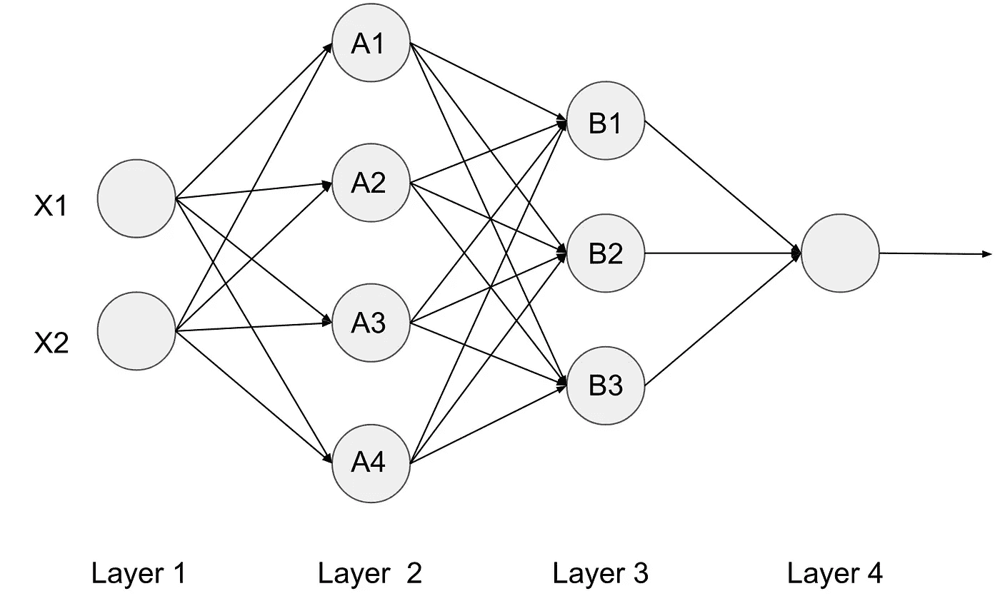

## 正向输送

我们将从关注前两层开始。

输入是一个包含数据行的文件，其中每一列都包含进入神经网络的一个输入条目的值。
例如，具有值(X11，X21，…，Xm1)的列 X1 进入神经网络的 X1 输入，类似于列 X2。

人们很自然地认为，输入到神经网络中的行数将在输出端收集。也就是说，如果我们有两个样本一次一个地输入网络，我们应该期望在输出端有两个结果(一次一个)。
同样，如果我们将数据作为包含代表两个样本的两行的矩阵输入，我们应该会得到包含两行结果的矩阵。

这也适用于每一层的输出。
让我们考虑一个包含 X1 和 X2 的不同样本的文件。
在第 2 层的输出端，对于输入到输入层的每个样本，我们有值 A1、A2、A3、A4。对于每个样本都是如此，因此对于 **m** 个样本，我们将有 **m** 个输出，例如(A11，A12，A13，A14)，(A21，A22，A23，A24)，…。(Am1、Am2、Am3、Am4)。所以第 2 层输出的 A 矩阵的维数是(m，4)。z 的导数也是如此。

注意，权重矩阵的维数不随样本数而改变，它仅取决于输入端的节点数(在本例中为 2)和输出端的节点数(在本例中为 4)，这使得它为(2，4)。

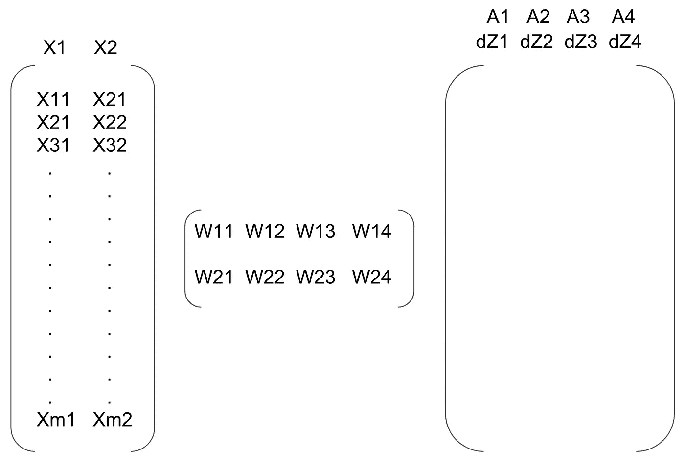

或者，我们可以通过线性代数获得相同的结果。
我们已经知道，在 feed froward 中我们计算 A 和 dZ，例如
**A = f(X.W)** 和 **dZ = f'(X.W)** 。
所以要计算 A 和 dZ 的维数，看一下 X 和 W 的维数就够了，它们分别是(m，2)和(2，4)。
结果是(m，2) x (2，4) = (m，4)。
下图描绘了如何填充 A 和 dZ 以形成维数为(m，4)的矩阵。

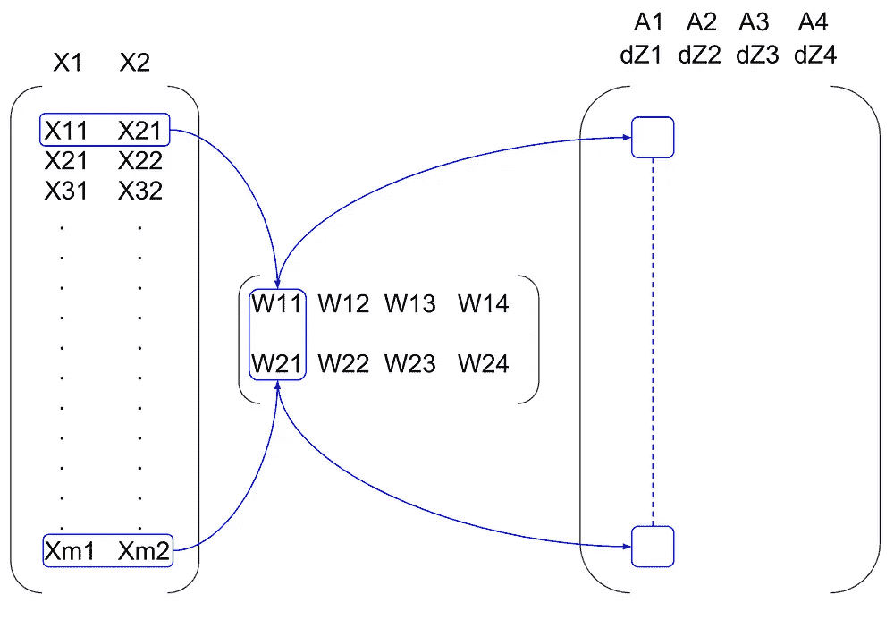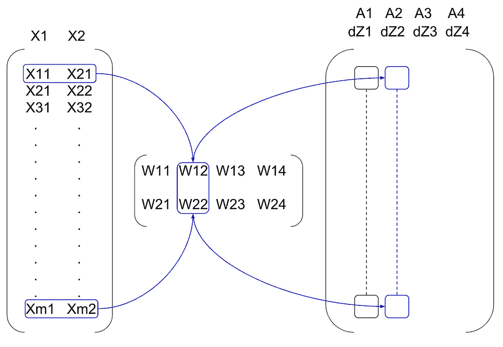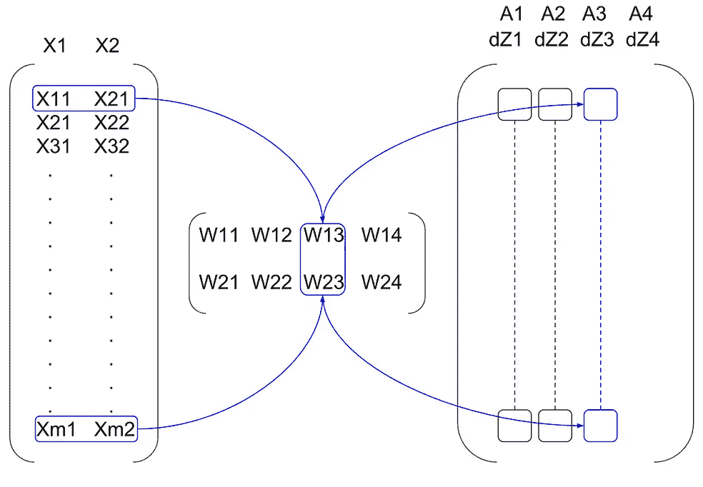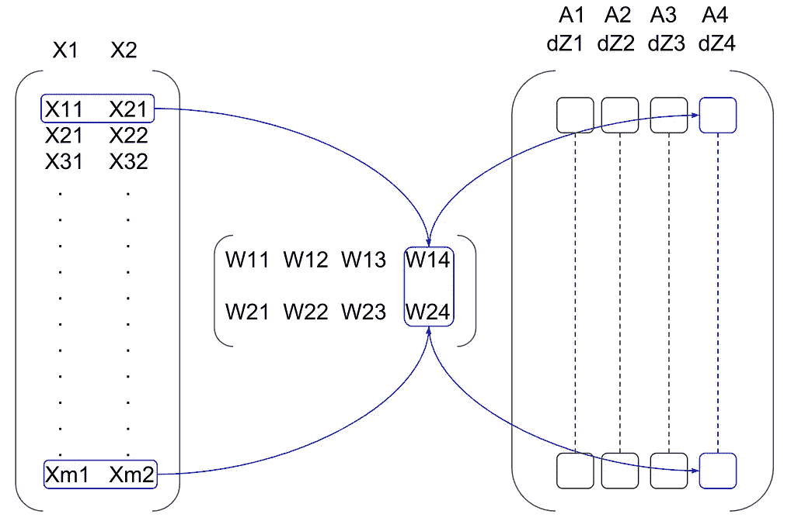

## 反向传播

到目前为止，我们计算了前馈阶段每层输出的维数。我们来看看反向传播。

提醒一下，反向传播中的公式是:

𝚫ᴸ = (Aᴸ - Y) * dZᴸ

𝚫ⁱ = (𝚫ⁱ⁺ .ᵀ)* dZⁱ西部

(其中*是成员的乘法运算)

我们现在知道 A 和 dZ 都具有维度(m，n ),其中 **m** 是样本的数量， **n** 是层中节点的数量。所以𝚫ᴸ将有相同的维数(m，n)

在我们的例子中，最后一层(L)只有一个节点，所以层 L 的 A 和 dZ 的维数为(m，1)。由此可见，𝚫ᴸ也有维数(m，1)。

为了计算内层的增量，让我们以示例中的第 2 层和第 3 层为例。

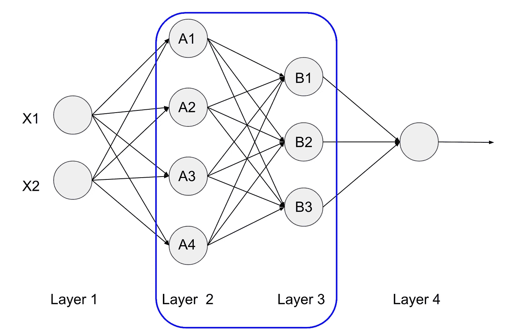

层 2 和层 3 之间的权重𝞱具有维度(4，3)，因为层 2 的 4 个节点连接到层 3 的 3 个节点。

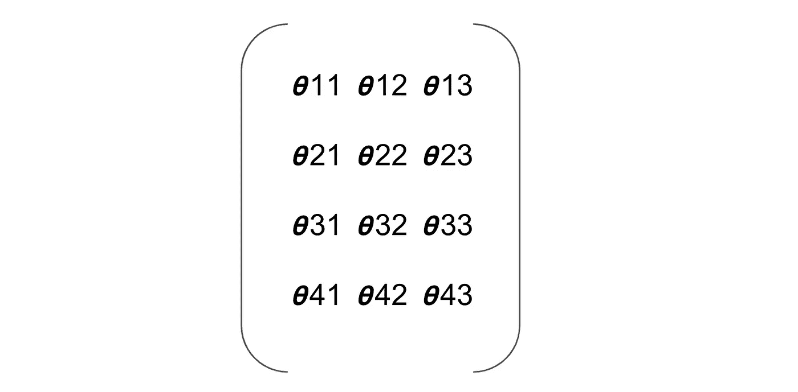

然而，由于第 2 层的增量是来自第 3 层的增量和权重𝞱的点积，我们最终得到以下配置。

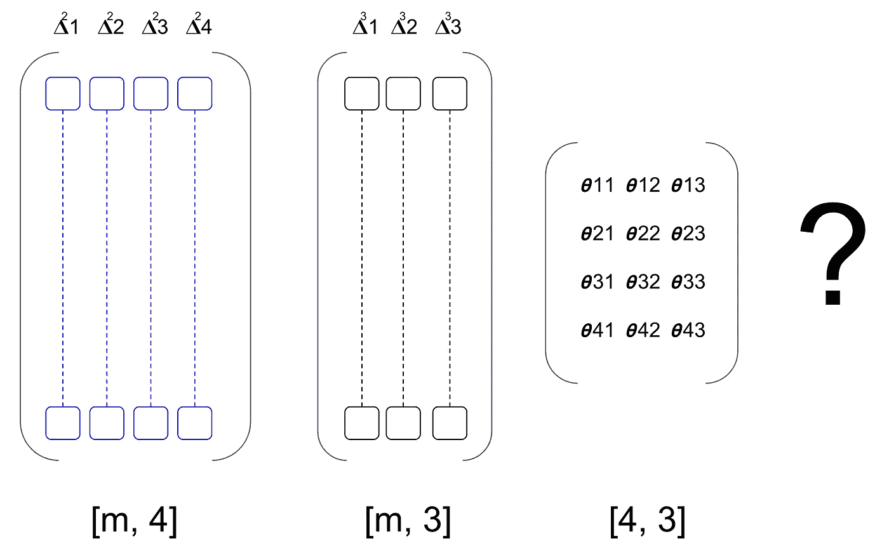

不可能进行点积并在维度为(m，4)的第 2 层获得 delta！
为了解决这个问题，我们用𝞱ᵀ转置了𝞱.

计算将是可能的，如下图所示

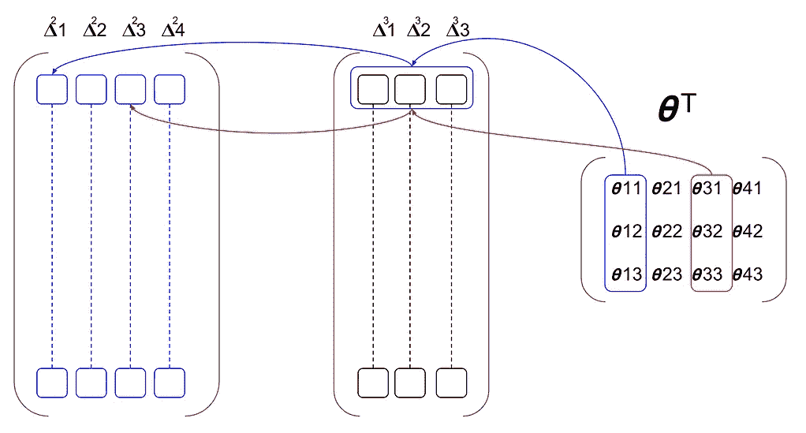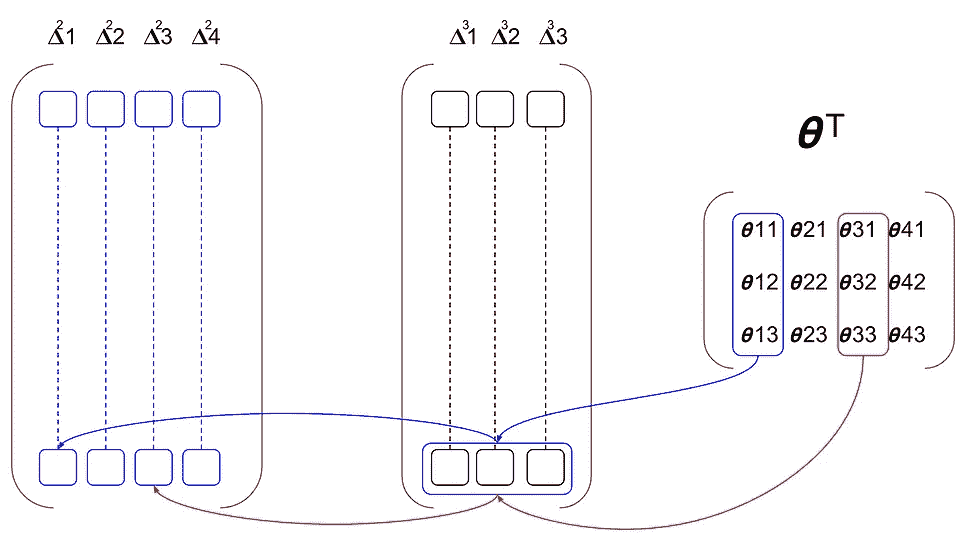

## 更新权重

更新层 ***i*** 的权重，包括获取该层的输入，对该层的增量执行点积，然后使用结果来更新权重。

如果我们以第 1 层和第 2 层为例，我们在第 1 层有一个维度为(m，2)的输入，在第 2 层有一个维度为(m，4)的增量。
然而，连接层 1 和层 2 的权重矩阵具有维度
(2，4)。

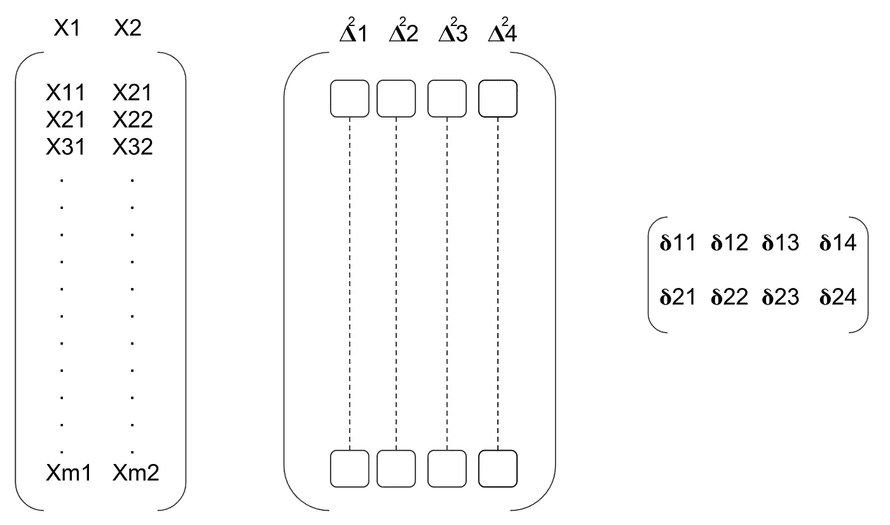

为了能够更新权重矩阵，x 和𝚫之间的点积应该产生(2，3)矩阵。
这是通过得到 x 的转置，即 x 的 **ᵀ** ，然后执行点积 x 的 **ᵀ。**我们称之为𝞭.的𝚫

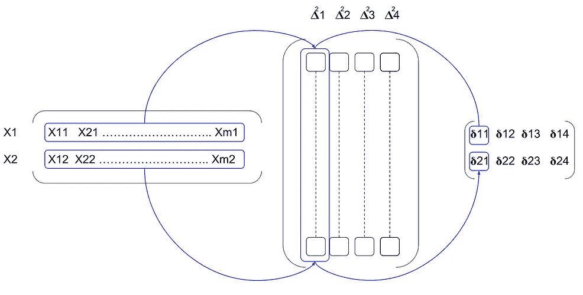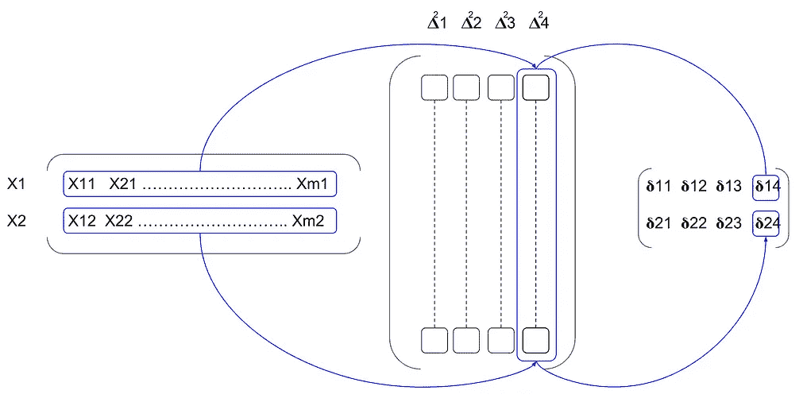

现在，我们可以使用梯度下降公式更新权重矩阵

Wⁿ⁺ = Wⁿ - 𝝰 * 𝞭(这里 n 是 w 的版本，而不是图层索引)

## 结论

您从头开始进行反向传播的可能性很小，这要感谢大量已经这样做的库。然而，如果你想自己做这个练习，你应该注意尺寸，否则你会陷入计算错误的迷宫。

## **源代码**

下面是前一篇文章中开发的 XOR 示例的源代码，它使用样本矩阵，而不是一次一个样本。

## 相关文章

第一部分:[反向传播](/back-propagation-the-easy-way-part-1-6a8cde653f65)
的简单详细说明第二部分:[反向传播](/back-propagation-the-easy-way-part-2-bea37046c897)的实际实现