# 回归基础:朴素贝叶斯去神秘化

> 原文：<https://towardsdatascience.com/back-to-basics-naive-bayes-demystified-8c21dc47f566?source=collection_archive---------21----------------------->

## 我们的目标是学习朴素贝叶斯，并将其应用于现实世界的问题，垃圾邮件检测。为什么是朴素贝叶斯？在这里找到答案！


Photo by [Webaroo.com.au](https://unsplash.com/@webaroo?utm_source=medium&utm_medium=referral) on [Unsplash](https://unsplash.com?utm_source=medium&utm_medium=referral)

我们的目标是学习朴素贝叶斯，并将其应用于现实世界的问题，垃圾邮件检测。为什么是朴素贝叶斯？考虑使用机器学习建立一个垃圾邮件过滤器。您希望根据邮件是未经请求的商业邮件(*垃圾邮件*)还是非垃圾邮件(*火腿*)对邮件进行分类。**分类*垃圾邮件* vs. *火腿*是一组更广泛的问题的一个例子，称为文本分类，一组问题，朴素贝叶斯可以以相对较高的性能解决。**朴素贝叶斯分类器是一种基于条件概率建模的强大分类算法。它对于具有多对多特征的分类问题特别有用，而且我们很快就会发现，可以忽略的条件依赖。**名字“天真”暗示我们在这里做了一个错误的假设；事实上，我们是！但事实证明，我们天真的假设在实践中非常有效。**

# 朴素贝叶斯

让我们假设我们对分类大量电子邮件感兴趣，并检测*垃圾邮件*与*垃圾邮件*。我们用 *x* 表示我们的输入向量。输入向量是每封邮件中单词的有序集合，比如 *x = {I，am，happy}* 。我们训练模型的目标是决定这个向量属于哪一类结果。我们把我们可能的结果集合表示为*C*；在这个例子中， *C={spam，ham}* 。

我们可以认为垃圾邮件检测是一个概率问题，我们想知道我们的电子邮件是垃圾邮件还是垃圾邮件的几率，并自然地选择几率更高的邮件。例如，我们可能会发现*垃圾邮件*的几率为 40%，因此*垃圾邮件*的几率为 60%(60% = 100%—40%)；然后，我们期望我们的模型将给定的电子邮件检测为 *ham* 。数学上我们用 *P(spam|x)= 0.4* 和 *P(ham|x)= 0.6* 或者如果我们真的想乱一点的话， *P(spam| I，am，happy)= 0.4* 和 *P(ham| I，am，happy)= 0.6* 。术语 *P(spam|x)* 读作电子邮件是*垃圾邮件* ( *垃圾邮件*发生)的概率，假设电子邮件是 *x* ( *x* 发生)。

到目前为止，一切顺利！但这里有一个问题。**怎么才能找到这些概率呢？**我们需要找到所有内容为 *x* 的电子邮件，并统计它们被*垃圾邮件*vs*火腿*的次数。比方说，我们收到 100 封内容为 *x* 的电子邮件，其中 60 封不是*垃圾邮件*，40 封是，那么:

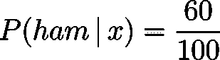

不过这里有一个小问题！为了检测一封电子邮件并决定它是否是垃圾邮件，我们需要接收许多完全相同的电子邮件，并在能够对它们进行分类之前将它们记录在我们的记录中。**不实用！**幸运的是，条件概率的贝叶斯定理可以帮助我们。请注意**贝叶斯定理不同于朴素贝叶斯假设！**贝叶斯定理可以写成:

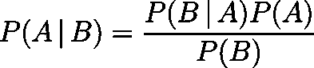

贝叶斯定理是概率论中的一个基本定理。好吧，就用它吧！

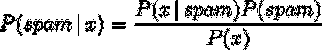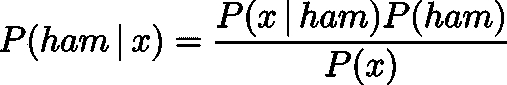

值得注意的是，我们真的想知道`**𝑃(spam|x)/ 𝑃(ham|x)>1**`是否存在；我们并不在乎它们的绝对值。所以我们真的想估计一下:

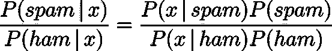

好消息是，与直接估算*𝑃(spam|x】*和 *𝑃(ham|x)* 相比，我们能更好地估算*𝑃(spam|x】**𝑃(x|ham】**𝑃(ham】*。据推测，我们有很多很多的电子邮件要么是垃圾邮件，要么是垃圾邮件，其中一些邮件的内容可能是垃圾邮件。这有助于我们处理不太频繁但存在于我们数据库中的电子邮件。**但是，我们可能找不到以 *x* 为内容的电子邮件！我们该怎么办？这就是朴素贝叶斯帮助我们的地方！还有一个概率定理是基本定理。**


Photo by [JESHOOTS.COM](https://unsplash.com/@jeshoots?utm_source=medium&utm_medium=referral) on [Unsplash](https://unsplash.com?utm_source=medium&utm_medium=referral)

让我们将这个定理应用到我们的电子邮件示例中。


更好看！好，让我们再次应用同样的定理。


现在是**朴素贝叶斯假设**大放异彩的时候了！**朴素贝叶斯假设 *x* 的元素是条件独立的，给定 *C* 。**换句话说，在我们的例子中，我们将假设:

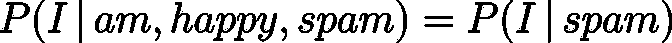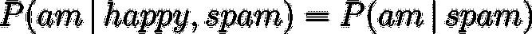

**这个假设不仅听起来不对，简直荒谬！如果邮件中有“am ”,我们自然会期望有更高的几率出现“I”。然而，它工作得相当好！为什么？这需要对正在发生的事情有更深入的了解，但本质上每个单词的个体概率对于大多数常见的分类类型来说已经足够了。好了，让我们把所有的东西放在一个等式里:**

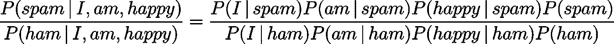

剩下的就好办了！我们只需要查找包含各种单词的电子邮件，而不是所有单词都放在一起。那是一种更实际的锻炼方式！假设我们有*1000 万*封*垃圾邮件*和 *1000 封*邮件中有“快乐”字样。另外，假设我们有 *1 亿*非*垃圾邮件*，其中 100 万包含“happy ”,那么:

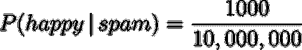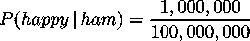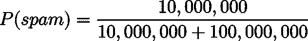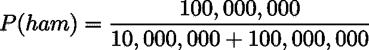

Photo by [Hitesh Choudhary](https://unsplash.com/@hiteshchoudhary?utm_source=medium&utm_medium=referral) on [Unsplash](https://unsplash.com?utm_source=medium&utm_medium=referral)

# 使用 Python 进行垃圾邮件检测

我很确定没有人想自己做上面所有的计算；所以让我们来看一个 Python 库！我们将使用一堆 Python 库将电子邮件分类为*垃圾邮件*和*火腿*。计算机在理解文本方面并不擅长，所以我们需要做的第一件事是用另一种形式表示每封邮件的内容。表示要在机器学习上下文中使用的文本的一种方式是使用单词袋表示法(BOW)。在收集了所有可能的单词并将它们放入字典后，我们为字典中的每个单词分配一个向量。每个向量的长度等于字典中的单词数。例如，如果我们的字典中只有四个单词 *{hello，I，am，happy}* ，那么我们可以为它们分配以下向量:

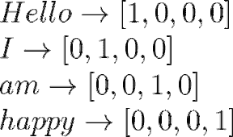

在 BOW 表示中，文档被简单地表示为字数的向量；**忽略单词顺序**。一个简单的表示“我很开心很开心”的鞠躬是:

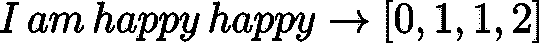

在这篇文章中，我们将使用这里可用的数据(感谢 Kaggle)。从技术上讲，这不是一个电子邮件数据集，但它是确定的。朴素贝叶斯也在这里工作！数据集在被您——饥饿的数据科学家——使用之前只需要少量的清理工作！下载 CSV 文件后，我们使用我们的朋友，' ***熊猫*** '，来加载数据。

```
import pandas as pd
file_encoding = 'utf8'
input_fd = open('./spam.csv', encoding=file_encoding, errors = 'backslashreplace') #the file has some non utf8 parts
data = pd.read_csv(input_fd)
data = data.iloc[:,0:2]    #removing the null columns
data.columns = ['label','content']
data.head()
```

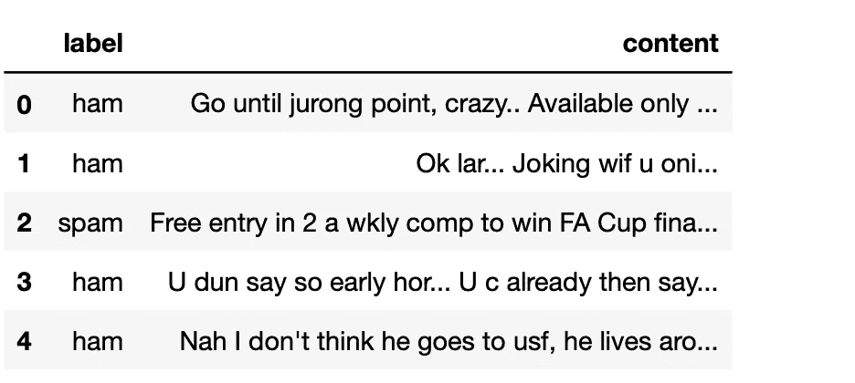

我们需要将电子邮件放入 BOW 表示中。没问题！我们将使用模块'***text***' from '***sk learn***'来处理这个问题。首先，我们需要告诉 Python 为我们制作我们需要的字典。

```
from sklearn.feature_extraction import text 
word_bagger = text.CountVectorizer()
```

> 注意:任何语言中都有一些单词对文本分类等没有那么大的价值；一个原因是它们在任何上下文中都很常见，例如，“the”、“am”和“this”无处不在。我们可以使用下面的选项来摆脱它们。

```
word_bagger = text.CountVectorizer(stop_words="english")
```

如果你有兴趣看看你的字典里有多少单词，甚至看一看它们，做我的猜测吧！您可以通过以下方式轻松查看:

```
words = word_bagger.get_feature_names()
len(all_words)
```

如你所见，我们的字典里有 *8692* 。如果你对 word *1001* 到 *1010* 感到疑惑，那么你可以看看！

```
words[2000:2010]
```

我们得到下面的话:

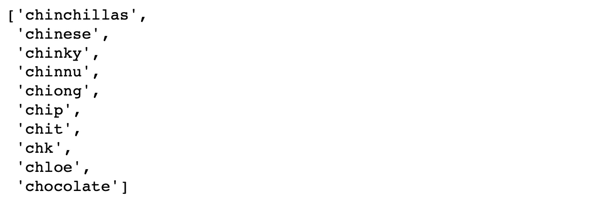

现在我们有了字典，我们可以将任何句子转换成向量。只要照着这个做:

```
X = word_bagger.transform(data['content'])
```

让我们看看它通过转换'*我很开心很开心【T1]'做了什么！*

```
test = word_bagger.transform(['I am happy happy'])
```

如果你查看变量 *test* ，它被存储为*‘压缩稀疏行*’。这是因为' ***sklearn*** '非常注意有效地使用内存，并希望最小化任何冗余存储。因此，它只跟踪非零元素。只需使用 *print* 命令查看*测试*的非零元素。

```
print(test)
```

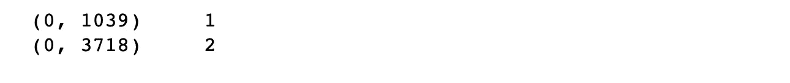

# 训练模型:

信不信由你，我们已经完成了大部分工作！我们现在将使用另一个' ***sklearn*** '模块来训练我们的朴素贝叶斯分类器。根据输入变量的特征，我们需要使用不同版本的朴素贝叶斯。它们是什么？让我们来看看。

*   **高斯朴素贝叶斯**:对于特征服从高斯分布的连续数据。
*   **多项式朴素贝叶斯**:针对特征为*计数*(即非负整数)的离散数据。
*   **伯努利朴素贝叶斯**:针对具有二进制值特征的离散数据。

在我们的例子中，我们需要使用**多项式朴素贝叶斯**；让我们导入它，然后在我们的数据集**上训练模型。**

```
from sklearn.naive_bayes import MultinomialNB
spam_nb = MultinomialNB()
spam_nb.fit(X, y)
```

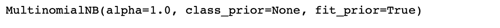

我们可以使用' ***sklearn*** '提供的原生评分函数轻松检查我们训练好的模型的样本内准确率。

```
spam_nb.score(X,y)
```

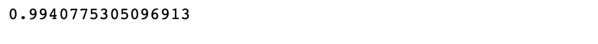

> 注意:这是一条通往高分的道路！我们在这里绝对是过度适应了。这可以使用通常的交叉验证或其他用于避免过度拟合的方法来避免。

我们完了！又短又甜，对吧？我们可以在一些样本案例上尝试我们的训练模型，看看结果是否符合我们的预期。

```
ham = "Let me know if it works for you? I will keep you posted!"
spam = "Buy real cheap eyeglasses here, eyeglasses.club!"
test_bagged = word_bagger.transform([ham, spam])
spam_nb.predict(bagged)
```

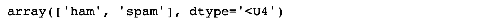

我们确实做得很好！总之，这是一个基本的机器学习算法，它是可靠的，因为很多很多的原因，比如易用性和快速计算时间。

快乐阅读&保持好奇！

*原载于 2019 年 12 月 31 日*[*http://hamidomid.com*](http://hamidomid.com/naive-bayes-classifier-demystified)*。*