# 回归基础:第 1 部分

> 原文：<https://towardsdatascience.com/back-to-basics-part-1-7065c90eae71?source=collection_archive---------12----------------------->

## 排列和组合

似乎不管我上了多少高级统计课，或者我重温了多少次这个话题，排列和组合仍然难住我。这篇文章是“回归基础”系列博客文章的第一篇，旨在建立数据科学的数学基础。这第一篇文章的目的是帮助彻底解决如何从瓶子里挑选那些讨厌的弹珠的问题！

排列和组合属于数学的一个分支，叫做组合学。具体来说，这是建立在**广义计数基本原理**的基础上的，即如果你进行 r 个实验，第一轮可能的结果是 n₁，第二轮是 n₂，……，rᵗʰ回合是 nᵣ，那么就有 n₁n₂……nᵣ可能的结果。

假设我们运行一个三轮实验，比如从一个装有红色和蓝色两个弹珠的罐子里选择弹珠。我们每轮选择两个弹珠。整个实验会有多少种可能的结果？

对于第一轮，有两种可能的结果。对于这两种结果中的每一种，第二轮都有两种可能的结果，所以 2 ^ 2 = 4 种可能的结果。在第三轮决赛中，四个变量中的每一个都有两个以上的可能结果，所以 4 ^ 2 = 2 ^ 2 = 2 = 8 个可能结果。

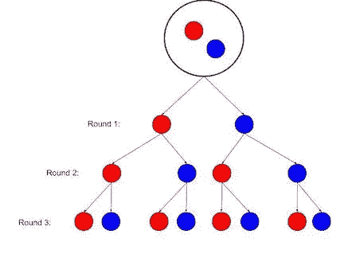

我们可以使用这个一般原则，用四个标准从给定的集合中找出排列项目的变化。这可以分为两种方式来思考一组物体的排列:**排列和组合**。对于排列，顺序很重要。在这种情况下，选择红色弹珠然后选择蓝色弹珠与选择蓝色弹珠然后选择红色弹珠是截然不同的结果。对于组合，顺序并不重要，即包含一个蓝色弹珠和一个红色弹珠的组是相同的组，无论哪个先被选择。无论哪一种，我们都可以替换掉瓶子里的弹珠，或者不替换。

1.  **排列(顺序事项)**

**a .带替换件**

当顺序不重要时，我们有多少种方法可以从三个弹珠的罐子中选择两个弹珠，并进行替换？在第一个例子中，有三种方法来选择第一个弹球，对于这三种方法中的每一种，还有三种方法来选择下一个弹球。沿着箭头，有 9 种不同的可能结果，或者 3 种。

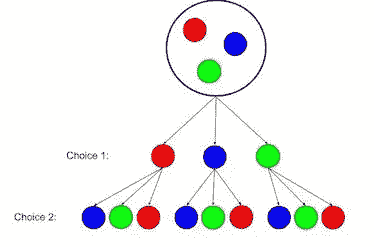

如果我们想替换弹珠，选择第三次，会有 3 3 3 = 3 种可能性；第四轮，我们会有 3 3 3 3 = 3⁴可能的结果，等等。一般来说，从一组 *n* 个对象中选择 *r* 个对象有 nʳ **种方式。**

**b .无需更换**

如果我们不把三颗弹珠放回瓶子里，有多少有序排列的弹珠？对于第一种选择，也有三种选择。对于这三个选择中的任何一个，第二个弹球只剩下两个选择。最后的弹珠永远只剩下一颗，三轮过后我们将被迫停止选择。所以有 3 2 1 = 6 种可能的结果，或者说是 3！。

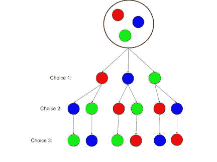

如果我们不打算选择所有的弹珠呢？假设瓶子里有 5 颗弹珠，我们将只选择其中的 2 颗。在这种情况下，有 5 种方法来选择第一个弹球，因为我们没有把它放回瓶子，第二个弹球有 4 种可能性。这是 5 4 = 20 种可能的组合。或者，这和上面的问题是一样的，但是“移除”了最后一轮，在这一轮中，我们继续选择瓶子中的所有弹珠。所以，我们可以把这些可能性分开，把 5 4 改写成:

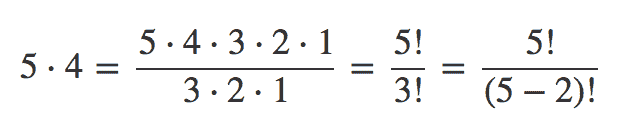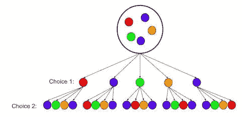

一般来说，从 *n* 总*个对象中选择 *r* 个对象而不替换的方法是:*

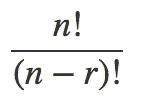

**2。组合(顺序无关紧要)**

**答:无需更换**

让我们扩展上面的例子，并考虑我们可以从五个*中选择两个弹珠而不用*替换它们的方法。

我们知道，当我们从一组 5 个物体中选择 2 个时，共有 5 个！/(5–2)!可能的结果。这里的新内容是冗余问题。每个颜色对都有一个冗余副本(例如，红色+蓝色=蓝色+红色)，因此我们可以将可能性的数量除以 2 ^ 1 = 2！

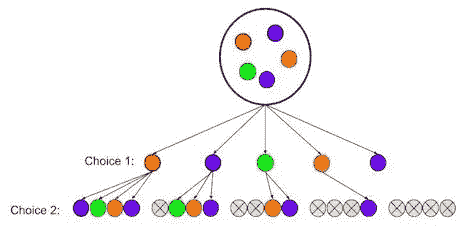

所以，总可能性的数量是:

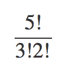

概括地说，从总共 n 个对象中产生 r 个对象的组而不替换(即，在一个组中没有重复项)的方法的数量等于:

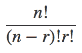

这也是用符号写的:

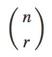

**b .带替换件**

三个弹珠可以组成多少个不同的*组*,每组两个，可以替换？在这种情况下，包含一个红色和一个蓝色弹珠的组与选择红色然后选择蓝色或选择蓝色然后选择红色是一样的。和上一节一样，我们只关心最终的分组，而不是每个对象被选中的顺序。但是，因为我们有替换，所以每组中可以有重复的颜色。

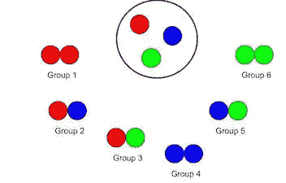

在这种情况下，有六种可能的分组，我们可以展开得到:

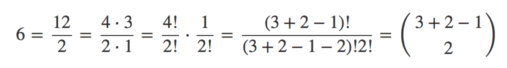

类似地，当顺序不重要时，有 15 种方法从总共 5 个弹珠中选择 2 个弹珠，并进行替换。

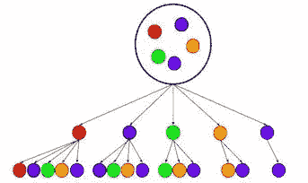

和以前一样，我们可以将它展开得到:

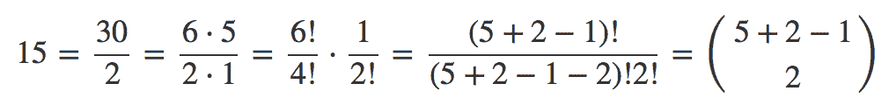

所以，一般来说，从总共 *n 个*对象中产生多组 *r 个*对象的方法总数，加上替换，当顺序不重要时，是:

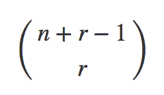

**有用的公式**

总之，对于从总共 *n* 个对象中选择 *r* 个对象*的可能方式的数量，我们有以下规则:*

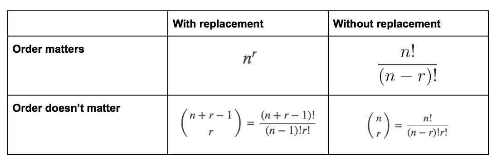

*我希望下次你从幸运弹珠罐中挑选或者只是准备数据科学面试时，这篇文章对你有用。欢迎和我联系，或者在评论中留下你的想法。*