# 回归基础:第 2 部分

> 原文：<https://towardsdatascience.com/back-to-basics-part-2-adf4f623cb45?source=collection_archive---------24----------------------->

## 条件概率和独立性

这是一系列博客中的第二篇，旨在建立数据科学的数学和统计基础(第一篇讨论了[排列和组合](/back-to-basics-part-1-7065c90eae71?source=friends_link&sk=0a86fe846d53e305419fe756eaac7e74))。这篇文章的目标是回顾条件概率和统计独立性背后的概率定理。概率论使我们能够根据观察到的信息模式做出预测，这是数据科学中预测分析的基础。

条件概率是指在给定另一事件 B 也已发生的情况下，某一事件 A 将发生的概率。它被写成 P(A|B)。自然地，发生车祸的概率是以首先进入车内为条件的，所以当 P(发生车祸|不要进入车内)严格为零时，P(发生车祸|一定要进入车内)在零以上。显然，首先上路很重要。

另一方面，如果 B 发生的概率对 A 发生的概率没有影响，那么两个事件 A 和 B 被称为统计独立。例如，一个人是否会遭遇车祸完全与他或她上周一早餐吃了什么无关。

## 条件概率

有了条件概率，我们就可以根据先前事件的新信息来更新样本空间，从而更新我们的概率计算。所以，P(撞车|乘车)≠ P(撞车|坐火车)，因为这些“前科”(乘车和坐火车)给出了撞车可能性的重要信息。

让我们转到一个不那么病态、更经典的纸牌例子。在第一次抽牌时，从一副标准牌中抽出一张 a 的概率，记为 P(A1)，总是 4/52 或 1/13。然而，第二次抽 a 的概率 P(A2)取决于是否先抽了 a。如果在第一笔交易中确实抽到了 a，那么我们得到 P(A2|A1) = 3/51 或 1/17(注意样本空间已经从 52 更新到 51)。

进一步分解这个简单的例子可以让我们建立一些有用的方程。在前两次抽牌中抽到 a 的概率表示为 P(A1∩A2)，为(1/13)*(1/17)或 1/221。

到目前为止，我们已经:

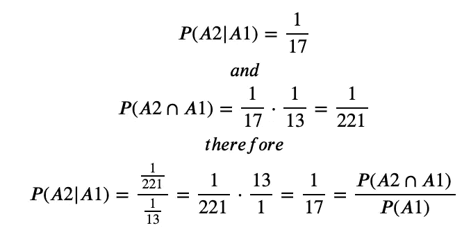

这给了我们解决条件概率问题所需的第一个等式:

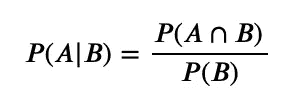

通过重新排列和乘法的交换性质，我们得到:

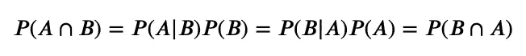

这个等式的内部两个表达式意味着:

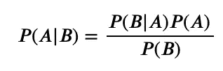

这就是贝叶斯定理。我们来看一个例子！

## 贝叶斯在行动

假设你有一个同事，汤姆，他一周有 5 天(随机)有 3 天开车上班。不过，我们不会在可怜的汤姆身上使用车祸场景——汤姆的问题是，虽然他喜欢开车挨家挨户上下班的便利，但早上的交通可能会相当拥挤，这意味着他开车时会迟到 1/3 的时间。

汤姆也可以坐火车，虽然他不喜欢往返车站的额外麻烦，但他的火车通常是可靠的，当他乘火车通勤时，他只迟到 1/12 的时间。他每周(随机)5 天中有 2 天坐火车。

你的另一位同事 Larry 开始在办公室打赌 Tom 在迟到的日子里是开车还是坐火车。假设 Tom 没有及时通知向底池中放多少钱，您需要计算他开车去上班的确切概率。

到目前为止，我们有以下信息:

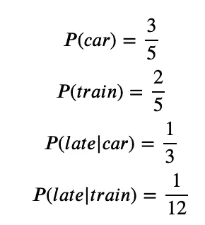

贝叶斯定理告诉我们:

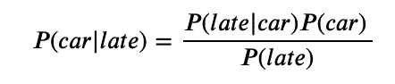

而我们很容易就能算出 P(后期):

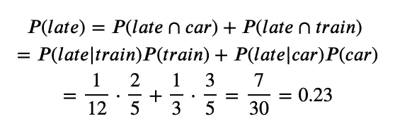

知道汤姆每 30 天迟到 7 天，我们就有:

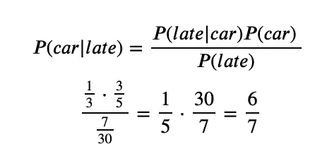

同样地:

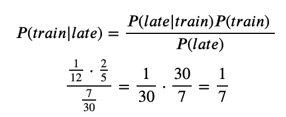

这些信息足以让你知道，如果你打赌汤姆在他迟到的日子里开车去上班，你会赢回你的钱，而且是 7 次中的 6 次。

## 独立性ˌ自立性

独立事件是指事件 B 的发生不会改变事件 A 发生的概率的事件。这样，当 A 和 B 是独立事件时，P(A|B) = P(A)。

根据这一点和贝叶斯定理，我们可以证明 P(B|A) = P(B ):

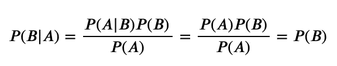

并且，由于 P(A∩B)=P(B|A)P(A)，那么 P(A∩B)=P(B)⋅P(A)=P(A)⋅P(B)当 a 和 b 统计独立时。

## 滚动骰子

统计独立性的思想可用于找出掷出*至少* 1 个公平骰子的三分之六的概率:

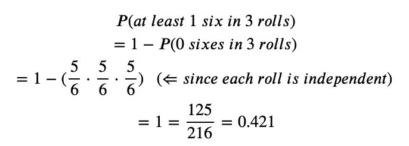

我希望这篇关于条件概率和统计独立性的基本原理的综述对你有所帮助，哪怕只是告诉你在同事的缺点或骰子游戏上该下多少赌注。欢迎在评论中联系我。