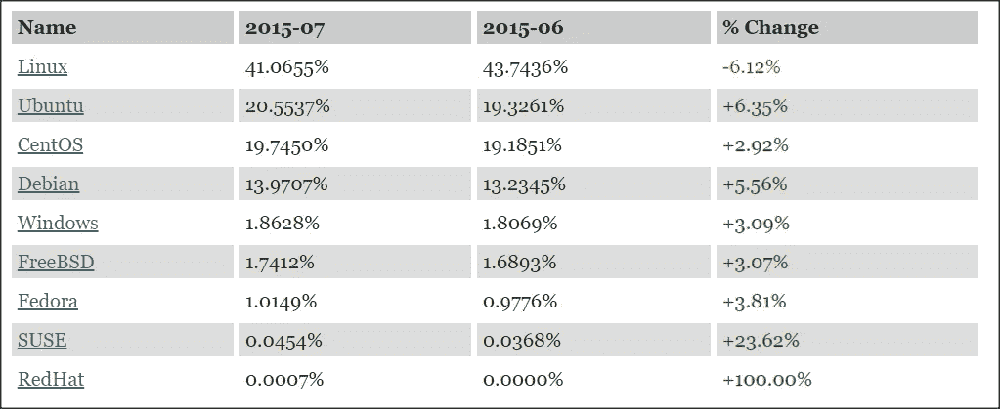
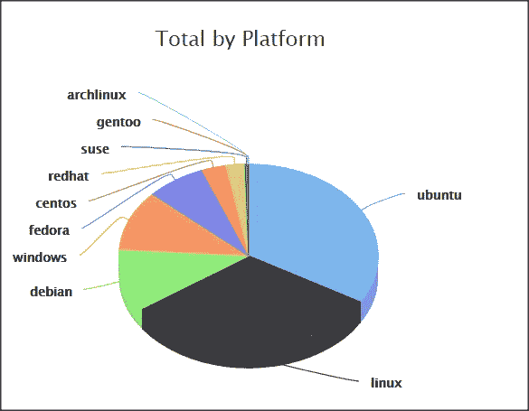
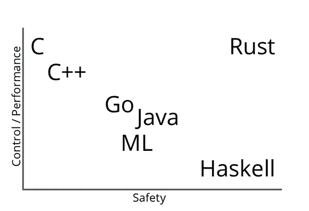

# 回归金属:开发大数据框架的三大编程语言

> 原文：<https://towardsdatascience.com/back-to-the-metal-top-3-programming-language-to-develop-big-data-frameworks-in-2019-69a44a36a842?source=collection_archive---------3----------------------->

## C++，Rust，用 Java 做数据密集型框架

Photo by [Rob Lambert](https://unsplash.com/@roblambertjr?utm_source=unsplash&utm_medium=referral&utm_content=creditCopyText) on [Unsplash](https://unsplash.com/s/photos/metal?utm_source=unsplash&utm_medium=referral&utm_content=creditCopyText)

在之前的一篇博客文章中: [**统治数据密集型(大数据、快速数据)框架的编程语言**](/programming-language-that-rules-the-data-intensive-big-data-fast-data-frameworks-6cd7d5f754b0) **，**我简要讨论了一些最流行的大数据框架，并展示了 **Java** 是数据密集型框架中事实上的编程语言。在 2004 年至 2014 年期间，当大多数主流大数据框架得到开发时，Java 相对于其他语言具有显著的优势(例如平台独立性、生产力、JVM)。

在过去的 10 年里，编程语言领域发生了很多变化。一些经典语言经历了重大改革和现代化。一些非常有前途的现代编程语言也以优雅的特性出现。计算机硬件已经经历了重大变化(**多核处理器、GPU、TPU** 的兴起)也是如此。集装箱化随着 Docker，Kubernetes 应运而生，并成为主流。

如果有人或某家公司想在 2019 年开发下一个颠覆性的大数据框架(例如下一个 Hadoop、Kafka、Spark)，什么编程语言会是最合适的？大数据领域的经典语言 Java 或任何其他语言？首先我将讨论 Java 的局限性，然后我将在**数据密集型框架开发**的背景下提出更好的替代方案。大部分的观点对于开发**云原生**、**物联网**和**机器学习**框架也是有效的。

# Java 的局限性

每种编程语言都有其局限性。此外，Java 作为数据密集型领域最主要的编程语言，也有其自身的局限性。在这里，我将讨论 Java 在数据密集型框架开发环境中的主要局限性。

JVM: JVM 对 Java 被广泛采用并成为最流行的编程语言之一起到了巨大的作用。但是就像生活中的很多事情一样，有时候最大的优点也是最大的缺点。下面列出了 JVM 的主要限制:

*   ***运行期*** *:* JVM 从开发者那里抽象出硬件。因此，Java 永远无法像接近金属的语言那样达到接近本机的速度/性能。
*   ***垃圾收集器*** *:* JVM 提供了垃圾收集器，极大地帮助开发人员将注意力集中在业务问题上，而不用考虑内存管理。大多数时候，默认的垃圾收集器在默认设置下工作正常。但是，当垃圾收集器需要调优时，一切都完了。Java 的垃圾收集器由于其“ ***停止世界*** ”的性质，对于大量的长寿命对象有特殊的问题。不幸的是，数据密集型应用意味着大量的对象。Apache Flink 开发了自己的 [**堆外内存管理**](https://flink.apache.org/news/2015/09/16/off-heap-memory.html) 解决方案来解决这个问题。Apache Spark 也有类似的使用 [**项目钨**](https://databricks.com/blog/2015/04/28/project-tungsten-bringing-spark-closer-to-bare-metal.html) 的堆外内存管理解决方案。许多其他大数据框架(Cassandra、Solr)也面临同样的问题。使用 JVM 管理对象，开发堆外内存管理来绕过 JVM 的对象管理，说明 JVM 还没有高效地处理大量对象。
*   ***内存占用*** *:* 由于 JVM 的内存占用很大，java 在缩小规模方面非常糟糕，也就是说，当一台机器上需要运行 100 个或更多的实例时。这就是为什么[**Linkerd**](https://github.com/linkerd/linkerd2)**已经从高性能、高吞吐量的 Scala+Finagle+Netty 栈中走出来生锈的原因。**

****开发者生产力:**Java 在 1995 年刚出现的时候，凭借其精简的规模和简单性，在当时是一门非常有生产力的语言。随着时间的推移，Java 增加了许多特性，增加了语言规范的规模/复杂性，不再被认为是最有生产力的语言。事实上，在过去的十年中，Java 经常因其需要大量样板代码的冗长本质而受到批评。**

****并发:**虽然 Java 是在多核时代之前发布的，但 Java 通过线程、锁、确定性内存模型和其他高级抽象提供了出色的基于共享内存的并发支持。基于共享内存的并发很难编程，并且容易出现数据竞争。Java 不提供任何基于语言级消息传递的并发性(更容易正确编程)或基于异步事件循环的并发性(I/O 繁重任务的更好选择)。 [***Akka***](https://akka.io/) 或其他高性能库可以在 Java 中提供消息传递或异步并发。但是如果没有 JVM 的内置支持，它们的性能将不如有本地支持的语言(例如 **Go** 、 **Erlang** 、 **Node.js** )。在当今多核处理器的世界里，这是 Java 的一个巨大缺点。**

****序列化** : Java 的默认序列化非常慢，有安全漏洞。因此，Java 序列化是数据密集型领域的另一个棘手问题，Oracle 将其称为 [**可怕的错误**](https://www.infoworld.com/article/3275924/java/oracle-plans-to-dump-risky-java-serialization.html) ，并计划在未来的 Java 版本中放弃。**

# **解决方案:回到金属**

**在 Java 的 heydeys 时代，这种接近金属的语言曾经被宣布过时并注定要消亡，但最近几年却获得了很多关注，这是有充分理由的。C 编程语言是由贝尔实验室的丹尼斯·里奇在一段时间(1969-1973)开发的，当时 CPU 的每个周期和内存的每个字节都非常昂贵。出于这个原因，C(以及后来的 C++)被设计成以语言的复杂性为代价，从硬件中获得最大的性能。**

**有一种误解认为，在大数据领域，人们不需要太在意 CPU/内存。如果有人需要更高的性能或需要处理更多的数据，就需要在大数据服务器中添加更多的机器。但是增加更多的机器/节点也会增加云提供商的费用。还有，随着机器学习/深度学习的兴起，未来几年硬件架构会发生快速变化。因此，在未来的日子里，完全控制硬件的编程语言只会越来越重要。**

**近金属语言在数据密集型框架中使用还有另一个缺点:平台依赖性。目前，Web 服务器操作系统由 [***Linux 以 97%左右的市场份额占据绝对优势***](https://web.archive.org/web/20150806093859/http://www.w3cook.com/os/summary/) *:***

****

**[https://web.archive.org/web/20150806093859/http://www.w3cook.com/os/summary/](https://web.archive.org/web/20150806093859/http://www.w3cook.com/os/summary/)**

**公共云也由 Linux 主导，占据超过 90%的市场份额:**

****

**[https://thecloudmarket.com/stats#/totals](https://thecloudmarket.com/stats#/totals)**

**随着 Docker，Kubernetes 容器化的迅速发展，可以自由地在任何平台(例如 Windows)上开发任何其他平台(例如 Linux)。因此，平台依赖性不再是为数据密集型框架开发选择编程语言的关键因素。**

**不要误解我，Java 仍然是开发数据密集型框架的强大语言。有了 Java 新的 [***虚拟机 GraalVM***](https://www.graalvm.org/)*和新的 [***垃圾收集器 ZGC***](https://wiki.openjdk.java.net/display/zgc/Main) ，Java 在几乎任何领域都将是更有吸引力的语言 ***。但是我确信，在未来几年，在开发数据密集型框架方面，接近金属的语言将会比 Java/Scala 更占优势。在这里，我将挑选三种接近金属的语言作为 2019 年在 Java/Scala 上开发数据密集型框架的潜在候选语言。******

## ***C++***

***像先驱的准金属语言 C 一样，C++也植根于贝尔实验室。在贝尔实验室期间， [**比雅尼·斯特劳斯特鲁普**](https://en.wikipedia.org/wiki/Bjarne_Stroustrup) 在 1985 年第一次发布商业版本时，已经初步实现了 C++作为“面向对象的 C”。C++是一种通用、静态类型、编译的编程语言，支持多种编程范式(函数式、命令式、面向对象)。像 C 一样，它也是一种近乎金属的语言，在没有内存安全或并发安全的情况下，对硬件进行完全控制。与 C 类似，C++也信奉以下 Moto:***

******

***也就是说，C++将为开发人员提供一种非常强大的语言，但开发人员有责任确保程序内存安全或数据无竞争。C++也有很多特性和功能(特性地狱)，可能是最难掌握的编程语言之一。自 2000 年以来，C++增加了许多特性(内存模型、基于共享内存的并发性、lambda ),使语言更简单、更安全、并发友好。但是这些变化是有代价的，C++语言规范变得更大甚至更复杂。***

***C++的另一个问题是构建时间长(我记得构建一个 CORBA 库需要 30 分钟)。然而，使用现代 C++(例如，**[***【C++ 17***](https://en.wikipedia.org/wiki/C%2B%2B17))并使用类似于 [***资源获取是初始化(RAII)***](https://en.cppreference.com/w/cpp/language/raii) 的原则，与旧版本的 C++(例如，C++98)相比，在 c++中开发内存安全、数据竞争自由的编程相对更容易。C++仍然缺乏对消息传递并发(将在[***c++ 20***](https://en.wikipedia.org/wiki/C%2B%2B20)中出现)和基于异步事件循环的并发的语言级支持。*****

*****虽然有很多 C++库支持消息传递和基于异步事件循环的并发**(传奇 Node.js 基于异步事件循环的并发是用 C++开发的)**。学习 C++很难。掌握 C++更是难上加难。但是如果有一群有经验的 C++开发人员，他们可以构建无与伦比的框架(在任何领域，包括数据密集型领域)。有一个 [***4 节点 ScyllaDB(用 C++编写)的例子，它的性能优于 40 节点 Cassandra(用 Java 编写)***](https://www.scylladb.com/product/benchmarks/) 。*****

*******优点:*******

*   *****最常用、最成熟的编程语言之一，在包括大数据或分布式系统在内的许多领域都有良好的记录。*****
*   *****惊人的快，接近金属语言与**最大限度地控制硬件(CPU，GPU，TPU)** ，旨在提取金属的最大性能。*****
*   *****优秀的工具和庞大的库生态系统。语言越来越容易，并不断进化( [***比雅尼·斯特劳斯特鲁普上 C++17***](https://www.infoworld.com/article/3044727/application-development/qa-bjarne-stroustrup-previews-c-17.html) )。*****

*******缺点:*******

*   *****对消息传递或基于异步事件的并发性没有语言级别的支持(对于 I/O 繁重的任务)*****
*   *****非常陡峭的学习曲线和它的大规格，这是最难掌握的语言之一。不适合新手、刚毕业的学生或动态语言开发人员(PHP、Ruby 等)*****
*   *****没有对内存安全、数据竞争安全的语言级支持(虽然[***C++ 17***](https://en.wikipedia.org/wiki/C%2B%2B17)相比老的 c++更安全)。很少有经验不足、粗心大意的开发人员会对整个项目造成严重破坏。*****

*******值得关注的大数据项目:*******

*   *****[MongoDB](https://www.mongodb.com/)*****
*   *****[ScyllaDB](https://www.scylladb.com/)*****
*   *****[MemSQL](https://www.memsql.com/)*****
*   *****[RocksDB](https://rocksdb.org/)*****
*   *****[BeeGFS](https://www.beegfs.io/content/)*****

## *****锈*****

**********

*****[https://thoughtram.io/rust-and-nickel/#/11](https://thoughtram.io/rust-and-nickel/#/11)*****

*****人们一直在寻找一种理想的编程语言，它将提供类似金属语言(C、C++)的性能/控制，以及运行时语言(Haskell/Python)的安全性。最后，Rust 看起来像是“**承诺了**的语言”，也就是说，它提供了类似 C/C++的性能/控制，以及[***Haskell***](https://www.haskell.org/)/[***Python***](https://www.python.org/)的安全性。受研究编程语言[***Cyclone(safer C)***](https://cyclone.thelanguage.org/)，[***Graydon Hoare***](https://github.com/graydon)首先开发了 Rust 作为个人项目，后来由 **Mozilla** 赞助，并得到了**大卫·赫尔曼**、 [***布伦丹·艾希***](https://en.wikipedia.org/wiki/Brendan_Eich)****的积极贡献 Rust 是一种静态类型的编译系统编程语言，支持函数式和命令式编程范式。*********

******它于 2010 年首次发布，第一个稳定版本于 2015 年发布。借助 [***所有权***](https://doc.rust-lang.org/book/ch04-01-what-is-ownership.html)[***借用***](https://doc.rust-lang.org/book/ch04-02-references-and-borrowing.html) 的概念，它提供了[***RAII***](https://en.wikipedia.org/wiki/Resource_acquisition_is_initialization)从语言层面的支持，使内存、线程安全编程具有 C++的速度，无需任何垃圾收集器或虚拟机。RUST 与其他近似金属语言(如 C/C++，Go)的真正区别在于它提供了编译时安全性，即如果代码编译，它将运行线程安全和内存安全，如“[**RUST**](https://blog.rust-lang.org/2015/04/10/Fearless-Concurrency.html)中讨论的那样。它还为共享内存并发和 [***消息传递并发(通过通道)***](https://doc.rust-lang.org/book/ch16-02-message-passing.html) 提供了语言级并发支持，尽管它仍然缺乏基于异步事件循环的并发(正在开发中)。下面是 Mozilla 的 Alex Crichton 解释 Rust 并发性的精彩演讲:******

******Rust 也有像 ML 语言/Haskell 这样的表达类型和数字类型，并且在默认情况下有不可变的数据结构。因此，它像 ML 语言/Haskell 一样提供了出色的功能并发和数据并发。由于 Rust 和 [***Web Assembly(浏览器的下一件大事)***](https://webassembly.org/) 都是由 Mozilla 开发的，高性能快速的 Rust 代码可以直接转换成 Web Assembly 在浏览器上运行。另一个非常有趣的特性是 Rust 拥有 [***自托管编译器***](https://web.archive.org/web/20140815054745/http://blog.mozilla.org/graydon/2010/1) 即 Rust 的编译器是用 Rust 编写的(23 年后，Java 还没有自托管编译器)。Rust 在数据密集型领域也是一种很好的语言，因为它具有内存安全、无数据竞争、零成本抽象和并发的特性。服务网格平台 [***链接***](https://linkerd.io/) 从 **Scala+Netty+Finagle 栈迁移到 Rust** ，实现了更好的性能和资源利用率。用 Rust 编写的数据密集型运行时[***Weld***](https://www.weld.rs/)对于数据密集型框架(如 Spark)可以放弃高达**30 倍的性能增益**。******

********优点:********

*   ******优雅的设计。Rust 是第一个成功结合了 C/C++的强大功能、Python 的安全性、ML 的表现力和 Haskell 的产品级语言。它有潜力像 C、C++、Java 一样成为改变游戏规则的语言。Rust 连续三年获得 StackOverflow 开发者调查中最受喜爱的编程语言:[***2016***](https://insights.stackoverflow.com/survey/2016#technology-most-loved-dreaded-and-wanted)[***2017***](https://insights.stackoverflow.com/survey/2017#technology-most-loved-dreaded-and-wanted-languages)[***2018***](https://insights.stackoverflow.com/survey/2018/#most-loved-dreaded-and-wanted)。******
*   ******编译时保证内存安全(无悬空指针，无分段错误，无缓冲区溢出)，无数据竞争(无死锁)程序。******
*   ******近乎金属的语言，拥有对硬件(CPU、GPU、TPU)的最大控制权和惊人的速度。如 [***基准游戏***](https://benchmarksgame-team.pages.debian.net/benchmarksgame/faster/rust-gpp.html) 所示，惯用 Rust 在性能上与惯用 C++不相上下。******
*   ******利用现代多核处理器优势的并发友好编程。提供共享内存和消息传递并发。基于异步事件循环的并发(对于 I/O 繁重的任务)也在进行中([***RFC 2394***](https://github.com/rust-lang/rfcs/blob/master/text/2394-async_await.md))。有了 Haskell 式的表达类型和不可变的数据结构，Rust 还提供了功能并发和数据并发。******

********缺点:********

*   ******由于学习曲线较高，Rust 对于新手、刚毕业的学生或来自 PHP、Ruby、Python 等动态语言的开发人员来说并不是理想的语言。******
*   ******Rust 在行业中没有被广泛采用。因此，Rust 缺少库(箱)和工具，这反过来又阻碍了它的广泛应用。******
*   ******Rust 语言开发还不是一个成品。Rust 可能会引入重大的突破性变化或过于复杂的功能，并抑制其采用。******

********值得关注的大数据项目:********

*   ******[链接器 2](https://linkerd.io/)******
*   ******[焊缝](https://www.weld.rs/)******
*   ******[全息链](https://holochain.org/)******
*   ******[数据融合](https://github.com/andygrove/datafusion)******
*   ******[CephFS](https://ceph.com/ceph-storage/file-system/)******

## ******去******

******Go 是这个列表中的第二种语言，它源于贝尔实验室。语言的三位共同创造者中的两位: [**罗布·派克**](https://en.wikipedia.org/wiki/Rob_Pike) **(** [**计划 9**](https://en.wikipedia.org/wiki/Plan_9_from_Bell_Labs) **，**[**UTF-8**](https://en.wikipedia.org/wiki/UTF-8)**)**和 [**肯·汤普森**](https://en.wikipedia.org/wiki/Ken_Thompson)**(Unix 的创造者)在 Unix、C、C++起源于贝尔实验室的那段时间在那里工作。在 2000 年中期，Google 遇到了一个巨大的可伸缩性问题:开发人员可伸缩性(1000 名开发人员无法高效地在同一个代码库上工作)和应用程序可伸缩性(应用程序无法在 1000 台机器上以可伸缩的方式部署)。Google 也有过应届毕业生与现有数百万行复杂 C++代码库整合的问题，C++代码库编译时间长等一些问题详细讨论 [***这里***](https://talks.golang.org/2012/splash.article) 。********

******发现现有的语言(C++，Java)不足以解决这些问题，谷歌聘请了软件行业的两个最优秀的人:Rob Pike 和 Ken Thompson 来创造一种新的语言。Go 于 2010 年首次发布，第一个正式版本于 2012 年发布。Go 设计者以 C 为基础，创造了一种简单、高效而强大的静态类型、编译、垃圾收集系统编程语言。Go 的另一个关键特性是它的编译时间非常快，它创建了一个单独的可执行二进制文件，该文件还包含 Go 运行时和垃圾收集器(几 MB)，并且不需要单独的 VM。Go 还提供了基于 **CSP 的消息传递并发**(通信顺序进程，源自**东尼·霍尔** [*论文*](https://www.cs.cmu.edu/~crary/819-f09/Hoare78.pdf) )几乎和 Erlang 一样的方式。******

******虽然 Go 没有使用 Actor 和 Channel(Erlang 使用的)，而是使用 [***goroutine(轻量级绿色线程)和 channel***](https://golang.org/ref/mem) 进行消息传递。另一个区别是 Erlang 在参与者之间使用点对点通信，而 Go 在 goroutines 之间使用灵活的间接通信。因此，Go 提供了非常简单但极其可扩展的并发模型来利用现代多核处理器。下面是 Rob Pike 关于 Go 的并发模型的精彩演讲:******

******为了保持语言的简单和高效，Go 缺乏许多功能，如基于共享内存的并发性(尽管 Go 提供了与 Moto 通道之间的共享内存:“ [***”不通过共享内存进行通信；相反，通过交流***](https://blog.golang.org/share-memory-by-communicating)*”*和许多高级抽象(例如泛型)来共享内存。在 Google 的支持下，Go 已经被社区/行业很好地接受，并且拥有优秀的工具/库。一些最好的基础设施框架(Docker、Kubernetes)以及数据密集型框架都是使用 Go 开发的。******

********优点:********

*   ******毫无疑问，这是最高效、最简单的系统编程语言。对于新手、刚毕业的学生或只有单线程、动态语言编程经验的开发人员来说，它是完美的接近金属的语言(PHP、Ruby、Python、JavaScript 等等)******
*   ******通过使用 goroutines(轻量级线程)对消息传递并发性的语言级支持，它提供了高并发性和可伸缩性。它还有一个轻量级的嵌入式垃圾收集器来提供内存安全。******
*   ******优秀的工具和库支持。已经是业内公认的成熟编程语言。******

********缺点:********

*   ******由于运行时和垃圾收集器的存在，在 Go 中对硬件(如堆内存)的低级控制是不可能的。这样一来，Go 在速度和性能上都比不上 C，C++，Rust。此外，Go 的垃圾收集器缺乏 JVM 垃圾收集器的成熟度和性能。******
*   ******由于其简单、极简的本质，Go 缺少许多通用编程语言的关键特性，例如共享内存并发、泛型。******
*   ******Go 没有为内存、数据竞争提供任何编译时安全性。******

********值得关注的大数据项目:********

*   ******[NATS](https://linkerd.io/)******
*   ******[etcd](https://github.com/etcd-io/etcd)******
*   ******[cocroach db](https://www.cockroachlabs.com/)******
*   ******[厚皮动物](https://www.pachyderm.io/)******
*   ******[influxDB](https://www.influxdata.com/time-series-platform/influxdb/)******

******如果你觉得这很有帮助，请分享到你最喜欢的论坛上( **Twitter，脸书，LinkedIn** )。高度赞赏评论和建设性的批评。感谢阅读！******

******如果你对编程语言感兴趣，也可以看看我下面的文章:******

****** [## 2020 年最受欢迎的 10 种编程语言

### 针对求职者和新开发人员的顶级编程语言的深入分析和排名

towardsdatascience.com](/top-10-in-demand-programming-languages-to-learn-in-2020-4462eb7d8d3e)  [## 2021 年将使用的 10 大数据库

### MySQL，Oracle，PostgreSQL，微软 SQL Server，MongoDB，Redis，Elasticsearch，Cassandra，MariaDB，IBM Db2

md-kamaruzzaman.medium.com](https://md-kamaruzzaman.medium.com/top-10-databases-to-use-in-2021-d7e6a85402ba)  [## 控制数据密集型(大数据+快速数据)框架的编程语言。

### 大数据框架概述

towardsdatascience.com](/programming-language-that-rules-the-data-intensive-big-data-fast-data-frameworks-6cd7d5f754b0)******