# 批量标准化张量流 Keras 示例

> 原文：<https://towardsdatascience.com/backpropagation-and-batch-normalization-in-feedforward-neural-networks-explained-901fd6e5393e?source=collection_archive---------2----------------------->


[https://www.pexels.com/photo/black-and-silver-laptop-computer-on-round-brown-wooden-table-1181243/](https://www.pexels.com/photo/black-and-silver-laptop-computer-on-round-brown-wooden-table-1181243/)

机器学习是一个非常活跃的研究领域，你会经常在图书馆的文档中看到白皮书。在前面的文章中，我们将讨论 Loffe 和 Szegedy 所描述的批处理规范化。如果你是那种喜欢直接从源头获取信息的人，请查看他们白皮书的链接。

 [## 批量标准化:通过减少内部协变量转移加速深度网络训练

### 训练深度神经网络是复杂的，因为每层输入的分布在训练过程中会发生变化

arxiv.org](https://arxiv.org/abs/1502.03167) 

批量标准化用于稳定甚至加速学习过程。它通过应用保持平均激活接近 0 和激活标准偏差接近 1 的变换来做到这一点。

# 反向传播

在高层次上，反向传播修改权重以降低成本函数值。然而，在我们能够理解批处理规范化背后的推理之前，我们必须掌握反向传播背后的实际数学原理。

为了使问题更简单，我们将假设我们有一个由两层组成的神经网络，每层有一个神经元。

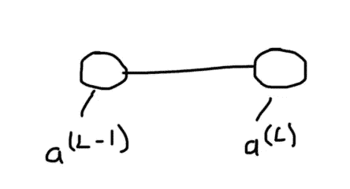

我们可以使用以下公式来表示每个神经元的输出:

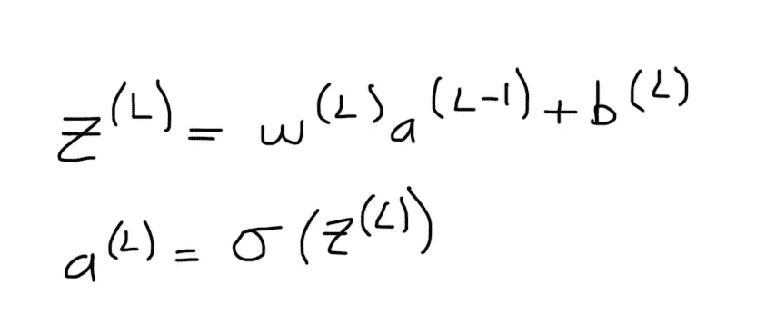

其中:

*   L =神经网络中的层
*   w =来自神经元的输出边缘所乘以的权重
*   a =前一层神经元的输出(输入边缘的值)
*   σ =激活函数
*   b =偏置神经元的输出(输入边缘的值)

成本函数的典型例子是**均方误差**。对于单个样本，我们从预测值中减去实际值(即 y ),并对结果进行平方，以说明预测值大于或小于实际值的情况。

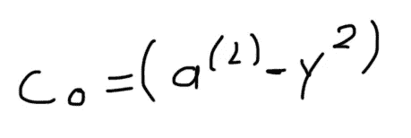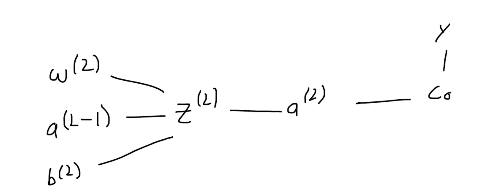

如前所述，我们修改权重以最小化成本函数。如果我们将成本与个体体重相关联，成本将在抛物线底部最低。

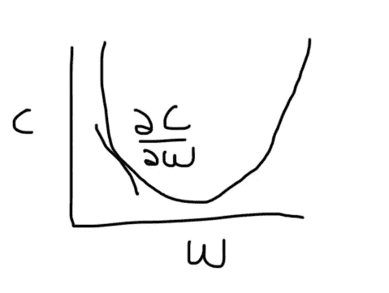

利用微积分中的链式法则，我们可以得到代价函数相对于权重的偏导数。

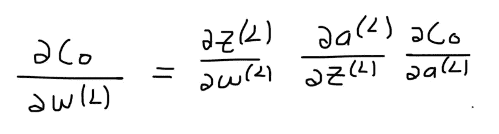

每一项的偏导数可以表示如下。

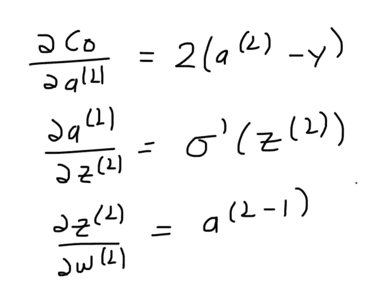

注意我们如何使用激活函数的导数。

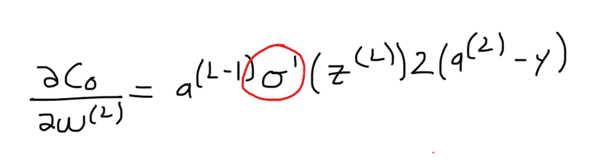

如果我们使用 sigmoid 函数作为我们的激活函数，那么，如果 ***z*** (激活函数之前的神经元输出)非常大或非常小，导数将近似为 0。因此，当我们计算梯度并更新权重时，变化会非常小，以至于模型不会改进。后者被称为**消失梯度** t 问题。

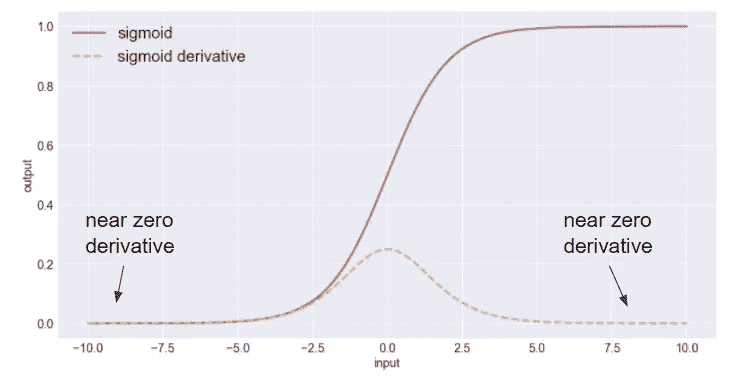

在神经元进入激活函数之前对其输出进行归一化，我们可以确保其保持接近于导数最高的 0。

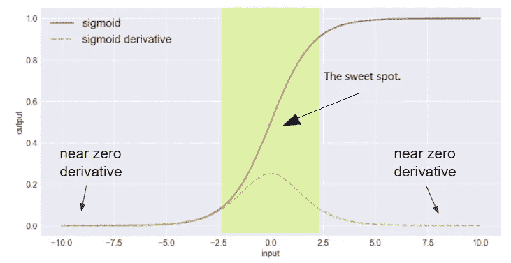

# 正常化

自然界中的随机过程倾向于遵循一个钟形曲线，称为正态分布。

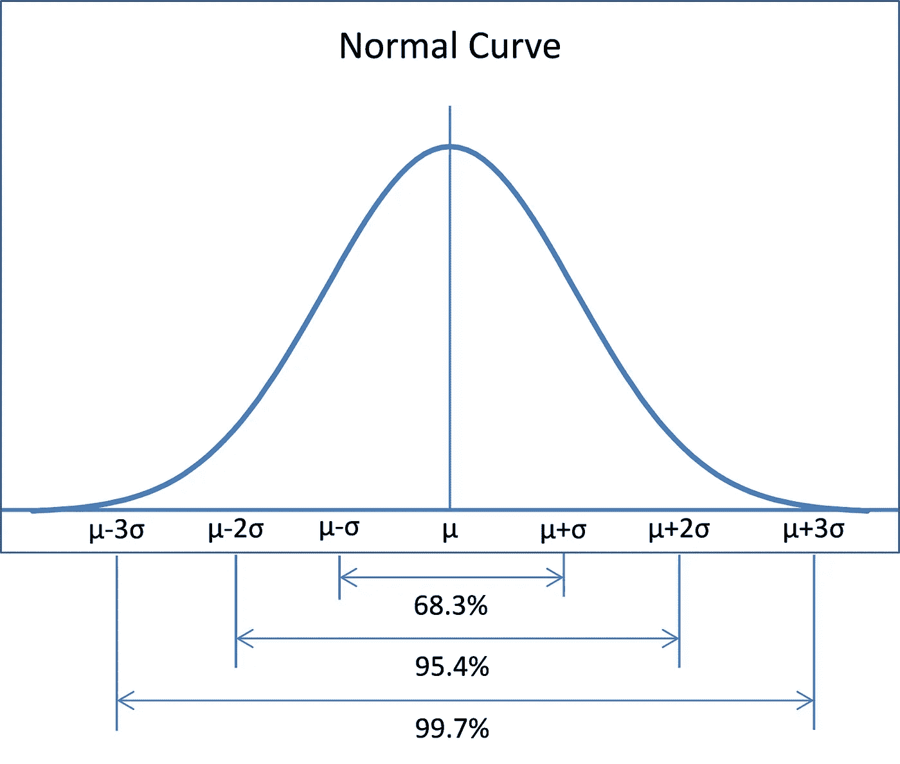

平均值是所有数据点的总和除以总点数。增大平均值会将钟形曲线的中心向右移动，减小平均值会将钟形曲线的中心向左移动。另一方面，标准差(方差的平方根)描述了样本与平均值的差异程度。增加标准差会使曲线变宽。

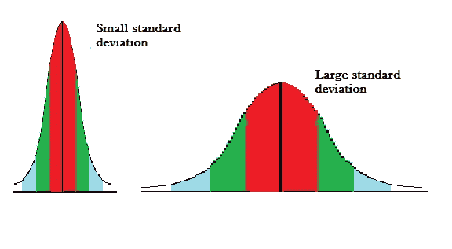

为了使数据标准化，我们减去平均值并除以标准差。

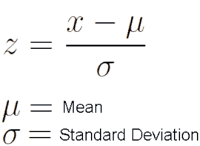

无论我们正在处理的数据是什么，归一化后，平均值将等于 0，标准差将等于 1。

*注意:这等同于说它确保方差等于 1，因为标准差等于方差的平方根。*

## 批量标准化

假设我们建立了一个神经网络，目标是对灰度图像进行分类。灰度图像中每个像素的亮度从 0 到 255 不等。在进入神经网络之前，每个图像都将被转换成一维数组。然后，每个像素从输入层进入一个神经元。如果将每个神经元的输出传递给一个 sigmoid 函数，那么除 0 之外的每个值(即 1 到 255)都将减少到接近 1 的数字。因此，通常在训练之前对每个图像的像素值进行归一化。另一方面，批处理规范化用于将规范化应用于隐藏层的输出。

# 密码

让我们看看如何在 Python 中实现批处理规范化。

```
import matplotlib.pyplot as plt
import matplotlib.image as mpimg
plt.style.use('dark_background')from keras.models import Sequential
from keras.preprocessing.image import ImageDataGenerator
from keras.layers import BatchNormalization
from keras.layers import Conv2D, MaxPooling2D, Dense, Flatten
from keras.datasets import cifar10
from keras.utils import normalize, to_categorical
```

**cifar10** 数据集由 60，000 张 32×32 像素的图像组成，分为 10 类。下面列出了这些类及其相关的标准整数值。

*   0:飞机
*   1:汽车
*   2:鸟
*   3:猫
*   4:鹿
*   5:狗
*   6:青蛙
*   7:马
*   8:船
*   9:卡车

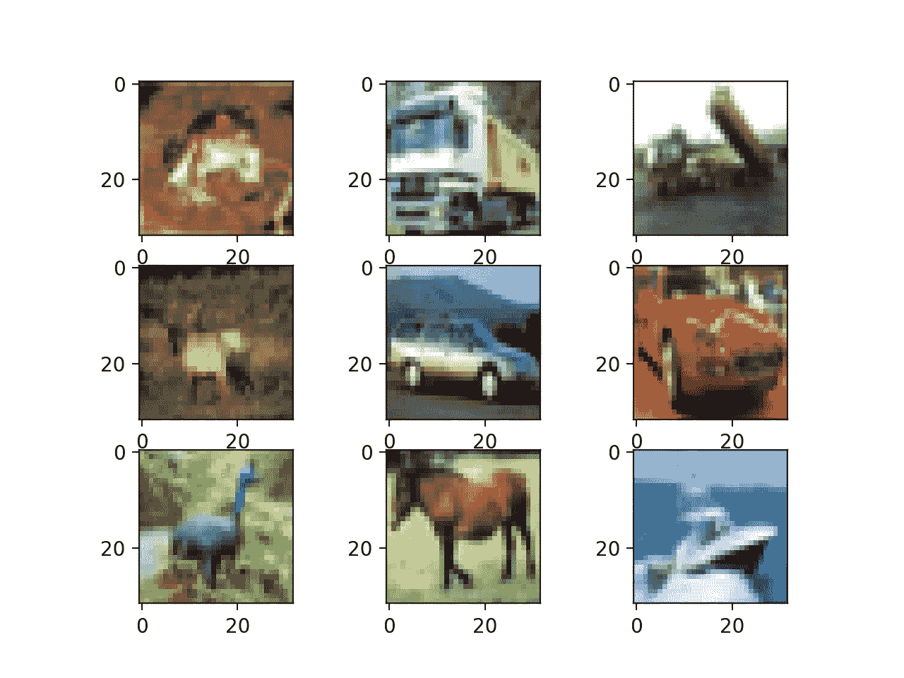

在训练我们的模型之前，我们基于上面列出的相同原因对输入进行标准化，并对标签进行编码。

```
(X_train, y_train), (X_test, y_test) = cifar10.load_data()X_train = normalize(X_train, axis=1)
X_test = normalize(X_test, axis=1)
y_train = to_categorical(y_train)
y_test = to_categorical(y_test)
```

为了提高我们的模型的概括能力，我们将随机移动，翻转和放大/缩小图像。

```
train_datagen = ImageDataGenerator(
    shear_range = 0.2,
    zoom_range = 0.2,
    horizontal_flip = True
)train_datagen.fit(X_train)train_generator = train_datagen.flow(
    X_train,
    y_train,
    batch_size = 32
)
```

我们使用下面的等式来设置步数，但是我们也可以使用任意值。

```
steps = int(X_train.shape[0] / 64)
```


我们定义一个函数来建立模型，使用和不使用批量标准化以及我们选择的激活函数。

```
def build_model(batch_normalization, activation):
    model = Sequential()
    model.add(Conv2D(32, 3, activation = activation, padding = 'same', input_shape = (32, 32, 3)))
    if batch_normalization: model.add(BatchNormalization())
    model.add(Conv2D(32, 3, activation = activation, padding = 'same', kernel_initializer = 'he_uniform'))
    if batch_normalization: model.add(BatchNormalization())
    model.add(MaxPooling2D())
    model.add(Conv2D(64, 3, activation = activation, padding = 'same', kernel_initializer = 'he_uniform'))
    if batch_normalization: model.add(BatchNormalization())
    model.add(Conv2D(64, 3, activation = activation, padding = 'same', kernel_initializer = 'he_uniform'))
    if batch_normalization: model.add(BatchNormalization()) 
    model.add(MaxPooling2D())
    model.add(Flatten())
    model.add(Dense(128, activation = activation, kernel_initializer = 'he_uniform'))
    model.add(Dense(10, activation = 'softmax'))return model
```

为了突出使用批处理规范化的好处，我们将训练并比较使用批处理规范化的模型和不使用批处理规范化的模型的性能。

```
sig_model = build_model(batch_normalization = False, activation = 'sigmoid')
```

我们使用 rmsprop 作为优化器，使用分类交叉熵作为损失函数，因为我们试图预测类。

```
sig_model.compile(
    optimizer = 'rmsprop',
    loss = 'categorical_crossentropy',
    metrics = ['accuracy']
)
```

接下来，我们训练我们的模型。

```
sig_history = sig_model.fit_generator(
        train_generator,
        steps_per_epoch = steps,
        epochs = 10,
        validation_data = (X_test, y_test)
)
```

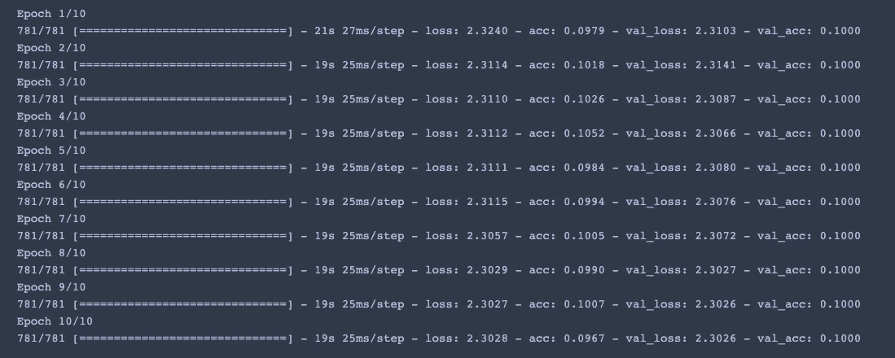

我们可以通过使用由*拟合*函数返回的历史变量来绘制每个时期的训练和验证准确度和损失。

```
loss = sig_history.history['loss']
val_loss = sig_history.history['val_loss']
epochs = range(1, len(loss) + 1)
plt.plot(epochs, loss, 'y', label='Training loss')
plt.plot(epochs, val_loss, 'r', label='Validation loss')
plt.title('Training and validation loss')
plt.xlabel('Epochs')
plt.ylabel('Loss')
plt.legend()
plt.show()
```

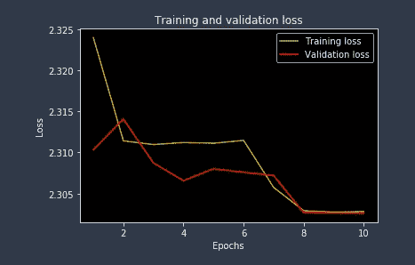

```
acc = sig_history.history['acc']
val_acc = sig_history.history['val_acc']
plt.plot(epochs, acc, 'y', label='Training acc')
plt.plot(epochs, val_acc, 'r', label='Validation acc')
plt.title('Training and validation accuracy')
plt.xlabel('Epochs')
plt.ylabel('Accuracy')
plt.legend()
plt.show()
```

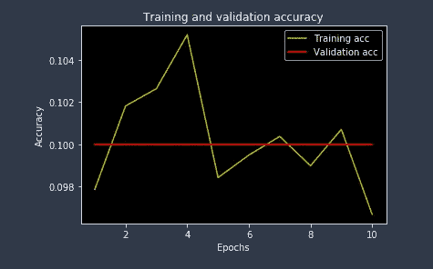

接下来，我们采取与之前相同的步骤，只是这次我们应用了批处理规范化。

```
sig_norm_model = build_model(batch_normalization = True, activation = 'sigmoid')sig_norm_model.compile(
    optimizer = 'rmsprop',
    loss = 'categorical_crossentropy',
    metrics = ['accuracy']
)sig_norm_history = sig_norm_model.fit_generator(
        train_generator,
        steps_per_epoch = steps,
        epochs = 10,
        validation_data = (X_test, y_test)
)
```

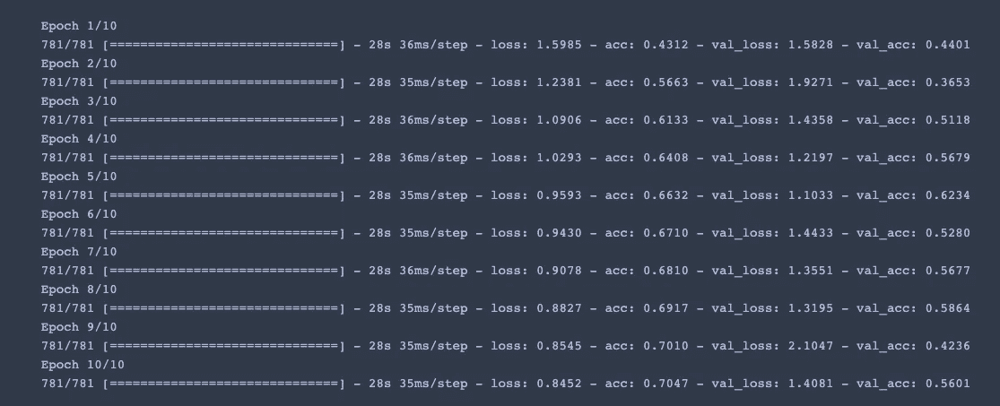

如您所见，训练损失和训练准确度图比没有批量标准化的模型平滑得多，并且获得了明显更好的结果。

```
loss = sig_norm_history.history['loss']
val_loss = sig_norm_history.history['val_loss']
epochs = range(1, len(loss) + 1)
plt.plot(epochs, loss, 'y', label='Training loss')
plt.plot(epochs, val_loss, 'r', label='Validation loss')
plt.title('Training and validation loss')
plt.xlabel('Epochs')
plt.ylabel('Loss')
plt.legend()
plt.show()
```

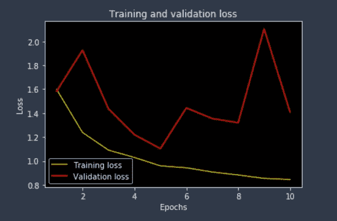

```
acc = sig_norm_history.history['acc']
val_acc = sig_norm_history.history['val_acc']
plt.plot(epochs, acc, 'y', label='Training acc')
plt.plot(epochs, val_acc, 'r', label='Validation acc')
plt.title('Training and validation accuracy')
plt.xlabel('Epochs')
plt.ylabel('Accuracy')
plt.legend()
plt.show()
```

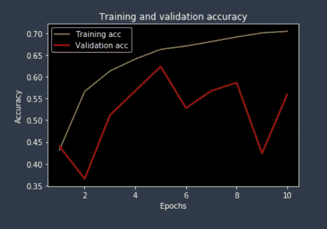

# 最后的想法

消失梯度问题指的是当我们向下传播到初始层时梯度如何指数下降。因此，初始层的权重和偏差将不能有效地更新。鉴于这些初始图层通常对识别输入数据的核心元素至关重要，因此可能会导致准确性较差。

最简单的解决方案是使用另一个激活函数，比如 ReLU。否则，我们可以使用批处理规范化来减轻问题，方法是规范化输入，使其保持在*金发区*。