# 对害怕数学的人进行反向传播

> 原文：<https://towardsdatascience.com/backpropagation-for-people-who-are-afraid-of-math-936a2cbebed7?source=collection_archive---------6----------------------->

反向传播是机器学习中最重要的概念之一。有许多在线资源解释了这种算法背后的直觉(在我看来，其中最好的是斯坦福 [cs231n 视频讲座](http://cs231n.stanford.edu/)中的反向传播讲座)。另一个非常好的来源，是[这个](https://en.wikipedia.org/wiki/Backpropagation)，但是从直觉到实践，可能(委婉地说)很有挑战性。

我承认，花了更多的时间，试图让我的层和重量的所有尺寸都适合，不断忘记什么是什么，什么连接在哪里，我坐下来，画了一些图表来说明整个过程。就当是可视化伪代码吧。

# 挑战:从直觉到实践

所以，假设你对算法应该做什么有很好的直觉理解，但在让它工作时有困难，这篇文章是为你写的！

现在，要明确的是，这篇文章不会试图解释直觉部分。正如我之前所写的，有很多好的、可靠的资源可以做到这一点。这是一个简单的(算法允许的最简单的)..)帮助您让代码工作的实用指南。事实上，如果你没有任何直觉地遵循这些步骤，你的代码可能会工作。尽管如此，我还是强烈建议您阅读一些关于[感知器](https://en.wikipedia.org/wiki/Perceptron)的内容(注意，感知器使用不可微分的步进激活函数，因此您不能真正使用反向传播，但它的结构和权重更新方法确实为更复杂的神经网络奠定了基础)。这是最基本的神经网络，只有一层。在进入更复杂的网络之前，了解如何更新简单网络的权重确实很有帮助。

训练网络时，我们重复以下步骤(对于 *n* epoches):

1.  执行向前传球。
2.  通过反向传播计算 W(每个权重的增量)。
3.  更新权重。

在这篇文章中，我将重点关注第二步。

准备好了吗？让我们跳进来吧！

-propagating…

# 破译方程式

下图是任意网络的示意图。因为反向传播的过程基本上每一步都是相同的(取决于您使用的[激活功能](https://medium.com/the-theory-of-everything/understanding-activation-functions-in-neural-networks-9491262884e0))。我们只看最后几层(你可以把 L95 层当作输入层，如果这样让你觉得更安全的话。就计算而言没什么区别)。

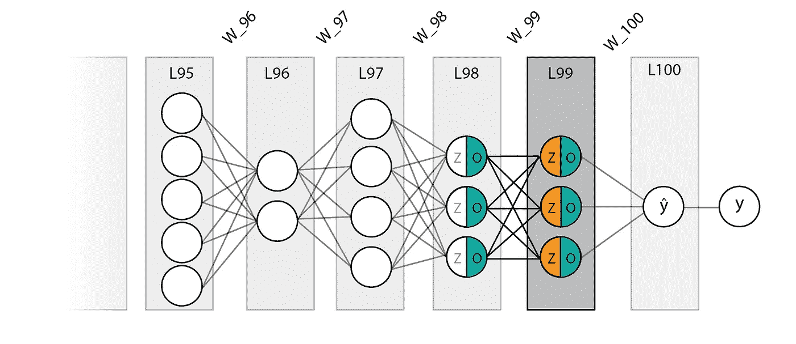

如您所见，我们的任意网络在第 95 层有 5 个神经元，然后在第 96 层有 2 个神经元，然后在输出层(L100)有 4、3、3 和 1 个神经元。所有层都由权重连接，由线标记(传统上)。
注意每个节点被分成 *Z* 和 *O* 。对于每个节点， *Z* 值是通过将前一层的 *O* 值乘以连接它们与该节点的权重来计算的。 *O* 通过在 *Z* 上应用非线性激活函数获得。现在，下面你会发现可怕的梯度计算。不要害怕！我们将复习每个表达。

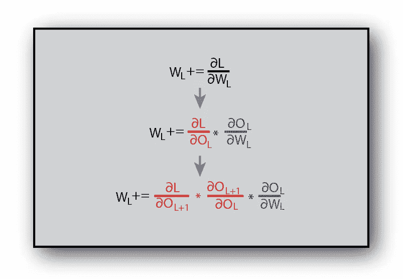

当试图更新和优化网络的权重时，我们试图找到-

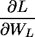

损失对重量的导数(“重量的变化如何影响损失”)，并使用链式法则，将该任务分成三部分:

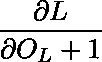

损失对下一层的导数。这是从输出层“向上游传递”的损失。或者换句话说，“下一层的变化如何影响损失”。

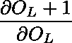

下一层相对于当前层的导数(可以解释为“当前层的变化如何影响下一层”)，它只是连接到下一层的权重乘以其激活函数的导数。和

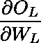

-(“权重的变化如何影响当前层”)，它是前一层的 *O* 值乘以当前层的激活函数导数。

为了使事情更清楚，我写了实际的计算，用颜色编码到我们的网络中，用于我们网络的最后两层，L100 和 L99。

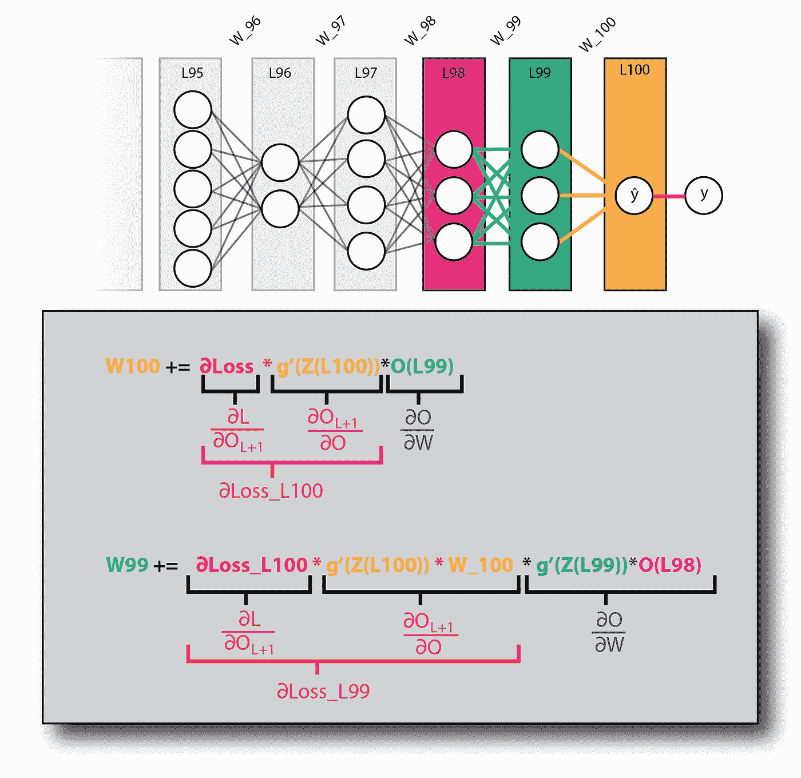

请注意，与每个计算相关的导数项出现在它的下方。与损耗相关的两个导数(以红色显示)非常重要，因为它们用于前面各层的计算。这在下图中可以清楚地看到:

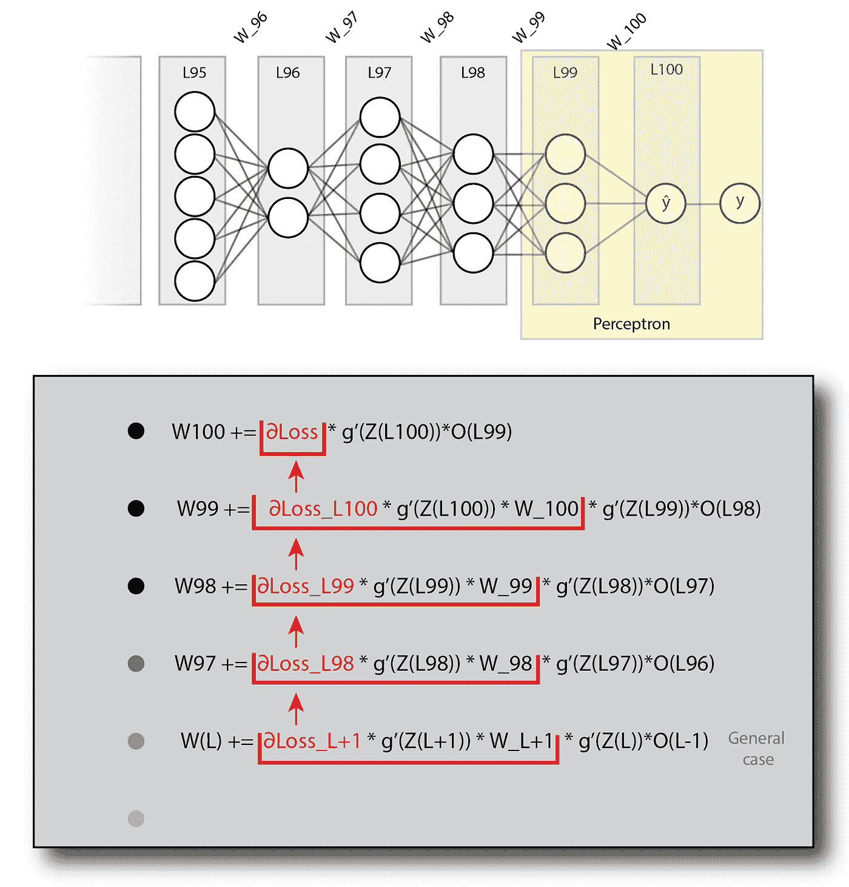

注意∂Loss **是如何向下传播**的。看着这个模式，你应该开始明白如何在代码中实现它。还要注意，我强调了最后两层，它们构成了前面提到的感知器。

注意，我没有提到在这个图中将整个表达式乘以学习率(α)，因为它看起来太拥挤了，并且遮蔽了带回家的消息，这是链规则的应用。您应该尝试不同的α值，以获得最佳性能。无论如何，α确实出现在下一张图中。

# 通过一批实例反向传播

需要注意的重要一点是，我们看到的示意图中的每一层实际上都是一个矢量，代表为一个**单个**实例所做的计算。通常我们会将一批实例输入到网络中。看了下一张图后，这一点会更清楚，图中显示了对一批 *n* 实例的计算。请注意，这是完全相同的网络(L95 层有 5 个神经元，L96 层有 2 个神经元，依此类推……)，只是我们现在看到的是 *n* 个实例，而不是一个。

对我来说，当实现反向传播时，最具挑战性的部分是获得不同层的大小、权重和梯度矩阵。这幅插图旨在整理事物。

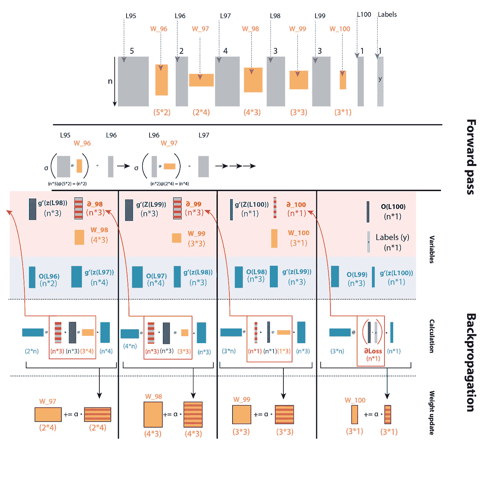

在顶部，你会看到示意网络。 *n* 的实际大小没有影响(用于计算。显然，这在更大的范围内会有所不同…)，因为你会注意到，当我们在反向传播时执行矩阵乘法时，我们总是对 *n* 求和。也就是说，矩阵相乘时 *n* 的长度是“丢失”的。这正是我们想要的，对我们批次中所有实例的损失求和。

图表的其余部分分为两个部分:

*   **向前传球。**
*   **反向传播。**

**向前传球**对你们大多数人来说应该很明显。如果不是，我建议在继续学习之前先阅读一下矩阵乘法。我要指出的一件事是，每个权重矩阵取一个大小为 *(n，k)* 的层，输出一个大小为 *(n，j)* 的层。这种权重矩阵的大小为 *(k，j)* 。你可能会注意到这张图缺少了偏差单位。这是因为我想让它尽可能的清晰，并关注不同的矩阵大小如何适应反向传播过程。下面有一小段是关于添加偏置单元的。

**反向传播**部分是一个“位”更棘手… :)
该部分图表分为**三个子部分**:

## **1。变量**

这里我列出了计算的不同元素，最重要的是它们的形状。关于这一部分的几点说明:

1.  *Z* 指激活前层的值。
2.  *O* 指激活后的层值。
3.  *σ* 指激活功能。
4.  *g'* 指激活函数的导数。

请注意，本节对构成的变量进行了分组

和

在顶部(以红色突出显示)，以及那些构成

在底部(用蓝色突出显示)。

## **2。计算**

这是所有戏剧发生的地方。这里其实没有什么新东西。这些都是在前面的图表中看到的完全相同的计算，但是矩阵大小写得很清楚。此外，何时使用元素乘法，何时使用矩阵乘法都有明确的说明(矩阵乘法用@表示，因为这是 Numpy.dot 的简写。您将在下面的代码部分中看到它的作用)，以及何时需要转置矩阵。图表和下面的代码假设了一个平方损失函数。其导数定义为`output - labels`。

## 3.重量更新

剩下的就是通过向每个权重矩阵添加 w 来更新我们的权重。请注意，我们只在完成反向传播后才执行更新。

# 密码

关于此部分的一些注意事项:

1.  出于可读性的目的，这里给出的代码是伪代码。
2.  由于这篇文章旨在用作实践指南，我鼓励你仔细阅读图表，并在查看代码示例之前，尝试编写自己的**T4 实现**。这些图包含了你自己成功构建它所需要的所有信息。查看图表，了解渐变是如何从一层传递到下一层的。确保你明白什么是乘什么，什么轴是求和的。看看我们如何在每次迭代中获得适合我们层的权重的形状 W 矩阵。****
3.  网上有很多解决方案。我强烈推荐这本书，因为它很容易理解。我自己的实现很大程度上基于它。
4.  代码假设使用 sigmoid 激活函数。由于 sigmoid 函数(`σ(z) *(1-σ(z))`)的导数只需要 *O* 的值(当然是`σ(z)` *)* ，所以我们不需要激活( *Z* )前神经元的值。对于使用不同激活功能的实施，在进行正向传递时，您需要保存 *Z* 值。

## 使用循环

## 使用递归

# 添加偏置单元

您可能已经注意到，之前的图表缺少偏置单位。我选择从这些图中去掉偏差，因为我想让它们尽可能简单和直观，但是你绝对应该考虑添加它！
您可以为每个层“手动”添加一个偏差，然后计算该偏差的损失导数:

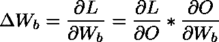

我们已经知道如何计算

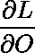

，以及

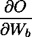

只是当前层的激活函数导数。

您还可以将偏差添加到权重矩阵中。这基本上意味着在每一层添加一个偏向神经元的向量(一个 1 的向量)，并相应地初始化权重矩阵形状(就像在简单的线性回归中一样)。不过要记住的一件事是，偏置单元本身永远不应该在正向传递中更新，因为它们连接到下一个层的**神经元，而不是前一个**层的**神经元(见图)。**

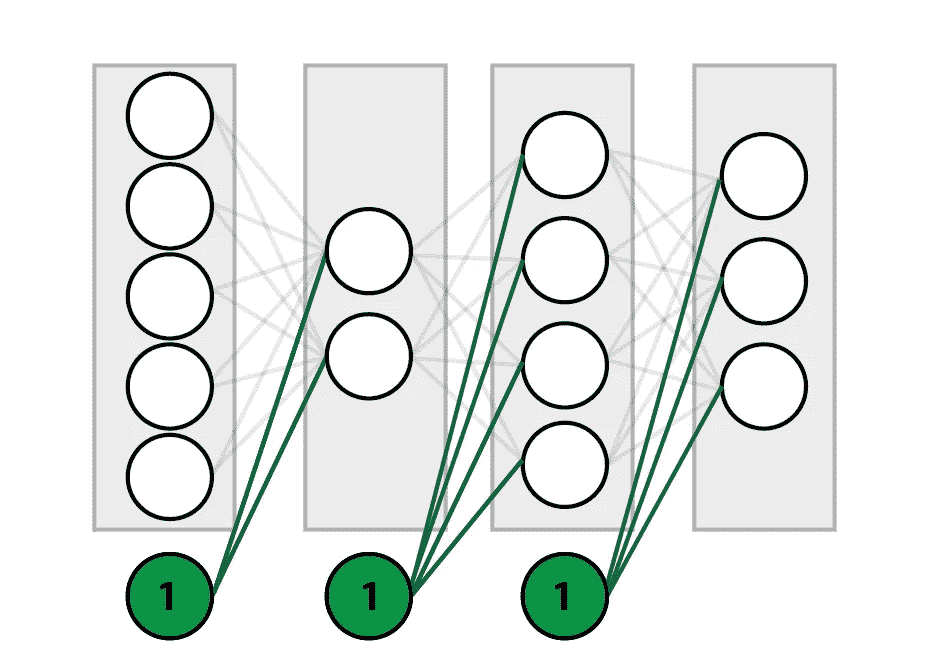

一种方法是避免更新这些神经元，但这可能会变得很棘手，尤其是在向后传递中(完全公开，这就是我所做的，我不建议这样做……)。一个更简单的解决方案是正常进行正向和反向传递，但在每次层更新后将偏置神经元重新初始化为 1。

# 一些有用的提示

*   反向传播时**不要**更新权重！！请记住，下一次迭代(前一层)将需要这些(未更新的)权重来计算损失。您可以保存 w，并在反向传播部分的末尾更新权重(就像我在代码示例中所做的那样)，或者不断更新前面两层的权重，在我看来，这是令人困惑的，而且过于复杂。
*   如果层不是由非线性函数激活的(例如输出层)，则梯度仅为 1。
*   你的程序没有崩溃，并不意味着它能工作。确保你的网络收敛，减少损失。
*   事实上，你的网络收敛，你的损失减少，并不意味着它的工作最佳。将您的结果与其他实现进行比较。研究学习速度和网络结构。
*   尝试不同的权重初始化方法。这会对性能产生巨大的影响。

# 摘要

反向传播可能是一个棘手的问题，但是如果你希望很好地理解神经网络是如何工作的，你应该避免在自己实现一个简单的网络之前跳入更高级的解决方案，如 [TensorFlow](https://www.tensorflow.org/) 或 [Pytorch](https://pytorch.org/) 。这是所有深度学习的基础，也是成功处理更复杂网络的关键。也很好玩(起作用的时候)。

祝你好运！