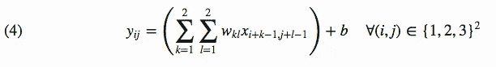
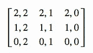
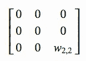

# 卷积层中的反向传播

> 原文：<https://towardsdatascience.com/backpropagation-in-a-convolutional-layer-24c8d64d8509?source=collection_archive---------0----------------------->


Backpropagation in a convolutional layer

# 介绍

## 动机

这篇文章的目的是详细说明梯度反向传播是如何在神经网络的卷积层中工作的。典型地，该层的输出将是所选激活功能的输入(例如`relu`)。我们假设给定了从该激活函数反向传播的梯度`dy`。因为我无法在网上找到一个完整的，详细的，和“简单”的解释它是如何工作的。我决定做数学，试图在归纳之前一步一步地理解简单的例子是如何工作的。在进一步阅读之前，你应该熟悉神经网络，尤其是计算图形中梯度的前向传递、后向传播和带有张量的基本线性代数。


Convolution layer — Forward pass & BP

## 记号

`*`在神经网络的情况下是指 2 个张量的卷积(一个输入`x`和一个滤波器`w`)。

*   当`x`和`w`为矩阵时:
*   如果`x`和`w`共享相同的形状，`x*w`将是一个标量，等于数组之间的元素级乘法结果之和。
*   如果`w`小于`x`，我们将获得一个激活图`y`，其中每个值是 x 的一个子区域与 w 的大小的预定义卷积运算。由滤波器激活的这个子区域在输入阵列`x`上滑动。
*   如果`x`和`w`有 2 个以上的维度，我们考虑将后 3 个维度用于卷积，后 2 个维度用于高亮显示的滑动区域(我们只是给矩阵增加了一个深度)

符号和变量与[斯坦福优秀课程](http://cs231n.stanford.edu/)中关于视觉识别的卷积神经网络中使用的符号和变量相同，尤其是[作业 2](http://cs231n.github.io/assignments2019/assignment2/) 中的符号和变量。关于卷积层和前向传递的细节将在这个[视频](https://www.youtube.com/watch?v=bNb2fEVKeEo&list=PL3FW7Lu3i5JvHM8ljYj-zLfQRF3EO8sYv&index=5)和前向传递[帖子](https://neodelphis.github.io/convnet/python/2019/07/02/convnet-forward-pass.html)的一个简单实现的实例中找到。


Convolution layer notations

## 目标

我们的目标是找出梯度是如何在卷积层中向后传播的。向前传球是这样定义的:

输入由 N 个数据点组成，每个数据点有 C 个通道，高 H，宽 w，我们用 F 个不同的滤波器对每个输入进行卷积，其中每个滤波器跨越所有 C 个通道，高 HH，宽 WW。

输入:

*   x:形状(N，C，H，W)的输入数据
*   w:形状的过滤器权重(F，C，HH，WW)
*   b:形状为(F，)的偏差
*   conv _ 参数:带有以下键的字典:
*   “步幅”:水平和垂直方向上相邻感受野之间的像素数。
*   ' pad ':将用于对输入进行零填充的像素数。

在填充过程中，“填充”零应沿着输入的高度和宽度轴对称放置(即两边相等)。

返回一个元组:

*   out:形状为(N，F，H’，W’)的输出数据，其中 H’和 W’由下式给出

H' = 1 + (H + 2 * pad — HH) /步幅

W' = 1 + (W + 2 * pad — WW) /步幅

*   缓存:(x，w，b，conv 参数)

# 前进传球

## 一般情况(简化为 N=1，C=1，F=1)

N=1 个输入，C=1 个通道，F=1 个滤波器。


Convolution 2D

x:H×W
x′=带填充的 x
W:hh×WW
b 偏移:标量
y:H′×W′
步幅 s


## 具体情况:stride=1，pad=0，无偏差。


# 反向传播

我们知道:


我们要计算成本函数 l 的偏导数 *dx* 、 *dw* 和 *db* ，我们假设这个函数的梯度已经反向传播到 y。

# 平凡的例子:输入 x 是一个向量(一维)

我们正在寻找一种直觉，它是如何在一个简单的设置上工作的，稍后我们将尝试概括。

## 投入


## 输出


## 前向通过—与一个滤波器卷积，步长= 1，填充= 0


## 反向传播

我们知道成本函数 L 相对于 y 的梯度:


这可以用雅可比符号来表示:


dy 和 y 具有相同的形状:


我们正在寻找


## 


使用链式法则和正向传递公式(1)，我们可以写出:


## 发展的宽度（Developed Width 的缩写）


我们可以注意到，dw 是输入 x 与滤波器 dy 的卷积。让我们看看它在增加了一个维度后是否仍然有效。


## 高级的（deluxe 的简写）


再一次，我们有一个卷积。这次有点复杂。我们应该考虑一个输入 dy，其大小为 1 的 0 填充与一个“反向”滤波器 w 卷积，如( *w* 2， *w* 1)


下一步将是看看它如何在小矩阵上工作。

# 输入 x 是一个矩阵(二维)

## 投入


## 输出

我们将再次选择最简单的情况:stride = 1 并且没有填充。y 的形状将是(3，3)


## 向前传球

我们将拥有:


用下标写的:



## 反向传播

我们知道:


## 

使用爱因斯坦约定来简化公式(当一个指数变量在乘法中出现两次时，它意味着该指数的所有值的总和)


对 I 和 j 求和，我们得到:


## 发展的宽度（Developed Width 的缩写）


我们正在寻找


使用公式(4 ),我们得到:


所有术语


除了( *k* ， *l* )=( *m* ， *n* )为 1 的情况，double sum 中只出现一次。因此:


使用公式(3 ),我们现在有:


如果我们将该等式与给出卷积结果的公式(1)进行比较，我们可以区分类似的模式，其中 dy 是应用于输入 x 的滤波器。


## 高级的（deluxe 的简写）

使用我们对(5)所做的链式法则，我们有:


这一次，我们要寻找


使用等式(4):


我们现在有:


在我们的示例中，索引的范围集是:


当我们设置*k*=*m*-*I*+1 时，我们将超出定义的边界:(*m*-*I*+1)∈[1，4]

为了保持上述公式的可信度，一旦指数超出定义的范围，我们选择用 0 值扩展矩阵 *w* 的定义。

在二重和中，我们只有一次 x 的偏导数等于 1。所以:


其中 *w* 是我们的 0 扩展初始滤波器，因此:


让我们用几个选定的指数值来形象化它。


使用∫符号进行卷积，我们得到:


由于 *dy* 保持不变，我们将只查看 *dx* 22 的 w .的索引值，范围为 w:3-I，3-j



现在我们有了 dy 和 w’矩阵之间的卷积，定义如下:


另一个例子来看看发生了什么。 *dx* 43，w:4—*I*，3—*j*


最后一个 *dx* 44



我们确实看到弹出一个“反向过滤器”w’。这一次，我们在具有大小为 1 的 0 填充边界的输入 *dy* 和步长为 1 的滤波器 w’slidding 之间进行卷积。


## 反投影方程综述


# 考虑到深度

当我们试图考虑深度时，事情变得稍微复杂一些(C 通道用于输入 x，F 不同的过滤器用于输入 w)

输入:

*   x:形状(C，H，W)
*   w:过滤器的权重形状(F，C，HH，WW)
*   形状(F，)

产出:

*   y:形状(F，H '，W ')

数学公式中出现了许多指数，使得它们更难阅读。我们示例中的正向传递公式是:


## 

db 计算仍然很容易，因为每个 *b_f* 都与一个激活图 *y_f* 相关:


## 发展的宽度（Developed Width 的缩写）


使用向前传递公式，由于双和不使用 dy 索引，我们可以写为:


# 算法

既然我们对它是如何工作的有了直觉，我们选择不写整个方程组(这可能是相当乏味的)，但是我们将使用已经为正向传递编码的内容，并且通过玩维度来尝试为每个梯度编码反向投影。幸运的是，我们可以计算梯度的数值来检查我们的实现。这种实现只对步幅=1 有效，对于不同步幅，事情变得稍微复杂一些，需要另一种方法。也许是为了另一个职位！

## 梯度数值检验

```
Testing conv_backward_naive function
dx error:  7.489787768926947e-09
dw error:  1.381022780971562e-10
db error:  1.1299800330640326e-10
```

几乎每次都是 0，一切似乎都很好！:)

# 参考

*   [我博客上的这篇关于 mathjax 方程的文章](https://neodelphis.github.io/convnet/maths/python/english/2019/07/10/convnet-bp-en.html):)
*   [斯坦福视觉识别卷积神经网络课程](http://cs231n.stanford.edu/)
*   [斯坦福 CNN 作业 2](http://cs231n.github.io/assignments2019/assignment2/)
*   [卷积神经网络，正向传递](https://www.youtube.com/watch?v=bNb2fEVKeEo&list=PL3FW7Lu3i5JvHM8ljYj-zLfQRF3EO8sYv&index=5)
*   [卷积层:正向传递的朴素实现](https://neodelphis.github.io/convnet/python/2019/07/02/convnet-forward-pass.html)。
*   [卷积神经网络中的反向传播](https://www.jefkine.com/general/2016/09/05/backpropagation-in-convolutional-neural-networks/)
*   [Cet 法语文章](https://neodelphis.github.io/convnet/maths/python/2019/07/08/convnet-bp.html)

欢迎评论改进本帖，随时联系我！