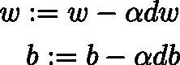
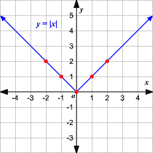
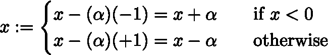
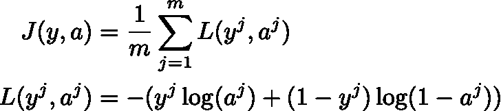
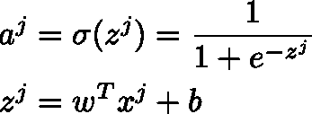
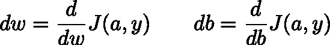
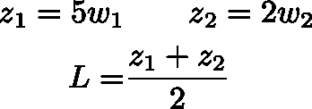
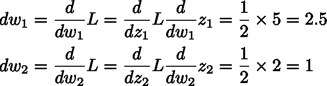
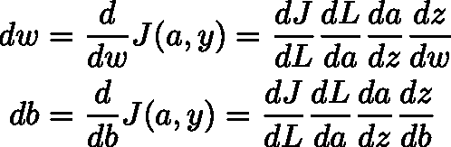
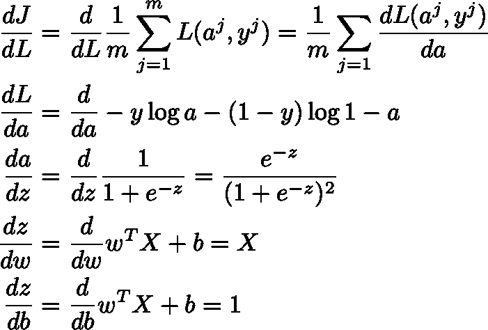

# 简单来说就是反向传播

> 原文：<https://towardsdatascience.com/backpropagation-in-simple-terms-8df312471d32?source=collection_archive---------18----------------------->

随着我对神经网络(NN)的了解，我努力理解反向传播在做什么以及为什么它有意义。这篇文章是[神经网络揭秘](https://medium.com/@fjulozada/neural-networks-demystified-487a54d2a8db)故事的后续。所以，如果你不知道什么是梯度下降，什么是正向传播，我建议你去查一下。

## 为什么我们关心反向传播？

我们关心反向传播，因为这是神经网络学习的方式！具体来说，这就是我们如何更新神经网络 **w** 和 **b** 的权重:

Rule for updating weights

**α** 是某个被称为学习率的正实数，它表示 **w** 和 **b** 的更新幅度，而 **dw、db** 分别是成本函数相对于 **w** 和 **b** 的斜率。

## 为什么有效？

为了建立我们的直觉，假设我们想要找到绝对值函数的最小值:

Absolute value function

对于那些微积分新手来说，为了找到一个函数在给定点的斜率，只要问自己:响应于 **x** 的变化， **f(x)** 变化了多少？注意，对于所有小于零的 **x** 值，斜率为 **-1** ，对于所有大于零的 **x** 值，斜率为 **+1** ，当 **x** 为零时，斜率未定义。思考一下更新 **x** 的值以最小化 **f(x) = |x|** 的规则。保持这种想法，现在让我们使用反向传播中使用的相同更新规则来更新 **x** :

根据反向传播更新规则，如果 **x** 为负(即 **x + α** )，我们希望将 **x** 向右移动；如果 **x** 为正(即 **x — α** )，我们希望将 **x** 向左移动。希望这也是你自己想出的最小化 **f(x)** 的策略！

## 我们到底是怎么计算 dw 和 db 的？

假设我们有一个用于分类的简单 NN，只有一个隐藏层，我们的模型成本函数是每个训练示例的平均损失，我们的损失函数是用于逻辑回归的损失函数:

Cost and Loss functions

其中 **yʲ** 是 **jᵗʰ** 例子的观测值， **aʲ** 是我们的 NN 为 **jᵗʰ** 例子产生的输出。此外，我们模型的输出是 sigmoid 函数的结果，sigmoid 函数使用输入要素与权重的线性组合:

Activation (sigmoid) and linear combination functions

最终，我们想要的是成本函数相对于权重的斜率，因为权重是我们唯一可以改变以最小化成本的东西。用数学术语来说，我们可以把它表达为:

Slope of the cost function with regards to the weights and the intercept

同时计算 **dw** 和 **db** 可能会令人望而生畏，因此我们将使用一种众所周知的技术，称为**链式法则**。

## 什么是链式法则，在 NNs 中是如何使用的？

一个例子可以清楚地说明这一点:假设我们有一些初始值、中间值和最终值，我们想通过只改变 w₁和 w₂来最小化 l

Example set-up

首先我们需要分别计算出 **L** 相对于 **w₁** 和**w₂**的斜率，从而找到 **dw₁** 和 **dw₂** 。然后，我们可以将反向传播更新规则应用于 **w₁** 和 **w₂** 。只看这个例子，我们知道 **w₁** 每改变一个单位， **L** 就会改变 2.5 个单位。同样， **w₂** 每改变一个单位， **L** 将改变 1 个单位。如果你不相信我，试着自己做出改变。事实证明，同样的计算可以表示为中间偏导数的乘法:

Chain rule

所以现在，回到 NN 的，我们可以将 **dw** 和 **db** 表示为导致 **w** 和 **b** 的偏导数的乘积:

Chain rule in NN's

最后，我们可以计算每一项，并用链式法则将它们相乘，得到 **dw** 和 **db** 。我知道每一项的实际解看起来很难看，但至少比试图做一次大规模求导要好(如果你有兴趣看每一项的求导，请向下滚动)。

希望这篇文章有助于驱散有时围绕反向传播的迷雾。请记住，我们所做的一切都是应用链式法则来计算我们应该如何更新我们的权重，这是神经网络学习过程的核心。

Derivation of each of the partial derivatives