# 反向传播超级简化！

> 原文：<https://towardsdatascience.com/backpropagation-super-simplified-2b8631c0683d?source=collection_archive---------17----------------------->

Photo by [Robina Weermeijer](https://unsplash.com/@averey?utm_source=medium&utm_medium=referral) on [Unsplash](https://unsplash.com?utm_source=medium&utm_medium=referral)

我不会说反向传播是一个非常简单的算法。如果你不知道微积分，线性代数，矩阵乘法，这可能是非常令人生畏的。即使你知道一些或全部，要掌握它也需要一点脑力锻炼。

我这么说并不是要打击你的积极性，让你避免学习它(是的，你可以避免它，但仍然可以继续你的深度学习之旅)。它有点复杂，但我不会说它超级难，而是非常直观和容易掌握。你会惊奇地发现，与它所解决的问题相比，它是多么简单。它实际上是深层神经网络的主干。所需的概念非常容易学习，而[可汗学院](https://www.khanacademy.org/)是实现这一目的的绝佳资源。我已经列出了所需数学概念的 URL，你可以在阅读帖子之前回顾一下。

1.[链式法则](https://www.khanacademy.org/math/ap-calculus-ab/ab-differentiation-2-new/ab-3-1a/v/chain-rule-introduction)

2.[梯度下降](https://www.khanacademy.org/math/multivariable-calculus/multivariable-derivatives/gradient-and-directional-derivatives/v/gradient)

3.[矩阵](https://www.khanacademy.org/math/linear-algebra/matrix-transformations)

关于反向传播算法的背景知识已经讲得够多了，我们现在开始吧。当我刚开始学习反向传播算法时，我发现节点的表示和权重非常令人困惑，而不是算法本身。所以，我会尽量让它变得简单。让我们从一个非常简单的神经网络开始。

# 简单神经网络

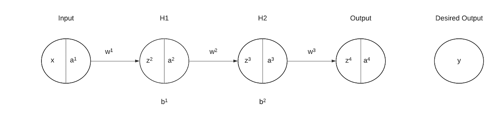

## 正向输送

在这个神经网络中，我们将计算每一层的值。

**输入:**

*x = z = a*

***H1 图层:***

*z = w x + b = w a + b*

*a = f(z ) = f(w a + b )*

***H2 层:***

*z = w a + b*

*a = f(z ) = f(w a + b )*

**输出:**

*z⁴ = w a*

*o =f(z⁴)= f(w a)= f(w(f(w(f(w(w a+b)+b))))*

这被称为前馈传播。我们必须一次又一次地这样做，通过改变我们的权重和偏好来接近我们想要的输出。

## 梯度下降和反向传播

但是，问题是如何改变权重。这就是这个算法的配方。为此，我们需要使用梯度下降，并向后传播(因此得名反向传播算法)，并根据需要改变权重。

回想一下，我们的期望输出是 *y* ，当前输出是 *o.* 为了评估我们预测中的差异，我们引入了**成本函数**，也称为 l **oss 函数**。它可以像 **MSE** (均方误差)一样简单，也可以像**交叉熵**函数一样简单。在这里，我们称之为 C，所以，我们的成本函数将是 *C(o，y)* 。

现在我们有了函数形式的差异。我们可以引入微积分来玩玩。我们需要一些函数来帮助我们减少预测值和实际产量之间的差异，我们已经以成本函数的形式量化了这种差异。这就是我们需要梯度下降算法的地方，梯度下降算法是通过不断向最陡下降的方向移动来最小化一个函数，最陡下降的方向等于梯度的负值。

让我们更深入地研究这种梯度下降。一个函数的梯度意味着，一个函数相对于一个特定量的变化而变化多少。它是通过对特定量取函数的偏导数来计算的。在这种情况下，我们希望看到我们的成本函数相对于我们的权重和偏差的变化有多少变化，从而给出如何改变权重以在我们的预测中获得最小可能误差的想法。

回到我们的例子:

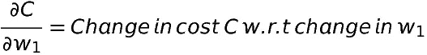

由于， *C* 是 *o 中的函数，*又是 w_1 中的函数，我们可以利用链式法则得到上面的偏导数。

*记住，****o =f(z⁴)= f(w a)= f(w(f(w(w(w a+b)+b))))***

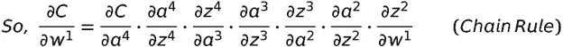

(同理，我们可以计算出 *C* w.r.t 其他权重的梯度。)

这里，我们需要注意几件事:

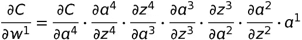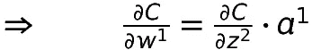

术语 ***∂C/∂w^n*** 也被称为**局部梯度**。

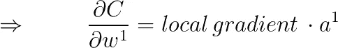

类似地，对于偏差:

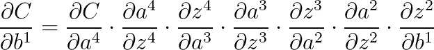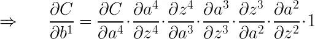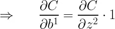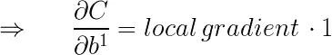

好了，现在是时候收获我们辛勤工作的果实了。我们已经准备好必须改变权重的量，即 w_n。因此，要修改我们的权重和偏差，我们需要:

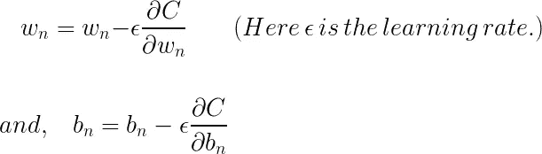

在这里，我们介绍了 ***ϵ*** 对渐变下降的影响。现在，该模型使用新的权重和偏差进行前向传播，然后一次又一次地反向传播。它继续下去，直到根据我们的约束最小化我们的成本函数到尽可能低的值。

# 小型复杂神经网络

此刻，你一定觉得很不完整，因为你可能会说这个模型非常简单，一旦层中有很多节点，事情就会变得非常复杂。

不完全是。事情依然如故，强硬程度依然如故。你现在要做的就是让自己熟悉编写复杂的指数和我们良好的 ole sigma(≘)符号。记住这一点，我们将再次检查表达式，但对于下面的神经网络，你会同意是相当复杂的。

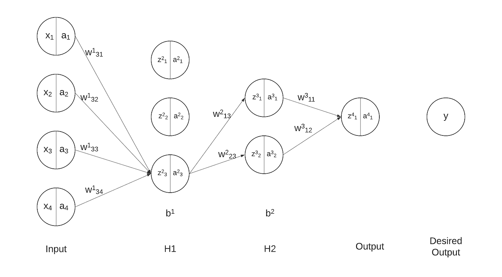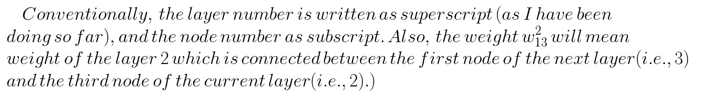

在这里要小心，这不是直觉的东西，你必须习惯它。再次概括一下，我们有:

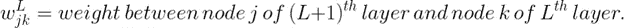

记住这一点，我们将尝试重新编写我们之前的表达式，但我将从第一层中选取一个特定的权重进行演示，然后我们将对其进行推广。

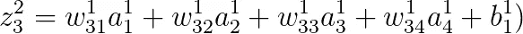

Value of z for node 3 in layer 2

对任意层中任意节点的 z 值进行概化，我们得到:

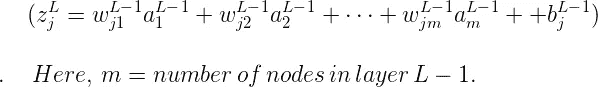

Generalized for of the value of z for any node in layer L

因此，相应的激活函数将是:

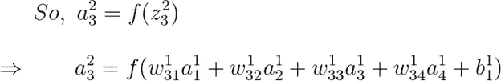

Generalized value of a for node j of layer L.

***输出层:***

在我们的例子中，**oT7*是输出:***

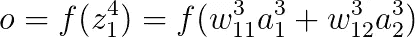

现在，对我们的成本函数 *C(o，y)* 应用梯度下降，我们得到:

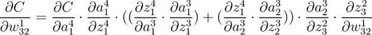

看看上面的表达式，这基本上是这个算法最复杂的部分。试着理解它是什么。我们将以类似的方式概括成本相对于所有其他权重的梯度。前面的表达式什么也没做，只是在向后传播时考虑了特定层的所有节点。我们如何做到这一点，非常简单，就是在我们试图改变的权重之前，将所有层的所有节点的所有计算相加。

概括起来，我们可以写:

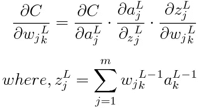

然后，权重更新以与我们之前完全相同的方式完成:

拍拍自己，你做到了深度学习最重要的算法之一——反向传播算法的终点。如果你理解了这个算法，你现在可以更深入地挖掘，可以很容易地得到像[消失渐变](https://en.wikipedia.org/wiki/Vanishing_gradient_problem)和更多的概念。

如果你对这篇文章有任何问题或编辑，请在评论区留下回复，我会回复的。

另外，请继续关注许多这样的深度学习算法和编码练习。