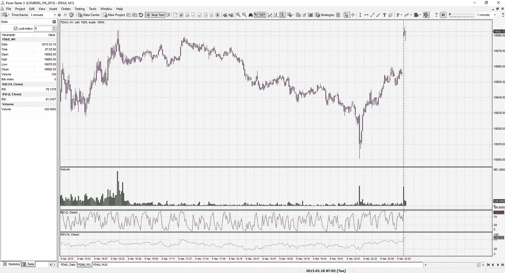
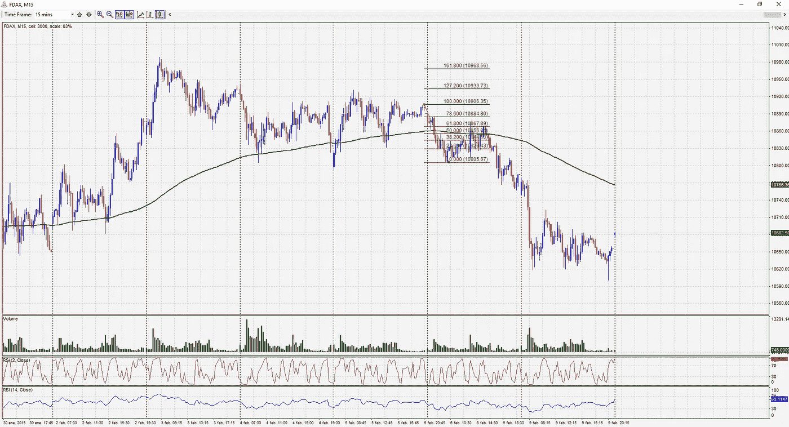
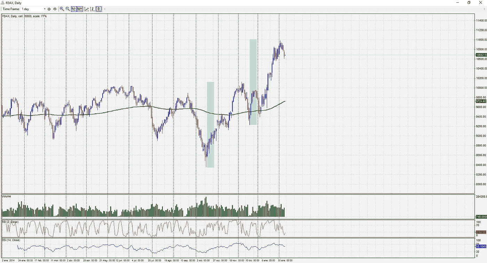
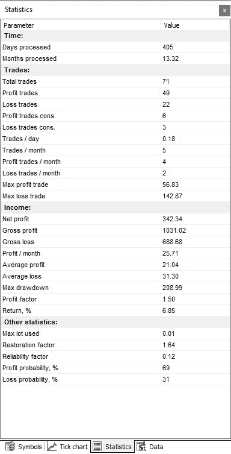
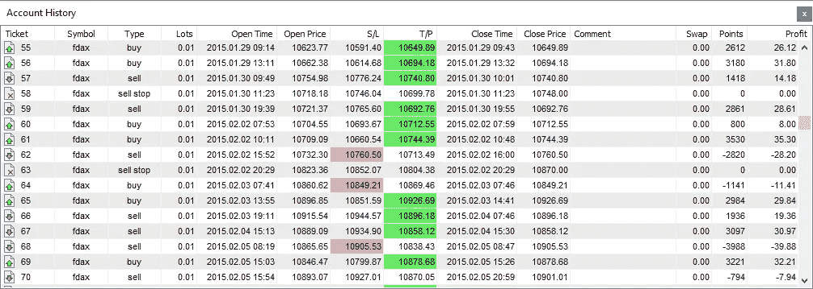

# 回溯测试交易策略:少施魔法，多统计数据

> 原文：<https://towardsdatascience.com/backtesting-trading-strategies-less-sorcery-and-more-statistics-on-your-side-241ac41d18b0?source=collection_archive---------7----------------------->

Photo by [M. B. M.](https://unsplash.com/photos/ZzOa5G8hSPI?utm_source=unsplash&utm_medium=referral&utm_content=creditCopyText) on [Unsplash](https://unsplash.com/search/photos/boerse?utm_source=unsplash&utm_medium=referral&utm_content=creditCopyText)

在这篇文章中，我将回顾为什么在定义交易策略时需要回溯测试，我将提供一个回溯测试设置的实际例子，包括工具和步骤，我稍后将描述哪些是关键的统计参数/数字，将引导我们得出有意义的结论。这些数字对盈利能力和风险管理的影响将被详细讨论。

正如将要展示的，简单的统计数据和指标可以以半自动的方式应用，以提供高质量的洞察力，即使是在传统上不太容易进行统计备份的全权委托交易中。

# 回溯测试不仅仅属于自动交易

一些分析师已经表示，资产的平均持有时间低至 22 秒。这一数字来自 2012 年的研究，可能已经被认为是过时的。

这一数字可能会产生误导，因为不同的参与者在不同的时间框架内运作，其中一些人持有资产的时间为几秒或几毫秒，而另一些人持有资产的时间为几年。

无论如何，可以合理地说，自动交易(高频、算法、量化或人工智能)的数量正在增长，而自主交易的数量正在减少或失去相关性。

这一趋势可以从大型投资机构的交易大厅和 pits⁴得到证实，它们现在要么完全解散，要么在边缘水平上运作。

这种趋势也可以在零售交易中发现。这种方法通常不同于专业交易公司使用的方法。最新的倾向于更多地依赖于统计、因子分解、回归模型、神经网络和基于覆盖率、对差价和网络中立性的策略，而零售商进行的大多数自动化交易是使用基本的基于指标的策略的简单定向交易，通常在不同的市场条件下表现不佳。

在这种背景下，似乎可自由支配的交易日屈指可数，零售注定要失败。虽然对大多数人来说这是事实(CFD 经纪公司的财务数据显示，他们每年需要吸纳大量新客户，因为他们的大多数现有客户在交易的第一个月内就失去了所有的钱)，但我发现有些人通过自主交易获得了极高的利润。他们的成果可能无法被大型资本复制，但他们足以提供一份富裕且利润丰厚的工作，甚至可以经营小型基金或投资俱乐部。

与任何其他职业一样，成功取决于一系列因素，包括态度、能力、培训、教育、指导、经验、学习、承诺、错误和时间。大多数零售商失败了，这是事实，但也是事实，他们中的大多数没有遵循必要的道路，成为一个成功的交易者。

# 回溯测试对于交易就像模拟/训练对于其他领域一样

在我快 30 岁的时候，当我试图成为一名空中交通管制员时，我有一个短暂的机会去了解航空业。从我生活的那个时期，我得到了一些关于世界上最安全的行业的信息，我今天仍然觉得很有用。

在航空业，没有什么是允许即兴创作的。培训——包括模拟——是所有角色工作中不可或缺的一部分。不管你是飞行员、空中交通管制员还是飞行助手。行业中的每个人都遵循程序并接受适当的培训，包括模拟正常和异常情况。

清单、交叉检查和程序是规范，航空事故和未能遵循这些程序和清单之间存在关联。这种方法可以推广到其他行业，在这些行业中没有对培训和模拟的强烈关注。

> “没有数千小时的飞行经验和适当的飞行模拟时间，谁会想驾驶一架 747？”

模拟是训练中的一个关键因素。它允许暴露在不利和紧张的条件下而不受伤害，并培养了遵循程序和根据计划作出决定所需的能力。

在交易中获得准确的模拟实际上很容易，这是通过回溯测试实现的。

# 自主交易中回溯测试的好处

正如本文前面提到的，回溯测试需要成为任何策略不可或缺的一步。放弃这一点只会花钱，甚至会在几天内毁掉一个交易账户，如果你喜欢杠杆的话，也可以是几个小时。

虽然许多人将回溯测试与自动交易联系在一起(回溯测试很容易编程，因此是交易过程的一个自然部分)，但很少有人将回溯测试与技术分析或价格行为自主交易联系在一起。

回溯的好处是:

1.  它能够充分理解方法/策略，发现仅仅描述策略无法涵盖的问题。
2.  它给你带来了现实的期望，它将清楚地表明市场是如何完全被设计来消灭小玩家的帐户。
3.  它允许您根据特定的资产/工具调整策略。
4.  它有助于确定可能影响盈利能力的过滤条件。
5.  它对我们正确执行该战略的技能和能力进行了现实的评估。
6.  它提供真实世界的统计数据，这些数据将导致对盈利能力、支出、风险和所需资本的现实和详细的预期。

虽然这不是火箭科学，我也没有发现任何新的东西，但是回溯测试并不总是被认真对待。很多时候，它被放弃，代之以模拟账户交易，执行不力或没有适当的承诺。

# 做回溯测试需要什么工具和资源？

所需的基本工具有:

1.  您想要交易的资产/工具的优质历史数据。
2.  模拟软件包。
3.  策略的完整定义(可以是一个迭代过程，因为第一轮模拟可能会导致策略的微调或定义进一步的条件)。
4.  质量时间(几天)来完成回溯测试，直到至少数百(理想情况下大于 1000)的交易已经完成。
5.  对回溯测试进行广泛的分析，重新访问已执行的交易，并尝试确定是否有任何相关因素或情景可以将交易损失降至最低。

所有项目都是不言自明的，尽管我们将在下面的段落中更详细地介绍前两个项目。

# 历史数据是个问题吗？

数据不再那么难找了。当然，如果你的策略在时间框架方面很激进，你希望根据一分钟蜡烛线的变化实时做出决策，或者你的策略使用分笔成交图，那么数据会很昂贵。但是，即使在这些情况下，这些策略中的一些也可以用 1 分钟蜡烛来近似，获得/购买要便宜得多。

数据的重要事实是，你需要明白你的时间框架和策略将决定你需要多少数据。

如果你在测试一个日内策略，几年后，可能 1 分钟蜡烛线(即使 5 分钟也是一个日内策略)将是最小值。无论选择何种数据长度，都应满足以下条件:

1.  该策略必须在趋势和非趋势市场条件下进行测试。一种策略可能在持续的牛市中有效，但在横向或熊市中效果不佳。
2.  该策略应针对不同的市场波动进行测试。
3.  你应该计划测试 1000 次操作。也可以是数百个，但越大越好。

# 模拟软件:一种负担得起的有价值的辅助工具

对于手动回测，我使用外汇测试。这是一个便宜的工具，它有一个永久许可模式，而且使用起来非常简单。它支持分笔成交点和分钟数据。

这是我测试过的唯一一个手工回溯测试工具，但是我确信还有其他工具完全可以完成这项工作。重要的一点是，你需要用实际的市场历史数据来复制市场的东西。

Backtesting software Forex Tester with a classic intraday Triple Screen configuration. In this particular setup a 1 minute intraday strategy is being tested using daily, 15 minutes and 1 minute charts of the FDAX symbol. The multiple screen setup mimics a live market setup where you can monitor scenario for different timeframes.

应特别注意尺度(我个人尝试修正网格尺度，以便您可以对特定资产/工具的行为有更好的启发性理解)。

模板应该总是相同的，你可以使用任何有助于你的指标，虽然许多价格行动交易者忽视指标，但我个人认为它们是很好的确认工具，我倾向于使用标准的 14 周期 rs I 和古老的 Connors 2 周期 RSI，但这只是个人偏好。

如果数据来自受监管的流动性市场，交易量总是相关的，超过柜台交易量，如在 CFD 经纪人上发现的交易量可能会产生误导。

模拟软件将允许市场向前或向后移动，自动或只需按一个键。从一个时间框架转换到另一个时间框架很容易，当市场在一个与你的策略不相关的区域波动时，你可以快速前进。

> “模拟/回溯测试软件的主要好处是，你可以在几天内测试数百或数千笔交易。同样数量的信息在常规交易或演示交易中需要几个月的时间。更不用说交易可以持续数周的摇摆或头寸策略了。”

应该避免分析过去的静态图表。我见过很多次，人们只是使用过去的图表，并根据图表验证策略。人类的大脑非常善于——也很有创造力——发现模式，所以仅仅在过去的图表中发现模式是不够的。需要在图表的右边空出一块地方来感受这个策略，并了解你在这些条件下的表现。

此外，一个常见的错误是避免分析模拟交易——避免分析一般的交易。你可以从盈利或亏损交易中学习，并识别可能导致生成提高盈利能力的过滤器的条件。尝试和事后分析 200 笔交易比测试 1000 笔交易要好。将市场条件与每笔交易相关联并加以注释也很重要，即，希望您用额外的市场条件情况来丰富该工具提供的损益表格数据。这将进一步丰富统计分析，进一步完善战略。

# 回溯测试的关键统计数据

尽管自主交易的名声更像巫术，而不是科学，但它绝对不是真的。虽然需要一定程度的艺术，但它可以被认为是一种比深奥更具启发性的体验。

全权委托交易的科学部分来自交易规则(即交易计划、设置、市场分析等。)以及我们方法论的统计分析。

必须为回溯测试、演示和实时交易阶段收集统计数据。与你可能认为的相反，不需要做复杂的分析，因为你可以从非常基本的统计数字中获得非常有趣的信息。

Backtesting Statistics

上图显示了该工具提供的统计数据。整个交易细节可以导出到 Excel 中，以进一步分析结果，但即使是这个基本集合也将提供足够的信息来验证或放弃策略。

在本例中，选择的策略涵盖了 2015 年全年，但在撰写本文时，交易仅在第一个月进行(如上所述，没有足够的采样数据来对策略进行有意义的分析)。无论如何，这些信息足以涵盖关键的统计数字以及如何解释这些数字。

# 总交易/盈利交易/亏损交易(与盈利能力相关)

这是对交易数量的明显统计，详细记录了盈亏情况。从这一基本计数中可以推断出以下信息:

1.  你能从该策略中平均预期多少交易，根据应用的资本和风险管理，这将导致从该策略中可预期的净利润。如果我们的策略是每年给你 15 笔交易，而你每笔交易的风险是 100€，你知道你不会从这个策略中获利。此外，每年 15 笔交易的数字一定会让你马上得出结论，它需要进行多年的回溯测试。
2.  盈利/亏损比率(也包含在统计报告中)。在这种情况下，我们赢了 69%的时间，输了 31%的时间。请注意，有些盈利策略的胜率低于 50%，这些数据与盈利交易的平均利润和亏损交易的平均亏损相结合，引入了每笔交易的平均盈利能力(APPT)⁵)的概念，这实际上是确定策略是否盈利的基石。

这是每笔交易的平均盈利率的公式，它基本上说明了每笔交易平均赚了多少钱。正数将反映盈利战略，负数将反映非盈利战略:

> *APPT =(盈利%平均盈利-(亏损%平均亏损)*

# 连续盈利/亏损交易(涉及风险管理和交易心理学)

根据你采取的策略，你将面临或长或短的连续输赢。有些策略比其他策略更容易失败，导致小的损失，这些损失可以通过一些成功的交易来弥补。其他人得到更多的补偿，将呈现出类似数量的输赢条纹长度。

提前知道你能从一个策略中得到多少亏损交易，这对于决定你能得到什么是很重要的。你的账户应该有适当的大小，不仅能承受这个数量的亏损，还能承受更大的亏损。

虽然这只是一个指示性因素(模拟并不能确保未来的可靠性)，但它是一个很好的现实预期指标。在这个特定的测试中，我们最多有 3 笔亏损交易和 6 笔盈利交易。这可以作为一个参考，所以你应该准备至少两倍于这些数字。

预期的连续盈利/亏损交易也会对你的心理产生影响。承受长时间的亏损可能是一个艰难的经历，尤其是当你强调每笔交易的风险资本时。提前知道你可能会期望什么将有助于你应对动荡，它也将有助于发现什么时候事情真正偏离了原来的计划，这样你就可以在为时已晚之前暂停运营。

# 最大利润交易/最小利润交易(与风险管理相关)

每笔交易的最大利润和最小利润可能会产生误导。实际上，在准备策略的时候，为给定的交易规模做准备是个好建议。在这个特殊的例子中，已经安排了符号统计(杠杆和批量大小),因此损益数字以 FDAX 点给出。也就是说，我们选择了一个批量，所以每个点(赢或输)代表一个€。这使得以后的规模确定操作能够适应我们的风险。这意味着你以后可以根据你的交易账户和风险状况来升级或降级规模。

根据统计数据，我们注意到最大的亏损交易损失了 142.87 个 DAX 点。

这意味着，如果你接受每笔交易 1%的风险(你的交易账户为特定策略配置的风险)，这是交易中常见的风险假设，你可能会为 10.000€交易账户设定 1€/点的风险，因为最差的交易会让你损失 1.4%。

一些人表示，1%的数字必须更新并适应每个操作，这涉及到根据资产/工具当前报价、操作的止损值和您交易账户权益曲线的当前状态(提款或利润)为每个操作计算出*一个适当的规模值。对于外汇对，您还需要将外汇对的当前汇率与您交易账户的基础货币进行比较。*“路太麻烦了，你不觉得吗？”*。*

我个人的观点是，你不必对数字要求太严格；保持在一个可接受的亏损数字附近更容易操作，并且允许你操作固定的手数。缩小损失是风险管理的重要部分。您可以按季度或简单地根据权益曲线中期或长期演变来审查规模。这更容易。

请注意，在交易杠杆衍生工具(如期货或差价合约)时，你需要更多地考虑名义价值，而不是实际交易账户。你将被要求分配比你投资的名义价值少得多的钱，但是你仍然应该明白杠杆作用对损失和利润都是重要的。我个人倾向于总是从名义价值的角度来思考。我开始操作股票时，这是我评估操作规模的自然方式，但我遇到过许多只处理杠杆工具的人，他们往往不完全理解名义 value⁶.的概念

还应注意，每笔交易的最大百分比或风险实际上取决于每个人。有很多方法可以确定这个价值，它不仅与你的交易账户有关，还与你的可用资本和财富有关。有些人资本少但财富多，所以他们的资本相对来说没什么用；有些人资本多但财富少，所以保护他们的资本至关重要。你的风险状况也起着重要的作用。

根据你的具体情况，盲目使用 X %规则会导致不均衡的风险。

风险管理的重要一点是要有所准备，并清楚地了解这对你的风险状况、财富和个人状况意味着什么。应采用哪种特定的风险管理取决于每个人。

# 平均利润/平均损失(与盈利能力相关)

这些数字，加上交易的%盈利/亏损比率，构成了策略的盈利能力，就像之前用 APPT 公式讨论的那样。

请记住，尽管大多数培训课程和书籍都强调需要保持平均盈利/平均亏损的正比率，但这并不是真正需要的，因为相关的是 APPT 符号。尤其重要的是要明白，很多盈利的短线日内和刷单策略都是处理负盈亏比的。这可能与在这种较小的时间框架中发现的噪音有关，这使得处理短期动量和较高的交易%盈亏比比处理正的平均盈亏比更可取。

# 最大提款(与风险管理和心理学相关)

最大提款模拟您的交易账户在回溯测试期间经历的最大损失。虽然这个值不能保证什么，但它可以让您知道会发生什么。

你必须在不停止这个过程的情况下对经历这样的损失感到非常舒服，而且它必须符合你的风险管理政策。一些策略——比如操作中盘的均值回归策略，仅举一例——可能会经历极其严重的亏损，因此了解你的风险状况以感到舒适是很重要的。

# 利润因素(与盈利能力和优化相关)

利润因子定义了你冒多大的风险，得到多少。它基本上把总利润和总损失联系起来。1.5 的比率——如本例所示——意味着你冒着 1€的风险获得 0.50€的利润。比率越高越好。

利润因素通常用于进一步优化策略。接近 1 的利润因素会让你提高警惕。

# 回报率%(与盈利能力相关)

回报率%基本上就是投资获得了多少回报。这可能会有点误导，因为它是基于您的回溯测试交易账户计算的，可能过大(或过小)。

同样重要的是要明白，只有在不同的市场条件下对策略进行了长时间的测试，才能获得现实的回报率。在这个特殊的例子中，一个月的回溯测试不足以得出策略盈利的结论。

# 最大批量因子

如果你操作的是可变规模策略，最大批量因子会告诉你所用的最大规模。这很大程度上取决于您如何在回溯测试工具中配置工具的杠杆水平。

在本例中，手数和杠杆调整得很好，因此每个操作处理 1 个€/点，因此该值没有意义。如果您在交易中操作可变手数，并且您希望通过确定手数来控制风险，这会有所帮助(在差价合约中，您最终会*感到自然*手数对您的交易账户来说太多了)。

# 恢复系数和可靠性系数(与风险管理和优化相关)

恢复系数通过以下公式计算:

> 恢复系数=(总利润-总损失)/最大提取额

它基本上是一个品质因数，量化了毛利润与最大亏损之间的关系。恢复系数越高越好。

可靠性系数将平均月利润与最大提取相关联:

> 可靠性系数=每月利润/最大支出

我们可以尝试简化这两个数字的统计含义，说明它们试图量化股票曲线的波动程度。由于最大下降是估计性的，它们只是指标，可用于优化参数并获得更友好的权益曲线。

# 丰富和审查您的回溯测试操作

虽然我们不会讨论如何丰富表格数据，但文章中已经提到，用交易信息丰富数据总是一个好主意。

丰富数据的方法不受限制，需要经验和实验。如果你使用移动平均线或指标，你可能想包括交易发生时这些平均线或指标的状态。

Backtesting software will provide you basic information that can — and shall — be enriched separately in an spreadsheet analysis

基于交易长度、方向(买入/卖出)或一天中的时间段，可以获得进一步的详细分析。目标是找到某些参数和盈利/亏损交易之间的相关性。

我记得为我的外汇交易做的一组统计(在这种情况下，他们是实时交易的统计)，我知道我买比卖更有利可图。虽然这些发现必须谨慎对待(它可能与市场条件有关)，但它们也可能揭示您的操作中的偏差。正确分析后，可以应用过滤器或进一步的尺寸标准。

最后但并非最不重要的建议是分析交易。这不是经常做的事情(很无聊，需要很多时间)，但它可能会导致发现操作错误，并有助于进一步改善战略和执行。

# 摘要

文章回顾了如何对自主交易进行回溯测试，以及如何阅读一些基本的统计数据。

已经强调了回溯测试的相关性，并且已经表明了对关键统计数字和指标的基本理解如何能够有利于提高盈利能力。

强调了用于确定其对盈利能力和风险管理的影响的关键数字和公式，并提供了关于如何基于扩展数据实现进一步改进的最终意见。

[1][https://www . telegraph . co . uk/finance/personal finance/investing/9021946/How-long-the-average-share-holding-last-Just-22-seconds . html](https://www.telegraph.co.uk/finance/personalfinance/investing/9021946/How-long-does-the-average-share-holding-last-Just-22-seconds.html)

[2][https://www . marottaomoney . com/what ' s-the-average-holding-period for a-stock/](https://www.marottaonmoney.com/what-is-the-average-holding-period-for-a-stock/)

[3][https://ny post . com/2017/04/19/UBS-已经正式放弃其庞大的交易大厅/](https://nypost.com/2017/04/19/ubs-has-officially-ditched-its-massive-trading-floor/)

[4][https://www . ft . com/content/4d 221 b 22-3d FB-11e 6-8716-a4 a71e 8140 b 0](https://www.ft.com/content/4d221b22-3dfb-11e6-8716-a4a71e8140b0)

[5][https://www . investopedia . com/articles/forex/07/profit _ loss . ASP](https://www.investopedia.com/articles/forex/07/profit_loss.asp)

[6][https://www . CME group . com/education/courses/introduction-to-futures/about-contract-nominal-value . html](https://www.cmegroup.com/education/courses/introduction-to-futures/about-contract-notional-value.html)