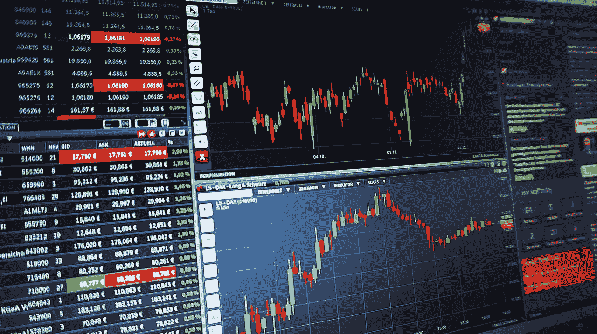
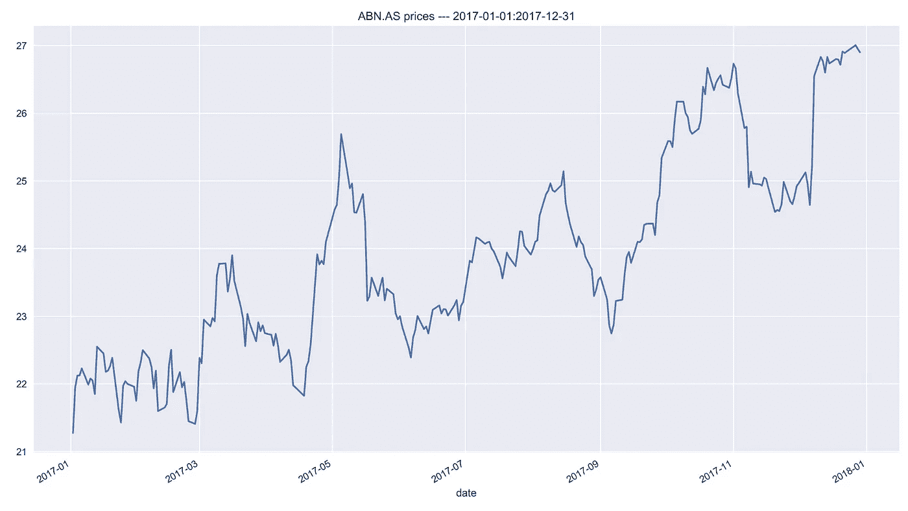
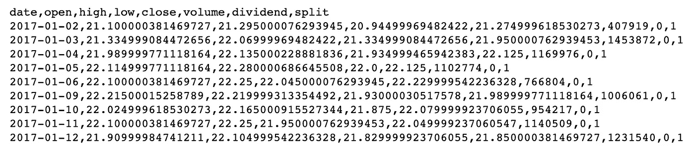
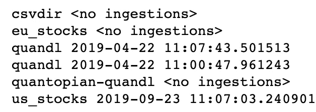
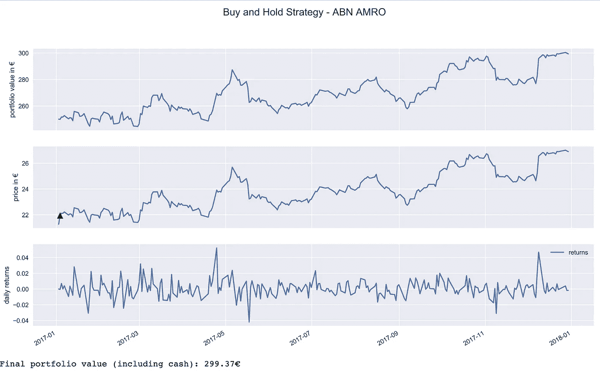

# 使用 zipline 中的自定义数据对交易策略进行回溯测试

> 原文：<https://towardsdatascience.com/backtesting-trading-strategies-using-custom-data-in-zipline-e6fd65eeaca0?source=collection_archive---------12----------------------->



Source: [pixabay](https://pixabay.com/photos/chart-trading-courses-forex-1905225/)

## 了解如何将自定义数据导入`zipline`

在之前的[文章](/introduction-to-backtesting-trading-strategies-7afae611a35e)中，我已经展示了如何使用`zipline`回测基本交易策略。为此，我使用了内置的`quandl`数据集，这对于许多用例来说已经足够了。然而，它也有一些缺点:

*   2018 年年中，它停产了，所以没有最近的价格
*   它只考虑美国股票

这就是为什么我还想展示如何获取定制数据集，即一小部分欧洲股票。我将通过使用已经由 Zipline 提供的`csvdir`包来这样做。还有其他的方法，我在本文最后会提到。

为了简洁起见，我将不再谈论`zipline`的设置。有关该主题的详细信息，请参考之前的[文章](/introduction-to-backtesting-trading-strategies-7afae611a35e)。

# 获取数据

我们首先需要收集我们想要输入到`zipline`中的数据。为此，我使用了`yahoofinancials`库。为了加载到`zipline`中，数据必须是 CSV 文件和预定义的格式(示例如下)。为了这篇文章，我下载了两种证券的数据:ABN AMRO(一家荷兰银行)和 AEX(一种由在泛欧交易所交易的荷兰公司组成的股票市场指数)。我们使用后者作为基准。

我们从加载所需的库开始。

```
import numpy as np
import matplotlib.pyplot as plt
import pandas as pd
from yahoofinancials import YahooFinancials
```

然后，我们定义一个简短的函数，用于使用`yahoofinancials`下载数据，并准备数据帧供`zipline`接收。准备好数据后，该函数将数据作为 CSV 文件保存在一个名为`daily`的文件夹中(该文件夹以所考虑数据的频率命名)。

我们从下载 ABN·AMRO 的股票价格开始。

```
download_csv_data(ticker='ABN.AS', 
                  start_date='2017-01-01', 
                  end_date='2017-12-31', 
                  freq='daily', 
                  path='european/daily/abn.csv')
```

该函数返回下载价格的曲线图:



我们还展示了 zipline 接受的文本文件的结构。

```
!head ./european/daily/abn.csv
```



我们以类比的方式下载索引数据。

```
download_csv_data(ticker='^AEX', 
                  start_date='2017-01-01', 
                  end_date='2017-12-31', 
                  freq='daily', 
                  path='european/daily/aex.csv')
```

也可以将多个 tickers 以 Python 列表的形式传递给`yahoofinancials`并一次性下载。然而，我们选择这种方式是为了简化所需的操作。

# 摄取 CSV

让我们通过运行以下命令来检查当前加载的包。

```
!zipline bundles
```



我们现在将添加一个名为`eu_stocks`的定制包。为此，我们需要修改 zipline 目录中的`extension.py`文件。我们需要添加以下代码:

在调用`register()`时，我们必须指定一个交易日历，在本例中是`XAMS`，它对应于泛欧交易所。有关所有提供的日历列表，请参考此[文档](https://github.com/quantopian/trading_calendars)。也可以定义自己的交易日历，你可以在`zipline`的文档[中找到更多信息。](https://www.zipline.io/trading-calendars.html)

请记住，我们需要传递之前下载的数据的确切日期范围。在本例中，我们从`2017–01–02`开始，因为这是我们获得价格数据的第一天。

为了最终接收数据，我们运行以下命令:

```
!zipline ingest --bundle eu_stocks
```

# 买入并持有策略示例

最后，我们展示了如何使用自定义数据来回溯测试交易策略。为此，我们采用基本的买入并持有策略。我们使用 ABN·AMRO 的股票，并选择 2017 年作为回溯测试的持续时间。默认情况下，`zipline`使用美元，但是，当所有资产都是同一种外币时，使用欧元报价的股票和指数没有问题。

关于这段代码中发生的事情的更详细的描述，我再次参考以前的[文章](/introduction-to-backtesting-trading-strategies-7afae611a35e)。让我描述一些细微差别:

*   我们需要通过在`zipline`魔术中包含 `—- bundle eu_stocks`来指定我们想要使用的定制包
*   我们还需要通过在`zipline`魔术中包含`--trading-calendar XAMS`来指定交易日历
*   我们需要在`initialize()`函数中设置基准:`set_benchmark(symbol(‘AEX’))`。原因是默认基准是在纽约证券交易所交易的 SP500，这与我们的设置不兼容。

我们的买入并持有策略的结果如下图所示。



我们简单的策略在一年内成功创造了近 50 个€。

# 结论

在本文中，我展示了如何使用定制数据在`zipline`中运行回溯测试。正如我提到的，使用`csvdir` bundle 并不是我们获取定制数据的唯一方式。我们也可以写一个完整的定制包(更多细节请看[这里](https://www.zipline.io/bundles.html#writing-a-new-bundle))，例如，它使用 API 自动从加密交换中下载数据。然而，这可能是另一篇文章的主题:)

一如既往，我们欢迎任何建设性的反馈。你可以在[推特](https://twitter.com/erykml1)或评论中联系我。您可以在我的 [GitHub](https://github.com/erykml/medium_articles/blob/master/Quantitative%20Finance/introduction_to_backtesting_eur_stocks.ipynb) 上找到本文使用的代码。

以下是该系列的其他文章:

*   介绍 zipline 框架并展示如何测试基本策略([链接](/introduction-to-backtesting-trading-strategies-7afae611a35e))
*   评估交易策略的绩效([链接](/the-easiest-way-to-evaluate-the-performance-of-trading-strategies-in-python-4959fd798bb3))
*   基于技术分析建立算法交易策略([链接](/algorithmic-trading-based-on-technical-analysis-in-python-80d445dc6943))
*   基于均值-方差分析建立算法交易策略([链接](/algorithmic-trading-based-on-mean-variance-optimization-in-python-62bdf844ac5b))

我最近出版了一本关于使用 Python 解决金融领域实际任务的书。如果你有兴趣，我贴了一篇文章介绍这本书的内容。你可以在亚马逊或者帕克特的网站 T21 买到这本书。