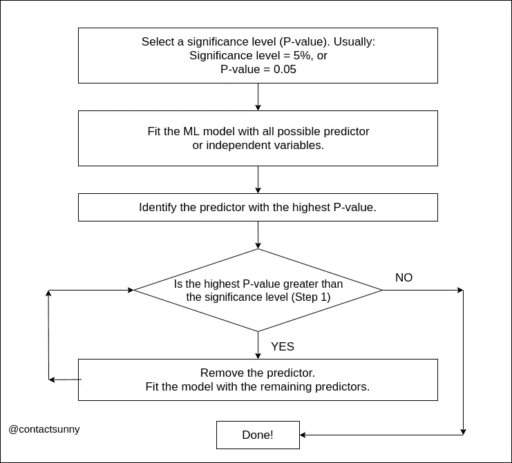

# 机器学习中特征选择的向后淘汰法

> 原文：<https://towardsdatascience.com/backward-elimination-for-feature-selection-in-machine-learning-c6a3a8f8cef4?source=collection_archive---------7----------------------->

当我们建立机器学习模型时，我们只选择那些必要的特征或预测器是非常重要的。假设我们的数据集中有 100 个特征或预测值。这并不一定意味着我们需要在模型中包含所有 100 个特性。这是因为并不是所有的 100 个特征都会对模型产生显著的影响。但话说回来，这并不意味着它对所有情况都适用。这完全取决于我们手头的数据。这里有更多关于[为什么我们需要特性选择](/null-hypothesis-and-the-p-value-fdc129db6502)的信息。

有多种方法可以找出哪些要素对模型影响很小，哪些要素可以从数据集中移除。我以前写过关于特性选择的文章，但是非常简短。在这篇文章中，我们将一步一步地看看逆向淘汰法，以及我们如何做到这一点。但是在我们开始讨论逆向淘汰之前，确保你[熟悉 P 值](/null-hypothesis-and-the-p-value-fdc129db6502)。

# 第一步

反向消除的第一步非常简单，您只需选择一个显著性水平，或者选择 P 值。通常，在大多数情况下，选择 5%的显著性水平。这意味着 P 值将为 0.05。您可以根据项目更改该值。

# 第二步

第二步也很简单。你只需将你的机器学习模型与所有选择的特征相匹配。因此，如果有 100 个特征，您可以将它们全部包含在您的模型中，并使模型适合您的测试数据集。这里没有变化。

# 第三步

在步骤 3 中，识别具有最高 P 值的要素或预测值。又很简单了，对吧？

# 第四步

这是重要的一步。在这里，我们做决定。在上一步中，我们确定了具有最高 P 值的要素。如果该要素的 P 值大于我们在第一步中选择的显著性水平，我们将从数据集中移除该要素。如果该特征的 P 值(在集合中最高)小于显著性水平，我们将直接跳到步骤 6，这意味着我们完成了。请记住，最高 P 值大于显著性水平，请移除该要素。

# 第五步

一旦我们找到了需要从数据集中移除的要素，我们将在这一步中进行移除。因此，我们从数据集中移除该要素，并用新的数据集再次拟合模型。在为新数据集拟合模型之后，我们将跳回到步骤 3。

这一过程将一直持续到第 4 步，此时数据集中所有剩余要素的最高 P 值小于第 1 步中选择的显著性。在我们的示例中，这意味着我们从步骤 3 迭代到步骤 5，然后返回，直到数据集中的最高 P 值小于 0.05。这可能需要一段时间。在 100 个假设的特性中，我们可以这样筛选出 10 个特性(这只是我选择的一个随机数)。参考本文顶部的流程图，更好地理解这些步骤。

# 第六步

一旦我们到达第 6 步，我们就完成了特征选择过程。我们已经成功地使用反向消除来过滤掉对我们的模型不够重要的特征。

在这个过程中，我们还可以使用其他一些方法。我想我将来也会写一些关于他们的东西。

> 在 [Twitter](https://twitter.com/contactsunny) 上关注我，了解更多[数据科学](https://blog.contactsunny.com/tag/data-science)、[机器学习](https://blog.contactsunny.com/tag/machine-learning)，以及通用[技术更新](https://blog.contactsunny.com/category/tech)。还有，你可以[关注我的个人博客](https://blog.contactsunny.com/)。