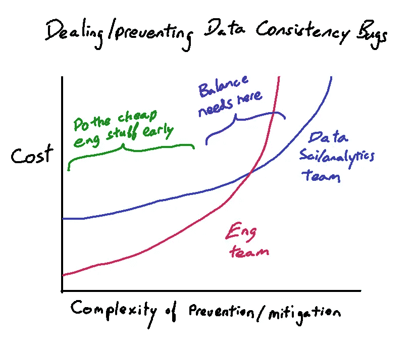
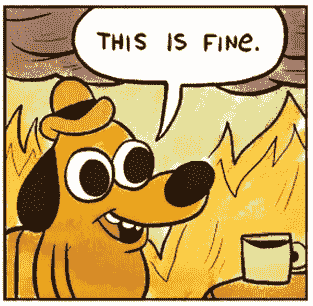
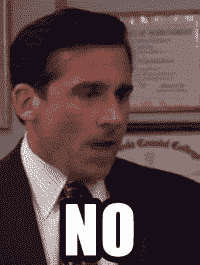

# 平衡谁处理数据不一致

> 原文：<https://towardsdatascience.com/balancing-who-handles-data-inconsistency-72779a1404b8?source=collection_archive---------14----------------------->

## 在生产中，事情不可避免地变得不稳定，这是正常的

如果说这些年来你在处理数据时学到了什么，那就是数据质量“保证”本质上是善意的虚构。每当我接触到一个不熟悉的生产数据库时，我不可避免地会做一些简单的一致性检查，比如“这个惟一的 ID 实际上只出现过一次吗？”“有重复的事件吗？”“这些应该完全一对一地同时发生的事件真的是一对一的吗？”

每当我检查一个已经运行了一年或更长时间的系统时，通常很有可能至少有一些事实已经被有限地打破了。而在我看来，在一些合理的界限内， ***这是可以的*** 。因为处理/预防问题的成本因团队而异。

Do the easy Eng stuff when you can, but eventually it gets too expensive

# 为什么？所有这些东西都应该由数据库系统来保证！这永远不会发生！

关于合同的事情(无论是在生活中还是在软件中)是，除非它们被强制执行，除非它们有真正的效力和后果，否则它们经常在对一方或双方都方便的时候被忽略。此外，强制执行的成本可能不值得付出。

在我曾经工作过的生产系统中，[通常](https://dev.mysql.com/doc/refman/8.0/en/constraints.html)强制一致性[约束](https://www.bignerdranch.com/blog/guaranteed-consistency-the-case-for-database-constraints/)的[事物](https://www.postgresql.org/docs/9.4/ddl-constraints.html)，比如外键和检查约束，出于性能原因在数据库中没有被明确使用或者不存在(就像那些黑暗的 NoSQL“酸？那是毒品对吗？”天)。这只是一个在应用层而不是数据库层“强制执行”的社会契约。所以事件日志表中没有重复行条目的唯一原因是因为应用程序知道不要写重复的行条目。

其他时候，有一些内置功能，如自动增加 id，这在单主机环境中是有意义的，但最终会增加复杂性，如分片，然后是多区域分片。随着复杂性的增加，这种逻辑开始转移到应用程序层，并且变得更加难以实施。

**大多数时候**，这一切都出乎意料地好，这要感谢设计系统并预见明显问题的工程师。预期的行为在测试和 QA 中得到验证，生活通常会继续。

当系统在生产中运行一段时间，并且系统开始积累不可预见的问题时，问题只会慢慢出现。不可避免地，一个系统会宕机，或者应用程序中的一个 bug 被引入。当你不得不处理一个分布式系统时，事情变得更加疯狂，这个系统更有可能有意想不到的和完全奇异的故障模式。这就是不可靠的数据如何绕过这些软“保证”并进入您的数据集。有时甚至“硬”保证也会被破坏，因为有一个意外的失败模式暴露了一个 bug。

# 什么？如果你关闭了一致性保证，你应该得到你所得到的！

I’m fairly sure this isn’t Stockholm Syndrome

确定吗？但问题是，如果数据中真的有重复的行(或丢失的行)，会发生什么呢？如果你是一家银行，这是你的交易日志，这是一件大事，即使每 10 万亿次交易中只发生一次。如果你只是跟踪有多少用户点击了一个按钮，你甚至可能不会注意到。

实用主义很重要。

同时，维护一致性合同的成本可能很高。数据库外键约束可能好，也可能不好，这取决于您的具体硬件、数据库工作负载和模式。您需要进行实际的测试和基准测试来计算 FKs 的成本。如果你需要保证整个地球上读/写事务的一致性，你要么等待光速，要么想出疯狂的新算法，比如用[扳手](https://ai.google/research/pubs/pub39966)。

如果检测到问题，您可以进行事后检查以发出警报，但随着应用程序的发展，您需要编写和维护一套全新的测试。此外，它要求您主动预测要检查的一致性问题。

对于大型 NoSQL 系统，您可能只有最终的一致性，如果不切换到一个完全不同的系统架构(以及其中涉及的所有成本)，您可能无能为力。

# 放松，可能没事

—什么？但是我的数据一团糟！我在一个表中有一个重复的 ID，该表中的字段应该是唯一的(真实的故事)。我的世界全是谎言。这怎么可能是“好”呢？你疯了。

所有发生在你发现了一个错误的证据，吸一口气，看看什么受到了影响。开始调试过程。你弄错了吗？它的主要作用是什么？有受影响的关键系统吗？这是一个持续的问题，还是已经停止了？有没有可以用来识别问题区域的签名？

一旦你意识到发生了什么(这不是一个错误)，以适当的严重程度提交一个 bug。如果它是一个关键的核心业务数据源，它可能需要 P0。

接下来，确定您是否可以解决事故造成的损失。对于那些有很强的人为因素的事情，比如临时的和探索性的工作，你能通过识别错误的行来解决这个问题吗？您能否在降级状态下使用不太细粒度的指标进行分析，比如使用唯一计数和不受影响的相关代理统计数据？

自动化数据管道的事情更加复杂，因为它们没有那么灵活。但是，根据您的模型和系统正在做什么，它可能在可接受的误差范围内。你必须测试才能发现。

# 核心问题:我们正在平衡防范数据问题的成本/收益

墨菲定律适用于所有事物，每个系统最终都会失败。完全干净的数据只存在于学校的玩具问题集中。问题是你愿意投入多少资源来防范越来越罕见的事件。

作为一个组织，您需要平衡在事情发生前通过工程预防/发现数据问题的能力，以及在事情发生后处理后果的时间和风险。

一致性检查和约束的工程设计可能是昂贵的，既包括原始计算资源，也包括构建和维护的工程时间。此外，这是另一个可能失败的系统！当然，有一些相对便宜的东西你可以从一开始就设计好，但是让我们承认，这些努力中有很多是典型的…后来加上去的。

另一方面，如果您没有预先做大量的一致性检查，当您发现坏数据时，作为数据科学家的您将被迫处理它。

# 那么，一个数据科学家能做些什么来处理这些乱七八糟的事情呢？

## 临时/探索过程

正如我之前提到的，这取决于所做的 ds 工作的类型。与生产系统或管道相比，分析和探索性研究是一件非常人性化和灵活的事情。由于这个过程中内置了大量的实验和探索，它天生更有能力处理奇异的数据错误，这些错误需要大量的工程工作来防止或检测。

在处理混乱的数据时，使用近似值的能力可能是我们拥有的最强有力的武器。考虑到我们所知道的一切是如何工作的，以及产生坏数据的错误的性质，至少可以推导出有用的近似值，至少可以提供部分信息的上限或下限。

正是由于这种使用降级数据集的能力，这就是为什么如果我被迫选择一方，我会投入更少的资源来确保非关键数据集上的预先数据一致性。在偶尔消费期间解决附带的 bug 会更有效率。

您仍然需要数据相当干净和可靠！但是你不应该试图为你能想象到的每一个黑天鹅事件提前计划。事情会出错，当它发生时你会处理它。

## 自动化流程

根据具体情况，数据问题可能会对模型产生巨大影响，或者根本没有影响。只有你这个模特设计师才能知道。但是即使有很大范围的可能性，我们还是可以谈论一些常见的情况。

如果数据问题已经存在很长时间了，您可能不需要立即采取任何措施，因为模型实际上是根据坏数据进行训练的，并且是在被判断为给出合理输出后启动的。具有讽刺意味的是，您需要测试您的模型是否能够处理接收干净的和错误修复的数据。这带来了各种关于模型原始有效性的认识论问题，但从纯黑盒输出的角度来看，它是可行的。

类似地，由于许多模型优先使用最近的数据，旧的和坏的数据有从系统中“老化”的趋势。如果修复花费的时间超过一个月或其他任何事情自我纠正的时间，那么修复历史数据可能就不值得了。

数据问题触发灾难性的重新分析和重写模型的情况也很少见(但并非闻所未闻),因为模型往往会将许多输入集中在一起。一个数据错误将需要影响一个真正广泛的区域来影响一组模型输入，因为几乎所有的模型都有一个试图最小化变量之间相关性的特征缩减步骤。

这种错误的一个例子是，如果重要的数据点以一种非常有偏差的方式被丢弃，就会在分布中引入一系列偏差。类似于一个系统，系统地不能识别来自大客户的购买，这些大客户只来自加利福尼亚州。希望这类错误足够大，能够很快被发现，因为它们会对业务中的其他事情产生重大影响。

# 所以我们应该接受数据质量退居二线的事实？

不要！我们不是擦鞋垫..

我要说的是，数据科学过程有更多自然的冲击吸收。数据质量的边际成本改善曲线与人在回路分析过程有很大的不同，在某一点上，说“好吧，我们的数据一致性保护措施是我们现在能够做到的最好的”是有道理的。

# 我们何时知道您必须改进数据一致性保护措施？

负责任的答案是，当你意识到一些流程和数据在你的业务中变得越来越重要，因此你应该加大投资。这意味着你需要做定期审查和积极主动。做好真的很难，我只在一些事情正在积极发展并且我正在积极思考这些问题的时候才会去做。

*诚实的*答案是，当你发现一个 bug，并意识到某件事有多重要时。随着系统的变化，这些事情很容易悄悄发生在我们当中最优秀的人身上。我们可能无法看到所有可能的变化，我们也无法 100%清楚地了解系统每个方面的副作用。

总是一种平衡的舞蹈。你永远不会对你所拥有的感到完全舒服，这种不舒服可能是一个好迹象，表明你接近一个可管理的点。