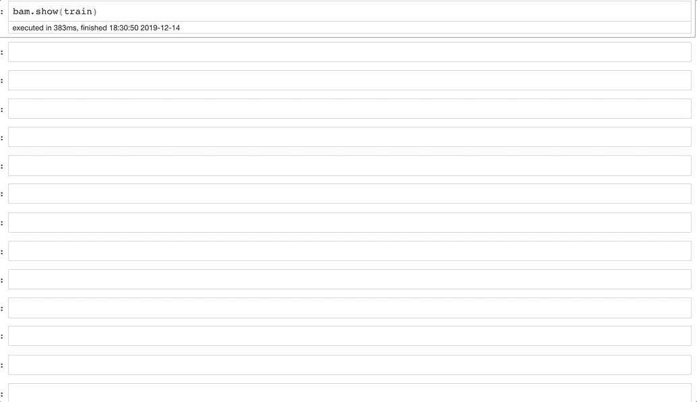
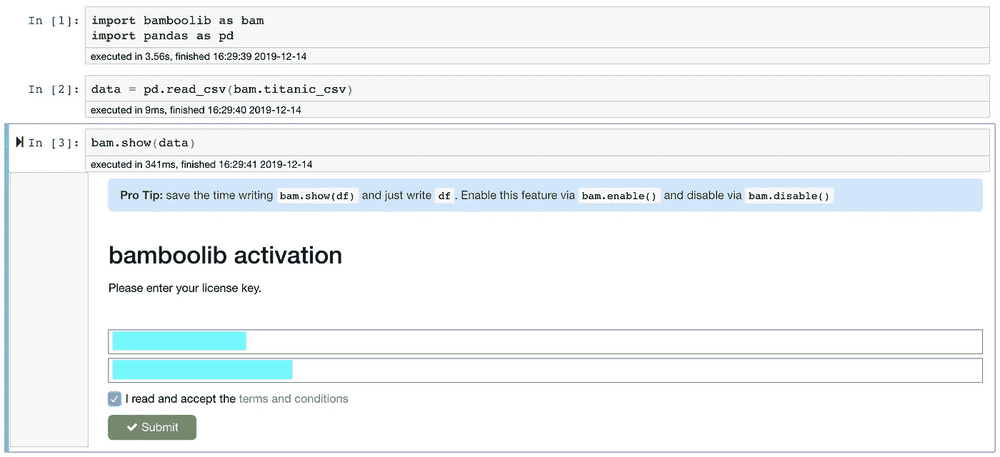
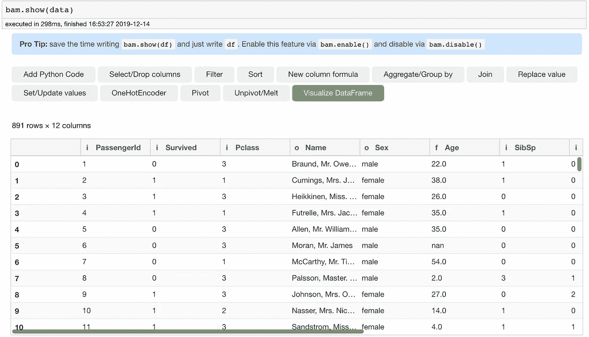
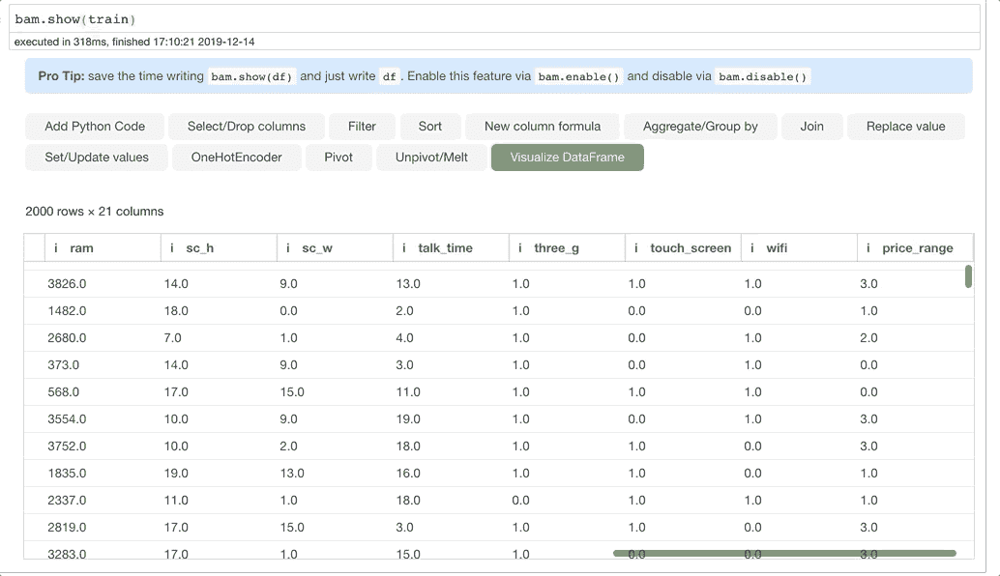
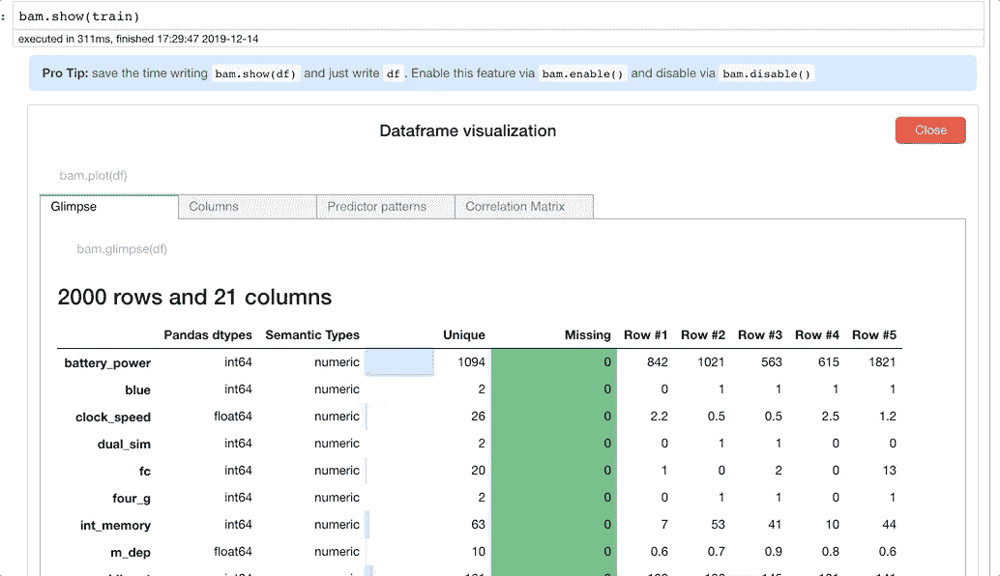
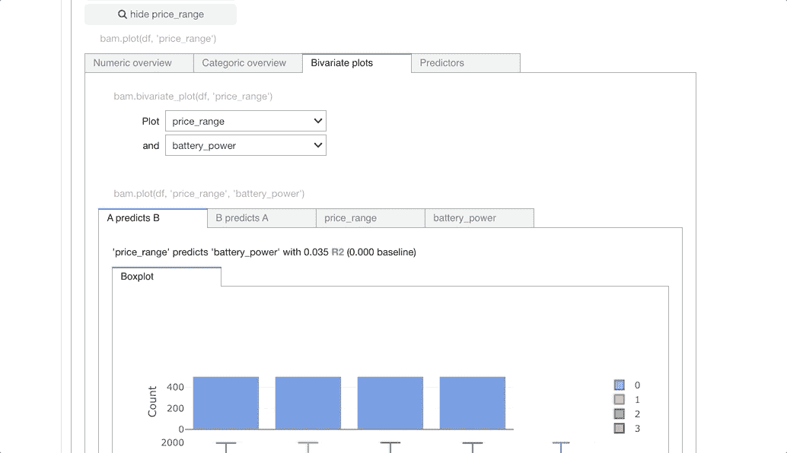
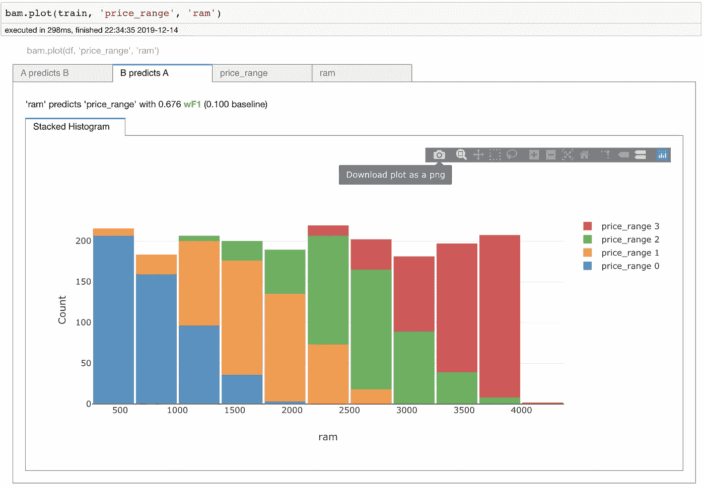
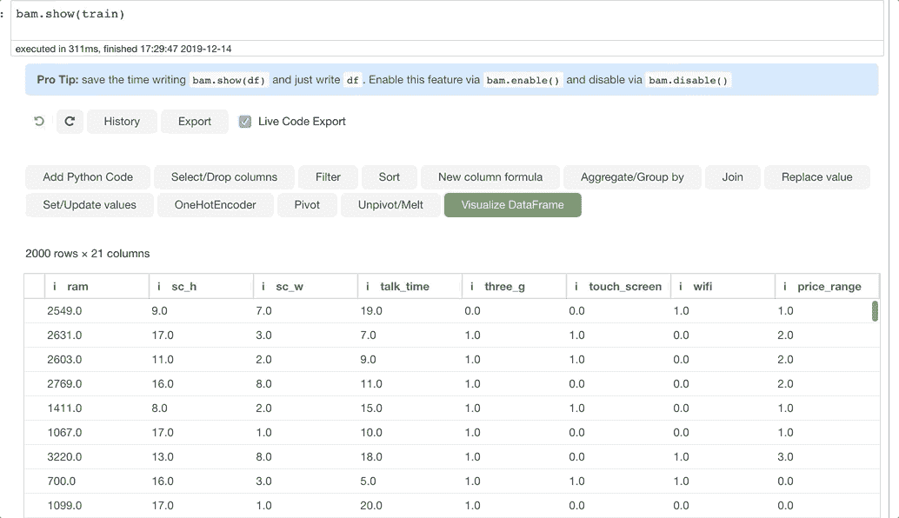
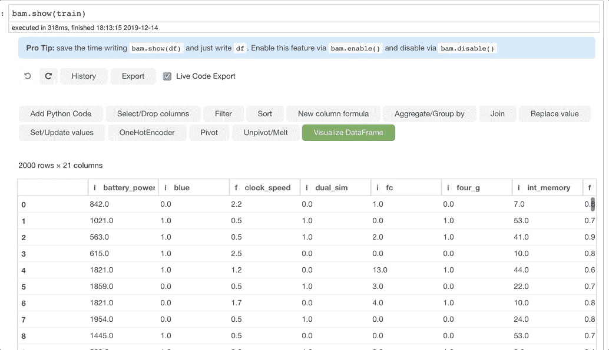

# bamboo lib——无需编码即可学习和使用熊猫

> 原文：<https://towardsdatascience.com/bamboolib-learn-and-use-pandas-without-coding-23a7d3a94e1b?source=collection_archive---------17----------------------->



Bamboolib In Action

## 熊猫的图形用户界面——适用于初学者和专家

你有没有因为用熊猫做数据探索和操纵而沮丧过？

有这么多方法做同样的事情，我被选择宠坏了，最终什么也没做。

对于初学者来说，问题正好相反，因为即使是简单的事情也没有适当的文档记录。对于门外汉来说，理解 Pandas 的语法可能是一件困难的事情。

那么应该怎么做呢？

*[***bamboo lib***](http://bamboolib.8080labs.com)***的创作者有了一个解决这个问题的想法——为什么不给熊猫添加一个 GUI 呢？****

*想法是 ***“不用编码学习使用熊猫。”这个想法开始可能很简单，但是我发现 Bamboolib 在数据探索和数据清理方面要好得多。****

*这个帖子是关于为你的数据设置和使用 Bamboolib 的。*

# *安装 Bamboolib*

*安装非常简单，包括:*

```
*pip install bamboolib*
```

*为了让 bamboolib 与 Jupyter 和 Jupyterlab 一起工作，我需要安装一些额外的扩展。因为我喜欢使用 Jupyter Notebook，所以我通过以下命令安装了 Jupyter Notebook extensions:*

```
*jupyter nbextension enable --py qgrid --sys-prefix
jupyter nbextension enable --py widgetsnbextension --sys-prefix
jupyter nbextension install --py bamboolib --sys-prefix
jupyter nbextension enable --py bamboolib --sys-prefix*
```

*如果你想为 Jupyterlab 安装进程，这里有[进程](https://github.com/tkrabel/bamboolib/blob/master/installation/conda_venv/setup_and_installation.md#installing-bamboolib-using-conda-environment)。*

# *验证 Bamboolib 安装*

*要检查是否一切正常，您可以打开一个 Jupyter 笔记本，并执行以下命令:*

```
*import bamboolib as bam
import pandas as pd
data = pd.read_csv(bam.titanic_csv)
***bam.show(data)****
```

*第一次运行此命令时，会要求您提供许可证密钥。如果您想对自己的数据使用 bamboolib，就需要这个键。因为我想在自己的项目中使用 bamboolib，所以我从 Bamboolib 的创始人 Tobias Krabel 那里得到了密钥，他非常慷慨地将它提供给我查看。然而，你可以从 https://bamboolib.8080labs.com/pricing/买你自己的。如果你想在购买钥匙之前看到库的运行，你可以尝试一下[现场演示](https://mybinder.org/v2/gh/8080labs/bamboolib_binder_template/master?filepath=bamboolib_demo_titanic.ipynb)。*

**

*一旦 bamboolib 被激活，有趣的部分就开始了。可以看到 Bamboolib 的输出是这样的。你可以选择玩它提供的选项。*

**

*因此，让我们用令人兴奋的数据源来尝试 Bamboolib，我们都已经看到了大量的数据。*

*为此，我将使用来自 Kaggle 的[移动价格分类数据](https://www.kaggle.com/iabhishekofficial/mobile-price-classification)。在这个问题中，我们必须创建一个分类器，根据手机的功能预测手机的价格范围。让我们从 Bamboolib 开始。*

```
*train = pd.read_csv("../Downloads/mobile-price-classification/train.csv")
bam.show(train)*
```

*我们需要简单地调用`bam.show(train)`来启动 Bamboolib。*

# *轻松的数据探索*

*Bamboolib 对探索性数据分析有很大帮助。现在，数据探索是任何数据科学管道不可或缺的一部分。为数据探索和创建所有图表编写完整的代码是复杂的，需要大量的耐心和努力才能做好。我承认有时我会懈怠，没有足够的时间来做这件事。*

*Bamboolib 使整个数据探索练习变得轻而易举。*

*比如说。这里是您数据的 ***一瞥，*** 一旦您点击可视化数据框。*

**

*您可以看到每一列中缺少的值，以及唯一值的数量和一些实例。*

*但这还不是全部。我们还可以获得单变量的列级统计数据和信息。那么 ***让我们来了解一下我们的目标变量——价格范围。****

**

*在这里，我们深入研究目标列，可以看到单变量列统计数据以及目标列的最重要预测值。看起来 RAM 和电池电量是价格区间最重要的预测指标。很好。*

*我们来看看 RAM 是如何影响价格区间的。 ***我们可以为此使用二元图。****

**

*使用 seaborn 或 plotly 等标准 Python 库获得如此美丽的图形通常需要一些代码。虽然 [plotly_express](/pythons-one-liner-graph-creation-library-with-animations-hans-rosling-style-f2cb50490396) 通过为大多数图表提供简单的函数在这方面帮了很大的忙，Bamboolib 为我们自动创建了许多重要的图表。*

*以上，我们可以看到，随着 RAM 的增加，价格区间也在增加。我们还看到 RAM 变量的加权 F1 得分为 0.676。您可以对数据集中的每个变量都这样做，并尝试了解您的数据。*

****也可以导出这些图表的代码*** 用于某些演示/导出这些图表为 PNG。*

*为此，只需复制每个图表上方显示的代码片段。例如，您可以复制并运行代码来查看`price_range`与`ram`的对比，您将看到一个将这些图形下载为 PNG 的选项。在后端，它们都是 plotly 图形。*

```
*bam.plot(train, 'price_range', 'ram')*
```

**

# *基于图形用户界面的数据管理*

*你有没有面临过忘记熊猫代码做某件事而去堆栈溢出，迷失在各种线程中的问题？如果是的话，这里有一份[最小](/minimal-pandas-subset-for-data-scientists-6355059629ae)熊猫点心。或者您可以根据自己的喜好使用 Bamboolib。*

*Bamboolib 让事情变得如此简单，而不会迷失在代码中。您可以使用提供的简单 GUI***删除列、过滤、排序、连接、分组、透视、融化(几乎是您想对数据集做的所有事情)。****

*例如，这里我将删除目标列中缺少的值，如果有的话。您也可以添加多个条件。*

**

*最好的部分是它也给了我们代码。这里，删除缺失值的代码会自动填充到单元格中。*

```
*train = train.loc[train['price_range'].notna()]
train.index = pd.RangeIndex(len(train))*
```

*它的工作方式就像商业用户的 Microsoft Excel 一样，同时为高级用户提供所有的代码来分割数据。您可以尝试使用其他选项来熟悉一下。*

*下面是另一个如何使用 groupby 的例子。这实际上非常直观。*

**

*其代码被填充为:*

```
*train = train.groupby(['price_range']).agg({'battery_power': ['mean'], 'clock_speed': ['std']})
train.columns = ['_'.join(multi_index) for multi_index in train.columns.ravel()]
train = train.reset_index()*
```

*你可以看到它如何为我们照顾`multi_index`以及`ravel`，这有点难以理解和处理。*

# *结论*

*Bamboolib 的 GUI 非常直观，我发现使用它绝对是一种享受。这个项目仍处于开始阶段，但这是一个多么好的开始啊。*

*我可以肯定地说，这个库对于想学习用 Pandas 编写代码的初学者来说是非常有用的，因为它为他们提供了访问所有必要功能的途径，而不会带来麻烦。*

*虽然我仍然会专注于了解熊猫的基础知识，并建议查看 Bamboolib 的输出来学习熊猫，但我想看看 Bamboolib 在未来会如何被采用。*

*请在评论中告诉我你的想法。*

*如果你想了解更多关于熊猫的知识，我想从密歇根大学调出一门关于 Python 数据科学入门的优秀课程，或者查看我以前关于如何与熊猫合作的帖子。*

*我以后也会写更多这样的帖子。让我知道你对他们的看法。在[](https://medium.com/@rahul_agarwal)**关注我或者订阅我的 [**博客**](http://eepurl.com/dbQnuX) 了解他们。一如既往，我欢迎反馈和建设性的批评，可以通过 Twitter [@mlwhiz](https://twitter.com/MLWhiz) 联系***