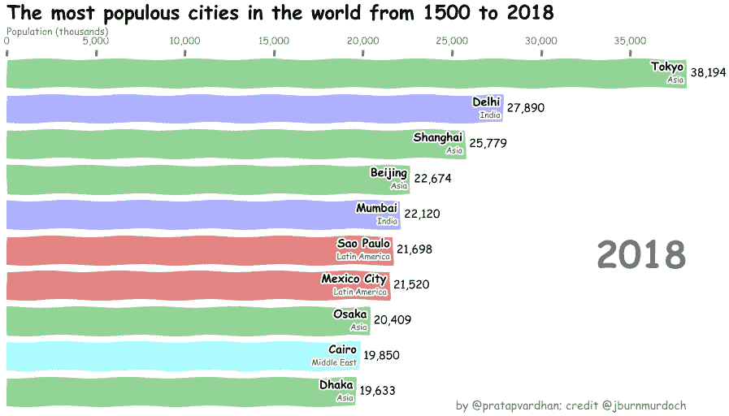

# 用 Matplotlib 实现 Python 中的条形图竞赛

> 原文：<https://towardsdatascience.com/bar-chart-race-in-python-with-matplotlib-8e687a5c8a41?source=collection_archive---------1----------------------->

## *~在大约不到 50 行的代码中*

Bar Chart Race animation showing the 10 biggest cities in the world

*原载于*[*pratapvardhan.com*](https://pratapvardhan.com/blog/bar-chart-race-python-matplotlib/)

条形图比赛已经有一段时间了。今年，他们席卷了社交媒体。它始于马特·纳瓦拉的推特，这条推特被点击了 1000 万次。然后， [John Burn-Murdoch](https://twitter.com/jburnmurdoch/status/1107552367795412992) 使用 d3.js 创建了可复制的[笔记本](https://observablehq.com/@johnburnmurdoch/bar-chart-race-the-most-populous-cities-in-the-world)，其他人开始创建他们的种族。然后，fluorescent studio 发布了面向非程序员的[赛程图](https://app.flourish.studio/@flourish/bar-chart-race)。从那以后，数百场比赛在互联网上被分享。

# 与 Matplotlib 竞赛

我想知道——用 Jupyter 和 Matplotlib 用 Python 重新制作 JBM 的[版本](https://twitter.com/jburnmurdoch/status/1107552367795412992)有多容易？事实证明，在不到 50 行代码中，您可以使用 Matplotlib 在 Python 中合理地重新创建可重用的条形图比赛。

这是我们想要创造的。

# 让我们编码

现在，您已经看到了输出，我们将逐步构建它。

的默认风格是为许多常见的情况设计的，但对我们的审美来说绝不是最佳的。因此，我们的大部分代码将进入样式(轴，文本，颜色，刻度等)

在您的`Jupyter`笔记本中，导入相关库。

用`pandas`阅读[城市人口数据集](https://gist.githubusercontent.com/johnburnmurdoch/4199dbe55095c3e13de8d5b2e5e5307a/raw/fa018b25c24b7b5f47fd0568937ff6c04e384786/city_populations)。我们只需要 4 列来与`'name', 'group', 'year', 'value'`一起工作。典型地，一个`name`映射到一个`group`(城市到洲/国家)，每个`year`有一个`value`。

# 数据转换

我们很有兴趣看到前 10 名`value`是给定的`year`。使用熊猫变换，我们将得到最高的`10`值。

# 基本图表

现在，让我们绘制一个基本的条形图。我们首先创建一个图形和一个轴。然后，我们使用`ax.barh(x, y)`绘制水平条形图。

注意，最高的横条在底部。我们需要扭转这种局面。

# 颜色，标签

接下来，让我们基于组添加值、组标签和颜色。我们将使用`colors`和`group_lk`来给条形添加颜色。

`group_lk`是`name`和`group`值之间的映射。

现在，我们只剩下设计图表的样式了。

# 波兰式

为了方便起见，让我们将代码移到`draw_barchart`函数中。

我们需要以下项目的风格:

*   文本:更新字体大小、颜色、方向
*   轴:移动 X 轴到顶部，添加颜色和字幕
*   网格:在横条后添加线条
*   格式:逗号分隔的值和轴标记
*   添加标题、致谢名单、装订线空间
*   移除:方框、y 轴标签

我们将为此再添加十几行代码。

我们现在有一个相同的图表。

# 动画种族

为了制作比赛的动画，我们将使用`matplotlib.animation`中的`[FuncAnimation](https://matplotlib.org/3.1.1/api/_as_gen/matplotlib.animation.FuncAnimation.html)`。`[FuncAnimatio](https://matplotlib.org/3.1.1/api/_as_gen/matplotlib.animation.FuncAnimation.html)`通过反复调用一个函数(在画布上绘制)来创建动画。在我们的例子中，这个函数将是`draw_barchart`。我们也使用`frames`，这个参数接受你想要运行`draw_barchart`的值——我们将从`year` 1968 运行到 2018。

现在，我们有了它，用 matplotlib 在笔记本中进行条形图竞赛。

您可以将`animator`对象保存为视频/gif 或在笔记本中播放。

# 奖金:xkcd 式！

将 matplotlib 图转换成 xkcd 风格的图非常容易。您可以使用`plt.xkcd`简单地打开`xkcd`草图风格绘图模式。

这里是动画 xkcd 风格的条形图比赛。

# 自己动手

比赛动画的完整代码在这里，你也可以在谷歌实验室上玩它[。尝试更改数据集、颜色并分享您的比赛。](https://colab.research.google.com/github/pratapvardhan/notebooks/blob/master/barchart-race-matplotlib.ipynb)

Matplotlib 是一个巨大的库——能够调整绘图的每个方面是非常强大的，但对于高度定制的图表来说，这可能很复杂/耗时。至少，对于这些条形图比赛，这是相当快！